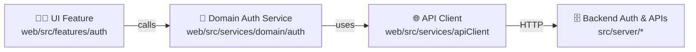
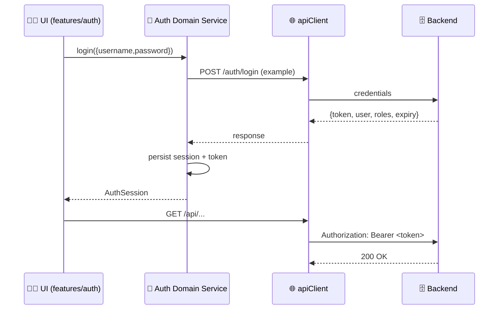

# 🔐 Auth Domain Service (Web)


📍 **Path:** `web/src/services/domain/auth/README.md`  
🎯 **Goal:** Provide a **single, testable, and consistent** authentication interface for the KFM web UI.

---

## 🧭 Quick Navigation
- [✨ What this module is](#-what-this-module-is)
- [🧱 Architecture fit](#-architecture-fit)
- [🗂️ Directory layout](#️-directory-layout)
- [🔌 Public API contract](#-public-api-contract)
- [🔁 Core flows](#-core-flows)
- [🧰 Error model](#-error-model)
- [🛡️ Security & privacy rules](#️-security--privacy-rules)
- [🧪 Testing checklist](#-testing-checklist)
- [🧩 Integration points](#-integration-points)
- [✅ Definition of done](#-definition-of-done)

---

## ✨ What this module is

This folder contains the **Auth “domain service”** for the web app. Think of it as the **use-case layer** for authentication:

- ✅ Login / Logout / Session hydration
- ✅ Token & session lifecycle management (store / clear / refresh strategy)
- ✅ A small, stable API consumed by UI features (e.g., `features/auth/`)
- ✅ Central place to handle auth-related edge cases (401 loops, expiry, retries, etc.)

### 🚫 What this module is NOT
- ❌ UI components (those belong in `web/src/features/auth/`)
- ❌ “Raw HTTP” details scattered across the app (those belong in a shared client like `apiClient`)
- ❌ Authorization enforcement (the backend **must** enforce permissions; the UI can only *adapt*)

---

## 🧱 Architecture fit

KFM uses a layered, separation-of-concerns design (clean architecture mindset). This module sits between **UI features** and **transport (HTTP)**.



### 📌 Dependency direction rule (keep it clean)
- ✅ `features/*` can depend on `services/domain/*`
- ✅ `services/domain/*` can depend on `services/apiClient` (or other infrastructure adapters)
- 🚫 `services/domain/*` must NOT import from UI (`features/*`, `components/*`)
- 🚫 Avoid circular dependencies with `store/*` — prefer dependency injection or thin adapters

---

## 🗂️ Directory layout

> This is the **recommended** shape for this folder. Adjust file names to match the repo, but keep the same intent.

```text
web/src/services/domain/auth/
├── 📄 README.md                 # You are here ✅
├── 📄 index.ts                  # Barrel exports (public API boundary)
├── 📄 auth.service.ts           # Main use-cases: login/logout/refresh/getSession
├── 📄 auth.types.ts             # AuthUser/AuthSession/AuthTokens types
├── 📄 auth.storage.ts           # Token/session storage adapter (cookie/session/memory)
├── 📄 auth.guard.ts             # Route guard helpers (optional)
├── 📄 auth.events.ts            # Audit/log hooks (optional but recommended)
└── 📁 __tests__/                # Unit tests
```

---

## 🔌 Public API contract

> 🧩 **Rule:** Consumers should import from the folder root (barrel), not deep files.  
> Example: `import { auth, type AuthSession } from '@/services/domain/auth'`

### ✅ Recommended exports (`index.ts`)
Keep the exported surface **small** and **stable**:

- `auth` — singleton service (or factory) exposing auth use-cases
- `AuthSession`, `AuthUser`, `AuthTokens` — core types
- `AuthError` / `AuthErrorCode` — standardized error handling
- Optional helpers:
  - `requireAuth()` / `hasRole()` / `hasAccessLevel()`
  - `subscribeToAuth()` (for store/context integrations)

### Example (illustrative) TypeScript API

```ts
// auth.types.ts
export type AuthUser = {
  id: string;
  email?: string;
  displayName?: string;
  roles?: string[];           // e.g. ["admin", "researcher"]
  accessLevel?: string;       // e.g. "ops_admin" (if used)
};

export type AuthTokens = {
  accessToken: string;
  // Optional: refreshToken may be cookie-based and not available to JS
  expiresAt?: number;         // epoch ms (recommended for proactive refresh)
};

export type AuthSession = {
  user: AuthUser;
  tokens: AuthTokens;
  issuedAt?: number;
};
```

```ts
// auth.service.ts
export interface AuthService {
  login(input: { username: string; password: string }): Promise<AuthSession>;
  logout(): Promise<void>;

  /** Returns cached session or null. Never throws. */
  getSession(): Promise<AuthSession | null>;

  /** Convenience sugar for guards & UI rendering. */
  isAuthenticated(): Promise<boolean>;

  /** Optional: refresh access token if supported by backend. */
  refresh(): Promise<AuthSession | null>;
}
```

---

## 🔁 Core flows

### 1) Login flow (JWT bearer)
Backend issues a token; the client stores it and attaches it to subsequent requests.



> [!NOTE]
> Endpoint paths are examples — this module should follow the **backend contract** (OpenAPI/GraphQL/etc.) and keep the rest of the UI insulated from those details.

---

### 2) Session hydration (app start / page refresh)

On app boot:
- Load cached session (if any)
- Validate basic freshness (e.g., `expiresAt` if you track it)
- Optionally refresh token if supported
- Emit auth state change event so the app can re-render safely

```ts
// Example boot pattern (consumer side)
const session = await auth.getSession();
if (!session) {
  // render logged-out shell
} else {
  // render app + user context
}
```

---

### 3) Logout flow

Logout is always two actions:
1) **Local**: clear tokens/session, reset auth-dependent caches
2) **Remote** (optional): notify backend to revoke tokens / end session

```ts
await auth.logout();
// ✅ clear app caches (query cache/store slices) AFTER logout
```

---

### 4) 401 handling & refresh strategy (optional)

If the backend supports refresh:
- Use a **single-flight** refresh (avoid 10 requests triggering 10 refresh calls)
- Retry original request once after refresh
- If refresh fails, clear session and force re-auth

> [!TIP]
> Put 401 interception logic in the shared `apiClient` adapter and delegate the “what now?” decision to `auth.refresh()` / `auth.logout()`.

---

## 🧰 Error model

A consistent error model keeps UI logic simple and prevents token leakage.

### ✅ Suggested error shape

```ts
export type AuthErrorCode =
  | "INVALID_CREDENTIALS"
  | "TOKEN_EXPIRED"
  | "UNAUTHORIZED"
  | "FORBIDDEN"
  | "NETWORK"
  | "UNKNOWN";

export class AuthError extends Error {
  constructor(
    public code: AuthErrorCode,
    message: string,
    public cause?: unknown
  ) {
    super(message);
  }
}
```

### UI mapping table

| AuthErrorCode | UI response 🎛️ | Notes |
|---|---|---|
| `INVALID_CREDENTIALS` | Show “Wrong username/password” | Never reveal which field was wrong |
| `TOKEN_EXPIRED` | Attempt refresh → else redirect to login | Avoid refresh loops |
| `FORBIDDEN` | Show “No access” page | Don’t hide the fact; show the boundary |
| `NETWORK` | Retry / offline mode | Do not logout automatically |
| `UNKNOWN` | Generic error toast | Attach a request id if available |

---

## 🛡️ Security & privacy rules

### ✅ Non‑negotiables
- 🔒 **Treat tokens like passwords** (no logging, no analytics payloads, no error bubbling with headers)
- 🧼 **Redact** `Authorization` header and token strings in *every* error path
- 🧯 UI must never “bypass” backend permissions — it can only **reflect** them
- 🧾 Prefer emitting **audit-safe events** (e.g., `AUTH_LOGIN_SUCCESS`) without sensitive payloads

### 🔐 Storage guidance (choose deliberately)

> [!WARNING]
> If access tokens are stored in `localStorage`, XSS becomes “account takeover.” Prefer safer approaches.

Recommended options:
- ✅ **Best**: refresh token in **HttpOnly + Secure cookie**, access token in memory (short lived)
- ✅ **Good**: access token in memory + session re-hydration via backend session endpoint
- ⚠️ **Risky**: access token in localStorage (only if you have strong CSP + XSS controls)

---

## 🧪 Testing checklist

✅ Unit tests (fast):
- token expiry calculations
- single-flight refresh behavior (no duplicate refresh calls)
- storage adapter behavior (set/get/clear)
- error mapping (HTTP → AuthError)

✅ Integration tests (mock server):
- login success/failure
- 401 → refresh → retry success
- refresh fail → forced logout

✅ UI flow tests (Cypress/Playwright, if present):
- login → navigate to protected route
- logout → protected route redirects to login
- role-based UI adaptation doesn’t break access rules

---

## 🧩 Integration points

### 🔗 Related folders
- `web/src/features/auth/` 🧑‍💻 — Login UI + auth context
- `web/src/services/` 🌐 — Shared API client (`apiClient.js`/`apiClient.ts`)
- `web/src/store/` 🧠 — Global state (if used)
- `src/server/` 🗄️ — Backend API/auth enforcement

---

## ✅ Definition of done

Before merging changes to this folder:

- [ ] Public exports documented in **Public API contract**
- [ ] No UI imports (no `features/*`, no `components/*`)
- [ ] Token strings are never logged (scan for `Authorization`, `token`, `Bearer`)
- [ ] 401 handling does not create an infinite refresh loop
- [ ] Tests updated or added for new behaviors
- [ ] Any backend contract changes are coordinated with server/API docs

---

<details>
<summary>📚 Glossary (click to expand)</summary>

- **JWT**: JSON Web Token (signed token used for stateless auth)
- **Bearer token**: token sent as `Authorization: Bearer <token>`
- **Session hydration**: reconstructing “who is logged in” on app start
- **Single-flight refresh**: ensure only one refresh happens even under concurrency

</details>