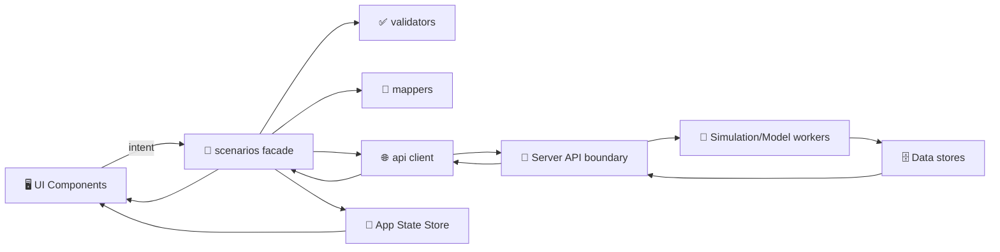

# 🧪 Scenarios Domain Service


> 🧩 **Purpose:** A clean, testable domain-layer home for **Scenario creation → validation → execution orchestration → result shaping** for KFM “what‑if” modeling (e.g., water allocation / drought policy / yield tradeoffs).

---

## 🧭 Quick Links

- 📁 **Domain services root:** `web/src/services/domain/`
- 🧱 **API boundary (server contracts live there):** `src/server/` (see project docs)
- 📚 **System governance & doc protocol:** `docs/MASTER_GUIDE_v13.md` / `docs/standards/*` (see project docs)

---

## 📘 Overview

### 🎯 What this module is for

The `scenarios` domain service is the **single integration point** for scenario workflows in the frontend:

- ✅ Turns UI intent (forms, sliders, policy toggles) into a **valid ScenarioDraft**
- ✅ Submits a **ScenarioRun** request to the backend API
- ✅ Tracks run lifecycle (**queued → running → completed/failed/canceled**)
- ✅ Fetches + shapes results into UI-friendly structures (**maps, charts, tables**)
- ✅ Enforces “no surprises” rules: validation, guardrails, classification, and provenance hooks

> 🔎 If a UI component needs “scenario data”, it should come from **this module** (or a thin wrapper around it), not from ad-hoc `fetch()` calls scattered in components.

---

### 📌 Scope

| ✅ In Scope | 🚫 Out of Scope |
|---|---|
| Domain models & type definitions (Scenario, Run, Results) | Rendering components (maps/charts/layout) |
| Validation & normalization of scenario inputs | Long-running compute / simulation engines (backend responsibility) |
| API orchestration (submit, poll, fetch results) | Direct DB or file access (never from UI) |
| Result shaping & comparison utilities | Styling, theming, UI animations |
| Export “intent” helpers (CSV/GeoJSON/PNG requests) | Authentication/authorization implementation (handled elsewhere) |

---

### 👥 Audience

- 🧑‍💻 Frontend engineers implementing scenario UX
- 🧪 Model/simulation integrators defining run inputs/outputs
- 🧱 API engineers validating contract alignment
- 🧭 Reviewers enforcing governance + data handling rules

---

### 🧾 Definitions (quick)

- **ScenarioDraft** 📝: editable configuration (constraints, policy levers, baseline, notes)
- **ScenarioRun** 🏃: immutable execution instance (draft snapshot + run config)
- **ConstraintSet** 🎛️: bounds/limits (water allocations, dates, areas, rules)
- **Results** 📊: maps/layers + time series + aggregates + uncertainty metadata
- **Provenance** 🧬: run ID + model version + dataset lineage references

---

## 🧱 Architecture & Boundaries

### ✅ Clean layering inside the frontend

This folder should behave like a **mini-application layer** for scenarios:

- UI components call a **small public facade**
- The facade relies on:
  - ✅ validators (pure functions)
  - 🧭 mappers (DTO ↔️ domain)
  - 🌐 API client/adapters (boundary)
  - 🧠 small domain utilities (comparison, summarization)

> 🧠 Rule of thumb: **Domain ≠ Fetch logic in components.** Keep components dumb and domain services smart (but testable).

---

### 🗺️ Data flow (frontend → backend → frontend)



---

## 🗂️ Directory Layout

> ⚠️ Exact filenames can vary—this is the **recommended** “one fact, one place” layout for maintainability.

```text
📁 web/src/services/domain/scenarios/
├── 📄 README.md                      # you are here 📍
├── 📄 index.ts                       # public exports (facade only)
├── 📄 types.ts                       # domain types (Scenario*, Run*, Results*)
├── 📄 errors.ts                      # domain error types + helpers
├── 📄 scenarios.facade.ts            # main entrypoint the UI calls
│
├── 📁 api/                           # 🌐 boundary (no UI imports)
│   ├── 📄 scenarios.client.ts        # HTTP/GraphQL calls (thin + typed)
│   ├── 📄 scenarios.contract.ts      # DTOs aligned to API contract
│   └── 📄 scenarios.endpoints.ts     # route builders, query keys
│
├── 📁 validators/                    # ✅ pure functions
│   ├── 📄 validateDraft.ts
│   ├── 📄 validateConstraints.ts
│   └── 📄 units.ts                   # unit conversions, bounds helpers
│
├── 📁 mappers/                       # 🧭 DTO <-> domain
│   ├── 📄 toDomain.ts
│   └── 📄 toDto.ts
│
├── 📁 selectors/                     # 🔎 optional (store selectors)
│   └── 📄 scenarioSelectors.ts
│
└── 📁 __tests__/                     # 🧪 unit tests (fast + deterministic)
    ├── 📄 validateDraft.test.ts
    └── 📄 mappers.test.ts
```

---

## 🔄 Key Flows

### 1) Create / Edit a ScenarioDraft 📝

**Goal:** Provide immediate feedback (validation) and keep draft state stable.

- User edits constraints/policy levers in UI
- UI calls `scenarios.validateDraft()` locally (fast + pure)
- UI persists draft via store + optional backend “save draft” endpoint

✅ Best practices:
- Validate **field-level** and **cross-field** rules (e.g., totals, ranges)
- Normalize units early (avoid “inches vs mm” bugs)
- Keep draft IDs stable (don’t regenerate on each keystroke)

---

### 2) Submit a ScenarioRun 🏃‍♂️

**Goal:** Take an immutable snapshot of the draft and send it to the backend.

- Freeze `ScenarioDraft` into a submission payload (`RunRequest`)
- `submitRun()` returns a `runId`
- Store run metadata (who, when, model version requested, input summary)

> 💡 Tip: Always attach **run labels** (e.g., “Rationing Policy A”) to support comparisons and exports later.

---

### 3) Track run status ⏳

Recommended patterns:
- **Polling** (simple): poll status every N seconds with backoff
- **Streaming** (advanced): SSE/WebSocket updates keyed by `runId`

Status rules to support:
- `queued` → `running` → `completed`
- `failed` (with structured error)
- `canceled` (user initiated)
- `expired` (results TTL exceeded)

---

### 4) Fetch + Shape Results 📊🗺️

Results commonly include:
- Map layers (tiles, GeoJSON summaries, vector features)
- Time series for key indicators (water, yield, aquifer level)
- Aggregated tables (by zone, county, field)
- Uncertainty metadata (bands, confidence intervals, Monte Carlo summaries)

✅ Best practices:
- Keep the UI’s job limited to rendering; **domain shapes** the data
- Include a `ResultsSummary` for quick dashboards (fast)
- Provide access to full detail for drill-down (lazy load)

---

### 5) Compare Runs 🆚

Comparison is a domain concern (not a chart-only concern).

Example comparison outputs:
- Δ time to aquifer depletion
- Δ yield distribution by region
- Tradeoff curves (water saved vs yield impact)
- Highlight “dominant” strategies

---

### 6) Export 📤

Export is a workflow, not a button:
- Prepare metadata: run ID, label, timestamp, model version
- Request export from backend (server-side generation preferred)
- Provide user feedback + retry (especially for large outputs)

---

## 🧩 Public API Design (Facade)

Keep a **small, stable surface area** for the rest of the app:

```ts
// Example (shape), adapt names to your codebase.
export interface ScenariosFacade {
  // Draft lifecycle
  validateDraft(draft: ScenarioDraft): ValidationResult;
  createDraft(input?: Partial<ScenarioDraft>): ScenarioDraft;
  updateDraft(draft: ScenarioDraft, patch: ScenarioDraftPatch): ScenarioDraft;

  // Run lifecycle
  submitRun(draft: ScenarioDraft, opts?: RunOptions): Promise<ScenarioRunRef>;
  getRun(runId: ScenarioRunId): Promise<ScenarioRun>;
  cancelRun(runId: ScenarioRunId): Promise<void>;

  // Results & analysis
  getResults(runId: ScenarioRunId): Promise<ScenarioResults>;
  compare(runIds: ScenarioRunId[]): Promise<ScenarioComparison>;

  // Export helpers
  exportResults(runId: ScenarioRunId, format: ExportFormat): Promise<Blob>;
}
```

> ✅ Keep facade functions **orchestrators**, not giant god-functions. Push complexity into validators/mappers/utilities.

---

## 🧾 Contracts, DTOs, and Mapping

### Contract-first expectations ✅

- API contracts are **first-class artifacts** (OpenAPI/GraphQL schemas + contract tests)
- DTOs live in `api/` and are mapped into **domain types** in `types.ts`
- UI components should never depend directly on “raw DTOs”

**Why?**
- Domain types stay stable when backend evolves
- Mappers become the only migration surface area

---

## ✅ Validation & Guardrails

Validation should include:

- **Numerical bounds:** min/max, non-negative
- **Cross-field rules:** totals, dependencies, mutually exclusive toggles
- **Temporal logic:** start/end windows, timestep compatibility
- **Spatial logic (if applicable):** geometry validity, area limits, redaction
- **Classification handling:** deny or generalize sensitive outputs

> 🛡️ Make invalid states hard to represent. Prefer “typed safe states” over runtime checks sprinkled everywhere.

---

## 🔐 Security, Governance & CARE Notes

Scenarios often touch:
- water rights / allocations
- sensitive infrastructure
- potentially sensitive locations

**Frontend responsibilities:**
- Respect classification flags on any payload (don’t “helpfully” reveal hidden detail)
- Never hardcode datasets or bypass the API boundary
- Ensure audit/telemetry hooks can attach a `runId` to user actions

---

## ⚡ Performance & UX Expectations

Scenario UX can get heavy (big results, time sliders, multiple runs). Priorities:

- 🧠 **Client caching:** cache run metadata + previously fetched timesteps/layers
- ⏭️ **Prefetch adjacent timesteps:** make timeline scrubbing feel instant
- 📴 **Degrade gracefully:** if the network is flaky, show last cached results + clear warnings
- 🧯 **Error UX:** show a human-friendly message + retry when possible
- 🧷 **Tooltips & context:** explain terms like “NDVI”, “confidence band”, “rationing policy”
- 📤 **Export affordances:** CSV, PNG, GeoJSON (depending on contract)

---

## 🧪 Testing

Minimum recommended tests:

- ✅ Validator unit tests (pure, fast)
- ✅ Mapper unit tests (DTO ↔️ domain)
- ✅ Facade orchestration tests (mock API client)
- ✅ Contract alignment checks (CI or generated types)

> 🧼 Keep tests deterministic: stable IDs, controlled timestamps, mocked randomness.

---

## 🛠️ Contributing: Add a New Scenario Type

When introducing a new scenario mode (e.g., “Policy Sweep” / “Monte Carlo” / “Sensitivity”) do:

1. 🧾 Add/extend domain types in `types.ts`
2. ✅ Add validation rules in `validators/`
3. 🧭 Add DTO ↔️ domain mapping in `mappers/`
4. 🌐 Extend API client calls in `api/` (contract-first)
5. 🧪 Add tests for validators + mappers
6. 📝 Update this README with the new mode’s behavior + outputs

---

## 📎 Related Docs (repo paths)

- 📘 `docs/MASTER_GUIDE_v13.md` (governance, contracts, repo structure)
- 🧱 `docs/architecture/*` (system design + evolution)
- 🌐 `src/server/contracts/*` (API contracts)
- 🧾 `docs/standards/*` (STAC/DCAT/PROV policies if scenarios generate evidence artifacts)

---

## ✅ Definition of Done (for changes in this folder)

- [ ] Facade API remains small + documented
- [ ] No UI components call scenario endpoints directly
- [ ] Validators cover new inputs + edge cases
- [ ] DTO ↔️ domain mapping is explicit (no “shape leaking”)
- [ ] Error states are typed and user-actionable
- [ ] Caching/prefetch behavior does not break correctness
- [ ] Tests added/updated (validators, mappers, orchestration)
- [ ] Any new outputs include provenance hooks (runId/modelVersion)
- [ ] Any sensitive/classified data is respected (no leakage)

---

<details>
<summary>📦 Appendix: Suggested Domain Types (starter sketch)</summary>

```ts
export type ScenarioId = string & { readonly __brand: "ScenarioId" };
export type ScenarioRunId = string & { readonly __brand: "ScenarioRunId" };

export type ScenarioRunStatus =
  | "queued"
  | "running"
  | "completed"
  | "failed"
  | "canceled"
  | "expired";

export interface ScenarioDraft {
  id: ScenarioId;
  name: string;
  description?: string;

  // Who/when metadata (optional; often stored elsewhere)
  createdAt: string; // ISO
  updatedAt: string; // ISO

  constraints: ConstraintSet;
  policy: PolicyLeverSet;

  // Display + governance
  tags?: string[];
  notes?: string;
}

export interface ScenarioRunRef {
  runId: ScenarioRunId;
  status: ScenarioRunStatus;
}

export interface ScenarioResults {
  runId: ScenarioRunId;

  // Map + time series + tables (shape depends on contracts)
  layers: Array<unknown>;
  series: Array<unknown>;
  tables: Array<unknown>;

  // Uncertainty/provenance
  uncertainty?: unknown;
  provenance?: {
    modelVersion?: string;
    datasetRefs?: string[];
    runLabel?: string;
  };
}
```

</details>