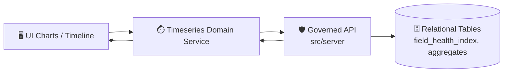

# ⏱️ Timeseries Domain Service


> 🎯 **Purpose:** Provide a single, contract-aligned way for the UI to request, validate, normalize, and cache **time-series** data (e.g., NDVI, rainfall, predicted yield) for charts, timelines, and analysis widgets—**without bypassing the governed API layer**.

---

## 🧭 Quick links

- 📘 **System invariants & repo rules:** `docs/MASTER_GUIDE_v13.md`
- 🧩 **API contracts (source of truth):** `src/server/contracts/`
- 🧾 **Governance & redaction rules:** `docs/governance/`
- 🧪 **API change template:** `docs/templates/TEMPLATE__API_CONTRACT_EXTENSION.md`

---

## 📌 Scope

This domain module is responsible for:

- ✅ **Building timeseries queries** (entity, variable, date range, cadence, aggregation)
- ✅ **Calling the governed API** (never direct DB, never direct graph, never “hidden files” in the UI)
- ✅ **Validating responses** against the contract (runtime validation recommended)
- ✅ **Normalizing output** into a UI-friendly shape (sorted points, gaps handled, units metadata preserved)
- ✅ **Caching & deduping** requests (avoid spamming the API during pan/zoom/brush interactions)
- ✅ **Surfacing provenance** (IDs/links returned by API should be preserved for Focus/Story use)

### 🚫 Non-goals

- ❌ Chart rendering (belongs in components)
- ❌ Statistical inference “inside the UI” (belongs in pipeline/model or server-side compute)
- ❌ Fabricating or “filling in” missing data silently (if you smooth/impute, it must be explicit + labeled)

---

## 🧱 Data flow at a glance



> 🛡️ **Rule of thumb:** the UI should only ever see time-series data that has crossed the API boundary and conforms to the contract.

---

## 🗂️ Suggested folder layout

> If your folder has a slightly different structure, update this tree to match reality ✅

```text
web/src/services/domain/timeseries/
├─ 📄 README.md
├─ 📦 index.ts
├─ 🧾 timeseries.contract.ts        # runtime validation (zod/io-ts) or generated types
├─ 🧠 timeseries.types.ts           # domain types used by charts & view-models
├─ 🔌 timeseries.service.ts         # main API-facing functions
├─ 🧹 timeseries.normalize.ts       # sorting, gap handling, unit mapping
├─ 🗝️ timeseries.cache.ts           # request keys + caching helpers (optional)
└─ 🧪 timeseries.service.test.ts    # mocked/contract tests
```

---

## 🔌 Contract alignment

### Source of truth

- ✅ **Do not** invent request/response shapes inside the UI.
- ✅ Treat **OpenAPI / GraphQL** definitions as *the contract*, and generate or validate types from them.
- ✅ Any breaking API change must be versioned and tested via contract tests.

> 🧾 Recommended approach: **generated TS types + runtime validation** (defensive), especially for time-series payloads that power charts.

---

## 🧠 Core concepts

### Entities

Time-series queries typically attach to one of these:

- 🌾 **Field** (most common)
- 🏞️ **Region/County** (aggregates)
- 🛰️ **Layer pixel/point sample** (advanced use)

### Variables

Examples you’ll see in KFM contexts:

- 🟩 `NDVI`
- 🌧️ `rainfall`
- 🌾 `predicted_yield`
- 🟫 `soil_moisture` (often a map + aggregate trend)

> Tip: keep variable names **contract-driven** (string literal union generated from API schema).

---

## 🧾 Suggested API shapes

> ⚠️ These are **illustrative**. The actual request/response is defined in `src/server/contracts/`.

### Example request

```ts
type TimeseriesQuery = {
  entityType: "field" | "county" | "region";
  entityId: string;
  variable: string;          // e.g. "NDVI"
  start?: string;            // ISO date: "2025-01-01"
  end?: string;              // ISO date: "2025-12-31"
  cadence?: "day" | "week" | "month";
  aggregation?: "mean" | "median" | "sum" | "min" | "max";
  timezone?: string;         // optional; avoid surprises at day boundaries
};
```

### Example response

```ts
type TimeseriesPoint = {
  t: string;                 // ISO date or datetime
  v: number | null;          // null = missing
};

type TimeseriesResponse = {
  variable: string;
  unit?: string;             // "index", "mm", "kg/ha", etc.
  points: TimeseriesPoint[];
  provenance?: {
    datasetIds?: string[];
    runIds?: string[];
    links?: Array<{ label: string; href: string }>;
  };
};
```

---

## 🧰 Usage patterns

### Minimal usage

```ts
import { getTimeseries } from "./timeseries.service";

const series = await getTimeseries({
  entityType: "field",
  entityId: "10",
  variable: "NDVI",
  start: "2025-01-01",
  end: "2025-12-31",
  cadence: "week",
  aggregation: "mean",
});
```

### UI-friendly normalization

Normalization should be explicit and reusable:

- ✅ sort by timestamp
- ✅ enforce monotonic `t`
- ✅ convert `t` into `Date` only at the component boundary (avoid timezone bugs in shared logic)
- ✅ handle gaps (`null` values) instead of inventing data
- ✅ preserve `unit` + `provenance`

```ts
import { normalizeTimeseries } from "./timeseries.normalize";

const normalized = normalizeTimeseries(series, {
  ensureSorted: true,
  fillMissingWithNull: true,
});
```

### React Query / SWR caching

For brush/zoom interactions, caching is mandatory to avoid request storms.

- 🔑 cache key should include: `entityType`, `entityId`, `variable`, `start`, `end`, `cadence`, `aggregation`
- 🧊 prefer **stale-while-revalidate** for dashboards

---

## 🔒 Auth, access control, and safe failure

Time-series endpoints often represent sensitive field-level data.

**Rules:**

- ✅ always send auth headers via the shared API client
- ✅ treat `401/403` as *normal* outcomes and render safe UI states
- ✅ do not retry endlessly on `403`
- ✅ never “fallback” to broader queries that might leak restricted aggregates

**UI behavior suggestions:**

- `401` → prompt login / refresh token flow
- `403` → show “No access to this field” + do not reveal existence/metadata beyond what API returns
- `404` → “Not found” (avoid implying ownership)
- empty `points` → “No observations in this date range”

---

## ⚡ Performance notes

Time-series are deceptively heavy when:

- date ranges are long (multi-year daily data)
- user pans quickly across multiple entities
- charts auto-refresh

**Client best practices:**

- ✅ debounce UI interactions that trigger fetches
- ✅ clamp max range unless user explicitly requests “all time”
- ✅ support server-side aggregation (week/month) rather than downsampling on the client
- ✅ prefer incremental updates (append) for “latest data” experiences

---

## 🧪 Testing checklist

### Unit tests

- [ ] request key generation is stable
- [ ] query serialization matches contract (esp. dates)
- [ ] normalization preserves units + provenance
- [ ] gaps are represented as `null`, not interpolated

### Contract tests

- [ ] validate response shape against generated schema
- [ ] ensure backwards compatibility (older payloads still parse)

> 🧩 A lightweight approach: MSW mocks + schema validation in tests.

---

## 🧩 Adding a new time-series variable

1. 🧾 **Update the API contract** in `src/server/contracts/`
2. ✅ Add/extend contract tests on the server
3. 🧠 Regenerate TS types (or update validators)
4. 🔌 Add variable mapping (label/unit) in this domain module
5. 🖥️ Update chart UI to display it (units, legends, tooltips)
6. 🧾 Ensure provenance is preserved end-to-end

---

## ✅ Definition of done

- [ ] Uses API contract types (no hand-rolled payload assumptions)
- [ ] No data leakage behavior (redaction/permissions respected)
- [ ] Handles `401/403/404` safely
- [ ] Has caching/deduping for interactive charts
- [ ] Preserves provenance metadata for Story/Focus use
- [ ] Includes tests (unit + contract/mocked)

---

## 📚 References inside this repo

- `docs/MASTER_GUIDE_v13.md`
- `src/server/contracts/`
- `docs/governance/`
- `docs/templates/TEMPLATE__API_CONTRACT_EXTENSION.md`