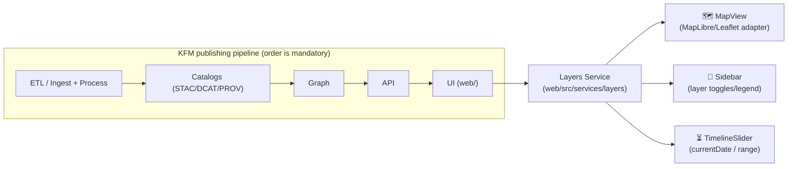

# 🗺️ Layers Service (`web/src/services/layers`)


> **Purpose:** This folder is the **UI-side “traffic controller”** that turns **cataloged geospatial datasets** into **renderable, time-aware map layers** and keeps them synchronized with the UI state (layer toggles + timeline).  
> The Kansas Frontier Matrix UX expects users to **toggle layers by time period**, **move a time slider**, and **click features to see linked documents/insights**.  [oai_citation:0‡Kansas-Frontier-Matrix_ Open-Source Geospatial Historical Mapping Hub Design.pdf](file-service://file-64djFYQUCmxN1h6L6X7KUw)

---

## 🔗 Quick links

- [Why this exists](#-why-this-exists)
- [Responsibilities](#-responsibilities)
- [How it fits in the KFM pipeline](#-how-it-fits-in-the-kfm-pipeline)
- [Core concepts](#-core-concepts)
- [Layer registry](#-layer-registry)
- [Time slider integration](#-time-slider-integration)
- [Integration points (MapView / Sidebar / TimelineSlider)](#-integration-points-mapview--sidebar--timelineslider)
- [Adding a new layer](#-adding-a-new-layer)
- [Testing & validation](#-testing--validation)
- [Troubleshooting](#-troubleshooting)
- [References](#-references)

---

## 💡 Why this exists

### KFM is “pipeline-first” (and the order matters)
KFM’s canonical publishing pipeline is **ETL → Catalogs → Graph → API → UI**. The UI (this `web/` app) is downstream of the API boundary and should not “reach around” the stack.  [oai_citation:1‡MARKDOWN_GUIDE_v13.md.gdoc](file-service://file-UYVruFXfueR8veHMUKeugU)

### The UI is contract-driven (no mystery data)
The UI’s contract artifacts explicitly include a **layer registry config** (plus accessibility/telemetry hooks). That’s the heart of why this service exists: it should consume **published layer contracts**, not ad-hoc layer definitions sprinkled across components.  [oai_citation:2‡MARKDOWN_GUIDE_v13.md.gdoc](file-service://file-UYVruFXfueR8veHMUKeugU)

### The map UX needs “layer state orchestration”
KFM’s frontend architecture is organized around components like **MapView**, **Sidebar (layer toggles)**, and **TimelineSlider**.  [oai_citation:3‡Kansas Frontier Matrix (KFM) – Comprehensive Technical Documentation & Markdown Guide.gdoc](file-service://file-XGC3Vf2AfbA2JWvTvmHNGF)  
When the timeline slider changes, global state updates `currentDate` and **map layers refresh** accordingly.  [oai_citation:4‡Kansas Frontier Matrix (KFM) – Comprehensive Technical Documentation & Markdown Guide.gdoc](file-service://file-XGC3Vf2AfbA2JWvTvmHNGF)

---

## ✅ Responsibilities

| Area | This service **owns** ✅ | This service **does not** ❌ |
|---|---|---|
| 📚 Layer availability | Load + validate the **Layer Registry** (the UI’s “menu of layers”) | Decide what datasets exist in the world (that’s pipeline/catalog work) |
| 🗂️ Layer metadata | Surface **provenance**, time range, and display metadata for legends/panels | Re-ingest raw datasets or reprocess rasters/vectors |
| 🧩 Map wiring | Convert layer specs → map “sources + layers” via an adapter | Lock the app to a specific mapping library forever |
| ⏳ Time sync | Keep layer visibility/data in sync with the **time slider / play animation** | Reimplement TimelineSlider UI itself |
| 🧭 UX rules | Apply ordering + conflicts (“don’t overlay two mutually exclusive rasters”) | Own the entire sidebar layout (that’s UI components) |

> UX note: KFM expects a **layer panel with toggles grouped by category**, and some conflict rules (e.g., “only one satellite image layer at a time”).  [oai_citation:5‡Kansas Frontier Matrix (KFM) – Comprehensive Technical Documentation & Markdown Guide.gdoc](file-service://file-XGC3Vf2AfbA2JWvTvmHNGF)

---

## 🧬 How it fits in the KFM pipeline



- “Pipeline ordering is absolute” and the **API boundary** is enforced; the UI should not bypass upstream layers.  [oai_citation:6‡MARKDOWN_GUIDE_v13.md.gdoc](file-service://file-UYVruFXfueR8veHMUKeugU)
- KFM is **contract-first** and **provenance-first**: STAC/DCAT/PROV-style artifacts are treated as “published” interfaces.  [oai_citation:7‡MARKDOWN_GUIDE_v13.md.gdoc](file-service://file-UYVruFXfueR8veHMUKeugU)

---

## 🧩 Core concepts

### 1) 📦 Published, cataloged layers (not ad-hoc files)
The Kansas-Frontier-Matrix design calls for a **Geo-spatial Data Catalog** storing processed map layers, indexed with a **STAC-like JSON schema** that includes *bbox, time range, and source info*.  [oai_citation:8‡Kansas-Frontier-Matrix_ Open-Source Geospatial Historical Mapping Hub Design.pdf](file-service://file-64djFYQUCmxN1h6L6X7KUw)  
This service should treat that catalog (or an API built on it) as the source of truth.

### 2) 🧱 Layer “types” we need to support
From the design:
- **Raster** layers (elevation, imagery) stored as **COGs** (cloud-optimized GeoTIFFs).  [oai_citation:9‡Kansas-Frontier-Matrix_ Open-Source Geospatial Historical Mapping Hub Design.pdf](file-service://file-64djFYQUCmxN1h6L6X7KUw)
- **Vector** layers (boundaries, routes) stored as **GeoJSON/shapefiles**; optionally served as tiles.  [oai_citation:10‡Kansas-Frontier-Matrix_ Open-Source Geospatial Historical Mapping Hub Design.pdf](file-service://file-64djFYQUCmxN1h6L6X7KUw)
- **Document/POI** layers that connect text references to geography—clicking shows a **snippet + source**.  [oai_citation:11‡Kansas-Frontier-Matrix_ Open-Source Geospatial Historical Mapping Hub Design.pdf](file-service://file-ShqHKgjxCS9UT9vbcxDNzA)

### 3) 🧾 Provenance is a UI feature, not an afterthought
The system design expects each layer to be documented with:
- original URL/archive reference
- coordinate system
- resolution
- temporal coverage
- processing steps performed  
…and to be extendable by contributors.  [oai_citation:12‡Kansas-Frontier-Matrix_ Open-Source Geospatial Historical Mapping Hub Design.pdf](file-service://file-ShqHKgjxCS9UT9vbcxDNzA)

---

## 🗂️ Layer Registry

The UI contract explicitly calls out a **Layer registry config**.  [oai_citation:13‡MARKDOWN_GUIDE_v13.md.gdoc](file-service://file-UYVruFXfueR8veHMUKeugU)

### What the registry should contain (recommended)
At minimum, each layer entry should carry:

- **Identity**: `id`, `title`, `description`, `category` (for grouped toggles) [oai_citation:14‡Kansas Frontier Matrix (KFM) – Comprehensive Technical Documentation & Markdown Guide.gdoc](file-service://file-XGC3Vf2AfbA2JWvTvmHNGF)
- **Type**: `raster | vector | documents | ...` (see [Layer “types”](#2--layer-types-we-need-to-support))
- **Temporal**:
  - `time.kind`: `timeless | range | discrete`
  - `time.start`, `time.end` (or `time.available[]`)
- **Source resolution**:
  - `stacRef` (preferred) OR `apiRef` OR `urlTemplate`
- **Map rendering hints**:
  - default visibility, opacity, z-order, legend metadata
- **Provenance** (UI-displayable):
  - citation string(s), license, processing summary

<details>
  <summary><strong>📄 Example registry entry (illustrative)</strong></summary>

```json
{
  "id": "railroads",
  "title": "Railroads (by year built)",
  "category": "Infrastructure",
  "type": "vector",
  "time": { "kind": "range", "start": "1850-01-01", "end": "1930-12-31" },
  "source": {
    "stacRef": "stac://layers/railroads",
    "preferredRender": "vector-tiles"
  },
  "render": {
    "defaultVisible": false,
    "opacity": 0.9,
    "zIndex": 310,
    "legend": { "style": "line", "label": "Rail line" }
  },
  "provenance": {
    "origin": "Original archive URL…",
    "crs": "EPSG:4326",
    "resolution": "N/A",
    "processing": "Digitized + attributed with year built",
    "license": "Open data / archival use"
  }
}
```

</details>

> 🔎 Why include provenance fields in the registry? Because the catalog approach is explicitly meant to aid reproducibility and make it easy for contributors to extend layers.  [oai_citation:15‡Kansas-Frontier-Matrix_ Open-Source Geospatial Historical Mapping Hub Design.pdf](file-service://file-ShqHKgjxCS9UT9vbcxDNzA)

---

## ⏳ Time slider integration

The map UX is described as a **browser-based interactive map + timeline application** with a **time slider** used to move through eras and toggle layers by time period.  [oai_citation:16‡Kansas-Frontier-Matrix_ Open-Source Geospatial Historical Mapping Hub Design.pdf](file-service://file-64djFYQUCmxN1h6L6X7KUw)

In the broader KFM UI spec, temporal navigation includes:
- a slider with tick marks
- step buttons
- a **play button** that animates through time steps via an interval, updating the view automatically  [oai_citation:17‡Kansas Frontier Matrix (KFM) – Comprehensive Technical Documentation & Markdown Guide.gdoc](file-service://file-XGC3Vf2AfbA2JWvTvmHNGF)

### Recommended time update behavior
When `currentDate` (or current year) changes:
1. **Determine active layers** based on the layer’s temporal coverage vs the current time.
2. For each active layer, resolve a renderable source:
   - If it’s time-enabled (e.g., URL supports a time param), update params.
   - If it’s time-sliced (separate assets per time), swap the source.
3. Apply **layer conflict rules** (e.g., only one “base imagery” layer).
4. Ensure **map + legend** stay consistent.

> In the React + Redux flow described for KFM, moving the timeline slider updates `currentDate` and triggers map layers to refresh.  [oai_citation:18‡Kansas Frontier Matrix (KFM) – Comprehensive Technical Documentation & Markdown Guide.gdoc](file-service://file-XGC3Vf2AfbA2JWvTvmHNGF)

---

## 🔌 Integration points (MapView / Sidebar / TimelineSlider)

KFM’s frontend component structure includes:
- **MapView**: interactive map container
- **Sidebar**: menus, layer toggles, legend, context info
- **TimelineSlider**: temporal navigation  [oai_citation:19‡Kansas Frontier Matrix (KFM) – Comprehensive Technical Documentation & Markdown Guide.gdoc](file-service://file-XGC3Vf2AfbA2JWvTvmHNGF)

This service should be the **shared dependency** that each component calls into instead of duplicating logic:

- **MapView** calls:
  - “apply registry to map”
  - “update visible layers”
  - “handle feature click”
- **Sidebar** calls:
  - “get registry entries”
  - “toggle layer”
  - “update opacity/order”
- **TimelineSlider** calls:
  - “set current time / range”
  - “play/pause”

---

## 🧱 Adapter boundary: keep map libraries swappable

The KFM design explicitly allows MapLibre GL or Leaflet for rendering.  [oai_citation:20‡Kansas-Frontier-Matrix_ Open-Source Geospatial Historical Mapping Hub Design.pdf](file-service://file-64djFYQUCmxN1h6L6X7KUw)

And the project-wide rule is to keep dependencies pointing inward (“Dependency Inversion”), with simple data in the core and adapters at the edges.  [oai_citation:21‡Scalable Data Management for Future Hardware.pdf](file-service://file-GZ8gMsQ8hxu7GWEVd3csNE)

**Practical implication for this folder:**
- Define a **map-agnostic LayerSpec** (your “core”).
- Implement one or more **map adapters** (MapLibre, Leaflet) that translate LayerSpec → concrete map operations.

---

## 🛠️ Adding a new layer

### ✅ Checklist (end-to-end)
- [ ] **Ingest + process** the dataset into standard formats (e.g., GeoTIFF → COG, vectors to GeoJSON) with shared spatial reference + traceability metadata.  [oai_citation:22‡Kansas-Frontier-Matrix_ Open-Source Geospatial Historical Mapping Hub Design.pdf](file-service://file-64djFYQUCmxN1h6L6X7KUw)
- [ ] **Publish** the layer into the Geo-spatial catalog (STAC-like JSON: bbox, time range, source).  [oai_citation:23‡Kansas-Frontier-Matrix_ Open-Source Geospatial Historical Mapping Hub Design.pdf](file-service://file-64djFYQUCmxN1h6L6X7KUw)
- [ ] Add/extend the **STAC-like catalog entry** with URL/archive reference, CRS, resolution, temporal coverage, and processing notes.  [oai_citation:24‡Kansas-Frontier-Matrix_ Open-Source Geospatial Historical Mapping Hub Design.pdf](file-service://file-ShqHKgjxCS9UT9vbcxDNzA)
- [ ] Register the layer in the **UI Layer Registry config** (category, defaults, legend, conflicts).  [oai_citation:25‡MARKDOWN_GUIDE_v13.md.gdoc](file-service://file-UYVruFXfueR8veHMUKeugU)
- [ ] Verify it works with the **time slider** (including play/step behavior).  [oai_citation:26‡Kansas Frontier Matrix (KFM) – Comprehensive Technical Documentation & Markdown Guide.gdoc](file-service://file-XGC3Vf2AfbA2JWvTvmHNGF)
- [ ] If the layer is document-linked: confirm click yields a **snippet + source** in the UI panel/popup.  [oai_citation:27‡Kansas-Frontier-Matrix_ Open-Source Geospatial Historical Mapping Hub Design.pdf](file-service://file-ShqHKgjxCS9UT9vbcxDNzA)

> 📌 Repo note: the reference design describes `web/` as the front-end viewer home and mentions precomputed JSON for document index/timeline configuration living alongside it.  [oai_citation:28‡Kansas-Frontier-Matrix_ Open-Source Geospatial Historical Mapping Hub Design.pdf](file-service://file-64djFYQUCmxN1h6L6X7KUw)  
> This README targets the evolved structure (`web/src/services/...`) but the “precomputed JSON + timeline config” idea still applies.

---

## 🧪 Testing & validation

### Suggested minimum coverage
- ✅ **Registry validation**
  - ensure required fields exist
  - ensure temporal fields are coherent (`start <= end`)
  - ensure category names are stable for UI grouping
- ✅ **Time window tests**
  - layer becomes visible at correct times
  - conflicts resolved deterministically
- ✅ **Map adapter tests**
  - LayerSpec → expected map operations
- ✅ **E2E smoke tests**
  - toggling from Sidebar shows/hides layer
  - moving TimelineSlider refreshes data/layers  [oai_citation:29‡Kansas Frontier Matrix (KFM) – Comprehensive Technical Documentation & Markdown Guide.gdoc](file-service://file-XGC3Vf2AfbA2JWvTvmHNGF)

---

## 🧯 Troubleshooting

<details>
  <summary><strong>🕵️ Layer doesn’t show up</strong></summary>

- Confirm the layer exists in the **Layer Registry** (and is in the right category for the panel).  [oai_citation:30‡MARKDOWN_GUIDE_v13.md.gdoc](file-service://file-UYVruFXfueR8veHMUKeugU)
- Confirm the layer has valid **temporal coverage** and you’re within it (time slider!).  [oai_citation:31‡Kansas-Frontier-Matrix_ Open-Source Geospatial Historical Mapping Hub Design.pdf](file-service://file-64djFYQUCmxN1h6L6X7KUw)
- Confirm the underlying asset format matches expectations (COG/GeoJSON/tiles).  [oai_citation:32‡Kansas-Frontier-Matrix_ Open-Source Geospatial Historical Mapping Hub Design.pdf](file-service://file-64djFYQUCmxN1h6L6X7KUw)

</details>

<details>
  <summary><strong>🧩 Clicks don’t open documents/snippets</strong></summary>

- Verify the layer is of a “document/POI” type (or is configured for feature interaction).
- Ensure feature IDs link to the Document Knowledge Base / API and the UI can display a **snippet + source**.  [oai_citation:33‡Kansas-Frontier-Matrix_ Open-Source Geospatial Historical Mapping Hub Design.pdf](file-service://file-ShqHKgjxCS9UT9vbcxDNzA)

</details>

<details>
  <summary><strong>⏱️ Time slider feels “out of sync”</strong></summary>

- Confirm the TimelineSlider dispatches a `currentDate` update (global state), and map layers refresh when it changes.  [oai_citation:34‡Kansas Frontier Matrix (KFM) – Comprehensive Technical Documentation & Markdown Guide.gdoc](file-service://file-XGC3Vf2AfbA2JWvTvmHNGF)
- If animation is enabled, ensure “play” increments time and updates the view on each step.  [oai_citation:35‡Kansas Frontier Matrix (KFM) – Comprehensive Technical Documentation & Markdown Guide.gdoc](file-service://file-XGC3Vf2AfbA2JWvTvmHNGF)

</details>

---

## 📚 References

### Project docs used to define this folder’s intent
- **MARKDOWN_GUIDE_v13.md.gdoc**  [oai_citation:36‡MARKDOWN_GUIDE_v13.md.gdoc](file-service://file-UYVruFXfueR8veHMUKeugU)  
  (pipeline ordering, UI contract artifacts, subsystem boundaries)  [oai_citation:37‡MARKDOWN_GUIDE_v13.md.gdoc](file-service://file-UYVruFXfueR8veHMUKeugU) [oai_citation:38‡MARKDOWN_GUIDE_v13.md.gdoc](file-service://file-UYVruFXfueR8veHMUKeugU)

- **Kansas-Frontier-Matrix: Open-Source Geospatial Historical Mapping Hub Design.pdf**  [oai_citation:39‡Kansas-Frontier-Matrix_ Open-Source Geospatial Historical Mapping Hub Design.pdf](file-service://file-64djFYQUCmxN1h6L6X7KUw)  
  (STAC-like catalog, COG/GeoJSON, time slider UX, document snippets)  [oai_citation:40‡Kansas-Frontier-Matrix_ Open-Source Geospatial Historical Mapping Hub Design.pdf](file-service://file-64djFYQUCmxN1h6L6X7KUw) [oai_citation:41‡Kansas-Frontier-Matrix_ Open-Source Geospatial Historical Mapping Hub Design.pdf](file-service://file-ShqHKgjxCS9UT9vbcxDNzA)

- **Kansas Frontier Matrix (KFM) – Comprehensive Technical Documentation & Markdown Guide.gdoc**  [oai_citation:42‡Kansas Frontier Matrix (KFM) – Comprehensive Technical Documentation & Markdown Guide.gdoc](file-service://file-XGC3Vf2AfbA2JWvTvmHNGF)  
  (MapView/Sidebar/TimelineSlider architecture, time animation, layer panel UX)  [oai_citation:43‡Kansas Frontier Matrix (KFM) – Comprehensive Technical Documentation & Markdown Guide.gdoc](file-service://file-XGC3Vf2AfbA2JWvTvmHNGF) [oai_citation:44‡Kansas Frontier Matrix (KFM) – Comprehensive Technical Documentation & Markdown Guide.gdoc](file-service://file-XGC3Vf2AfbA2JWvTvmHNGF)

---

## 🧭 “If you only remember 3 rules…”

1. **Registry-first:** the layer registry is the UI contract. Keep it complete + validated.  [oai_citation:45‡MARKDOWN_GUIDE_v13.md.gdoc](file-service://file-UYVruFXfueR8veHMUKeugU)
2. **Time-aware by default:** if a layer has a time dimension, it must respond cleanly to the time slider + play.  [oai_citation:46‡Kansas-Frontier-Matrix_ Open-Source Geospatial Historical Mapping Hub Design.pdf](file-service://file-64djFYQUCmxN1h6L6X7KUw) [oai_citation:47‡Kansas Frontier Matrix (KFM) – Comprehensive Technical Documentation & Markdown Guide.gdoc](file-service://file-XGC3Vf2AfbA2JWvTvmHNGF)
3. **Provenance is part of UX:** clicking and inspecting layers should surface source + processing context, not hide it.  [oai_citation:48‡Kansas-Frontier-Matrix_ Open-Source Geospatial Historical Mapping Hub Design.pdf](file-service://file-ShqHKgjxCS9UT9vbcxDNzA)