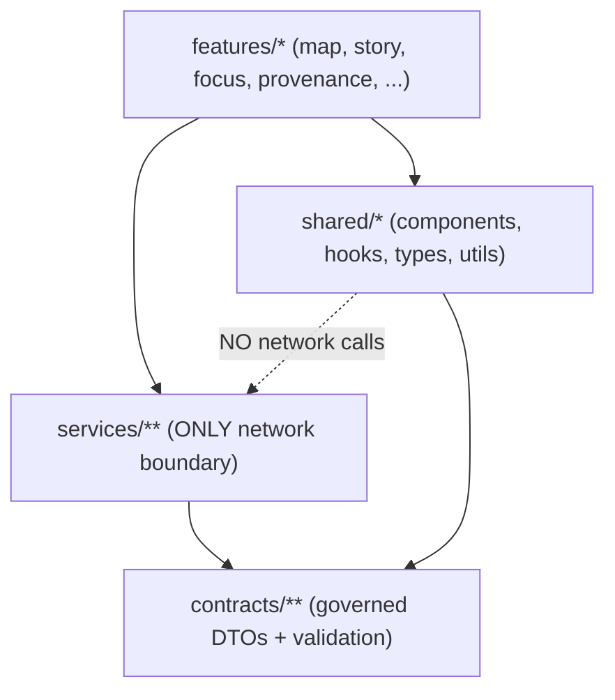

# `web/src/shared/` — Cross‑Feature UI Primitives (Governed) ️


`shared/` is the home for **pure, reusable UI primitives** (components, hooks, types, utilities) used across multiple KFM web features.

> [!IMPORTANT]
> This folder is part of the UI’s **product trust surface**.
> If `shared/` code influences what a user can see (labels, popups, citations, “precision” hints, etc.), it must preserve:
> - **Trust membrane:** UI accesses data **only** via the governed API (network IO stays in `src/services/**`).  
> - **Evidence-first UX:** citations must be **resolvable**, otherwise UI must **abstain** or degrade safely.  
> - **Sensitivity/CARE handling:** never imply false precision; never “work around” policy denials.

## Quick links
- Parent overview (`web/src`): `../README.md`
- Web UI invariants + contracts: `../../README.md`
- Repo governance gates: `../../../.github/README.md`
- Governed docs hub: `../../../docs/README.md`
- Policy (default deny): `../../../policy/README.md`

---

## What belongs in `shared/`

`shared/` exists to keep **consistency** and **governance correctness** high across features.

### ✅ Put this here
| Category | Examples | Why |
|---|---|---|
| UI primitives | buttons, panels, drawers, tables, toasts, icons | reuse without feature coupling |
| Evidence/provenance rendering primitives | citation chips, license badges, “generalized” indicators, audit‑ref display | keeps evidence UX consistent |
| UI-only hooks | `useDebounce`, `useHotkeys`, `useResizeObserver` | reusable and side‑effect bounded |
| Pure utilities | formatters, parsers, guards, normalizers | testable and deterministic |
| Shared UI types | props types, UI state shapes, view models | reduces copy/paste across features |

### ❌ Do not put this here
| Anti-pattern | Where it should go instead | Why |
|---|---|---|
| Feature-specific logic | `features/*` | prevents “god shared” coupling |
| Network calls (`fetch`, `axios`, sockets) | `src/services/**` | trust membrane rule (no hidden IO) |
| Policy “guessing” / inference | API + policy boundary; UI renders outcomes | policy is authoritative at boundary |
| Caching restricted payloads in browser storage | nowhere (unless explicitly policy-approved) | prevents bypass/leak risk |

> [!NOTE]
> `web/src/README.md` describes `shared/` as **cross-feature UI primitives (pure + reusable)** and calls out `shared/components`, `shared/hooks`, `shared/types`, `shared/utils` as the expected structure.  [oai_citation:1‡GitHub](https://raw.githubusercontent.com/bartytime4life/Kansas-Frontier-Matrix/main/web/src/README.md)

---

## Hard boundaries (non‑negotiable)

### 1) No network IO in `shared/`
`shared/` must not directly call the network.

- No `fetch(...)`
- No `XMLHttpRequest`
- No `axios.*`
- No hidden WebSocket connections
- No “resolver” calls from inside a button/hook that look pure

> [!IMPORTANT]
> KFM-Web’s contract says **network IO lives only in `src/services/**`**.  [oai_citation:2‡GitHub](https://raw.githubusercontent.com/bartytime4life/Kansas-Frontier-Matrix/main/web/README.md)

### 2) Shared must not bypass denials
If the user gets a deny/abstain result, **shared** code must not:
- try alternate endpoints,
- reconstruct fields by combining responses,
- store denied payloads “for later” in `localStorage/sessionStorage/IndexedDB`.

These are explicitly called out as prohibited UI behaviors.  [oai_citation:3‡GitHub](https://raw.githubusercontent.com/bartytime4life/Kansas-Frontier-Matrix/main/web/README.md)

### 3) Dependency direction must stay one-way
Shared code should be a **leaf dependency**.

- `features/*` may import from `shared/*`
- `shared/*` must **not** import from `features/*`
- `shared/*` may depend on `src/contracts/*` for **types only** (preferred), but must not implement/perform IO



---

## Recommended directory layout

> [!NOTE]
> Keep this tree accurate: if you add a top-level folder under `shared/`, update this README in the same PR.

```text
web/src/shared/
├─ README.md            # (this file) shared boundaries + conventions
├─ components/          # reusable UI building blocks (NO network)
├─ hooks/               # UI-only hooks (NO hidden IO)
├─ types/               # shared UI types (see contract rules below)
└─ utils/               # pure helpers (format/parse/guard/normalize)
```

---

## Contract and type rules

KFM distinguishes **governed contracts** from “helpful UI types”:

- If a type is part of a **UI↔API contract** (e.g., ViewState, Citation, Focus DTOs), treat it as **governed** and keep the canonical definition in `src/contracts/**` (or whatever the repo’s governed contract path is).
- `shared/types/**` may:
  - **re-export** governed contract types, or
  - define **UI-local** types that are not policy inputs / API DTOs.
- `shared/types/**` must **not** fork or redefine governed DTOs “almost the same.”

> [!IMPORTANT]
> The web UI contract explicitly calls out governed contracts and emphasizes reproducibility and stable shapes.  [oai_citation:4‡GitHub](https://raw.githubusercontent.com/bartytime4life/Kansas-Frontier-Matrix/main/web/README.md)

---

## Patterns that keep shared code “pure”

### Components: render-only + callbacks
Shared components should accept all data via props and emit actions via callbacks.

<details>
<summary><strong>Example: a citation chip that does not resolve evidence</strong></summary>

```tsx
export type CitationChipProps = {
  label: string;
  ref: string; // citation.ref (scheme://...)
  onOpenEvidence: (ref: string) => void;
};

export function CitationChip({ label, ref, onOpenEvidence }: CitationChipProps) {
  return (
    <button type="button" onClick={() => onOpenEvidence(ref)}>
      {label}
    </button>
  );
}
```

**Why:** evidence resolution is a networked operation and belongs in `src/services/**` + feature wiring, not in shared UI.
</details>

### Hooks: UI concerns only
Good shared hooks:
- compute derived UI state
- observe UI signals (resize, keyboard)
- debounce/throttle inputs

Bad shared hooks:
- call APIs
- cache server payloads
- infer policy decisions

---

## Testing expectations for `shared/`

Shared code is high-leverage. Treat it like an internal “standard library.”

### Minimum expectations
- **Unit tests** for `utils/**` and critical UI logic
- **Component tests** for shared primitives that render evidence/policy cues correctly
- No test fixtures with sensitive locations or restricted fields

> [!IMPORTANT]
> UI test gates should protect evidence UX and trust membrane invariants (including blocking network calls outside `src/services/**`).  [oai_citation:5‡GitHub](https://raw.githubusercontent.com/bartytime4life/Kansas-Frontier-Matrix/main/web/README.md)

### “Definition of Done” for changes under `shared/`
- [ ] No new IO paths (no network, no forbidden storage)
- [ ] No feature coupling (no imports from `features/*`)
- [ ] If displaying evidence/policy cues: behavior is consistent and non-leaky
- [ ] Tests added/updated where risk is introduced
- [ ] README updated if you add/rename shared subfolders

---

## Governance and safety reminders

- **Do not imply precision** you do not have. If something is generalized/redacted, surface that clearly.
- **No secrets** ever in client code or env examples.
- Assume the browser is adversarial: shipped code is observable and modifiable.

These are consistent UI baselines for KFM-Web.  [oai_citation:6‡GitHub](https://raw.githubusercontent.com/bartytime4life/Kansas-Frontier-Matrix/main/web/README.md)

---

## “Where should this go?” (fast decision guide)

| You’re building… | Put it in… | Quick rule |
|---|---|---|
| Reusable modal/button/table | `shared/components/` | render-only, no IO |
| General-purpose hook | `shared/hooks/` | UI-only, no network |
| Formatter/guard/parser | `shared/utils/` | pure + tested |
| Feature UI logic | `features/*` | shared must not know features |
| Anything that calls the backend | `services/**` | trust membrane |

> **KFM principle:** if it can’t be traced, it can’t be trusted.
