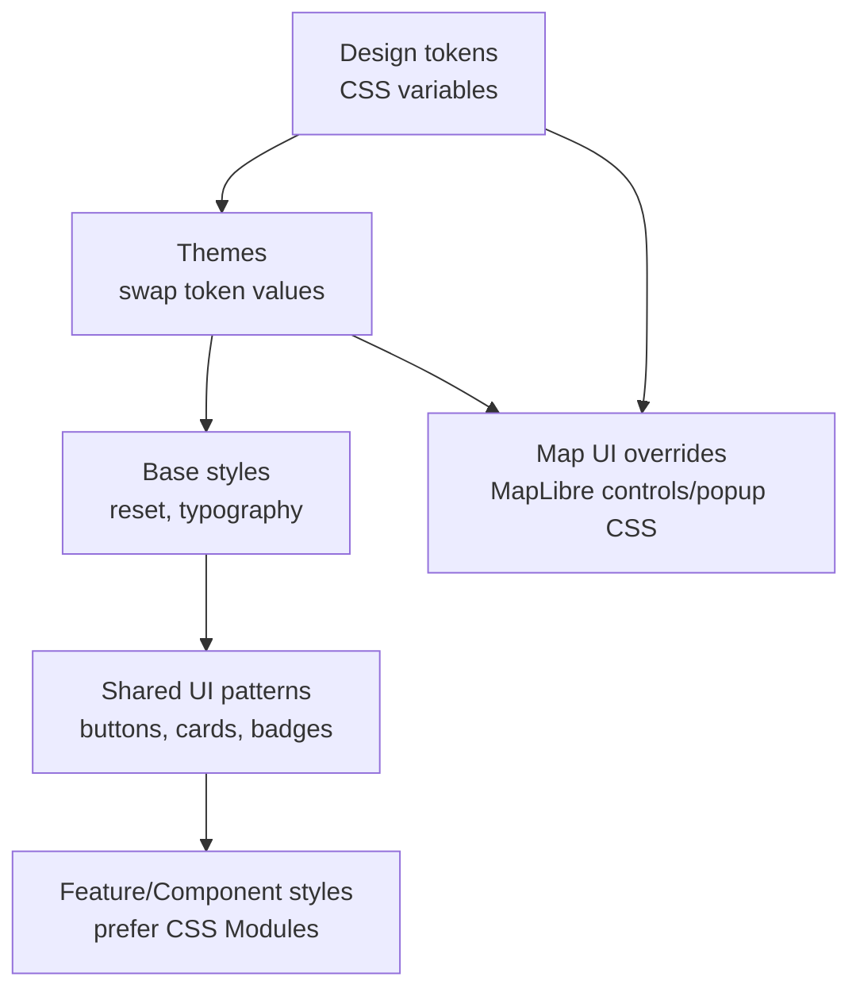

# `web/src/styles` 🎨🧭


This directory is the **style foundation** for the KFM web client:
design tokens → themes → base styles → shared UI patterns → map UI overrides.

> [!NOTE]
> This README documents the **intended** styling approach and directory shape.
> If some filenames/folders below do not exist yet, treat them as a **target layout** and update the tree once the repo structure is finalized. *(Some details are not confirmed in repo.)*

---

## Quick rules ✅

- **Prefer tokens** over raw values (colors, spacing, radii, z-index).
- **Theme via CSS variables** (supports high-contrast and system preferences).
- **No meaning by color alone** (pair color with icon/text/pattern).
- **Accessibility is a release gate** (focus states, contrast, reduced motion).
- **Map UI is special**: MapLibre ships base UI CSS—import it once, then override it.

---

## Directory layout 📁

> Update this tree to match reality as the folder fills in. *(not confirmed in repo)*

```text
web/
└─ src/
   └─ styles/
      ├─ README.md                  # You are here
      ├─ index.css                  # Global entry: tokens + base + utilities + overrides
      │
      ├─ tokens/                    # Design tokens (CSS variables)
      │  ├─ color.css               # palette + semantic color roles
      │  ├─ typography.css          # font stacks, sizes, line heights
      │  ├─ spacing.css             # spacing scale
      │  ├─ radii.css               # border-radius scale
      │  ├─ shadows.css             # shadow tokens (use sparingly)
      │  └─ zindex.css              # z-index tokens (documented!)
      │
      ├─ themes/                    # Theme “overlays” (swap token values)
      │  ├─ theme-default.css
      │  ├─ theme-dark.css
      │  └─ theme-high-contrast.css
      │
      ├─ base/                      # Baseline styles
      │  ├─ reset.css               # normalization/reset
      │  ├─ typography.css          # headings, body text defaults
      │  ├─ forms.css               # inputs/selects/textarea
      │  └─ layout.css              # app shell primitives
      │
      ├─ components/                # Shared UI patterns (not per-component CSS Modules)
      │  ├─ buttons.css
      │  ├─ badges.css              # status/provenance/sensitivity chips
      │  ├─ cards.css
      │  └─ tables.css
      │
      ├─ map/                       # Map UI CSS (controls, popups, overlays)
      │  ├─ maplibre-overrides.css
      │  ├─ legend.css
      │  └─ layer-panel.css
      │
      └─ utilities/                 # Small reusable helpers
         ├─ a11y.css                # focus rings, reduced motion, sr-only
         ├─ helpers.css             # text truncation, flex helpers, etc.
         └─ print.css               # print/exports if supported
```

---

## Styling architecture (mental model) 🧱



---

## Entry-point imports 🔌

### 1) Import MapLibre CSS once

MapLibre’s built-in controls/popups rely on its base CSS. Import MapLibre first, then add KFM overrides.

```ts
// Example: src/main.tsx or src/index.tsx (path may differ; not confirmed in repo)
import "maplibre-gl/dist/maplibre-gl.css";
import "./styles/index.css";
```

### 2) `styles/index.css` should be the only global style import

Keep global imports centralized to avoid order bugs.

```css
/* styles/index.css (example; not confirmed in repo) */

/* 1) tokens */
@import "./tokens/color.css";
@import "./tokens/typography.css";
@import "./tokens/spacing.css";
@import "./tokens/radii.css";
@import "./tokens/shadows.css";
@import "./tokens/zindex.css";

/* 2) themes (default values + optional system fallbacks) */
@import "./themes/theme-default.css";
@import "./themes/theme-dark.css";
@import "./themes/theme-high-contrast.css";

/* 3) base */
@import "./base/reset.css";
@import "./base/typography.css";
@import "./base/forms.css";
@import "./base/layout.css";

/* 4) shared patterns */
@import "./components/buttons.css";
@import "./components/badges.css";
@import "./components/cards.css";
@import "./components/tables.css";

/* 5) map overrides */
@import "./map/maplibre-overrides.css";
@import "./map/legend.css";
@import "./map/layer-panel.css";

/* 6) utilities */
@import "./utilities/a11y.css";
@import "./utilities/helpers.css";
@import "./utilities/print.css";
```

> [!TIP]
> If your toolchain doesn’t support `@import` in CSS the way you want, convert `index.css` into explicit imports in the JS entry, or switch to a preprocessor/PostCSS pipeline. *(not confirmed in repo)*

---

## Design tokens 🧩

### Naming conventions

Use a single prefix (recommendation): `--kfm-*`

| Token category | Example | Notes |
|---|---|---|
| Semantic colors | `--kfm-color-surface`, `--kfm-color-text`, `--kfm-color-accent` | Use semantics, not “red/blue” |
| State colors | `--kfm-color-success`, `--kfm-color-warning`, `--kfm-color-danger` | Pair with icon/text too |
| Spacing | `--kfm-space-1`…`--kfm-space-8` | Consistent rhythm |
| Typography | `--kfm-font-sans`, `--kfm-font-size-2` | Prefer `rem` |
| Motion | `--kfm-motion-fast`, `--kfm-motion-slow` | Respect reduced motion |
| Z-index | `--kfm-z-map`, `--kfm-z-modal`, `--kfm-z-toast` | Document every layer |

> [!IMPORTANT]
> **Do not bake meaning into raw colors.**
> Tokens should represent *roles* (surface, text, border, emphasis, focus) so themes can swap values safely.

---

## Themes (including high contrast) 🌓🟨⬛

Themes should override token values, not restyle components directly.

### Recommended mechanism

- Theme attribute on `<html>`: `data-theme="default|dark|high-contrast"`
- Tokens defined in `:root`
- Theme overrides in `[data-theme="…"]`
- Respect user preferences:
  - `prefers-color-scheme`
  - `prefers-reduced-motion`

```css
/* tokens/color.css */
:root {
  --kfm-color-surface: white;
  --kfm-color-text: black;
  --kfm-color-focus: currentColor; /* placeholder */
}

/* themes/theme-high-contrast.css */
html[data-theme="high-contrast"] {
  /* overwrite tokens only */
  --kfm-color-surface: black;
  --kfm-color-text: white;
}

/* utilities/a11y.css */
@media (prefers-reduced-motion: reduce) {
  * {
    animation-duration: 0.001ms !important;
    animation-iteration-count: 1 !important;
    transition-duration: 0.001ms !important;
    scroll-behavior: auto !important;
  }
}
```

<details>
  <summary><strong>Theme switching in React (example)</strong></summary>

```ts
// Pseudocode (not confirmed in repo)
document.documentElement.dataset.theme = "high-contrast";
```

</details>

---

## Accessibility requirements ♿️

### Focus and keyboard

- Never remove focus outlines without replacement.
- Use a visible focus ring with sufficient contrast.
- Ensure map controls and overlay panels are keyboard reachable.

### Contrast

- Treat WCAG contrast as a **blocking check** for:
  - text vs background
  - focus ring vs background
  - interactive borders/controls

### Motion

- Respect `prefers-reduced-motion`
- Avoid excessive parallax, long transitions, and animated backgrounds.

> [!CHECKLIST]
> **A11y DoD for style changes**
> - [ ] Focus ring visible on all interactive elements
> - [ ] Contrast checked for text + focus + controls
> - [ ] `prefers-reduced-motion` honored
> - [ ] Meaning not conveyed by color alone

---

## Map UI styling (MapLibre) 🗺️

There are *two* different “map styling” layers:

1) **Map style JSON** (vector tile layers, colors/line widths for map features)  
2) **CSS** for MapLibre UI elements (controls, popups, attribution, overlays)

This folder mainly addresses **#2**.

### MapLibre CSS overrides pattern

1) Import `maplibre-gl.css` once (entry point)  
2) Add overrides in `styles/map/maplibre-overrides.css`

```css
/* map/maplibre-overrides.css */

/* Example: keep overrides scoped to the map container */
.kfm-map .maplibregl-ctrl-group {
  /* use tokens, not raw values */
  background: var(--kfm-color-surface);
  color: var(--kfm-color-text);
}
```

> [!WARNING]
> If map controls/popups are invisible, check that `maplibre-gl/dist/maplibre-gl.css` is imported before KFM overrides.

---

## Governance notes for styles 🧾

KFM is an evidence-first, governed system. UI styling can change meaning and interpretation.

**High-risk style changes (require governance review):**
- Map palettes that imply value judgements (e.g., “good/bad” colors)
- Boundary styling that implies certainty where data is uncertain
- Symbol/icon changes that could affect public narratives
- “Sensitive” or redaction indicators (ensure they are unambiguous)

**Recommended visual language (semantic roles):**
- `confirmed` / `not-confirmed` / `inferred`
- `sensitive` / `redacted` / `approximate`

> [!IMPORTANT]
> If the UI shows *approximate or generalized locations* for safety, ensure styling makes that explicit (e.g., dashed outlines, “approximate” chip). Do not present generalized data with the same styling as precise data.

---

## Definition of Done for a new style pattern ✅

> Copy/paste into PR descriptions.

- [ ] Uses tokens (`--kfm-*`), no hard-coded “magic values” unless justified
- [ ] Works across supported themes (default/dark/high-contrast)
- [ ] Keyboard + focus states verified
- [ ] Contrast verified for text + controls + focus rings
- [ ] MapLibre UI verified (controls/popups visible)
- [ ] No global leakage (styles are scoped; avoids generic selectors like `div {}`)
- [ ] Added/updated docs in this README if a new convention was introduced

---

## FAQ / troubleshooting 🧯

### “Map controls disappeared”
- Ensure MapLibre’s base CSS is imported (`maplibre-gl/dist/maplibre-gl.css`) before your overrides.
- Confirm overrides are scoped (don’t accidentally `display:none` on control containers).

### “Theme switching works, but some components don’t change”
- Check for hard-coded color values in component styles.
- Convert component rules to use semantic tokens.

---

## Related (where to document what) 🔗

- **Component-specific styles**: colocate with the component (prefer CSS Modules). *(not confirmed in repo)*
- **Map style JSON**: keep separate from CSS; document in a `map/` or `mapStyles/` README. *(not confirmed in repo)*
- **UI patterns** (badges/alerts/provenance chips): document in `web/src/components/...` plus a short entry here.

---