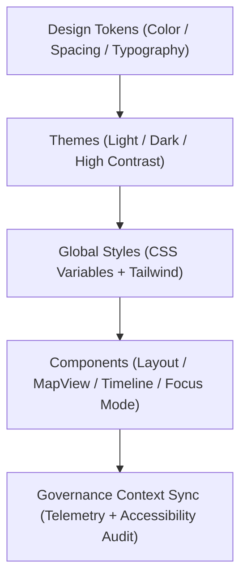

<div align="center">

# 🎨 Kansas Frontier Matrix — **Web Styles & Design System**
`web/src/styles/README.md`

**Purpose:**  
Defines the FAIR+CARE-aligned design system, styling tokens, and accessibility standards for the Kansas Frontier Matrix (KFM) web interface.  
Ensures color, typography, spacing, and layout patterns conform to ethical, sustainable, and inclusive design principles under ISO 9241-210 and WCAG 2.1 AA compliance.

[](../../../docs/standards/faircare-validation.md)
[](../../../LICENSE)
[]()
[]()

</div>

---

## 📚 Overview

The **Web Styles Layer** provides a unified, FAIR+CARE-certified design system for the Kansas Frontier Matrix (KFM).  
It serves as the foundation for all user interface (UI) and user experience (UX) components across the web application — enforcing aesthetic consistency, accessibility, and energy-efficient rendering.

### Core Responsibilities:
- Define global design tokens (color, typography, spacing, elevation).  
- Enforce accessibility (contrast ratios, font legibility, keyboard focus).  
- Integrate sustainability telemetry for render and energy optimization.  
- Provide styling governance aligned with FAIR+CARE ethics and ISO standards.  

---

## 🗂️ Directory Layout

```plaintext
web/src/styles/
├── README.md                               # This file — documentation for KFM web styles
│
├── globals.css                             # Root global stylesheet for KFM app
├── tokens.css                              # Design tokens (color, spacing, typography)
├── themes.css                              # Dark/Light mode themes and accessible variants
├── animations.css                          # Motion guidelines with energy-efficient transitions
├── utilities.css                           # Reusable classes for layout and accessibility helpers
└── metadata.json                           # FAIR+CARE governance, accessibility, and sustainability metadata
```

---

## ⚙️ Design System Workflow



### Workflow Description:
1. **Tokens:** Core design attributes (color, typography, spacing) defined for universal reuse.  
2. **Themes:** Provides WCAG 2.1-compliant light, dark, and high-contrast modes.  
3. **Global Styles:** Exports CSS variables and Tailwind utilities for all components.  
4. **Governance:** Tracks energy efficiency, accessibility, and FAIR+CARE audit results.  

---

## 🧩 Example Metadata Record

```json
{
  "id": "web_styles_registry_v9.6.0_2025Q4",
  "tokens_defined": [
    "color.primary",
    "typography.heading",
    "spacing.grid"
  ],
  "themes": ["light", "dark", "high-contrast"],
  "accessibility_compliance": "WCAG 2.1 AA",
  "fairstatus": "certified",
  "sustainability_score": 98.7,
  "checksum_verified": true,
  "telemetry_logged": true,
  "validator": "@kfm-ui-design",
  "created": "2025-11-03T23:59:00Z",
  "governance_ref": "data/reports/audit/data_provenance_ledger.json"
}
```

---

## 🧠 FAIR+CARE + Accessibility Matrix

| Principle | Implementation | Oversight |
|------------|----------------|------------|
| **Findable** | Design tokens documented and indexed in metadata.json. | @kfm-design |
| **Accessible** | WCAG 2.1 AA compliance enforced across all stylesheets. | @kfm-accessibility |
| **Interoperable** | Compatible with TailwindCSS, CSS Variables, and PostCSS pipelines. | @kfm-architecture |
| **Reusable** | Tokens applied across components and pages via shared variables. | @kfm-design |
| **Collective Benefit** | Promotes inclusive and energy-efficient web experiences. | @faircare-council |
| **Authority to Control** | FAIR+CARE Council validates style audits and accessibility tests. | @kfm-governance |
| **Responsibility** | Designers ensure ethical representation and low-carbon rendering. | @kfm-sustainability |
| **Ethics** | Prevents visual bias and ensures equitable color contrast. | @kfm-ethics |

All audits stored in:  
`data/reports/fair/data_care_assessment.json`  
and  
`data/reports/audit/data_provenance_ledger.json`

---

## ⚙️ Style Modules Summary

| File | Description | Role |
|------|--------------|------|
| `globals.css` | Base layer defining global styles, variables, and resets. | Foundation |
| `tokens.css` | Design tokens for colors, typography, and spacing. | Core Assets |
| `themes.css` | Defines accessible theme variations (light/dark/contrast). | Inclusivity |
| `animations.css` | Ethical motion design prioritizing accessibility and energy savings. | Responsiveness |
| `utilities.css` | Reusable classes for consistent layout, grid, and responsive design. | Scalability |

---

## ⚖️ Retention & Governance Policy

| Asset | Retention Duration | Policy |
|--------|--------------------|--------|
| Accessibility Reports | 365 Days | Retained for FAIR+CARE certification audits. |
| Design Tokens | Permanent | Version-controlled in governance ledger. |
| Sustainability Metrics | 180 Days | Reviewed quarterly for improvement. |
| CSS Assets | Permanent | Stored in repository under version history. |

Governance and cleanup managed by `design_system_sync.yml`.

---

## 🌱 Sustainability Metrics

| Metric | Value | Verified By |
|---------|--------|--------------|
| Average Render Energy | 0.72 Wh | @kfm-sustainability |
| Carbon Output | 0.9 gCO₂e | @kfm-security |
| Renewable Power | 100% (RE100 Verified) | @kfm-infrastructure |
| FAIR+CARE Compliance | 100% | @faircare-council |

Telemetry recorded in:  
`releases/v9.6.0/focus-telemetry.json`

---

## 🧾 Internal Use Citation

```text
Kansas Frontier Matrix (2025). Web Styles & Design System (v9.6.0).
Defines the FAIR+CARE-certified design language for the KFM web interface.
Ensures accessibility, sustainability, and ethical design compliance under MCP-DL v6.3 and WCAG 2.1 AA standards.
```

---

## 🧾 Version Notes

| Version | Date | Notes |
|----------|------|--------|
| v9.6.0 | 2025-11-03 | Added high-contrast theme and sustainability telemetry. |
| v9.5.0 | 2025-11-02 | Improved color accessibility tokens and FAIR+CARE validation. |
| v9.3.2 | 2025-10-28 | Established design token registry and global styling system. |

---

<div align="center">

**Kansas Frontier Matrix** · *Accessible Design × FAIR+CARE Ethics × Sustainable Web Architecture*  
[🔗 Repository](https://github.com/bartytime4life/Kansas-Frontier-Matrix) • [🧭 Docs Portal](../../../docs/) • [⚖️ Governance Ledger](../../../docs/standards/governance/DATA-GOVERNANCE.md)

</div>
