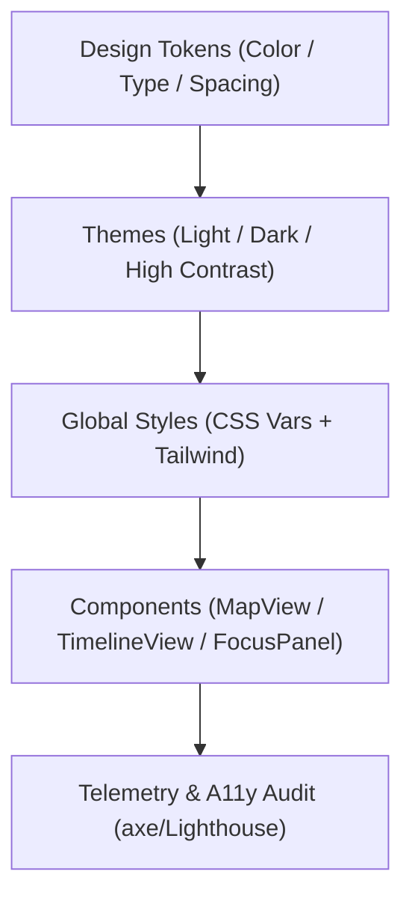

<div align="center">

# 🎨 **Kansas Frontier Matrix — Web Styles & Design System**
`web/src/styles/README.md`

**Purpose:** Define the FAIR+CARE-aligned design tokens, CSS architecture, and accessibility standards for the KFM web application.  
This system guarantees **WCAG 2.1 AA** conformance, sustainable rendering, and reproducibility under **MCP v6.3**.

[](../../../docs/README.md)
[](../../../LICENSE)
[](../../../docs/standards/faircare.md)
[]()

</div>

---

## 📘 Overview

The **Styles layer** centralizes tokens and global styles for a consistent, inclusive web experience.  
Color, typography, spacing, motion, and layout are versioned as **tokens** and exported via CSS variables and Tailwind utilities.  
All changes are validated by accessibility scans and logged to telemetry.

---

## 🗂️ Directory Layout

```
web/src/styles/
├── README.md                # This file
├── globals.css              # Root resets, base variables, layout rules
├── tokens.css               # Design tokens (color, type, spacing, elevation)
├── themes.css               # Light/Dark/High-contrast themes
├── animations.css           # Ethical motion + reduced-motion variants
├── utilities.css            # Common layout/a11y utility classes
└── metadata.json            # Governance + accessibility metadata for the style system
```

---

## 🧩 Design System Workflow



1. **Tokens** define portable style primitives.  
2. **Themes** deliver WCAG-compliant palettes and contrast targets.  
3. **Global Styles** wire tokens through CSS variables and Tailwind.  
4. **Components** consume tokens; variants adapt to user preferences (e.g., reduced motion).  
5. **Telemetry/A11y** scans report across builds, stored in `focus-telemetry.json`.

---

## ♿ Accessibility & Inclusive Patterns

- Contrast ratios: **≥ 4.5:1** (text), **≥ 3:1** (large).  
- Focus indicators and **skip links** for keyboard navigation.  
- **Reduced motion** media queries and motion-safe animations.  
- Alt text guidance for imagery; ARIA labeling for landmarks and controls.  
- **Bi-directional** (LTR/RTL) and **high-contrast** variants supported.

Docs: `../../../docs/standards/ui_accessibility.md`.

---

## ⚙️ Token Registry

| Token Group | Example Variables | Notes |
|------------|-------------------|------|
| Color | `--kfm-color-primary`, `--kfm-bg-surface`, `--kfm-accent` | Contrast-tested; themable |
| Typography | `--kfm-font-sans`, `--kfm-font-size-200..900` | Scalable, legible pairs |
| Spacing | `--kfm-space-1..12` | Grid + rhythm |
| Elevation | `--kfm-shadow-1..5` | Motion-safe elevation |
| Radius | `--kfm-radius-sm..2xl` | Component rounding |

---

## 🧪 Contracts & Validation

| Contract | Purpose | Enforced By |
|---------|---------|-------------|
| A11y Contract | Route/component a11y assertions | `accessibility_scan.yml` (axe/Lighthouse) |
| Token Schema | Structure of tokens.css | CSS lint + schema guard |
| Theme Contract | Light/Dark/Contrast invariants | Visual regression + contrast tests |

Artifacts feed telemetry and audits:
- `docs/reports/telemetry/build_metrics.json`  
- `../../../releases/v9.7.0/focus-telemetry.json`

---

## 🌱 Sustainability Metrics

| Metric | Target | Verified By |
|-------|--------|-------------|
| Render Energy / View | ≤ 0.7 Wh | Telemetry hooks |
| Page Weight (styles) | ≤ 150 KB | Build metrics |
| Lighthouse A11y | ≥ 95 | CI accessibility scan |

---

## 🧾 Example Metadata Record

```json
{
  "id": "web_styles_v9.7.0",
  "themes": ["light", "dark", "high-contrast"],
  "wcag": "2.1 AA",
  "sustainability_score": 98.8,
  "checksum_verified": true,
  "timestamp": "2025-11-05T18:05:00Z",
  "telemetry_ref": "releases/v9.7.0/focus-telemetry.json"
}
```

---

## 🕰️ Version History

| Version | Date | Author | Summary |
|----------|------|---------|----------|
| v9.7.0 | 2025-11-05 | KFM Core Team | Upgraded & aligned: token registry, theme contract, a11y & sustainability telemetry. |
| v9.6.0 | 2025-11-03 | KFM Core Team | Added high-contrast theme + reduced-motion variants. |
| v9.5.0 | 2025-11-02 | KFM Core Team | Improved color accessibility tokens and CI checks. |
| v9.3.2 | 2025-10-28 | KFM Core Team | Established design token and global CSS system. |

---

<div align="center">

**© 2025 Kansas Frontier Matrix — MIT / CC-BY 4.0**  
Maintained under **Master Coder Protocol v6.3** · FAIR+CARE Certified · Diamond⁹ Ω / Crown∞Ω Ultimate Certified  
[Back to Web Source](../README.md) · [Docs Index](../../../docs/README.md)

</div>