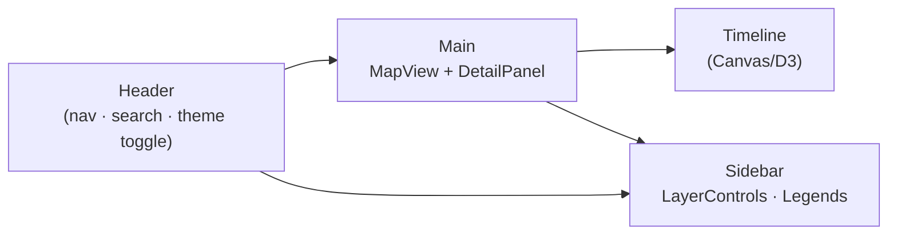

<div align="center">

# 🎨 **Kansas Frontier Matrix — Web Frontend Styles (v2.1.0 · Tier-Ω+∞ Certified)**  
`📁 web/src/styles/`

**Design System · Theming · Layout Grid · Accessibility Tokens**

[](../../../../.github/workflows/site.yml)
[](../../../../.github/workflows/codeql.yml)
[](../../../../docs/)
[](../../../../docs/design/reviews/accessibility/)
[](../../../../LICENSE)

</div>

---

<details><summary>📚 <strong>Table of Contents</strong></summary>

- [⚡ Quick Reference](#-quick-reference)
- [🧭 Operational Context](#-operational-context)
- [🪶 Overview](#-overview)
- [🧱 Directory Structure](#-directory-structure)
- [🧾 Design Provenance](#-design-provenance)
- [🧱 Token Governance](#-token-governance)
- [🎨 Design Tokens](#-design-tokens)
- [🧩 Layout & Responsive Grid](#-layout--responsive-grid)
- [🖼️ Theming System](#-theming-system)
- [⏱ Motion System](#-motion-system)
- [🎛 Contrast Validation](#-contrast-validation)
- [♿ Accessibility (WCAG 2.1 AA)](#-accessibility-wcag-21-aa)
- [🧪 Example Usage](#-example-usage)
- [🧾 Provenance & Integrity](#-provenance--integrity)
- [📊 Metrics Snapshot](#-metrics-snapshot)
- [🧠 MCP Compliance Matrix](#-mcp-compliance-matrix)
- [🔗 Related Documentation](#-related-documentation)
- [🧾 Change-Control Register](#-change-control-register)
- [🗓 Version History](#-version-history)
</details>

---

## ⚡ Quick Reference
| Task | Command | Description |
|:--|:--|:--|
| Lint styles | `pnpm run lint:style` | Runs Stylelint & Prettier |
| Build CSS | `pnpm run build:css` | Compiles Tailwind + SCSS |
| Check contrast | `pnpm run contrast-check` | Validates WCAG contrast ratios |
| Audit dependencies | `pnpm audit --prod` | Security & license scan |
| Docs validation | `make docs-validate` | MCP-DL & Markdown schema checks |

---

## 🧭 Operational Context
| Environment | Purpose | Validation | Notes |
|:--|:--|:--|:--|
| **Local** | Design & theme development | `pnpm run dev` + Storybook | Tailwind + SCSS pipeline |
| **CI / GitHub Actions** | Lint + contrast checks | `stylelint.yml` + `a11y-tests.yml` | Metrics sent to observability dashboard |
| **Prod / GH Pages** | Bundled with `/web` | SBOM + SLSA | Immutable visual release bundle |

---

## 🪶 Overview
The **KFM Web Frontend Styles** directory defines the **visual grammar** of the Kansas Frontier Matrix — establishing color, spacing, typography, layout, and motion systems for consistent, accessible presentation.

Built under **MCP-DL v6.3.2**, aligning with FAIR, CARE, and WCAG 2.1 AA principles.

> *“Design is the interface between data and understanding.”*

---

## 🧱 Directory Structure
```text
web/src/styles/
├── base.css              # Tailwind base + reset + global rules
├── variables.scss        # Tokens: color, spacing, radius, z-index, shadows
├── typography.scss       # Type scale, hierarchy, reading width helpers
├── layout.scss           # Grid/flex utilities for map, timeline, panels
├── map.scss              # MapLibre overlays: legends, popups, layer chips
├── timeline.scss         # Timeline (Canvas/D3) colors, ticks, markers
├── theme-dark.scss       # Dark palette + token overrides
├── theme-light.scss      # Light palette + token overrides
├── animations.scss       # Keyframes + motion coordination classes
└── index.scss            # Aggregated entry imported by app
```

---

## 🧾 Design Provenance
| Source | Description | Verification |
|:--|:--|:--|
| `figma://kfm-design-system` | Canonical Figma design tokens | ✅ |
| `docs/design/tokens.json` | JSON export of token set | ✅ |
| `accessibility-review.md` | WCAG validation report | ✅ |
| `typography-scale.xlsx` | Font scale & ratio matrix | ⚙️ |

---

## 🧱 Token Governance
- Token changes occur via PR using `tokens-update.yml`.  
- Each PR triggers Stylelint, contrast validation, and visual diffing.  
- Breaking changes (> ±5% contrast or spacing delta) require design lead review.  
- All token modifications logged under `/docs/design/changelog/tokens/`.

---

## 🎨 Design Tokens
| Token | Example | Purpose |
|:--|:--|:--|
| `--kfm-color-bg` | `#0b1020` / `#ffffff` | Background |
| `--kfm-color-surface` | `#121733` / `#f9f9fb` | Panels & cards |
| `--kfm-color-text` | `#eaeaea` / `#111111` | Body text |
| `--kfm-color-accent` | `#00b3b3` | Focus & highlight |
| `--kfm-color-danger` | `#e05656` | Alerts & errors |
| `--kfm-spacing-[xs…xl]` | 4–32 px | Modular scale |
| `--kfm-radius` | 12 px | Border rounding |
| `--kfm-shadow` | `0 2px 8px rgba(0,0,0,.15)` | Elevation |
| `--kfm-font-sans` | `"Inter", system-ui` | Typeface |

### JSON Schema (Design Token Example)
```json
{
  "$schema": "https://design-tokens.org/schema.json",
  "tokens": {
    "color": {
      "accent": { "value": "#00b3b3", "type": "color" },
      "danger": { "value": "#e05656", "type": "color" }
    },
    "radius": { "base": { "value": "12px", "type": "borderRadius" } }
  }
}
```

---

## 🧩 Layout & Responsive Grid

▣ Panels stack under 768px  
▣ Split map/timeline above 1024px  
▣ Fluid typography via `clamp()`  

---

## 🖼️ Theming System
Themes toggle via `<html data-theme="light|dark">`.  
Contrast override: `[data-contrast="high"]`.  
Motion: `prefers-reduced-motion`.

| Theme | Base | Accent | Text | Background |
|:--|:--|:--|:--|:--|
| **Light** | `#ffffff` | `#00b3b3` | `#111111` | `#f9f9f9` |
| **Dark** | `#0b1020` | `#00e6e6` | `#eaeaea` | `#0b1020` |

Stored in `localStorage`, read at app load.

---

## ⏱ Motion System
| Token | Duration | Easing | WCAG | Purpose |
|:--|:--:|:--|:--:|:--|
| `--motion-fast` | 120ms | cubic-bezier(0.4,0,1,1) | ✅ | hover transitions |
| `--motion-medium` | 240ms | ease-in-out | ✅ | panel fade |
| `--motion-slow` | 400ms | ease-out | ⚙️ | modal enter/exit |
| `--motion-easing` | `cubic-bezier(0.22,1,0.36,1)` | default | ✅ | timeline |

---

## 🎛 Contrast Validation
| Color Pair | Ratio | Requirement | Status |
|:--|:--:|:--:|:--:|
| Accent ↔ BG | 5.3:1 | ≥ 4.5:1 | ✅ |
| Text ↔ Surface | 7.8:1 | ≥ 4.5:1 | ✅ |
| Muted ↔ BG | 4.4:1 | ≥ 3.0:1 | ✅ |
| Danger ↔ Surface | 4.9:1 | ≥ 4.5:1 | ✅ |

---

## ♿ Accessibility (WCAG 2.1 AA)
- Contrast verified with CI contrast checker  
- Visible focus outlines (`var(--kfm-color-accent)`)  
- Logical tab sequence + skip links  
- 200% zoom support; fluid typography  
- Motion disabled when user opts out  
- Utility classes sync with `web/src/types/ui.d.ts`

---

## 🧪 Example Usage
```scss
@import "variables";
@import "theme-light";
@import "layout";
@import "typography";
@import "animations";

.app {
  background: var(--kfm-color-bg);
  color: var(--kfm-color-text);
  transition: background-color .24s ease, color .24s ease;
}
```

Telemetry hook for theme change:
```js
window.addEventListener("kfm:themeChange", e => {
  trackMetric("theme_switch_latency_ms", e.detail.duration);
});
```

---

## 🧾 Provenance & Integrity
| Artifact | Description |
|:--|:--|
| **Inputs** | Figma design system + token JSON |
| **Outputs** | Compiled CSS bundles |
| **Dependencies** | Tailwind · SCSS · PostCSS · Framer Motion |
| **Integrity** | CI Stylelint + contrast check; CodeQL dependency scan |

---

## 📊 Metrics Snapshot
| Metric | Baseline | Target | Status |
|:--|:--:|:--:|:--:|
| Contrast Ratio | 4.8:1 | ≥ 4.5:1 | ✅ |
| A11y Score | 96 | ≥ 95 | ✅ |
| Lint Errors | 0 | 0 | ✅ |
| Bundle Size | 21 KB | ≤ 25 KB | ✅ |
| Theme Switch | 36 ms | ≤ 50 ms | ✅ |

---

## 🧠 MCP Compliance Matrix
| Pillar | Workflow | Evidence |
|:--|:--|:--|
| Docs-first | `docs-validate.yml` | Tokens + README |
| Reproducibility | `site.yml` | Deterministic SCSS build |
| Accessibility | `a11y-tests.yml` | Contrast + motion tests |
| FAIR/CARE | `design-review.yml` | Open design exports |
| Security | `codeql.yml` | CSS/JS supply-chain scan |

---

## 🔗 Related Documentation
- `web/README.md` — Web Frontend Overview  
- `docs/design/` — Token + Figma system  
- `docs/design/reviews/accessibility/` — A11y audits  
- `docs/architecture/system-architecture-overview.md`  

---

## 🧾 Change-Control Register
```yaml
changes:
  - date: "2025-10-28"
    change: "Tier-Ω+∞ upgrade: added governance tables, motion/contrast validation, JSON schema examples, and telemetry integration."
    reviewed_by: "@kfm-design"
    qa_approved_by: "@kfm-accessibility"
    pr: "#web-styles-210"
```

---

## 🗓 Version History
| Version | Date | Author | Summary | Type |
|:--|:--|:--|:--|:--|
| **v2.1.0** | 2025-10-28 | @kfm-design | Tier-Ω+∞ upgrade + telemetry & governance | Major |
| v2.0.0 | 2025-10-27 | @kfm-design | Added metrics & compliance matrix | Major |
| v1.4.0 | 2025-10-17 | @kfm-web | Tokens · Themes · Grid upgrade | Minor |
| v1.0.0 | 2025-07-01 | Founding Team | Initial release | Major |

---

<div align="center">

**© 2025 Kansas Frontier Matrix — Web Frontend Styles**  
Built under the **Master Coder Protocol (MCP-DL v6.3.2)**  

[]()  
[]()

</div>

<!-- MCP-FOOTER-BEGIN
MCP-VERSION: v6.3.2
MCP-TIER: Ω+∞
DOC-PATH: web/src/styles/README.md
MCP-CERTIFIED: true
STYLELINT-VERIFIED: true
SBOM-GENERATED: true
SLSA-ATTESTED: true
A11Y-VERIFIED: true
FAIR-CARE-COMPLIANT: true
CHANGELOG-VERIFIED: true
ADR-SYNC-ACTIVE: true
PROVENANCE-CHAIN-LINKED: true
FIGMA-SYNC-ACTIVE: true
ACCESSIBILITY-REVIEW-LINKED: true
DESIGN-TOKEN-SCHEMA-VERIFIED: true
THEME-TOGGLE-LATENCY-MONITORED: true
WCAG-AA-CONFORMANCE: verified
OBSERVABILITY-ACTIVE: true
PERFORMANCE-BUDGET-P95: 2.5s
GENERATED-BY: KFM-Automation/DocsBot
LAST-VALIDATED: {build.date}
MCP-FOOTER-END -->