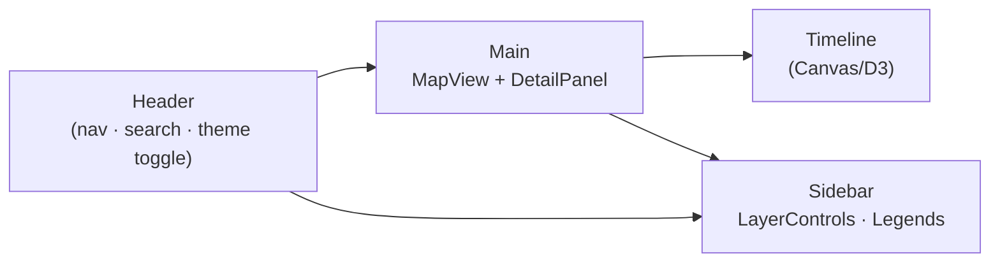

<div align="center">

# 🎨 Kansas Frontier Matrix — **Web Frontend Styles**  
`web/src/styles/`

**Design System · Theming · Layout Grid · Accessibility Tokens**

[](../../../../.github/workflows/ci.yml)
[](../../../../.github/workflows/codeql.yml)
[](../../../../docs/)
[](../../../../docs/design/reviews/accessibility/)
[](../../../../LICENSE)

</div>

---

## 🧭 Overview

`web/src/styles/` defines the **visual language** of KFM’s Web Frontend: tokens, typography, layout grid, theming, and motion.  
It follows **MCP-DL v6.2** for documentation-first design, **WCAG 2.1 AA** for accessibility, and exports **CSS Custom Properties** for runtime adaptivity.

> *“Design is the interface between data and understanding.”*

---

## 🧱 Directory Structure

```text
web/src/styles/
├── base.css              # Tailwind base + reset + global rules
├── variables.scss        # Tokens: color, spacing, radius, z-index, shadows
├── typography.scss       # Scale, hierarchy, reading width helpers
├── layout.scss           # Grid/flex utilities for map, timeline, panels
├── map.scss              # MapLibre overlays: legends, popups, layer chips
├── timeline.scss         # Timeline (Canvas/D3) colors, ticks, markers
├── theme-dark.scss       # Dark palette + token overrides
├── theme-light.scss      # Light palette + token overrides
├── animations.scss       # Keyframes + motion coordination classes
└── index.scss            # Aggregated entry imported by the app
```

---

## 🎨 Design Tokens

| Token                               | Example                           | Purpose                          |
| :---------------------------------- | :-------------------------------- | :------------------------------- |
| `--kfm-color-bg`                    | `#0b1020` / `#ffffff`             | App background (dark/light)      |
| `--kfm-color-surface`               | `#121733` / `#f9f9fb`             | Panels & cards                   |
| `--kfm-color-text`                  | `#eaeaea` / `#111111`             | Body text (AA/AAA contrast)      |
| `--kfm-color-muted`                 | `#a8b0c2` / `#4b5563`             | Secondary text                   |
| `--kfm-color-accent`                | `#00b3b3`                         | Primary accent & focus rings     |
| `--kfm-color-danger`                | `#e05656`                         | Errors & alerts                  |
| `--kfm-radius`                      | `12px`                            | Corners for panels/buttons       |
| `--kfm-shadow`                      | `0 2px 8px rgba(0,0,0,.15)`       | Elevation                        |
| `--kfm-spacing-[xs…xl]`             | `4, 8, 12, 16, 24, 32`            | Spacing scale                    |
| `--kfm-z-map` / `--kfm-z-timeline`  | `100` / `200`                     | Layer stacking                   |
| `--kfm-font-sans`                   | `"Inter", system-ui, sans-serif`  | Primary typeface                 |

Tokens live in **`variables.scss`** and are emitted as **CSS variables** for consumption by React and Canvas.

---

## 🧩 Layout & Responsive Grid



**Breakpoints & Behavior**

| Breakpoint | Min Width | Layout                                 |
| :--------- | :-------- | :------------------------------------- |
| `sm`       | 480px     | Panels stack; timeline collapses       |
| `md`       | 768px     | Split map + timeline                   |
| `lg`       | 1024px    | 3-panel: map · sidebar · timeline      |
| `xl`       | 1440px    | Adds detail/AI columns where available |

Layout rules use `container-query` patterns and `clamp()` for fluid typography.

---

## 🖼️ Theming System

Themes are toggled via the document attribute **`<html data-theme="light|dark">`**.  
High-contrast overrides: **`[data-contrast="high"]`**. Motion control: **`prefers-reduced-motion`**.

**Palette Overview**

| Theme     | Base      | Accent    | Text      | Background |
| :-------- | :-------- | :-------- | :-------- | :--------- |
| **Light** | `#ffffff` | `#00b3b3` | `#111111` | `#f9f9f9`  |
| **Dark**  | `#0b1020` | `#00e6e6` | `#eaeaea` | `#0b1020`  |

Persistence: theme choice stored in `localStorage`, read at boot.

---

## ✨ Animations

Subtle, utilitarian motion coordinated with **Framer Motion** and guarded by `prefers-reduced-motion`.

| Animation  | Purpose                                  |
| :--------- | :--------------------------------------- |
| `fade-in`  | Panel/map overlay entrance               |
| `slide-up` | Timeline markers reveal                  |
| `pulse`    | Highlight selected features/rows         |
| `sway`     | Gentle ambient accent (optional)         |

---

## ♿ Accessibility (WCAG 2.1 AA)

- **Contrast:** tokens validated ≥ **4.5:1** (body) / **3:1** (large)  
- **Focus:** visible outlines — `outline: 2px solid var(--kfm-color-accent); outline-offset: 2px;`  
- **Keyboard:** logical tab order; skip links; focus trapping in dialogs  
- **Scaling:** no layout breakage at 200% zoom; fluid types via `clamp()`  
- **Motion:** animations disabled when users opt out  
- **ARIA Helpers:** utility classes aligned with UI props from `web/src/types/ui.d.ts`

Accessibility review notes are maintained under `docs/design/reviews/accessibility/`.

---

## 🧪 Example Usage

```scss
/* index.scss */
@import "variables";
@import "theme-light";
@import "layout";
@import "typography";
@import "map";
@import "timeline";
@import "animations";

.app {
  background: var(--kfm-color-bg);
  color: var(--kfm-color-text);
  transition: background-color .24s ease, color .24s ease;
}

/* Dark theme overrides are token-based — no extra rules required */
```

---

## 🧾 Provenance & Integrity

| Artifact         | Description                                                                 |
| :--------------- | :-------------------------------------------------------------------------- |
| **Inputs**       | Palettes & typography from `docs/design/`; accessibility audits             |
| **Outputs**      | Compiled CSS bundles under `build/static/css/`                              |
| **Dependencies** | TailwindCSS · SCSS · PostCSS · Framer Motion                                |
| **Integrity**    | CI runs Stylelint/Prettier + contrast checks; CodeQL watches supply chain   |

---

## 🧠 MCP Compliance Checklist

* ✅ **Documentation-first** — tokens & rules captured in `variables.scss` and this README  
* ✅ **Reproducibility** — deterministic tokens; CI validation gates  
* ✅ **Open Standards** — CSS custom properties; WCAG 2.1 AA alignment  
* ✅ **Provenance** — design sources and audits linked in repo  
* ✅ **Auditability** — lint, contrast, and build logs persisted in CI

---

## 🔗 Related Documentation

* **Web Frontend Overview** — `web/README.md`  
* **Web UI Architecture** — `web/ARCHITECTURE.md`  
* **Design System** — `docs/design/`  
* **Accessibility Reviews** — `docs/design/reviews/accessibility/`

---

## 🧾 Versioning & Metadata

| Field | Value |
| :---- | :---- |
| **Version** | `v1.4.0` |
| **Codename** | *Tokens · Themes · Grid Upgrade* |
| **Last Updated** | 2025-10-17 |
| **Maintainers** | @kfm-design · @kfm-web |
| **License** | MIT (code) · CC-BY 4.0 (docs) |
| **Alignment** | WCAG 2.1 AA · CIDOC CRM (presentation links) · OWL-Time (temporal hooks) · STAC (legend symbology) |
| **Maturity** | Stable / Production |

---

<div align="center">

**© Kansas Frontier Matrix — Web Frontend Styles**  
Built under the **Master Coder Protocol (MCP)**

[]()  
[]()

</div>