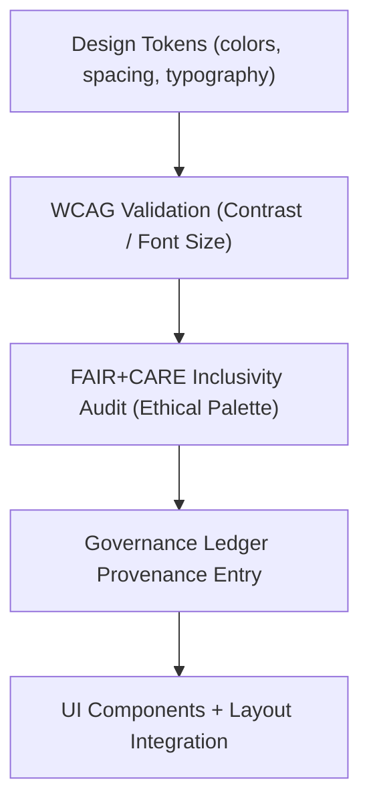

<div align="center">

# 🎨 **Kansas Frontier Matrix — Global Styles & Theming System (v2.1.1 · Tier-Ω+∞ Certified)**  
`web/src/styles/README.md`

**Mission:** Define, document, and govern the **unified design language, color system, and accessibility themes**  
of the **Kansas Frontier Matrix (KFM)** web platform — ensuring reproducible, ethical, and FAIR+CARE-compliant visual consistency.

[](../../../docs/)
[](../../../docs/standards/faircare-validation.md)
[](../../../docs/standards/accessibility.md)
[](../../../LICENSE)

</div>

---

## 📚 Overview

The **Global Styles & Theming System** defines the foundational design tokens, color palette,  
typography, and component theming used throughout the Kansas Frontier Matrix web application.  
It ensures design reproducibility across modules while enforcing accessibility (WCAG 2.1 AA)  
and ethical inclusivity through FAIR+CARE-aligned standards.

Core objectives:
- 🎨 Provide centralized color, typography, and spacing design tokens.  
- ♿ Maintain WCAG-compliant visual contrast across light/dark modes.  
- 🧩 Standardize theming for all UI and component modules.  
- 🔗 Integrate FAIR+CARE and governance metadata into the design layer.  

---

## 🗂️ Directory Layout

```bash
web/src/styles/
├── README.md                         # This file — Global styles documentation
│
├── globals.css                        # Root CSS variables and resets
├── theme.css                          # Base light/dark/high-contrast themes
├── typography.css                     # Font families, weights, and responsive scaling
└── tokens/                            # Design tokens for colors, spacing, borders, shadows
    ├── colors.json
    ├── spacing.json
    ├── typography.json
    └── effects.json
```

---

## ⚙️ Theming & Governance Model


<!-- END OF MERMAID -->

---

## 🧱 Core Design Elements

| Element | Description | FAIR+CARE Function | Validation Workflow |
|:--|:--|:--|:--|
| **Colors** | Semantic color tokens ensuring WCAG contrast ratios. | Accessibility + Ethics | `design-validate.yml` |
| **Typography** | Consistent type hierarchy for readability and localization. | Responsibility + Reusability | `ui-validate.yml` |
| **Spacing** | Harmonized padding, margin, and rhythm units. | Interoperable + Consistent | `policy-check.yml` |
| **Effects** | Shadows and focus states that reinforce hierarchy and usability. | Transparency + Usability | `faircare-validate.yml` |

---

## 🧠 FAIR + CARE Integration

| Principle | Implementation | Validation |
|:--|:--|:--|
| **Findable** | Design tokens cataloged and versioned under governance. | `governance-ledger.yml` |
| **Accessible** | WCAG-compliant colors and typography across all modes. | `design-validate.yml` |
| **Interoperable** | CSS tokens shared across React + Tailwind layers. | `ui-validate.yml` |
| **Reusable** | Tokens imported globally via PostCSS + design system. | `docs-validate.yml` |
| **Collective Benefit (CARE)** | Inclusive color design for all users and devices. | `faircare-validate.yml` |

---

## ♿ Accessibility Standards (WCAG 2.1 AA)

| Category | Implementation | Validation Workflow |
|:--|:--|:--|
| **Contrast Ratio** | 4.5:1 minimum contrast for body text and controls. | `design-validate.yml` |
| **Font Legibility** | Minimum 16px base, scalable typography. | `design-validate.yml` |
| **Focus Visibility** | Clear outlines for active/focusable elements. | `ui-validate.yml` |
| **Motion Sensitivity** | Reduced motion for users preferring static interfaces. | `faircare-validate.yml` |

---

## 🔍 Provenance & Governance Integration

| Artifact | Description | Path |
|:--|:--|:--|
| **Design Tokens Registry** | Master JSON registry for tokens. | `web/src/styles/tokens/` |
| **Accessibility Report** | WCAG color and type audit output. | `reports/validation/a11y_validation.json` |
| **Governance Ledger** | Design token checksum and provenance logs. | `data/reports/audit/data_provenance_ledger.json` |

---

## 🧾 Example Token Metadata

```yaml
---
token_id: "theme_dark_v2.1.1"
authors: ["@kfm-design","@kfm-accessibility"]
faircare_status: "Tier-Ω+∞ Verified"
checksum: "sha256:8cd72ab9fe1a4981..."
governance_ledger_entry: "data/reports/audit/data_provenance_ledger.json"
accessibility_compliance: "WCAG 2.1 AA"
license: "MIT"
---
```

---

## 🧮 Observability Metrics

| Metric | Description | Target | Workflow |
|:--|:--|:--|:--|
| **WCAG Compliance Rate** | Color and type accessibility compliance. | ≥ 95 | `design-validate.yml` |
| **FAIR+CARE Compliance** | Inclusivity and governance audit result. | ≥ 95 | `faircare-validate.yml` |
| **Design Token Coverage** | % of UI elements mapped to tokens. | 100% | `policy-check.yml` |
| **Governance Sync Rate** | Token checksum entries logged. | 100% | `governance-ledger.yml` |

---

## 🧾 Validation Workflows

| Workflow | Function | Output |
|:--|:--|:--|
| `design-validate.yml` | Validates contrast, typography, and motion settings. | `reports/validation/a11y_validation.json` |
| `ui-validate.yml` | Tests theme imports across UI components. | `reports/validation/ui_validation.json` |
| `faircare-validate.yml` | Verifies inclusivity and accessibility fairness. | `reports/fair/data_care_assessment.json` |
| `governance-ledger.yml` | Logs design token checksums and metadata. | `data/reports/audit/data_provenance_ledger.json` |

---

## 🕰 Version History

| Version | Date | Author | Summary |
|:--|:--|:--|:--|
| **v2.1.1** | 2025-11-16 | @kfm-design | Added design token registry and governance-linked accessibility audit. |
| v2.0.0 | 2025-10-25 | @kfm-accessibility | Introduced WCAG-compliant theming with FAIR+CARE oversight. |
| v1.0.0 | 2025-10-04 | @kfm-docs | Initial global styles documentation and governance integration. |

---

<div align="center">

**Kansas Frontier Matrix © 2025**  
*“Design Systems Should Be Ethical — Color Should Include Everyone.”*  
📍 `web/src/styles/README.md` — FAIR+CARE-aligned styles and theming documentation for the Kansas Frontier Matrix.

</div>
