<div align="center">

# 🎨 Kansas Frontier Matrix — **Web Frontend Styles**  
`web/src/styles/`

**Design System · Theming · Layout Grid · Accessibility Tokens**

[](../../../../.github/workflows/ci.yml)
[](../../../../.github/workflows/codeql.yml)
[](../../../../docs/)
[](../../../../docs/design/reviews/accessibility/)
[](../../../../LICENSE)

</div>

---

```yaml
---
title: "KFM • Web Frontend Styles (web/src/styles/)"
version: "v1.3.0"
last_updated: "2025-10-14"
owners: ["@kfm-design", "@kfm-web"]
tags: ["styles","design-system","tokens","theming","accessibility","wcag","scss","tailwind"]
license: "MIT"
semantic_alignment:
  - WCAG 2.1 AA
  - CIDOC CRM (presentation context linkage)
  - OWL-Time (temporal theming hooks)
  - STAC (legend symbology metadata)
---
````

---

## 📚 Table of Contents

* [🧭 Overview](#🧭-overview)
* [🧱 Directory Structure](#🧱-directory-structure)
* [🎨 Design Tokens](#🎨-design-tokens)
* [🧩 Layout & Responsive Grid](#🧩-layout--responsive-grid)
* [🖼️ Theming System](#🖼️-theming-system)
* [✨ Animations](#✨-animations)
* [♿ Accessibility (WCAG 2.1 AA)](#♿-accessibility-wcag-21-aa)
* [🧪 Example Usage](#🧪-example-usage)
* [🧾 Provenance & Integrity](#🧾-provenance--integrity)
* [🧠 MCP Compliance Checklist](#🧠-mcp-compliance-checklist)
* [🔗 Related Documentation](#🔗-related-documentation)
* [📜 License](#📜-license)

---

## 🧭 Overview

`web/src/styles/` defines the **visual identity and design tokens** for the KFM Web Application.
It implements a **modular styling system** that unifies typography, color, spacing, responsive layout, and motion across components — ensuring **consistency** and **accessibility** under **MCP-DL v6.2**.

Styles are **documentation-first** and reference the broader Design System under `docs/design/` (typography, mockups, accessibility reviews).

---

## 🧱 Directory Structure

```text
web/src/styles/
├── base.css              # Tailwind base + reset + global rules
├── variables.scss        # CSS custom properties (colors, spacing, z-index, radii, shadows)
├── typography.scss       # Font scale, heading hierarchy, reading width, contrast helpers
├── layout.scss           # Grid/flex utilities for panels, sidebars, timeline
├── map.scss              # MapLibre overlays: legends, popups, layer pills
├── timeline.scss         # Canvas timeline colors, markers, transitions
├── theme-dark.scss       # Dark theme palette + token overrides
├── theme-light.scss      # Light theme palette + token overrides
├── animations.scss       # Keyframes + Framer Motion coordination classes
└── index.scss            # Master import compiled into the build CSS
```

Each file maps to a **UI domain** (global, layout, feature-specific) so changes don’t trigger side effects elsewhere.

---

## 🎨 Design Tokens

| Token                              | Example                          | Description                        |
| :--------------------------------- | :------------------------------- | :--------------------------------- |
| `--kfm-color-bg`                   | `#0b1020` / `#ffffff`            | Background (dark/light)            |
| `--kfm-color-surface`              | `#121733` / `#f9f9fb`            | Panel backgrounds                  |
| `--kfm-color-text`                 | `#eaeaea` / `#111111`            | Body text (AA/AAA contrast)        |
| `--kfm-color-muted`                | `#a8b0c2` / `#4b5563`            | Secondary text                     |
| `--kfm-color-accent`               | `#00b3b3`                        | Primary accent                     |
| `--kfm-color-danger`               | `#e05656`                        | Errors / alerts                    |
| `--kfm-radius`                     | `12px`                           | Rounded corners for panels/buttons |
| `--kfm-shadow`                     | `0 2px 8px rgba(0,0,0,.15)`      | Standard elevation                 |
| `--kfm-spacing-*`                  | `4, 8, 12, 16, 24, 32`           | Spacing scale                      |
| `--kfm-z-map` / `--kfm-z-timeline` | `100` / `200`                    | Layer stacking                     |
| `--kfm-font-sans`                  | `"Inter", system-ui, sans-serif` | Primary typeface                   |

Tokens are defined in **`variables.scss`** and exported as **CSS Custom Properties** (readable from JS for adaptive theming and accessibility tooling).

---

## 🧩 Layout & Responsive Grid

```mermaid
flowchart LR
  A["Header<br/>(nav · search · theme toggle)"] --> B["Main<br/>MapView + DetailPanel"]
  B --> C["Timeline<br/>(Canvas/D3)"]
  B --> D["Sidebar<br/>LayerControls · Legends"]
  A --> D
%% END OF MERMAID
```



**Breakpoints & Behavior**

| Breakpoint | Min Width | Layout                                |
| :--------- | :-------- | :------------------------------------ |
| `sm`       | `480px`   | Timeline collapses; panels stack      |
| `md`       | `768px`   | Split map + timeline                  |
| `lg`       | `1024px`  | Full 3-panel (map, sidebar, timeline) |
| `xl`       | `1440px`  | Adds detail/AI columns                |

* Spacing & font sizes are responsive with `clamp()` and container queries.
* Grid utilities are implemented in `layout.scss` (and Tailwind classes in `base.css` when applicable).

---

## 🖼️ Theming System

Theming uses CSS variables and an **`<html data-theme="light|dark">`** attribute.
Users toggle themes in the header; preference is persisted in `localStorage`.

**Palette Overview**

| Theme     | Base      | Accent    | Text      | Background |
| :-------- | :-------- | :-------- | :-------- | :--------- |
| **Light** | `#ffffff` | `#00b3b3` | `#111111` | `#f9f9f9`  |
| **Dark**  | `#0b1020` | `#00e6e6` | `#eaeaea` | `#0b1020`  |

* Theming supports **high-contrast** token overrides (`[data-contrast="high"]`) and **reduced motion** (via `prefers-reduced-motion`) baked into token logic.
* Smooth transitions are coordinated with **Framer Motion** where appropriate.

---

## ✨ Animations

Defined in `animations.scss` and coordinated with Framer Motion. Motions are **subtle** and **contextual**.

| Animation  | Purpose                                 |
| :--------- | :-------------------------------------- |
| `fade-in`  | Gentle entrance for panels/map overlays |
| `slide-up` | Timeline markers revealing in sequence  |
| `pulse`    | Highlight selected markers/rows         |
| `sway`     | Ambient background flourish (optional)  |

All animations **respect** `prefers-reduced-motion` and disable transitions for users who opt out.

---

## ♿ Accessibility (WCAG 2.1 AA)

* **Contrast:** All text tokens validated ≥ **4.5:1**; large text ≥ **3:1**
* **Focus:** Visible outlines `outline: 2px solid var(--kfm-color-accent); outline-offset: 2px;`
* **Keyboard:** Logical tab order for header → map → sidebar → timeline; skip-links available
* **Scaling:** Font stack and sizes respect OS/browser scaling; no content loss on 200% zoom
* **Motion:** Animations disabled with `prefers-reduced-motion: reduce`
* **ARIA:** Utility classes for `aria-live`, `role` helpers included in `typography.scss` and `ui` components

Accessibility audit scripts live in `docs/design/reviews/accessibility/`.

---

## 🧪 Example Usage

```scss
/* index.scss */
@import "variables";
@import "theme-light";
@import "layout";
@import "typography";
@import "map";
@import "timeline";

.app {
  background-color: var(--kfm-color-bg);
  color: var(--kfm-color-text);
  transition: background-color .24s ease, color .24s ease;
}

[data-theme="dark"] .app {
  /* tokens already overridden in theme-dark.scss */
}
```

This pattern ensures consistent theming and **safe composability** across components.

---

## 🧾 Provenance & Integrity

| Artifact         | Description                                                                                      |
| :--------------- | :----------------------------------------------------------------------------------------------- |
| **Inputs**       | Tokens from `docs/design/` (typography, palettes), Accessibility audit reports                   |
| **Outputs**      | Compiled CSS bundles (`build/static/css/`)                                                       |
| **Dependencies** | TailwindCSS, SCSS, PostCSS, Framer Motion                                                        |
| **Integrity**    | CI runs **Stylelint** + **Prettier** + **contrast audits**; CodeQL scans for supply chain issues |

---

## 🧠 MCP Compliance Checklist

* ✅ **Documentation-first** (this README + tokens documented in `variables.scss`)
* ✅ **Reproducibility** (deterministic tokens; CI validation)
* ✅ **Open Standards** (CSS Custom Properties; WCAG 2.1 AA)
* ✅ **Provenance** (design source links; audit logs)
* ✅ **Auditability** (lint & contrast checks in CI)

---

## 🔗 Related Documentation

* **Web Frontend Overview** — `web/README.md`
* **Web UI Architecture** — `web/ARCHITECTURE.md`
* **Design System Overview** — `docs/design/`
* **Accessibility Review Templates** — `docs/design/reviews/accessibility/`

---

## 📜 License

Released under the **MIT License**.
© 2025 Kansas Frontier Matrix — developed with **MCP** design standards for clarity, accessibility, and visual consistency.

> *“Design is data made visible — and Kansas has stories to tell.”*

```
```
