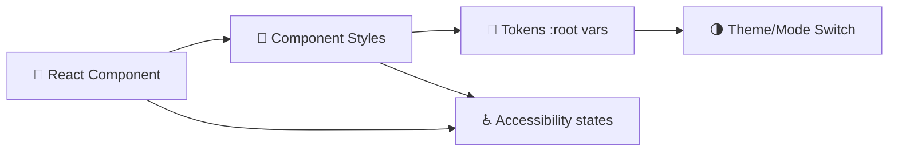

# 🎨 Component Styles (`web/src/styles/components`)

> 📌 **Purpose:** A single home for **component-scoped** styling used across the KFM web UI (React). This keeps UI styling predictable, reusable, and easy to review.  
> _KFM’s frontend is component-based (React) and designed to be responsive with CSS3 (Flexbox/Grid + media queries), while staying accessible across major browsers._[^kfm-frontend]

---

## 🧭 Quick Navigation

<details>
  <summary><strong>Click to expand 📚</strong></summary>

- [📁 Where this fits in the frontend](#-where-this-fits-in-the-frontend)
- [🧩 What belongs in `components/`](#-what-belongs-in-components)
- [📛 Naming conventions](#-naming-conventions)
- [📱 Responsive rules](#-responsive-rules)
- [🧱 Tokens and theming](#-tokens-and-theming)
- [♿ Accessibility rules](#-accessibility-rules)
- [⚡ Performance tips](#-performance-tips)
- [✅ Definition of Done](#-definition-of-done)
- [🧪 Example: CSS Module + React](#-example-css-module--react)
- [📎 References](#-references)

</details>

---

## 📁 Where this fits in the frontend

KFM organizes the React app by **reusable components** + **feature areas**, with a `styles/` area for global or modular styling (depending on the approach).[^kfm-structure]

```text
📦 web/
└─ 📂 src/
   ├─ 🧩 components/        → reusable UI building blocks (Button, Modal, Chart, …)
   ├─ 🧭 features/          → feature slices (map/, timeline/, dashboard/, …)
   └─ 🎨 styles/
      ├─ 🧱 tokens/         → (recommended) design tokens (CSS variables)
      ├─ 🧰 utilities/      → (recommended) helpers (layout helpers, sr-only, etc.)
      └─ 🧩 components/     → ✅ YOU ARE HERE
         └─ 📄 README.md
```

---

## 🧩 What belongs in `components/`

✅ Put styles here when they are:

- **Component-scoped** (MapView, Sidebar, TimelineSlider, ChartPanel, DataTable, Header, etc.).[^kfm-frontend]
- **Reusable** across features (not just one screen).
- **Presentational** (layout, spacing, typography, theming) rather than data logic.

🚫 Avoid putting these here:

- **Feature-only** “one-off” styling (keep it close to the feature if that’s your project convention).
- **Global resets** (these belong in `styles/` root or a dedicated `styles/base/`).
- **Hard-coded colors/spacing** that should be tokens (see tokens section).

---

## 📛 Naming conventions

### ✅ Files
Pick one style file strategy and stay consistent:

**Option A — CSS Modules (recommended):**
- `ComponentName.module.css`
- `ComponentName.module.scss` (if Sass is enabled)

**Option B — Global (BEM-ish)**
- `component-name.css`
- Classes like `.kfm-ComponentName__element`

> If you’re using PostCSS/Sass tooling, use it to improve organization and automate repetitive tasks (like vendor prefixing).[^rwd-tooling]

### ✅ Class names (CSS Modules)
Prefer “semantic parts”:

- `root`
- `header`
- `content`
- `footer`
- `actions`
- `legend`, `tooltip`, `panel`, etc.

Avoid:
- `.blueText`, `.marginTop10`, `.leftBox` (these become brittle)

---

## 📱 Responsive rules

### 1) Base-first styling (progressive enhancement)
Start with the simplest baseline experience and **enhance** as the viewport grows/capabilities increase.[^rwd-progressive]  
Also: keep your **base rules outside media queries** and layer on changes only when needed.[^rwd-breakpoints]

### 2) Breakpoints are content-driven (not device-driven)
Don’t “target iPhone/iPad sizes.” Let the layout/content determine where it breaks.[^rwd-breakpoints]

KFM does use practical breakpoints (example: switching to a “mobile layout” under ~768px), but treat this as a *starting heuristic*, not a hard law.[^kfm-frontend]

### 3) A simple breakpoint pattern
```css
/* base: mobile/compact-first */

.root { /* ... */ }

/* enhance: larger layouts */
@media screen and (min-width: 50em) {
  .root { /* ... */ }
}
```
The `@media ... (min-width: …)` pattern is a clean default for layering enhancements.[^rwd-breakpoints]

---

## 🧱 Tokens and theming

### Why tokens?
Tokens keep the UI consistent (spacing/typography/colors), reduce “magic numbers,” and make theme changes safer.

### Use CSS custom properties
CSS custom properties (variables) can live at `:root` and be consumed via `var(...)`.[^rwd-css-vars]

```css
:root {
  --kfm-font-sans: system-ui, -apple-system, Segoe UI, Roboto, Arial, sans-serif;
  --kfm-space-2: 0.5rem;
  --kfm-space-4: 1rem;
  --kfm-radius-2: 0.5rem;
}

.root {
  font-family: var(--kfm-font-sans);
  padding: var(--kfm-space-4);
  border-radius: var(--kfm-radius-2);
}
```

🎯 Suggested rule:
- **Tokens:** `styles/tokens/*`
- **Component styles:** `styles/components/*`
- **Component overrides:** only when truly component-specific

---

## ♿ Accessibility rules

KFM’s frontend emphasizes semantic HTML, correct labeling, ARIA where needed, and color choices that work for colorblind users.[^kfm-frontend]

Minimum expectations for component styles:

- ✅ Visible focus state (`:focus-visible`) for keyboard users  
- ✅ Adequate contrast (don’t rely on color alone)  
- ✅ Motion sensitivity: respect reduced motion (if animations exist)  
- ✅ Don’t remove outlines unless you replace them with something better

Optional helper pattern:
```css
@media (prefers-reduced-motion: reduce) {
  * {
    scroll-behavior: auto;
    transition: none !important;
    animation: none !important;
  }
}
```

---

## ⚡ Performance tips

Component CSS can harm runtime performance if it gets sloppy:

- ✅ Prefer shallow selectors (`.root`, `.header`) over deep nesting (`.a .b .c .d`)
- ✅ Avoid heavy universal selectors in hot paths
- ✅ Keep box-shadows/filters conservative (they can trigger expensive painting)
- ✅ Prefer layout with Flexbox/Grid (intended + predictable)[^kfm-frontend]

---

## ✅ Definition of Done

Use this checklist when adding/updating component styles:

- [ ] **Scoped:** Style changes don’t leak globally (or are intentionally global and documented)
- [ ] **Responsive:** Layout works for small + large viewports (content-driven breakpoints)[^rwd-breakpoints]
- [ ] **Accessible:** Focus, labels, ARIA (if applicable), and color choices are considered[^kfm-frontend]
- [ ] **Tokenized:** New colors/spacing values use tokens (or you documented why not)
- [ ] **Cross-browser:** Smoke tested on major modern browsers + mobile[^kfm-frontend]
- [ ] **Docs-ready:** If you introduce new conventions, update this README (docs are treated as governed artifacts with citations/provenance).[^kfm-doc-governance]

---

## 🧪 Example: CSS Module + React

**`MapView.module.css`**
```css
.root {
  display: grid;
  gap: var(--kfm-space-4);
}

.mapCanvas {
  min-height: 320px;
  border-radius: var(--kfm-radius-2);
  overflow: hidden;
}

/* Enhance layout on wider screens */
@media screen and (min-width: 50em) {
  .root {
    grid-template-columns: 1fr 360px; /* map + sidebar/panel */
  }
}
```

**`MapView.tsx`**
```tsx
import styles from "./MapView.module.css";

export function MapView() {
  return (
    <section className={styles.root}>
      <div className={styles.mapCanvas} />
      {/* panel, legend, etc */}
    </section>
  );
}
```

---

## 🗺️ Component → Style mapping (suggested)

These are core UI components referenced in KFM’s frontend architecture.[^kfm-frontend]

| 🧩 Component | 🎨 Style file (example) | Notes |
|---|---|---|
| `MapView` | `MapView.module.css` | Layout + map container constraints |
| `Sidebar` | `Sidebar.module.css` | Responsive collapse + scroll behavior |
| `TimelineSlider` | `TimelineSlider.module.css` | Touch-friendly spacing + hit targets |
| `ChartPanel` | `ChartPanel.module.css` | Chart container sizing + legends |
| `DataTable` | `DataTable.module.css` | Table overflow + sticky header rules |
| `Header` | `Header.module.css` | Global nav spacing + responsive stacking |

---

## 🧠 Style Architecture (mental model)



---

## 📎 References

> KFM documentation treats Markdown docs as first-class artifacts: cite claims, keep provenance, and keep formatting consistent with the project’s expectations.[^kfm-doc-governance]  
> The YAML front-matter pattern is available for docs systems that support it (optional for GitHub-only rendering).[^kfm-yaml]

[^kfm-frontend]: KFM frontend architecture: React component-based UI with responsive design (Flexbox/Grid + media queries), plus accessibility and cross-browser considerations. [oai_citation:0‡Kansas Frontier Matrix (KFM) – Comprehensive Technical Documentation & Markdown Guide.gdoc](file-service://file-XGC3Vf2AfbA2JWvTvmHNGF)
[^kfm-structure]: KFM suggested React project structure showing `styles/` as the location for global CSS or style definitions (e.g., if using CSS modules). [oai_citation:1‡Kansas Frontier Matrix (KFM) – Comprehensive Technical Documentation & Markdown Guide.gdoc](file-service://file-XGC3Vf2AfbA2JWvTvmHNGF)
[^kfm-doc-governance]: KFM Markdown governance guidance on citations/attributions and documentation provenance practices. [oai_citation:2‡Kansas Frontier Matrix (KFM) – Comprehensive Technical Documentation & Markdown Guide.gdoc](file-service://file-XGC3Vf2AfbA2JWvTvmHNGF)
[^kfm-yaml]: KFM example YAML front-matter fields for governed documents (including `last_updated`). [oai_citation:3‡Kansas Frontier Matrix (KFM) – Comprehensive Technical Documentation & Markdown Guide.gdoc](file-service://file-XGC3Vf2AfbA2JWvTvmHNGF)
[^rwd-progressive]: Responsive design guidance favoring progressive enhancement (base experience first, then enhance). [oai_citation:4‡responsive-web-design-with-html5-and-css3.pdf](file-service://file-4pQLNMB3Rk5n5vUPTqxpNa)
[^rwd-tooling]: Notes on front-end tooling: CSS processors and linting/validation tools for reliability and maintainability. [oai_citation:5‡responsive-web-design-with-html5-and-css3.pdf](file-service://file-4pQLNMB3Rk5n5vUPTqxpNa)
[^rwd-breakpoints]: Media query/breakpoint guidance: avoid device-driven breakpoints; let content/design drive when breakpoints are needed; base rules outside media queries first. [oai_citation:6‡responsive-web-design-with-html5-and-css3.pdf](file-service://file-Heg28TVM2nReDYTQ7nPhAK)
[^rwd-css-vars]: CSS custom properties (variables) via `:root` and consumption using `var(...)`. [oai_citation:7‡responsive-web-design-with-html5-and-css3.pdf](file-service://file-4pQLNMB3Rk5n5vUPTqxpNa)