<div align="center">

# 🧪 **Kansas Frontier Matrix — Design Tokens Registry (v2.1.1 · Tier-Ω+∞ Certified)**  
`web/src/styles/tokens/README.md`

**Mission:** Serve as the **single source of truth** for color, typography, spacing, and effects tokens in the **Kansas Frontier Matrix (KFM)**.  
Guarantee **WCAG** accessibility, **FAIR+CARE** ethics, and governance **provenance** across all styles and themes.

[](../../../../docs/)
[](../../../../docs/standards/faircare-validation.md)
[](../../../../docs/standards/accessibility.md)
[](../../../../LICENSE)

</div>

---

## 📚 Overview

The **Design Tokens Registry** centralizes platform-wide design variables to keep UI **consistent, accessible, and ethical**.  
Tokens are machine-readable (JSON), compiled into **CSS variables** and utility classes, and validated via CI for **contrast** and **provenance**.

---

## 🗂️ Directory Layout

```bash
web/src/styles/tokens/
├── README.md                 # This file — Token registry documentation
├── colors.json               # Semantic color tokens (base, surface, text, states)
├── spacing.json              # Spacing scale (px/rem) for margin/padding
├── typography.json           # Font stacks, sizes, line-heights, weight scales
└── effects.json              # Shadows, radii, borders, focus-rings, elevation
```

---

## ⚙️ Token Governance Model

```mermaid
flowchart TD
  A["Token Proposal (Design / A11y)"] --> B["WCAG Validation (Contrast / Size)"]
  B --> C["FAIR+CARE Inclusivity Review"]
  C --> D["Checksum + Governance Ledger Registration"]
  D --> E["Build → CSS Vars / Theming → UI Components"]
```


<!-- END OF MERMAID -->

---

## 🧱 Token Categories

| Category | Purpose | Examples (Semantic) | WCAG/FAIR+CARE Note |
|:--|:--|:--|:--|
| **Color** | Palettes for bg, text, states, data vis. | `color.bg.surface`, `color.text.primary`, `color.state.warning` | All pairs must meet target contrast. |
| **Typography** | Readable, scalable type system. | `type.size.sm`, `type.line.md`, `type.weight.semibold` | Base ≥ 16px; line-height ≥ 1.4. |
| **Spacing** | Vertical rhythm and density control. | `space.2`, `space.4`, `space.6` | Use consistent scale increments. |
| **Effects** | Focus, elevation, and affordances. | `focus.outline.primary`, `elevation.2` | Focus rings **must** be visible. |

---

## 🧠 FAIR + CARE Integration

| Principle | Implementation | Validation |
|:--|:--|:--|
| **Findable** | Tokens indexed in manifest and design registry. | `governance-ledger.yml` |
| **Accessible** | Contrast + legibility validated in CI. | `design-validate.yml` |
| **Interoperable** | JSON tokens → CSS variables/Tailwind config. | Build pipeline |
| **Reusable** | Versioned tokens shared across modules. | `policy-check.yml` |
| **Collective Benefit (CARE)** | Inclusive color choices and motion sensitivity. | `faircare-validate.yml` |

---

## ♿ Accessibility Standards (WCAG 2.1 AA)

- **Contrast:** Body text pairs ≥ **4.5:1**; large text/icons ≥ **3:1**.  
- **Typography:** Base **16px**, responsive scaling, high legibility stacks.  
- **Focus:** Visible focus outline tokens on all interactive elements.  
- **Motion:** Tokens must enable **reduced motion** theming.

---

## 🔧 Consumption Patterns

**CSS Variables (built from tokens):**
```css
:root {
  --color-bg-surface: #0b0e12;
  --color-text-primary: #0f172a;
  --space-4: 1rem;
  --type-size-md: 1rem;
  --focus-outline-primary: 2px solid #2563eb;
}
```

**TypeScript (token import for JS usage):**
```ts
import colors from '@/styles/tokens/colors.json';
const surface = colors['color.bg.surface'];
```

---

## 🧩 Example Token Files

**`colors.json`**
```json
{
  "color.bg.surface": "#0b0e12",
  "color.bg.panel": "#111827",
  "color.text.primary": "#0f172a",
  "color.text.invert": "#f8fafc",
  "color.state.info": "#2563eb",
  "color.state.success": "#16a34a",
  "color.state.warning": "#d97706",
  "color.state.error": "#dc2626",
  "color.focus.outline": "#22d3ee"
}
```

**`typography.json`**
```json
{
  "type.family.sans": "\"Inter var\", system-ui, -apple-system, Segoe UI, Roboto, Arial, sans-serif",
  "type.size.xs": "0.75rem",
  "type.size.sm": "0.875rem",
  "type.size.md": "1rem",
  "type.size.lg": "1.125rem",
  "type.size.xl": "1.25rem",
  "type.line.default": 1.5,
  "type.weight.regular": 400,
  "type.weight.semibold": 600
}
```

---

## 🔍 Provenance & Governance

| Artifact | Purpose | Path |
|:--|:--|:--|
| **Design Tokens Registry** | Master JSON assets & checksums. | `web/src/styles/tokens/` |
| **A11y Audit Report** | Contrast and type validation results. | `reports/validation/a11y_validation.json` |
| **Governance Ledger** | Token checksums and approval metadata. | `data/reports/audit/data_provenance_ledger.json` |

> All token changes are **checksummed** and must be approved by the **Accessibility Council**.

---

## 🧮 Observability Metrics

| Metric | Description | Target | Workflow |
|:--|:--|:--|:--|
| **Contrast Compliance** | % of color pairs passing WCAG. | 100% | `design-validate.yml` |
| **Token Coverage** | % of UI using tokens (vs hard-coded). | 100% | `policy-check.yml` |
| **Ledger Sync Rate** | Token updates recorded with checksum. | 100% | `governance-ledger.yml` |
| **Theme Parity** | Light/dark/high-contrast token parity. | 100% | `ui-validate.yml` |

---

## 🧾 Versioning & Change Control

```yaml
versioning:
  policy: "Semantic (MAJOR.MINOR.PATCH)"
  breaking_change: "Color renames / scale changes"
  governance:
    approval: "@kfm-accessibility, @kfm-design"
    ledger: "data/reports/audit/data_provenance_ledger.json"
```

---

## 🕰 Version History

| Version | Date | Author | Summary |
|:--|:--|:--|:--|
| **v2.1.1** | 2025-11-16 | @kfm-design | Standardized token registry; added governance + WCAG CI integration. |
| v2.0.0 | 2025-10-25 | @kfm-accessibility | Introduced high-contrast theme tokens and motion preferences. |
| v1.0.0 | 2025-10-04 | @kfm-docs | Initial token registry and consumption patterns. |

---

<div align="center">

**Kansas Frontier Matrix © 2025**  
*“Tokens Align the System — Governance Aligns the Tokens.”*  
📍 `web/src/styles/tokens/README.md` — FAIR+CARE-aligned design token registry for the Kansas Frontier Matrix.

</div>

