# 🎛️ Visualization Styles (`web/src/styles/viz`)


> 📍 **Folder:** `web/src/styles/viz/`  
> 🎯 **Purpose:** One home for *visualization-specific styling* — map overlays, legends, chart chrome, timelines, tooltips, and viz design tokens.

<!-- sources:  [oai_citation:0‡Kansas Frontier Matrix (KFM) – Comprehensive Technical Documentation & Markdown Guide.gdoc](file-service://file-XGC3Vf2AfbA2JWvTvmHNGF)  [oai_citation:1‡MARKDOWN_GUIDE_v13.md.gdoc](file-service://file-UYVruFXfueR8veHMUKeugU) -->

---

## 🧭 Why this folder exists

KFM’s UI is an interactive mapping + analytics surface: map views, layer toggles, legends, a timeline slider, and chart panels all need **consistent, reusable visual language** across features and pages. <!-- sources:  [oai_citation:2‡Kansas Frontier Matrix (KFM) – Comprehensive Technical Documentation & Markdown Guide.gdoc](file-service://file-XGC3Vf2AfbA2JWvTvmHNGF) -->

This directory keeps that visual language:

- **Consistent** (same ramp = same meaning everywhere)
- **Readable** (legends/tooltips/panels are predictable)
- **Responsive** (desktop ↔ mobile layouts stay usable)
- **Accessible** (contrast, focus states, reduced motion)
- **Governable** (styles support redaction/generalization states when needed) <!-- sources:  [oai_citation:3‡MARKDOWN_GUIDE_v13.md.gdoc](file-service://file-UYVruFXfueR8veHMUKeugU) -->

---

## ✅ What belongs here vs. what doesn’t

### ✅ Put here
- 🎨 **Viz tokens**: CSS custom properties for ramps, semantic colors, strokes, shadows, spacing, z-index layers
- 🗺️ **Map-adjacent UI styles**: legend, scale, layer list chips, selection/popup chrome
- 📈 **Chart UI chrome**: axes labels styling, tooltip shells, legend layout, loading/skeleton states
- 🕰️ **Timeline/timeslider skin**: ticks, play controls, scrub handles
- 🔒 **Governance view states**: “redacted”, “restricted”, “uncertain”, “low confidence” patterns (visual encodings / hooks)

### 🚫 Don’t put here
- ❌ Fetching data / calling APIs
- ❌ Business rules (“what layer is visible”)
- ❌ Map style JSON/source definitions (keep with the map module or layer definitions)
- ❌ Component logic (keep in React/components)

---

## 🗂️ Suggested layout (example)

> This is a *recommended* structure — actual file names may differ.  
> Aim for “small, focused files” over one mega stylesheet.

```text
📁 web/src/styles/viz/
├─ 🎨 tokens.css               # CSS custom props: ramps, semantic colors, spacing
├─ 🗺️ map-ui.css               # popups, attribution, controls wrappers, overlays
├─ 🧾 legend.css               # legend layout + swatches + category list
├─ 🧰 tooltip.css              # hover tooltips + pinned info cards
├─ 🕰️ timeline.css             # slider + ticks + play controls
├─ 📊 charts.css               # chart panel chrome (Plotly/D3 containers)
├─ 🧩 patterns.css             # hatching, uncertainty overlays, redaction masks
└─ 🧪 debug.css                # (optional) dev helpers: outlines, z-layers
```

---

## 🧱 Core design rules (the “contract”)

| Rule | Do ✅ | Avoid ❌ |
|---|---|---|
| Tokens first | Define meaning in `--viz-*` vars | Hard-coded colors everywhere |
| Semantic naming | `--viz-danger`, `--viz-anomaly-pos` | `--red-500` where meaning varies |
| Consistent ramps | Same ramp for same variable | New ramp per page “because nice” |
| Layout stability | Reserve space for legends/tooltips | UI jumping during load |
| Accessibility | Keyboard focus + contrast + reduced motion | Hover-only interactions |
| Performance | Prefer `transform/opacity` for animation | Layout-thrashing transitions |

---

## 🎨 Tokens and theming

### 1) Semantic tokens (preferred)
Use semantic tokens so components “ask for meaning,” not a specific hue.

```css
:root {
  /* Surfaces */
  --viz-surface: var(--surface-1, #111);
  --viz-on-surface: var(--text-1, #f5f5f5);

  /* States */
  --viz-info: #2f80ed;
  --viz-warn: #f2c94c;
  --viz-danger: #eb5757;

  /* Map overlay defaults */
  --viz-outline: rgba(255,255,255,.65);
  --viz-outline-strong: rgba(255,255,255,.9);
}
```

### 2) Ramp tokens (sequential/diverging/categorical)
Use ramp tokens for data-driven fills/strokes.

```css
:root {
  /* sequential: low → high */
  --viz-seq-0: #0b1320;
  --viz-seq-1: #0f1c2e;
  --viz-seq-2: #152741;
  --viz-seq-3: #1b3354;
  --viz-seq-4: #234069;

  /* diverging: neg ↔ pos (anomalies) */
  --viz-div-neg: #2d74da;
  --viz-div-mid: #e0e0e0;
  --viz-div-pos: #d64545;
}
```

> 💡 If JS needs to drive styles (e.g., dynamic thresholds), prefer setting **CSS variables** on a container rather than swapping classes repeatedly.

---

## 🗺️ Map UI & legends

### Legend basics
A legend is not optional when color encodes meaning — it’s part of the visualization. Keep it:

- **Readable** (swatch + label + units)
- **Compact** (doesn’t eat the map)
- **Consistent** (same ordering & typography)

<!-- sources:  [oai_citation:4‡Geographic Information System Basics - geographic-information-system-basics.pdf](file-service://file-Kjn2enYFqXQtK3J4zN2DWz) -->

**Suggested legend markup**
```html
<aside class="viz-legend" aria-label="Map legend">
  <header class="viz-legend__header">
    <h3 class="viz-legend__title">Soil Moisture</h3>
    <div class="viz-legend__meta">Volumetric • %</div>
  </header>

  <ul class="viz-legend__items">
    <li class="viz-legend__item">
      <span class="viz-swatch" style="--swatch: var(--viz-seq-1)"></span>
      <span class="viz-legend__label">Low</span>
    </li>
    <li class="viz-legend__item">
      <span class="viz-swatch" style="--swatch: var(--viz-seq-4)"></span>
      <span class="viz-legend__label">High</span>
    </li>
  </ul>
</aside>
```

**Suggested CSS**
```css
.viz-legend {
  background: color-mix(in srgb, var(--viz-surface) 92%, transparent);
  color: var(--viz-on-surface);
  border: 1px solid rgba(255,255,255,.08);
  border-radius: 12px;
  padding: 12px;
  max-width: 320px;
}

.viz-swatch {
  width: 14px;
  height: 14px;
  border-radius: 3px;
  display: inline-block;
  background: var(--swatch, #999);
  border: 1px solid rgba(255,255,255,.18);
}
```

---

## 🧮 Choropleths (don’t accidentally mislead)

If you’re styling choropleths, treat these as **guardrails**:

- Prefer **rates/densities/derived variables** over totals when comparing different-sized regions.
- Consider alternatives (graduated symbols, proportional markers) when totals are the true story.
- Choose ordering consistent with perception (commonly, darker = more).  

<!-- sources:  [oai_citation:5‡making-maps-a-visual-guide-to-map-design-for-gis.pdf](file-service://file-51FgWTn7uFXenxztXw29bP) -->

---

## 🔥 Heatmaps & dense visualizations

Heatmaps are powerful but easy to “over-style.” Practical rules:

- Try more than one palette if patterns are unclear.
- Consider nonlinear scaling or quantiles if extremes dominate.
- Always provide a legend; a small distribution hint (mini histogram) can help interpret intensity.

<!-- sources:  [oai_citation:6‡graphical-data-analysis-with-r.pdf](file-service://file-K7oxq5mFmdE9HrPPev6c7L) -->

---

## 🕰️ Timeline & animation

The timeline slider is a core interaction surface — style it like a first-class component:

- Big enough handle for touch
- Clear tick marks at meaningful intervals
- Play state is visibly distinct from paused
- “Reduced motion” friendly (no aggressive pulsing)

<!-- sources:  [oai_citation:7‡Kansas Frontier Matrix (KFM) – Comprehensive Technical Documentation & Markdown Guide.gdoc](file-service://file-XGC3Vf2AfbA2JWvTvmHNGF)  [oai_citation:8‡Kansas Frontier Matrix (KFM) – Comprehensive Technical Documentation & Markdown Guide.gdoc](file-service://file-XGC3Vf2AfbA2JWvTvmHNGF) -->

---

## 🧊 Charts (Plotly / D3 containers)

KFM charts are expected to be interactive (hover tooltips, toggling legend series, zoom where relevant). Your job in `viz/` is to provide:

- consistent chart panel backgrounds
- consistent tooltip shells and spacing
- consistent legend spacing/typography
- stable loading/error states

<!-- sources:  [oai_citation:9‡Kansas Frontier Matrix (KFM) – Comprehensive Technical Documentation & Markdown Guide.gdoc](file-service://file-XGC3Vf2AfbA2JWvTvmHNGF) -->

---

## 🧩 Canvas / WebGL overlays (HUD pattern)

When using a map canvas (WebGL) and you need HUD-like overlays, one practical pattern is:

- one canvas for the WebGL scene
- one canvas layered above for 2D “HUD” drawing (z-index overlay)

This keeps overlay drawing independent and can simplify UI layering.

<!-- sources:  [oai_citation:10‡webgl-programming-guide-interactive-3d-graphics-programming-with-webgl.pdf](file-service://file-7quELMw4FrspPczB9Y3BTp) -->

---

## 📱 Responsive + touch-first notes

KFM UI is expected to work on modern browsers and mobile. Design for:

- panel layouts that stack on small screens
- touch-friendly controls (sliders, toggles)
- map + chart layouts that degrade gracefully

Implementation-wise, the documented approach emphasizes CSS3 layout primitives (Flexbox/Grid) and media-query breakpoints. <!-- sources:  [oai_citation:11‡Kansas Frontier Matrix (KFM) – Comprehensive Technical Documentation & Markdown Guide.gdoc](file-service://file-XGC3Vf2AfbA2JWvTvmHNGF) -->

---

## ♿ Accessibility checklist

- [ ] Keyboard focus states visible on all interactive viz UI (legend toggles, slider, popups)
- [ ] Color is **never** the only channel (use labels, patterns, thickness, icons)
- [ ] Contrast passes for text on panels/legends/tooltips
- [ ] Supports `prefers-reduced-motion` for animated legends, timeline play state
- [ ] Tooltips have a “pinned” alternative for touch users

---

## 🔒 Governance hooks (redaction / sensitivity)

Some layers may require *visual safeguards* (blur/generalization/masking) to respect data governance and classification rules.

Recommendation: create obvious hooks like:

- `.viz--redacted`
- `.viz--restricted`
- `[data-sensitivity="high"]`

…and implement patterns in `patterns.css` (blur, hatch overlays, reduced precision, etc.), so product logic can toggle the state without reinventing UI styling per feature.

<!-- sources:  [oai_citation:12‡MARKDOWN_GUIDE_v13.md.gdoc](file-service://file-UYVruFXfueR8veHMUKeugU) -->

---

## ✅ Definition of Done for adding/updating viz styles

- [ ] New style uses **tokens** (or introduces them with a clear semantic name)
- [ ] Legend + tooltip styles included when needed
- [ ] Mobile/touch checked (hit targets, stacking)
- [ ] `prefers-reduced-motion` respected for anything animated
- [ ] Doesn’t degrade map pan/zoom performance
- [ ] Has a “restricted/redacted” state hook if the data might ever be sensitive

---

## 🧰 Documentation tricks (keep this folder readable)

Want lightweight diagrams and expandable content in docs? GitHub supports:

- Mermaid diagrams
- `<details>` / `<summary>` collapsible blocks

So feel free to document tricky ramp logic or z-index layering right here.

```mermaid
flowchart LR
  A[🧱 Tokens: --viz-*] --> B[🧩 Component styles]
  B --> C[🗺️ Map UI: legends/tooltips/panels]
  B --> D[📊 Charts: containers/tooltip shells]
  C --> E[👀 User reads the story]
  D --> E
```

<!-- sources:  [oai_citation:13‡Kansas Frontier Matrix (KFM) – Comprehensive Technical Documentation & Markdown Guide.gdoc](file-service://file-XGC3Vf2AfbA2JWvTvmHNGF)  [oai_citation:14‡Kansas Frontier Matrix (KFM) – Comprehensive Technical Documentation & Markdown Guide.gdoc](file-service://file-XGC3Vf2AfbA2JWvTvmHNGF) -->

<details>
  <summary>🧠 Optional: Mermaid sketch of the viz styling flow</summary>



</details>