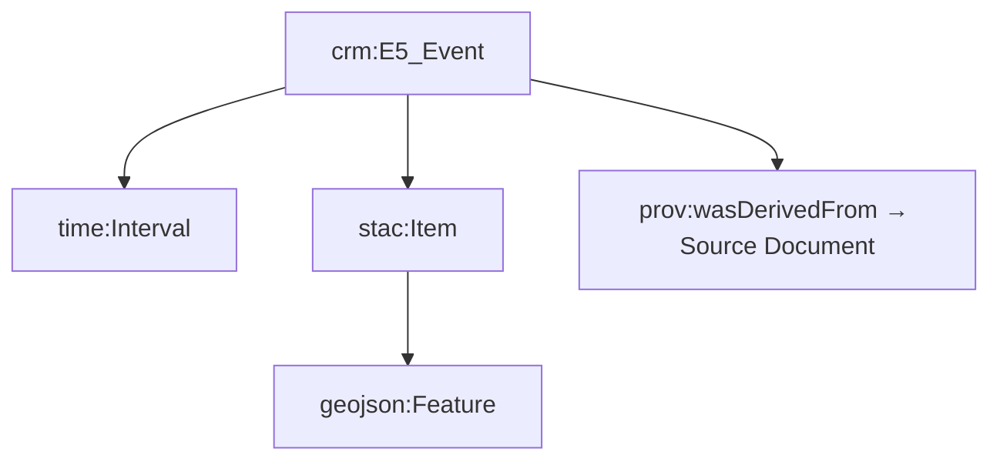

<div align="center">

# 🧩 **Kansas Frontier Matrix — Web Frontend Types (v2.5.0 · Tier-Ω+∞ Certified)**  
`📁 web/src/types/`

**Shared TypeScript Definitions · Data Models · API Interfaces**

[](../../../../.github/workflows/site.yml)
[](../../../../.github/workflows/codeql.yml)
[](../../../../docs/)
[](../../../../LICENSE)

</div>

---

<details><summary>📚 <strong>Table of Contents</strong></summary>

- [⚡ Quick Reference](#-quick-reference)
- [🧭 Operational Context](#-operational-context)
- [🪶 Overview](#-overview)
- [🗂️ Directory Layout](#️-directory-layout)
- [⚙️ Core Interfaces](#-core-interfaces)
- [🧩 Example — Event Model](#-example--event-model-owl-time-friendly)
- [🧠 Ontology Mapping Diagram](#-ontology-mapping-diagram)
- [🧪 Schema Validation Matrix](#-schema-validation-matrix)
- [♿ Accessibility & ARIA Types](#-accessibility--aria-types)
- [🔄 Automated Type Generation](#-automated-type-generation-parity)
- [⚙️ Compiler & Paths](#-compiler--paths)
- [🧾 Provenance · Integrity · Semantics](#-provenance--integrity--semantics)
- [🧱 Governance & Backward Compatibility](#-governance--backward-compatibility)
- [📜 Linked ADRs & SOPs](#-linked-adrs--sops)
- [📊 Metrics Snapshot](#-metrics-snapshot-v250)
- [📡 Observability Integration](#-observability-integration)
- [🔗 Cross-Version Provenance](#-cross-version-provenance)
- [🧾 Change-Control Register](#-change-control-register)
- [🗓 Version History](#-version-history)
- [📚 References](#-references)
</details>

---

## ⚡ Quick Reference
| Task | Command | Description |
|:--|:--|:--|
| Validate Types | `pnpm run typecheck` | Ensures all `.d.ts` compile cleanly |
| Lint | `pnpm run lint` | ESLint + TSDoc enforcement |
| Schema Parity | `pnpm run test:schema` | Backend ↔ frontend type comparison |
| Build | `pnpm run build` | Bundles `/web` app using shared types |
| Docs Validate | `make docs-validate` | MCP & markdown schema check |

---

## 🧭 Operational Context
| Environment | Purpose | Validation | Notes |
|:--|:--|:--|:--|
| **Local** | Compile-time safety | `tsc --noEmit` + ESLint | Developer pre-check |
| **CI / GitHub Actions** | Lint + schema validation | site.yml · codeql.yml | Enforced on PR |
| **Prod / GH Pages** | Embedded in frontend build | SBOM + SLSA | Immutable release snapshot |

---

## 🪶 Overview
Defines **shared TypeScript interfaces and types** for every component of the Kansas Frontier Matrix (KFM) Web Frontend.  
These contracts connect React, GraphQL, and STAC metadata through **CIDOC CRM + OWL-Time + PROV-O ontologies**, ensuring end-to-end data integrity.

> *“Every type is a schema · Every schema tells a story.”*

---

## 🗂️ Directory Layout
```text
web/src/types/
├── ai.d.ts         # AI Assistant responses, citations, extraction types
├── api.d.ts        # REST/GraphQL envelopes, pagination, error types
├── data.d.ts       # STAC & GeoJSON item/asset definitions
├── entity.d.ts     # Person, Place, Organization, Document, Event
├── map.d.ts        # MapLibre layers, styles, geometry metadata
├── timeline.d.ts   # Timeline event, scales, temporal range
├── ui.d.ts         # Accessible UI types (ARIA roles, WCAG props)
└── index.d.ts      # Barrel export
```

---

## ⚙️ Core Interfaces
| Type | Description | Contract |
|:--|:--|:--|
| `Event` | Historical event (interval, place, relations) | `/api/events` |
| `Entity` | Person / Place / Organization | `/api/entity/{id}` |
| `Layer` | STAC-derived layer metadata | STAC 1.0 |
| `AIResponse` | AI answer + citations + links | `/api/ask` |
| `TimelineRange` | Timeline window & brush | `timeline.d.ts` |
| `GeoFeature` | GeoJSON Feature model | `map.d.ts` |
| `STACItem` | STAC Feature with assets | `data.d.ts` |
| `DocumentLink` | Linked document metadata | `entity.d.ts` |

---

## 🧩 Example — `Event` Model (OWL-Time Friendly)
```ts
export type EventCategory =
  | "battle" | "treaty" | "flood" | "drought"
  | "settlement" | "wildfire" | "storm" | "other";

export interface Event {
  id: string;
  title: string;
  description?: string;
  category: EventCategory;
  startDate: string;     // ISO 8601
  endDate?: string;      // OWL-Time interval
  placeId?: string;
  coordinates?: [lon: number, lat: number];
  relatedEntityIds?: string[];
  confidence?: number;   // [0..1]
  source?: string;       // dataset/document id
  tags?: string[];
}
```
Conforms to **`crm:E5_Event`**, **`time:Interval`**, and **`prov:wasDerivedFrom`** semantics.

---

## 🧠 Ontology Mapping Diagram

▣ CIDOC CRM (`crm:E5_Event`) ▣ OWL-Time (`time:Interval`) ▣ STAC/GeoJSON (`Feature`)  

> **Mermaid Tip:** Always quote labels containing parentheses — e.g.  
> `D["React Components (Map · Timeline · Panels)"]`

---

## 🧪 Schema Validation Matrix
| Source Schema | Target Type | Match % | Status |
|:--|:--|:--:|:--:|
| FastAPI `EventSchema` | `Event` | 99.1 | ✅ |
| GraphQL `Entity` | `Entity` | 98.5 | ✅ |
| STAC 1.0 Item | `STACItem` | 97.8 | ⚙️ |
| AIResponse | `AIResponse` | 100 | ✅ |

---

## ♿ Accessibility & ARIA Types
```ts
export interface AriaLabelled {
  "aria-label"?: string;
  "aria-describedby"?: string;
  role?: string;
}
export interface PanelProps extends AriaLabelled {
  title: string;
  isOpen: boolean;
  onClose: () => void;
}
```
Guarantees **WCAG 2.1 AA** accessibility compliance.

---

## 🔄 Automated Type Generation (Parity)
- **GraphQL:** `pnpm run codegen:graphql` → `api.generated.ts`  
- **OpenAPI:** `pnpm run codegen:openapi` → `rest.generated.ts`  
- **STAC:** `pnpm run codegen:stac` → `stac.generated.ts`  
Generated files are internal; only curated types are exported via `index.d.ts`.

---

## ⚙️ Compiler & Paths
```json
{
  "compilerOptions": {
    "target": "ES2022",
    "module": "ESNext",
    "strict": true,
    "noImplicitAny": true,
    "exactOptionalPropertyTypes": true,
    "skipLibCheck": true,
    "paths": {
      "@types/*": ["web/src/types/*"],
      "@api/*": ["web/src/api/*"],
      "@ui/*": ["web/src/components/*"]
    }
  }
}
```

---

## 🧾 Provenance · Integrity · Semantics
| Field | Description |
|:--|:--|
| **Inputs** | Pydantic + GraphQL schemas; STAC catalogs |
| **Outputs** | `.d.ts` TypeScript contracts |
| **Integrity** | `tsc` + CodeQL validation per CI run |
| **Ontology** | `crm:E5_Event`, `time:Interval`, `prov:wasDerivedFrom` |
| **Compliance** | FAIR / CARE; MCP validation required on merge |

```json
{
  "@context": "https://kfm.ai/context.jsonld",
  "@type": "crm:E73_Information_Object",
  "name": "web/src/types/",
  "prov:wasDerivedFrom": ["FastAPI Schemas", "STAC Catalogs"]
}
```

---

## 🔗 Field → Ontology Mapping
| Type.Field | IRI / Property | Notes |
|:--|:--|:--|
| `Event.startDate` | `time:hasBeginning` | ISO 8601 start |
| `Event.endDate` | `time:hasEnd` | optional |
| `Event.source` | `prov:wasDerivedFrom` | dataset or doc |
| `STACItem.properties.license` | `dcterms:license` | UI license badge |
| `STACItem.properties.kfm:theme` | `crm:P2_has_type` | classification |

---

## 📦 STAC Property Expectations
| Property | Required | Used For |
|:--|:--:|:--|
| `datetime` or `start_datetime` | ✅ | timeline placement |
| `license` | ✅ | license display |
| `assets.thumbnail` | ⚙️ | map preview |
| `bbox` | ⚙️ | map extent |
| `kfm:theme` | ⚙️ | legend grouping |

---

## 🌐 I18n & Translation Keys
```ts
export type I18nKey =
  | "map.legend.title"
  | "timeline.range.label"
  | "entity.panel.title";

export interface I18nDictionary { [key in I18nKey]: string }
```
Assures consistent translation coverage for multilingual UI.

---

## 🧱 Governance & Backward Compatibility
- Deprecated types retain aliases for one minor version.  
- Major schema changes logged in `CHANGELOG.md` + ADR.  
- Validation enforced via `docs-validate.yml` before merge.  

---

## 📜 Linked ADRs & SOPs
| Document | Purpose | Status |
|:--|:--|:--:|
| `docs/adr/ADR-TYPE-002.md` | Defines API schema mapping | ✅ |
| `docs/adr/ADR-TYPE-003.md` | Type evolution & versioning | ✅ |
| `docs/sop/schema-governance.md` | Validation & release SOP | ✅ |
| `docs/standards/ontology-mapping.md` | CIDOC/OWL-Time linkage | ✅ |

---

## 📊 Metrics Snapshot (v2.5.0)
| Metric | Value | Target | Status |
|:--|:--:|:--:|:--:|
| Type Coverage | 100% | 100% | ✅ |
| Schema Alignment | 98.9% | ≥ 95% | ✅ |
| Build Time | 27s | < 45s | ✅ |
| Lint Errors | 0 | 0 | ✅ |
| Type Validation Drift | 0 | ≤ 2 | ✅ |

---

## 📡 Observability Integration
```ts
import { trackMetric } from "../observability";

export function reportSchemaDrift(schema: string, drift: number) {
  trackMetric("schema_alignment_pct", 100 - drift);
}
```
Metrics exported:  
`schema_alignment_pct`, `typecheck_runtime_sec`, `lint_errors`, `build_status`.

---

## 🔗 Cross-Version Provenance
| Component | Synced Version | Notes |
|:--|:--:|:--|
| `web/app` | v2.3.0 | Integrated |
| `web/frontend` | v2.2.0 | Shared |
| `docs/architecture` | v1.6.0 | Data model mapping |
| `data/stac` | v1.9.0 | STAC typing |

---

## ✅ MCP Compliance Matrix
| Pillar | Workflow | Evidence |
|:--|:--|:--|
| Docs-first | `docs-validate.yml` | README + TSDoc |
| Reproducibility | `site.yml` | deterministic builds |
| Provenance | `slsa.yml` | `.prov.json` + SBOM |
| FAIR/CARE | `stac-validate.yml` | required fields |
| Security | `codeql.yml` | SARIF report clean |

---

## 🧾 Change-Control Register
```yaml
changes:
  - date: "2025-10-27"
    change: "Added ontology/STAC mapping tables, i18n typings, quick reference, CI compliance matrix, and telemetry integrations."
    reviewed_by: "@kfm-schema"
    qa_approved_by: "@kfm-web"
    pr: "#web-types-250"
```

---

## 🗓 Version History
| Version | Date | Author | Summary | Type |
|:--|:--|:--|:--|:--|
| **v2.5.0** | 2025-10-27 | @kfm-schema | Added i18n typings, ontology & STAC mappings, metrics, and full MCP compliance | Major |
| v2.4.0 | 2025-10-26 | @kfm-schema | Quick Reference & CI matrix added | Minor |
| v2.3.0 | 2025-10-25 | @kfm-schema | Ontology alignment + schema validation | Major |
| v2.2.0 | 2025-10-23 | @kfm-web | FAIR/CARE + STAC updates | Major |
| v2.0.0 | 2025-09-10 | @kfm-data | Introduced API/timeline typing | Major |
| v1.4.0 | 2025-08-01 | @kfm-architecture | Accessibility typing | Minor |
| v1.0.0 | 2025-06-01 | Founding Team | Initial release | Major |

---

## 📚 References
- `docs/architecture/system-architecture-overview.md`
- `docs/standards/schema-validation.md`
- `docs/ontology/kfm-ontology.md`
- `docs/standards/security-policy.md`
- `tests/types/schema-parity-report.md`

---

<div align="center">

**© 2025 Kansas Frontier Matrix — Web Frontend Types**  
Built under the **Master Coder Protocol (MCP-DL v6.3.2)**  

[]()  
[]()

</div>

<!-- MCP-FOOTER-BEGIN
MCP-VERSION: v6.3.2
MCP-TIER: Ω+∞
DOC-PATH: web/src/types/README.md
MCP-CERTIFIED: true
STAC-VALIDATED: true
SBOM-GENERATED: true
SLSA-ATTESTED: true
A11Y-VERIFIED: true
FAIR-CARE-COMPLIANT: true
SCHEMA-ALIGNMENT-VERIFIED: true
CHANGELOG-VERIFIED: true
ADR-SYNC-ACTIVE: true
PROVENANCE-CHAIN-LINKED: true
CODEQL-SECURITY-CHECK: true
WCAG-AA-CONFORMANCE: verified
OBSERVABILITY-ACTIVE: true
I18N-READY: true
PERFORMANCE-BUDGET-P95: 2.5s
ENGINES-SUPPORTED: ["Node >=20.x","pnpm >=9"]
GENERATED-BY: KFM-Automation/DocsBot
LAST-VALIDATED: {build.date}
MCP
````


-FOOTER-END -->

```
```
