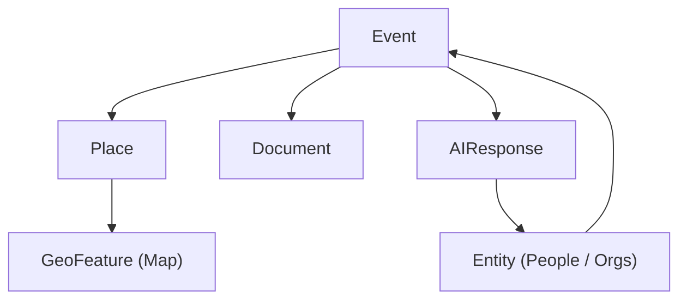

<div align="center">

# 🧩 Kansas Frontier Matrix — **Web Frontend Types**  
`web/src/types/`

**Shared TypeScript Definitions · Data Models · API Interfaces**

[](../../../../.github/workflows/ci.yml)
[](../../../../.github/workflows/codeql.yml)
[](../../../../docs/)
[](../../../../LICENSE)

</div>

---

```yaml
---
title: "KFM • Web Frontend Types (web/src/types/)"
version: "v1.3.0"
last_updated: "2025-10-14"
owners: ["@kfm-web", "@kfm-schema"]
tags: ["typescript","data-models","api","geojson","stac","mcp","web"]
license: "MIT"
semantic_alignment:
  - CIDOC CRM
  - OWL-Time
  - PROV-O
  - STAC 1.0
  - GeoJSON 1.0
---
````

---

## 🧭 Overview

The `web/src/types/` directory defines all **TypeScript interfaces and type declarations** shared across the **Kansas Frontier Matrix (KFM)** Web Application.
These guarantee **type safety**, **semantic interoperability**, and **alignment with backend API schemas** for all map, timeline, and AI components.

All types comply with **MCP-DL v6.2** (Master Coder Protocol – Documentation Language) to ensure **reproducibility**, **traceable provenance**, and **FAIR-aligned** semantics (CIDOC CRM · OWL-Time · PROV-O · STAC).

---

## 🗂️ Directory Layout

```text
web/src/types/
├── ai.d.ts         # AI Assistant responses, citations, entity extraction
├── api.d.ts        # REST/GraphQL payloads, error envelopes, and response contracts
├── data.d.ts       # STAC & GeoJSON dataset definitions
├── entity.d.ts     # Person, Place, Organization, Document, Event interfaces
├── map.d.ts        # MapLibre layer, style, legend, and geometry metadata
├── timeline.d.ts   # Timeline event, zoom scale, and temporal range interfaces
├── ui.d.ts         # ARIA / WCAG-compliant UI props (panels, dialogs, toasts)
└── index.d.ts      # Barrel export (aggregates all type modules globally)
```

Each file exports reusable **interfaces**, **enums**, and **utility types** shared across React components, hooks, API clients, and MapLibre layers—establishing **a single source of truth**.

---

## 🧱 Core Type Interfaces

| Type              | Description                                         | Defined In / Source |
| :---------------- | :-------------------------------------------------- | :------------------ |
| **Event**         | Historical event (time, place, relations, category) | `/api/events`       |
| **Entity**        | Base for Person, Place, Organization, Document      | `/api/entity/{id}`  |
| **Layer**         | Map overlay metadata from STAC Catalog              | `data/stac/*.json`  |
| **AIResponse**    | AI answer + citations + linked entities             | `/api/ask`          |
| **TimelineRange** | Visible time window & zoom factor                   | `timeline.d.ts`     |
| **GeoFeature**    | GeoJSON-compliant map feature                       | `map.d.ts`          |
| **STACItem**      | STAC 1.0 item for geospatial datasets               | `data.d.ts`         |
| **DocumentLink**  | Linked doc metadata (title, URL, license)           | `entity.d.ts`       |

---

## 🧩 Example — Event Type Definition

```ts
// event.d.ts
export type EventCategory =
  | "battle" | "treaty" | "flood" | "drought"
  | "settlement" | "wildfire" | "storm" | "other";

export interface Event {
  id: string;
  title: string;
  description?: string;
  category: EventCategory;
  startDate: string;             // ISO 8601 start
  endDate?: string;              // ISO 8601 end (interval)
  placeId?: string;              // Linked Place ID
  coordinates?: [lon: number, lat: number];
  relatedEntityIds?: string[];   // People / Orgs / Docs
  importance?: number;           // Timeline scaling weight
  source?: string;               // Dataset or document ID
  confidence?: number;           // 0..1 uncertainty
  tags?: string[];               // Descriptive tags
}
```

This model enforces **strong typing** for map, timeline, and AI modules.
Each event encodes a **temporal interval** and **uncertainty field**, compatible with **OWL-Time** and **PROV-O**.

---

## 🧠 Data Model Relationships



> These TypeScript relationships mirror the Neo4j Knowledge Graph schema — **Event ↔ Place ↔ Document ↔ Entity** — enabling cohesive temporal-spatial traversal and consistent map/timeline rendering.

---

## 🗺️ STAC / GeoJSON Integration

```ts
// data.d.ts
export interface STACAsset {
  href: string;
  type?: string;
  roles?: ("data" | "overview" | "thumbnail" | "metadata")[];
  title?: string;
}

export interface STACItem {
  id: string;
  type: "Feature";
  bbox?: [number, number, number, number];
  geometry?: GeoJSON.Geometry;
  properties: {
    datetime?: string;
    start_datetime?: string;
    end_datetime?: string;
    license?: string;
    "kfm:theme"?: string;
  };
  assets: Record<string, STACAsset>;
  links?: { rel: string; href: string; type?: string }[];
}
```

This enables direct ingestion from **STAC 1.0 catalogs**, linking backend geospatial assets to **map layers** and **timeline overlays**.

---

## ⚙️ TypeScript Configuration

* **Compiler:** `strict`, `noImplicitAny`, `esModuleInterop`, `skipLibCheck`
* **Global Exports:** `index.d.ts` re-exports all type definitions
* **Validation:** `tsc --noEmit` + ESLint via CI (`.github/workflows/ci.yml`)
* **IDE Support:** VS Code IntelliSense + path aliases (`@types`, `@api`, `@ui`)

---

## 🧩 Usage Example

```ts
import { Event, Layer } from "../types";

function renderEventMarker(event: Event, layer: Layer) {
  console.log(`Rendering ${event.title} on layer ${layer.id}`);
}
```

---

## ♿ Accessibility (ARIA Helpers)

```ts
// ui.d.ts
export interface AriaLabelled {
  "aria-label"?: string;
  "aria-describedby"?: string;
  role?: string;
}

export interface PanelProps extends AriaLabelled {
  title: string;
  isOpen: boolean;
  onClose: () => void;
}
```

These definitions standardize **accessibility props** across UI components, ensuring **WCAG 2.1 AA** compliance throughout the application.

---

## 🧾 Provenance · Integrity · Semantics

| Field            | Description                                                                |
| :--------------- | :------------------------------------------------------------------------- |
| **Inputs**       | Backend schemas (FastAPI Pydantic / GraphQL SDL)                           |
| **Outputs**      | TypeScript `.d.ts` definitions used by the Web UI                          |
| **Dependencies** | React · TypeScript · MapLibre GL · `@types/geojson`                        |
| **Integrity**    | Versioned in Git · CI validates with TypeScript compiler                   |
| **Ontology**     | `crm:E5_Event`, `crm:E31_Document`, `time:Interval`, `prov:wasDerivedFrom` |

```json
{
  "@context": "https://kfm.org/contexts/kfm.context.jsonld",
  "@type": "crm:E73_Information_Object",
  "name": "web/src/types/",
  "prov:wasDerivedFrom": ["API Schemas", "STAC Catalog"]
}
```

---

## 🧪 MCP Compliance Checklist

* ✅ **Documentation-first** — defined before code
* ✅ **Type-safe & strictly validated**
* ✅ **Provenance tracked** (source links + schema citations)
* ✅ **Semantic / FAIR alignment** (STAC, GeoJSON, CIDOC CRM, OWL-Time)
* ✅ **Accessibility integrated** (ARIA types, WCAG alignment)

---

## 🔗 Related Documentation

* **Web Frontend Overview** — `web/README.md`
* **Web UI Architecture** — `docs/architecture/web-ui.md`
* **Knowledge Graph API Reference** — `docs/api/graph.md`
* **Monorepo Repository Design** — `docs/repo/monorepo.md`

---

## 🧩 Version & Change Log

| Field            | Value                    |
| :--------------- | :----------------------- |
| **Doc Version**  | v6.2                     |
| **Last Updated** | 2025-10-14               |
| **Maintainer**   | Web Platform Team (@KFM) |

---

## 📜 License & Credits

Released under the **MIT License**.
© 2025 **Kansas Frontier Matrix** — all code and documentation follow **MCP-DL v6.2** for clarity, semantics, and reproducibility.

> *“Strong types make strong frontiers.”*

```
```
