<div align="center">

# 🧩 Kansas Frontier Matrix — **Web Frontend Types**  
`web/src/types/`

**Shared TypeScript Definitions · Data Models · API Interfaces**

[](../../../../.github/workflows/ci.yml)
[](../../../../.github/workflows/codeql.yml)
[](../../../../docs/)
[](../../../../LICENSE)

</div>

---

## 🧭 Overview

The `web/src/types/` directory defines **TypeScript interfaces and type declarations** shared across the KFM Web Frontend.  
These types ensure **strict compile-time safety**, **semantic interoperability**, and **schema alignment** with the backend (FastAPI/GraphQL + Neo4j), enabling consistent models for **Map**, **Timeline**, **AI Assistant**, and **UI** modules.

**House rules (MCP-DL v6.2):** deterministic modeling, provenance-first docs, FAIR-aligned semantics (CIDOC CRM · OWL-Time · PROV-O · STAC · GeoJSON).

---

## 🗂️ Directory Layout

```text
web/src/types/
├── ai.d.ts         # AI Assistant responses, citations, extraction types
├── api.d.ts        # REST/GraphQL contracts, envelopes, errors
├── data.d.ts       # STAC & GeoJSON dataset/item/asset definitions
├── entity.d.ts     # Person, Place, Organization, Document, Event
├── map.d.ts        # MapLibre layers, styles, legends, geometry metadata
├── timeline.d.ts   # Timeline event, scales, temporal range & brush
├── ui.d.ts         # ARIA/WCAG-friendly UI props: panels, dialogs, toasts
└── index.d.ts      # Barrel export for all public type modules
```

Each file exports reusable **interfaces**, **enums**, **type guards**, and **utility types** used across components, hooks, and utils, establishing a **single source of truth**.

---

## 🧱 Core Type Interfaces

| Type              | Description                                             | Source / Contract        |
| :---------------- | :------------------------------------------------------ | :----------------------- |
| **Event**         | Historical event (interval, place, relations, tags)    | `/api/events`            |
| **Entity**        | Base for Person/Place/Org/Document                      | `/api/entity/{id}`       |
| **Layer**         | STAC-derived map layer metadata                         | STAC 1.0 Item/Collection |
| **AIResponse**    | AI answer + citations + linked entities                 | `/api/ask`               |
| **TimelineRange** | Visible time window, zoom, brush                        | `timeline.d.ts`          |
| **GeoFeature**    | GeoJSON Feature for map rendering                       | `map.d.ts`               |
| **STACItem**      | STAC 1.0 Feature with assets & properties               | `data.d.ts`              |
| **DocumentLink**  | Linked document (title, URL, license, role)             | `entity.d.ts`            |

---

## 🧩 Example — `Event` Model (OWL-Time friendly)

```ts
// event.d.ts (excerpt)
export type EventCategory =
  | "battle" | "treaty" | "flood" | "drought"
  | "settlement" | "wildfire" | "storm" | "other";

export interface Event {
  id: string;
  title: string;
  description?: string;
  category: EventCategory;

  /** ISO 8601 start; use endDate for intervals */
  startDate: string;
  /** Optional ISO 8601 end — start/end define a time:Interval */
  endDate?: string;

  /** Optional linked Place node id */
  placeId?: string;

  /** Optional centroid for quick map placement */
  coordinates?: [lon: number, lat: number];

  /** People/Orgs/Documents related to this event */
  relatedEntityIds?: string[];

  /** [0..1] confidence score for uncertainty-aware rendering */
  confidence?: number;

  /** Optional dataset/document id (provenance) */
  source?: string;

  tags?: string[];
}
```

**Why this shape?**  
Intervals (start+end) align with **OWL-Time `time:Interval`**, while `confidence` supports uncertainty-aware UI.

---

## 🧠 Data Model Relationships

```mermaid
flowchart TD
  A["Event"] --> B["Place"]
  A --> C["Document"]
  A --> D["AIResponse"]
  B --> E["GeoFeature (Map)"]
  D --> F["Entity (People · Orgs)"]
  F --> A
%% END OF MERMAID
```



> Mirrors the Neo4j knowledge-graph schema for cohesive spatio-temporal behavior.

---

## 🗺️ STAC & GeoJSON Integration (essential excerpts)

```ts
// data.d.ts (excerpt)
export interface STACAsset {
  href: string;
  type?: string;
  roles?: ("data" | "overview" | "thumbnail" | "metadata")[];
  title?: string;
}

export interface STACItem {
  id: string;
  type: "Feature";
  bbox?: [number, number, number, number];
  geometry?: GeoJSON.Geometry;
  properties: {
    datetime?: string;
    start_datetime?: string;
    end_datetime?: string;
    license?: string;
    "kfm:theme"?: string;
  };
  assets: Record<string, STACAsset>;
  links?: { rel: string; href: string; type?: string }[];
}
```

These map to KFM’s STAC-indexed datasets (COG rasters, GeoJSON vectors), powering **MapLibre** layers and **timeline overlays**.

---

## ⚙️ TypeScript & Tooling

- **Compiler:** `strict`, `noImplicitAny`, `exactOptionalPropertyTypes`, `esModuleInterop`, `skipLibCheck`  
- **Exports:** `index.d.ts` re-exports stable, public types (avoid importing from deep paths)  
- **Validation:** `tsc --noEmit` + ESLint in CI (`.github/workflows/ci.yml`)  
- **Dev Ergonomics:** VS Code IntelliSense, `paths` aliases (e.g., `@types`, `@api`, `@ui`)  

---

## 🧩 Usage Example

```ts
import type { Event, Layer } from "../types";

export function renderEventMarker(event: Event, layer: Layer) {
  console.log(`Rendering ${event.title} on layer ${layer.id}`);
}
```

---

## ♿ Accessibility (ARIA Types)

```ts
// ui.d.ts (excerpt)
export interface AriaLabelled {
  "aria-label"?: string;
  "aria-describedby"?: string;
  role?: string;
}

export interface PanelProps extends AriaLabelled {
  title: string;
  isOpen: boolean;
  onClose: () => void;
}
```

Normalize accessibility props across panels/dialogs to keep **WCAG 2.1 AA** baseline.

---

## 🧾 Provenance · Integrity · Semantics

| Field            | Description                                                                    |
| :--------------- | :----------------------------------------------------------------------------- |
| **Inputs**       | Backend Pydantic/GraphQL schemas; STAC catalogs; GeoJSON specs                 |
| **Outputs**      | Stable `.d.ts` contracts for UI, hooks, and utils                              |
| **Dependencies** | TypeScript · `@types/geojson` · MapLibre GL typings                            |
| **Integrity**    | CI validates with `tsc` + ESLint; CodeQL scans; PR checks with coverage gates  |
| **Ontology**     | `crm:E5_Event`, `crm:E31_Document`, `time:Interval`, `prov:wasDerivedFrom`     |

```json
{
  "@context": "https://kfm.org/contexts/kfm.context.jsonld",
  "@type": "crm:E73_Information_Object",
  "name": "web/src/types/",
  "prov:wasDerivedFrom": ["API Schemas", "STAC Catalog"]
}
```

---

## 🧪 MCP Compliance Checklist

* ✅ **Documentation-first** — types defined before implementation  
* ✅ **Strict type-safety** — compiler/CI enforced  
* ✅ **Provenance tracked** — source schemas & STAC linked in docs  
* ✅ **Semantic/FAIR alignment** — CIDOC CRM · OWL-Time · PROV-O · STAC · GeoJSON  
* ✅ **Accessibility integrated** — ARIA types standardized

---

## 🔗 Related Documentation

- **Web Frontend Overview** — `web/README.md`  
- **Web UI Architecture** — `docs/architecture/web-ui.md`  
- **Graph/API Reference** — `docs/api/graph.md`  
- **Monorepo Design** — `docs/repo/monorepo.md`

---

## 🧾 Versioning & Metadata

| Field | Value |
| :---- | :---- |
| **Version** | `v1.4.0` |
| **Codename** | *Typed Interop & Semantics Upgrade* |
| **Last Updated** | 2025-10-17 |
| **Maintainers** | @kfm-web · @kfm-schema |
| **License** | MIT (code) · CC-BY 4.0 (docs) |
| **Alignment** | CIDOC CRM · OWL-Time · PROV-O · STAC 1.0 · GeoJSON 1.0 |
| **Maturity** | Stable / Production |

---

<div align="center">

**© Kansas Frontier Matrix — Web Frontend Types**  
Built under the **Master Coder Protocol (MCP)**

[]()  
[]()

</div>