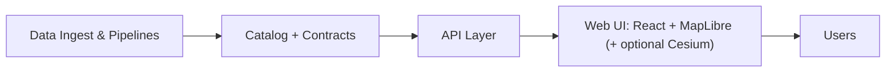

# 🧭 `web/src/ui` — Kansas Frontier Matrix UI Layer


%20Cesium-2E6E9E)


> **Mission reminder:** KFM is a “living atlas” where *every layer and AI output is traceable*—citations + metadata are first-class, and the UI must make that inspectable.  [oai_citation:0‡Kansas Frontier Matrix (KFM) – Comprehensive Technical Documentation.pdf](file-service://file-AkqwUuYPp5zePf7pv5SMxi)

---

## ✨ What lives here?

`web/src/ui` is the **presentation layer** for the KFM web app: reusable UI building blocks *and* feature UI for:
- 🗺️ **Map + Timeline** exploration (2D MapLibre; optional 3D Cesium)  [oai_citation:1‡Kansas Frontier Matrix (KFM) – Comprehensive Technical Documentation.pdf](file-service://file-AkqwUuYPp5zePf7pv5SMxi)  
- 📚 **Data Catalog / Layer Browser** (no “mystery layers”)  [oai_citation:2‡Kansas Frontier Matrix (KFM) – Comprehensive Technical Documentation.pdf](file-service://file-AkqwUuYPp5zePf7pv5SMxi)  
- 📖 **Story Mode** (Markdown + JSON-driven narrative slides synced to map state)  [oai_citation:3‡Kansas Frontier Matrix (KFM) – Comprehensive Technical Documentation.pdf](file-service://file-AkqwUuYPp5zePf7pv5SMxi)  
- 🧠 **Focus Mode** (advisory-only assistant w/ evidence and clear labeling)  [oai_citation:4‡Kansas Frontier Matrix (KFM) – Comprehensive Technical Documentation.pdf](file-service://file-AkqwUuYPp5zePf7pv5SMxi)  

The UI is designed as a browser-based interactive map/timeline experience where users can toggle layers by time period, inspect linked docs, and surface insights—while keeping provenance front-and-center.  [oai_citation:5‡Kansas-Frontier-Matrix_ Open-Source Geospatial Historical Mapping Hub Design.pdf](file-service://file-ShqHKgjxCS9UT9vbcxDNzA)

---

## 🧱 Non‑negotiables (UI Contracts)

### 1) 🔎 Provenance is a first-class UI feature
- Every dataset/layer must expose **source, license, extent, processing steps** (and ideally a “why this exists” note).  [oai_citation:6‡Kansas Frontier Matrix (KFM) – Comprehensive Technical Documentation.pdf](file-service://file-AkqwUuYPp5zePf7pv5SMxi)  
- The UI must **always let users inspect a layer’s source** and any AI note’s references.  [oai_citation:7‡Kansas Frontier Matrix (KFM) – Comprehensive Technical Documentation.pdf](file-service://file-AkqwUuYPp5zePf7pv5SMxi)  

### 2) 🚫 No “mystery layers”
- Datasets are accepted only if they satisfy their **metadata “data contract”**; unsourced/ad-hoc layers do not belong in the official catalog.  [oai_citation:8‡Kansas Frontier Matrix (KFM) – Comprehensive Technical Documentation.pdf](file-service://file-AkqwUuYPp5zePf7pv5SMxi)  

### 3) 🧠 Focus Mode is *advisory only* + evidence-backed
- Never takes autonomous action; always provides sources; clearly labels AI output.  [oai_citation:9‡Kansas Frontier Matrix (KFM) – Comprehensive Technical Documentation.pdf](file-service://file-AkqwUuYPp5zePf7pv5SMxi)  
- If the answer isn’t supported by KFM’s data: say so (don’t “fill in”).  [oai_citation:10‡Kansas Frontier Matrix (KFM) – Comprehensive Technical Documentation.pdf](file-service://file-AkqwUuYPp5zePf7pv5SMxi)  

### 4) 🧼 “Safe rendering” for narrative content
- Story content is Markdown rendered to HTML and **must be sanitized** before display.  [oai_citation:11‡Kansas Frontier Matrix (KFM) – Comprehensive Technical Documentation.pdf](file-service://file-AkqwUuYPp5zePf7pv5SMxi)  
- If we rely on Markdown patterns to populate evidence panels (e.g., citations), validate the rendering end-to-end in UI.  [oai_citation:12‡Comprehensive Markdown Guide_ Syntax, Extensions, and Best Practices.docx](file-service://file-J6rFRcp4ExCCeCdTevQjxz)  

### 5) 🧍 Human-centered, ethically aware
KFM is guided by digital humanism: transparency, accountability, and careful interface design around automation.  [oai_citation:13‡Introduction to Digital Humanism.pdf](file-service://file-HC311tLjkcn1yRbyTBLJQQ)

---

## 🗺️ UI in the system (where we sit)



- **Frontend does not talk directly to DB/pipelines**—it consumes API endpoints and renders state.  [oai_citation:14‡MARKDOWN_GUIDE_v13.md.gdoc](file-service://file-UYVruFXfueR8veHMUKeugU)  
- KFM clean architecture separates concerns so each part stays independently testable and scalable.  [oai_citation:15‡Kansas Frontier Matrix (KFM) – Comprehensive Technical Documentation.pdf](file-service://file-AkqwUuYPp5zePf7pv5SMxi)  

---

## 🧩 Suggested folder map (adjust to match reality)

> This is the recommended mental model. If your current folder layout differs, update this section to reflect the repo.

```text
📁 web/src/ui
├─ 📁 components/        # Buttons, panels, dialogs, tabs, etc.
├─ 📁 map/               # Map viewer wrapper(s), layer adapters, interactions
├─ 📁 timeline/          # Time slider, playhead, animation controls
├─ 📁 catalog/           # Browse/search layers & datasets; metadata display
├─ 📁 story/             # Story renderer (Markdown) + slide controller
├─ 📁 focus/             # Focus Mode panel + evidence view
├─ 📁 hooks/             # UI hooks (state sync, viewport, media queries)
├─ 📁 styles/            # tokens, themes, CSS vars, typography
└─ 📁 utils/             # formatters, guards, invariants
```

The broader `web/` app often includes `components/`, `views/`, `viewers/`, and `story_nodes/` content directories.  [oai_citation:16‡Kansas Frontier Matrix (KFM) – Comprehensive Technical Documentation.pdf](file-service://file-AkqwUuYPp5zePf7pv5SMxi)

---

## 🧠 Core experiences (what we optimize for)

### 🗺️ Map + Timeline (the “living atlas” cockpit)
- Users scrub time, toggle layers, inspect features, and open metadata/provenance panels.  [oai_citation:17‡Kansas-Frontier-Matrix_ Open-Source Geospatial Historical Mapping Hub Design.pdf](file-service://file-ShqHKgjxCS9UT9vbcxDNzA)  
- Design map symbology/legends intentionally—data type should match visual encoding (qualitative vs quantitative), and legends should not mislead.  [oai_citation:18‡making-maps-a-visual-guide-to-map-design-for-gis.pdf](file-service://file-51FgWTn7uFXenxztXw29bP)  [oai_citation:19‡making-maps-a-visual-guide-to-map-design-for-gis.pdf](file-service://file-51FgWTn7uFXenxztXw29bP)  
- Cartographic design principle: *maximum information at minimum interpretive cost*—simplicity beats clutter.  [oai_citation:20‡F-H programming Books.pdf](file-service://file-QofzooQDG9grJwh9nFN9SY)  

### 📖 Story Mode (narrative + map synchronization)
Story mode is an “interactive storybook” that drives map state step-by-step: view (zoom), layers on/off, time setting, highlighted features, and narrative text.  [oai_citation:21‡Kansas Frontier Matrix (KFM) – Comprehensive Technical Documentation.pdf](file-service://file-AkqwUuYPp5zePf7pv5SMxi)  
- Content authored in **Markdown + JSON config**, rendered and applied through MapLibre/Cesium calls.  [oai_citation:22‡Kansas Frontier Matrix (KFM) – Comprehensive Technical Documentation.pdf](file-service://file-AkqwUuYPp5zePf7pv5SMxi)  
- Future direction: a **Story Builder GUI** so non-devs can author stories.  [oai_citation:23‡Kansas Frontier Matrix (KFM) – Comprehensive Technical Documentation.pdf](file-service://file-AkqwUuYPp5zePf7pv5SMxi)  

### 🧠 Focus Mode (AI assistant with receipts)
- Integrated assistant panel for “what am I looking at?” questions, returning answers **with references**.  [oai_citation:24‡Kansas Frontier Matrix (KFM) – Comprehensive Technical Documentation.pdf](file-service://file-AkqwUuYPp5zePf7pv5SMxi)  
- Must be clearly labeled, evidence-backed, and non-autonomous.  [oai_citation:25‡Kansas Frontier Matrix (KFM) – Comprehensive Technical Documentation.pdf](file-service://file-AkqwUuYPp5zePf7pv5SMxi)  

---

## 🧵 Data flow rules (UI state & API)

### ✅ Do
- Treat the UI as a **pure renderer** of API-provided data + local interaction state.  [oai_citation:26‡MARKDOWN_GUIDE_v13.md.gdoc](file-service://file-UYVruFXfueR8veHMUKeugU)  
- Use dataset metadata contracts to generate attributions/credits and to power “inspect provenance” UX.  [oai_citation:27‡Kansas Frontier Matrix (KFM) – Comprehensive Technical Documentation.pdf](file-service://file-AkqwUuYPp5zePf7pv5SMxi)  
- Cache smartly (tiles, vector sources, story assets), but invalidate clearly.

### 🚫 Don’t
- Don’t embed “secret knowledge” in UI (no hidden datasets, no unreviewed sources).
- Don’t let Focus Mode silently mutate user state (it can suggest actions, but user triggers them).  [oai_citation:28‡Kansas Frontier Matrix (KFM) – Comprehensive Technical Documentation.pdf](file-service://file-AkqwUuYPp5zePf7pv5SMxi)  

---

## 🧰 How to add a new map layer UI (checklist)

1) **Define the layer contract**
- Confirm metadata exists: source, license, extents, processing steps.  [oai_citation:29‡Kansas Frontier Matrix (KFM) – Comprehensive Technical Documentation.pdf](file-service://file-AkqwUuYPp5zePf7pv5SMxi)  

2) **Choose the right visual encoding**
- Qualitative → hue/icon/symbol differences; Quantitative → value/ramp/size.  [oai_citation:30‡making-maps-a-visual-guide-to-map-design-for-gis.pdf](file-service://file-51FgWTn7uFXenxztXw29bP)  
- Legend rules: avoid misleading continuous legends for binned classes; keep class order intuitive.  [oai_citation:31‡making-maps-a-visual-guide-to-map-design-for-gis.pdf](file-service://file-51FgWTn7uFXenxztXw29bP)  

3) **Implement the renderer**
- Vector tiles / GeoJSON / raster tiles: keep I/O shapes predictable.
- For 3D or advanced rendering: WebGL/Cesium patterns belong in the map viewer layer.  [oai_citation:32‡Kansas Frontier Matrix (KFM) – Comprehensive Technical Documentation.pdf](file-service://file-AkqwUuYPp5zePf7pv5SMxi)  [oai_citation:33‡webgl-programming-guide-interactive-3d-graphics-programming-with-webgl.pdf](file-service://file-7Nd7iS68ES97NmWhPiRWTP)  

4) **Add interaction affordances**
- Hover → lightweight highlight + tooltip
- Click → details drawer w/ provenance + linked docs (when available)

5) **Ship with tests + docs**
- Snapshot/interaction tests for legends and metadata panels
- Story integration test if the layer is referenced in story JSON steps  [oai_citation:34‡Kansas Frontier Matrix (KFM) – Comprehensive Technical Documentation.pdf](file-service://file-AkqwUuYPp5zePf7pv5SMxi)  

---

## 📖 Story Nodes: authoring + rendering expectations

Story mode is driven by:
- `story.md` (narrative) + `story.json` (steps: layers/camera/time).  [oai_citation:35‡Kansas Frontier Matrix (KFM) – Comprehensive Technical Documentation.pdf](file-service://file-AkqwUuYPp5zePf7pv5SMxi)  
- Markdown rendering should support citations/footnotes patterns if we use them to populate the evidence panel.  [oai_citation:36‡Comprehensive Markdown Guide_ Syntax, Extensions, and Best Practices.docx](file-service://file-J6rFRcp4ExCCeCdTevQjxz)  

**Renderer rules**
- ✅ sanitize HTML output  
- ✅ lazy-load images/assets  
- ✅ keep “exit story” always available  
- ✅ map sync must be deterministic (no implicit state)  [oai_citation:37‡Kansas Frontier Matrix (KFM) – Comprehensive Technical Documentation.pdf](file-service://file-AkqwUuYPp5zePf7pv5SMxi)  

---

## 🧠 Focus Mode: safe-by-design UX rules

- ✅ Label AI output clearly (badge + “AI-generated” copy).  [oai_citation:38‡Kansas Frontier Matrix (KFM) – Comprehensive Technical Documentation.pdf](file-service://file-AkqwUuYPp5zePf7pv5SMxi)  
- ✅ Provide citations / sources in the UI for each claim.  [oai_citation:39‡Kansas Frontier Matrix (KFM) – Comprehensive Technical Documentation.pdf](file-service://file-AkqwUuYPp5zePf7pv5SMxi)  
- ✅ Refuse / generalize when sensitive data would be revealed.  [oai_citation:40‡Kansas Frontier Matrix (KFM) – Comprehensive Technical Documentation.pdf](file-service://file-AkqwUuYPp5zePf7pv5SMxi)  
- ✅ Don’t speculate beyond KFM data; default to “I don’t have info.”  [oai_citation:41‡Kansas Frontier Matrix (KFM) – Comprehensive Technical Documentation.pdf](file-service://file-AkqwUuYPp5zePf7pv5SMxi)  

---

## ⚡ Performance & polish (maps are expensive)

- Prefer tiled sources (vector/raster) and progressive disclosure.
- Keep UI responsive under load; optimize for latency-sensitive, user-facing experiences.  [oai_citation:42‡Database Performance at Scale.pdf](file-service://file-36z8qyiVJRtrSs6QG7Epen)  
- Use appropriate image formats & sizes to keep story pages snappy (image compression basics matter).  [oai_citation:43‡compressed-image-file-formats-jpeg-png-gif-xbm-bmp.pdf](file-service://file-Y6V94sFtV6sy3w63LDy9fi)  

---

## ♿ Accessibility (A11y) baseline

- Keyboard navigation for map controls and side panels  
- ARIA only where semantics don’t already exist; respect semantic HTML guidance and accessibility standards.  [oai_citation:44‡responsive-web-design-with-html5-and-css3.pdf](file-service://file-4pQLNMB3Rk5n5vUPTqxpNa)  
- Reduced motion support (timeline animations, story transitions)

---

## 🔐 Security basics (UI edition)

- Sanitize rendered Markdown (stories, citations, any user-provided text).  [oai_citation:45‡Kansas Frontier Matrix (KFM) – Comprehensive Technical Documentation.pdf](file-service://file-AkqwUuYPp5zePf7pv5SMxi)  
- Never echo raw HTML from API without sanitization.
- Treat query params as hostile (avoid injection patterns; validate).  
- Keep secrets out of the client; no tokens in localStorage unless explicitly intended.

---

## ✅ Definition of Done (UI PRs)

- [ ] Provenance visible for new/changed dataset UI  [oai_citation:46‡Kansas Frontier Matrix (KFM) – Comprehensive Technical Documentation.pdf](file-service://file-AkqwUuYPp5zePf7pv5SMxi)  
- [ ] No “mystery layer” paths introduced  [oai_citation:47‡Kansas Frontier Matrix (KFM) – Comprehensive Technical Documentation.pdf](file-service://file-AkqwUuYPp5zePf7pv5SMxi)  
- [ ] Focus Mode changes remain advisory + cited  [oai_citation:48‡Kansas Frontier Matrix (KFM) – Comprehensive Technical Documentation.pdf](file-service://file-AkqwUuYPp5zePf7pv5SMxi)  
- [ ] Story rendering sanitized + tested  [oai_citation:49‡Kansas Frontier Matrix (KFM) – Comprehensive Technical Documentation.pdf](file-service://file-AkqwUuYPp5zePf7pv5SMxi)  
- [ ] A11y pass (keyboard + contrast + semantics)  [oai_citation:50‡responsive-web-design-with-html5-and-css3.pdf](file-service://file-4pQLNMB3Rk5n5vUPTqxpNa)  
- [ ] Perf sanity check (slow device / low bandwidth)  
- [ ] Docs updated (this README, plus any feature docs)  [oai_citation:51‡Scientific Method _ Research _ Master Coder Protocol Documentation.pdf](file-service://file-HTpax4QbDgguDwxwwyiS32)  

---

## 📚 Project Library (how the “bookshelf” informs UI) 📖

<details>
<summary><strong>Click to expand: curated influences used by the UI layer</strong> ✨</summary>

### 🗺️ Mapping, cartography, and GIS UX
- **KFM Technical Documentation** (provenance-first, story mode, focus mode, web/ structure)  [oai_citation:52‡Kansas Frontier Matrix (KFM) – Comprehensive Technical Documentation.pdf](file-service://file-AkqwUuYPp5zePf7pv5SMxi)  [oai_citation:53‡Kansas Frontier Matrix (KFM) – Comprehensive Technical Documentation.pdf](file-service://file-AkqwUuYPp5zePf7pv5SMxi)  [oai_citation:54‡Kansas Frontier Matrix (KFM) – Comprehensive Technical Documentation.pdf](file-service://file-AkqwUuYPp5zePf7pv5SMxi)  
- **KFM Geospatial Historical Hub Design** (map/timeline UI requirements and interactive inspection)  [oai_citation:55‡Kansas-Frontier-Matrix_ Open-Source Geospatial Historical Mapping Hub Design.pdf](file-service://file-ShqHKgjxCS9UT9vbcxDNzA)  
- **Making Maps (Krygier & Wood)** (encoding, legend integrity, choropleth pitfalls, map purpose)  [oai_citation:56‡making-maps-a-visual-guide-to-map-design-for-gis.pdf](file-service://file-51FgWTn7uFXenxztXw29bP)  [oai_citation:57‡making-maps-a-visual-guide-to-map-design-for-gis.pdf](file-service://file-51FgWTn7uFXenxztXw29bP)  
- **Cartographic Principles (GIS text excerpt)** (simplicity, interpretability, map elements)  [oai_citation:58‡F-H programming Books.pdf](file-service://file-QofzooQDG9grJwh9nFN9SY)  
- **Mobile Mapping** (maps as “always becoming”; embodied, situated interaction)  [oai_citation:59‡Mobile Mapping_ Space, Cartography and the Digital - 9789048535217.pdf](file-service://file-AkVmsLhdFzwie5Gco3zgYj)  

### 🧊 3D & Web visualization
- **WebGL Programming Guide** (GPU pipeline literacy; shader mental model for 3D overlays)  [oai_citation:60‡webgl-programming-guide-interactive-3d-graphics-programming-with-webgl.pdf](file-service://file-7Nd7iS68ES97NmWhPiRWTP)  
- **Archaeological 3D GIS** (why web 3D GIS matters; collaborative 3D viewing)  [oai_citation:61‡Archaeological 3D GIS_26_01_12_17_53_09.pdf](file-service://file-6DRx5ELzDPBso9Y5Qcbqm2)  

### 📡 Remote sensing & raster visualization
- **Cloud-Based Remote Sensing w/ Google Earth Engine** (UI patterns for raster visualization, palettes, animations)  [oai_citation:62‡Cloud-Based Remote Sensing with Google Earth Engine-Fundamentals and Applications.pdf](file-service://file-JVv3nbvtonX1HcpeERi9kV)  [oai_citation:63‡Cloud-Based Remote Sensing with Google Earth Engine-Fundamentals and Applications.pdf](file-service://file-JVv3nbvtonX1HcpeERi9kV)  

### 🧾 Data + performance foundations (affects perceived UI speed)
- **Database Performance at Scale** (latency vs throughput thinking; observability mindset)  [oai_citation:64‡Database Performance at Scale.pdf](file-service://file-36z8qyiVJRtrSs6QG7Epen)  [oai_citation:65‡Database Performance at Scale.pdf](file-service://file-36z8qyiVJRtrSs6QG7Epen)  
- **PostgreSQL Notes** (index-aware query patterns that influence API responsiveness)  [oai_citation:66‡PostgreSQL Notes for Professionals - PostgreSQLNotesForProfessionals.pdf](file-service://file-742sw3gADJniEdmC19JeAC)  
- **Compressed Image File Formats** (format/compression concepts for story assets)  [oai_citation:67‡compressed-image-file-formats-jpeg-png-gif-xbm-bmp.pdf](file-service://file-Y6V94sFtV6sy3w63LDy9fi)  

### 🧪 Stats, modeling, and analysis literacy (for charts + explanations in UI)
- Scientific modeling/simulation (NASA-grade), regression, experimental design, Bayesian thinking, graphical analysis: used as design cues for *how* we present uncertainty, model outputs, and charts without misleading users.

### 🧠 Ethics, governance, and documentation
- **Digital Humanism** (human-centered safeguards around automated decisions)  [oai_citation:68‡Introduction to Digital Humanism.pdf](file-service://file-HC311tLjkcn1yRbyTBLJQQ)  
- **Comprehensive Markdown Guide** (governance via front-matter + evidence-first docs; UI parsing expectations)  [oai_citation:69‡Comprehensive Markdown Guide_ Syntax, Extensions, and Best Practices.docx](file-service://file-J6rFRcp4ExCCeCdTevQjxz)  
- **Scientific Method / Master Coder Protocol** (documentation as a disciplined artifact)  [oai_citation:70‡Scientific Method _ Research _ Master Coder Protocol Documentation.pdf](file-service://file-HTpax4QbDgguDwxwwyiS32)  

</details>

---

## 🔗 Sources (project docs referenced directly)
- KFM mission + provenance-first UI expectations  [oai_citation:71‡Kansas Frontier Matrix (KFM) – Comprehensive Technical Documentation.pdf](file-service://file-AkqwUuYPp5zePf7pv5SMxi)  
- Contract-first metadata; no “mystery layers”  [oai_citation:72‡Kansas Frontier Matrix (KFM) – Comprehensive Technical Documentation.pdf](file-service://file-AkqwUuYPp5zePf7pv5SMxi)  
- Web UI structure (components/views/viewers/story_nodes; MapLibre + Cesium)  [oai_citation:73‡Kansas Frontier Matrix (KFM) – Comprehensive Technical Documentation.pdf](file-service://file-AkqwUuYPp5zePf7pv5SMxi)  
- Story mode implementation details (Markdown + JSON; map sync; sanitization)  [oai_citation:74‡Kansas Frontier Matrix (KFM) – Comprehensive Technical Documentation.pdf](file-service://file-AkqwUuYPp5zePf7pv5SMxi)  
- Focus Mode safeguards (advisory-only; citations; labeling)  [oai_citation:75‡Kansas Frontier Matrix (KFM) – Comprehensive Technical Documentation.pdf](file-service://file-AkqwUuYPp5zePf7pv5SMxi)  
- Markdown governance & UI integration expectations  [oai_citation:76‡Comprehensive Markdown Guide_ Syntax, Extensions, and Best Practices.docx](file-service://file-J6rFRcp4ExCCeCdTevQjxz)  
- Map UI placement in the overall KFM system  [oai_citation:77‡MARKDOWN_GUIDE_v13.md.gdoc](file-service://file-UYVruFXfueR8veHMUKeugU)  [oai_citation:78‡MARKDOWN_GUIDE_v13.md.gdoc](file-service://file-UYVruFXfueR8veHMUKeugU)  
- Cartographic design guidance & legend integrity  [oai_citation:79‡F-H programming Books.pdf](file-service://file-QofzooQDG9grJwh9nFN9SY)  [oai_citation:80‡making-maps-a-visual-guide-to-map-design-for-gis.pdf](file-service://file-51FgWTn7uFXenxztXw29bP)  

---

## 🧾 Legacy citation anchors (kept for continuity)
> These are intentionally preserved because earlier project indexing referenced them directly.

- SciPy lecture notes / scientific computing references  [oai_citation:81‡S-T programming Books.pdf](file-service://file-NT32tqqzGW9RvfcNZmMH1K)  
- Objective‑C Notes for Professionals  [oai_citation:82‡O-R programming Books.pdf](file-service://file-M6zCNBGmJbot7A2aaUUy9M)  
- Implementing Programming Languages: An Introduction  [oai_citation:83‡I-L programming Books.pdf](file-service://file-T9sYu87k1GPNNKMLddx41a)  
- MATLAB Notes for Professionals  [oai_citation:84‡M-N programming Books.pdf](file-service://file-EYCp5md89QY2cy5PCYS18e)  
- Bash Notes for Professionals  [oai_citation:85‡B-C programming Books.pdf](file-service://file-7V9zHZSJakZZrJAw9ASCMJ)  
- Basics of Linear Algebra for ML discovery  [oai_citation:86‡U-X programming Books.pdf](file-service://file-3hYtSGHtHmb6wyTtavym6M)  
- Understanding ML: From Theory to Algorithms  [oai_citation:87‡F-H programming Books.pdf](file-service://file-QofzooQDG9grJwh9nFN9SY)  
- Flexible Software Design: Systems Development for Changing Requirements  [oai_citation:88‡Database Performance at Scale.pdf](file-service://file-36z8qyiVJRtrSs6QG7Epen)  
- Database Performance at Scale  [oai_citation:89‡Kansas Frontier Matrix (KFM) – Comprehensive Technical Documentation.pdf](file-service://file-AkqwUuYPp5zePf7pv5SMxi)  
- KFM Comprehensive Technical Documentation  [oai_citation:90‡Archaeological 3D GIS_26_01_12_17_53_09.pdf](file-service://file-6DRx5ELzDPBso9Y5Qcbqm2)  
- Archaeological 3D GIS   
