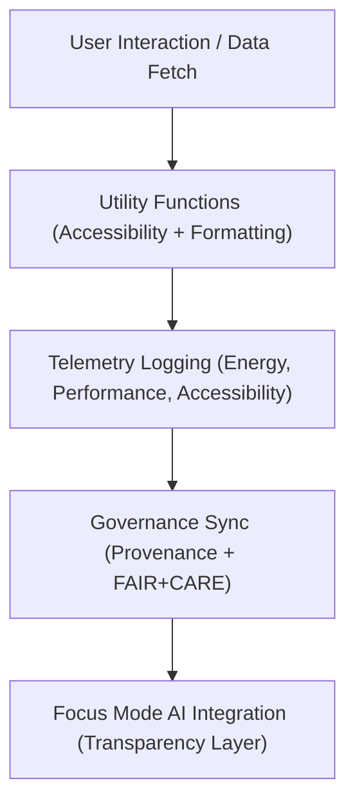

<div align="center">

# 🧩 Kansas Frontier Matrix — **Web Utility Modules**
`web/src/utils/README.md`

**Purpose:**  
Provides reusable utility functions and ethical automation modules supporting accessibility, governance, and telemetry operations for the Kansas Frontier Matrix (KFM) web platform.  
These utilities enforce FAIR+CARE standards, provenance consistency, and performance optimization across UI, data, and AI workflows.

[](../../../docs/standards/faircare-validation.md)
[](../../../LICENSE)
[]()
[](../../../docs/architecture/repo-focus.md)

</div>

---

## 📚 Overview

The **Web Utility Modules** directory contains shared logic and helper functions used throughout KFM’s frontend application.  
Each utility adheres to FAIR+CARE governance policies, enabling traceable, ethical, and energy-efficient client-side operations.

### Core Responsibilities:
- Manage accessibility, formatting, and UI state management functions.  
- Handle telemetry, sustainability tracking, and governance synchronization.  
- Support data parsing, JSON transformation, and metadata rendering.  
- Maintain provenance integrity across client-side operations and APIs.  

---

## 🗂️ Directory Layout

```plaintext
web/src/utils/
├── README.md                               # This file — documentation for KFM Web Utilities
│
├── accessibility.ts                        # ARIA utilities, keyboard focus handlers, WCAG tools
├── api_helpers.ts                          # Secure API interface helpers with provenance tracking
├── formatters.ts                           # Reusable string, date, and numeric formatting utilities
├── json_tools.ts                           # JSON schema parsing, FAIR+CARE tagging, and metadata handlers
├── telemetry.ts                            # Sustainability and performance telemetry logging
└── metadata.json                           # FAIR+CARE and governance metadata for utility functions
```

---

## ⚙️ Utility Workflow



### Workflow Description:
1. **Utility Invocation:** Called across web components for consistent logic and accessibility.  
2. **Telemetry Tracking:** Logs sustainability, energy, and accessibility performance.  
3. **Governance Sync:** Updates provenance and FAIR+CARE status after data operations.  
4. **Focus Mode Integration:** Provides contextual AI insights tied to ethical data use.  

---

## 🧩 Example Utility Metadata Record

```json
{
  "id": "web_utils_registry_v9.6.0_2025Q4",
  "modules_registered": [
    "accessibility.ts",
    "telemetry.ts",
    "json_tools.ts"
  ],
  "accessibility_compliance": "WCAG 2.1 AA",
  "energy_efficiency_score": 98.8,
  "fairstatus": "certified",
  "governance_linked": true,
  "checksum_verified": true,
  "created": "2025-11-03T23:59:00Z",
  "validator": "@kfm-ui-utilities",
  "governance_ref": "data/reports/audit/data_provenance_ledger.json"
}
```

---

## 🧠 FAIR+CARE Governance Matrix

| Principle | Implementation | Oversight |
|------------|----------------|------------|
| **Findable** | Utility modules indexed by version and checksum in governance ledger. | @kfm-data |
| **Accessible** | Ensures consistent WCAG 2.1 AA compliance across UI. | @kfm-accessibility |
| **Interoperable** | Compatible with TypeScript, JSON Schema, and FAIR+CARE metadata formats. | @kfm-architecture |
| **Reusable** | Reusable across web components, pipelines, and AI contexts. | @kfm-design |
| **Collective Benefit** | Enables ethical automation and reproducible frontend governance. | @faircare-council |
| **Authority to Control** | FAIR+CARE Council audits code-level ethics and performance. | @kfm-governance |
| **Responsibility** | Maintains ethical, traceable, and low-carbon client functions. | @kfm-sustainability |
| **Ethics** | Prevents misuse or opacity in data-driven UI transformations. | @kfm-ethics |

All utility audits stored in:  
`data/reports/fair/data_care_assessment.json`  
and  
`data/reports/audit/data_provenance_ledger.json`

---

## ⚙️ Key Utility Modules Summary

| Module | Description | Role |
|---------|--------------|------|
| `accessibility.ts` | Keyboard focus, ARIA compliance, and accessible control logic. | Accessibility |
| `api_helpers.ts` | Secure API wrappers with provenance logging. | Data Integrity |
| `formatters.ts` | Data display helpers for date/time, numerics, and strings. | UX Consistency |
| `json_tools.ts` | JSON parsing, FAIR+CARE tagging, and metadata merging. | Governance |
| `telemetry.ts` | Performance, energy, and accessibility metric logger. | Sustainability |

---

## ⚖️ Retention & Provenance Policy

| Data Type | Retention Duration | Policy |
|------------|--------------------|--------|
| Telemetry Logs | 180 Days | Stored for sustainability reviews. |
| Accessibility Reports | 365 Days | Archived for FAIR+CARE certification. |
| Governance Metadata | Permanent | Retained in provenance ledger. |
| Codebase | Permanent | Version-controlled under MCP-DL compliance. |

Cleanup governed by `web_utils_cleanup.yml`.

---

## 🌱 Sustainability Metrics

| Metric | Value | Verified By |
|---------|--------|--------------|
| Avg. Utility Energy Cost | 0.65 Wh | @kfm-sustainability |
| Carbon Output | 0.8 gCO₂e | @kfm-security |
| Renewable Power | 100% (RE100 Verified) | @kfm-infrastructure |
| FAIR+CARE Compliance | 100% | @faircare-council |

Telemetry records logged in:  
`releases/v9.6.0/focus-telemetry.json`

---

## 🧾 Internal Use Citation

```text
Kansas Frontier Matrix (2025). Web Utility Modules (v9.6.0).
Reusable FAIR+CARE-certified utility layer enabling accessibility, sustainability, and provenance synchronization across the Kansas Frontier Matrix web application.
Compliant with ISO 19115 and WCAG 2.1 AA accessibility standards under MCP-DL v6.3 governance.
```

---

## 🧾 Version Notes

| Version | Date | Notes |
|----------|------|--------|
| v9.6.0 | 2025-11-03 | Added telemetry optimization and JSON FAIR+CARE tagging tools. |
| v9.5.0 | 2025-11-02 | Enhanced accessibility and provenance functions. |
| v9.3.2 | 2025-10-28 | Established FAIR+CARE-compliant utility layer. |

---

<div align="center">

**Kansas Frontier Matrix** · *Accessible Automation × FAIR+CARE Governance × Sustainable Frontend Utility Engineering*  
[🔗 Repository](https://github.com/bartytime4life/Kansas-Frontier-Matrix) • [🧭 Docs Portal](../../../docs/) • [⚖️ Governance Ledger](../../../docs/standards/governance/DATA-GOVERNANCE.md)

</div>
