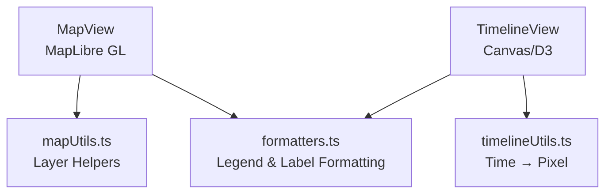

<div align="center">

# 🧮 Kansas Frontier Matrix — **Web Frontend Utilities**  
`web/src/utils/`

**Helper Functions · API Clients · Data Parsers · Map & Timeline Utilities**

[](../../../../.github/workflows/ci.yml)
[](../../../../.github/workflows/codeql.yml)
[](../../../../docs/)
[](../../../../LICENSE)

</div>

---

## 🧭 Overview

`web/src/utils/` houses **pure, reusable TypeScript utility modules** that serve as the backbone of the KFM Web Frontend — ensuring deterministic data transformation, clean API handling, and consistent formatting across the application.

All modules follow **MCP-DL v6.2**, emphasizing:
- Deterministic behavior  
- Provenance tracking  
- Testability and reproducibility  
- Documentation-first engineering  

> *“Every helper tells a story — reproducible, verifiable, and open.”*

---

## 🧱 Directory Structure

```text
web/src/utils/
├── apiClient.ts          # REST/GraphQL client (retry, backoff, logging)
├── mapUtils.ts           # MapLibre helpers (layer management, transforms)
├── timelineUtils.ts      # Temporal math and scaling functions
├── aiUtils.ts            # AI bridge (summaries, citations)
├── formatters.ts         # Date/number/text localization
├── dataParser.ts         # STAC/API payload normalization
├── hooks.ts              # useFetch, useDebounce, useResizeObserver
├── constants.ts          # Shared constants, URLs, version data
└── __tests__/            # Unit tests for each module
```

---

## ⚙️ Core Modules

| File | Purpose | Example Function |
|:-----|:---------|:----------------|
| `apiClient.ts` | Unified REST/GraphQL client | `getEvents(start, end)` |
| `mapUtils.ts` | MapLibre helpers (layers, markers, tiles) | `addLayer(map, id, url)` |
| `timelineUtils.ts` | Time → pixel interpolation | `timeToPixel(date, scale)` |
| `aiUtils.ts` | AI endpoint handlers | `fetchAISummary(entityId)` |
| `formatters.ts` | Locale-aware date/number formatting | `formatDateHuman(date)` |
| `dataParser.ts` | Normalize backend → frontend models | `parseEventData(json)` |
| `hooks.ts` | Common hooks | `useDebounce(fn, delay)` |
| `constants.ts` | Shared config, version, and endpoint constants | `API_BASE_URL`, `APP_VERSION` |

---

## 🧩 Example Usage

```ts
import { getEvents } from "./apiClient";
import { parseEventData } from "./dataParser";
import { formatDateHuman } from "./formatters";

export async function loadTimeline(start: string, end: string) {
  const data = await getEvents(start, end);
  const events = parseEventData(data);
  console.info(`Loaded ${events.length} events from ${formatDateHuman(start)}–${formatDateHuman(end)}.`);
  return events;
}
```

---

## 🗺️ Map & Timeline Utility Relationships



---

## 🤖 AI Utilities Integration

`aiUtils.ts` handles the KFM AI service layer:

* **Endpoints:**  
  - `POST /ask` → open-ended Q&A  
  - `GET /entity/{id}` → entity summary + citations  
* **Features:**  
  - Streaming responses  
  - Citation mapping to Neo4j entities  
  - In-memory caching  
  - Deterministic data shaping

**Response Type**

```ts
type AIResponse = {
  answer: string;
  citations: { id: string; label: string; source: string }[];
};
```

---

## 🧮 Coding Standards

- 🧱 **Style:** ESLint + Prettier + CI enforcement  
- 🧾 **Docs:** JSDoc/TSDoc on all public exports  
- 🧪 **Tests:** Jest ≥ 85% coverage  
- 🧩 **Determinism:** Pure functions; no global mutations  
- 🔍 **Typing:** Strict TypeScript, generics preferred  

---

## 🧾 Provenance & Integrity

| Artifact | Description |
|:----------|:-------------|
| **Inputs** | STAC catalogs, API payloads |
| **Outputs** | Typed data models (Event, Entity, Layer) |
| **Checks** | CI CodeQL, checksum validation, Jest |
| **Retention** | Git-tracked commits, version-tagged releases |

---

## 🧠 MCP & Governance Alignment

| MCP Pillar | Implementation |
|:------------|:---------------|
| **Documentation-first** | Inline TSDoc & per-file headers |
| **Reproducibility** | Deterministic outputs + unit tests |
| **Provenance** | Data lineage captured in metadata |
| **Open Standards** | STAC, GeoJSON, ISO-8601 time |
| **Auditability** | CI logs + versioned commits |

---

## 🧰 Deterministic Formatter (Example)

```ts
export function formatDateHuman(isoDate: string): string {
  const d = new Date(isoDate);
  return d.toLocaleDateString("en-US", { year: "numeric", month: "short" });
}
```

---

## 🧪 Test Example

```ts
import { timeToPixel } from "../timelineUtils";

describe("timelineUtils", () => {
  it("maps ISO date to correct pixel", () => {
    const scale = { start: 1800, end: 1900, width: 1000 };
    expect(timeToPixel("1850-01-01", scale)).toBe(500);
  });
});
```

---

## 🚀 Performance Considerations

- Memoize parsed datasets  
- Preprocess STAC collections at build-time  
- Lazy-load heavy dependencies (e.g., D3)  
- Async-only network I/O  
- Use ES modules for tree-shaking efficiency  

---

## 🧾 Versioning & Metadata

| Field | Value |
|:------|:------|
| **Version** | `v1.4.0` |
| **Codename** | *Utility Harmonization Upgrade* |
| **Last Updated** | 2025-10-17 |
| **Maintainers** | @kfm-web · @kfm-data |
| **License** | MIT (code) · CC-BY 4.0 (docs) |
| **Alignment** | STAC 1.0 · CIDOC CRM · OWL-Time · DCAT 2.0 |
| **Maturity** | Stable / Production |

---

<div align="center">

**© Kansas Frontier Matrix — Web Frontend Utilities**  
Built under the **Master Coder Protocol (MCP)**  

[]()  
[]()

</div>