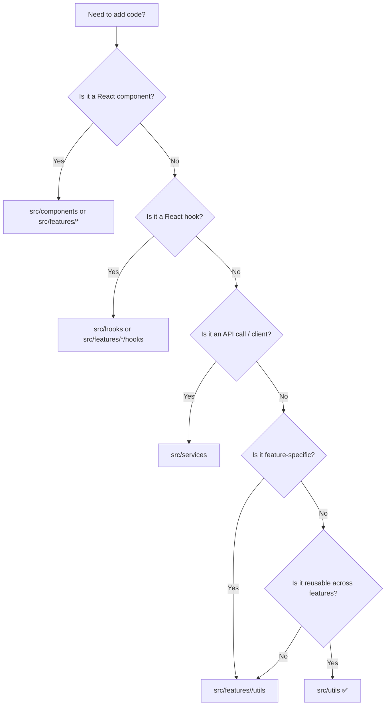

# 🧰 `web/src/utils` — Shared UI Helpers

> The **“boring but powerful”** toolbox for small, reusable helpers used across the KFM web UI 🌾🗺️  
> Keep it **pure**, **typed**, **tested**, and **dependency-light**.

---

## 🧭 What this folder is for

`src/utils/` is for **cross-feature utility code** that:

- ✅ Can be expressed as a **pure transform** (input ➜ output)
- ✅ Is **generic** enough to be used by *multiple* features (map, timeline, dashboard, auth, etc.)
- ✅ Helps keep components clean and readable (less “inline logic”)

If a helper is only used by *one* feature, prefer placing it **inside that feature** (e.g. `src/features/map/utils/`) to avoid a “junk drawer” utils folder.

---

## 🚦Where should new code go?



---

## ✅ What belongs here

Examples of good `utils/` candidates:

- 🔁 **Data transforms**: normalize objects, map/filter helpers, sorting, grouping
- 🕒 **Time helpers**: timeline ranges, formatting, safe parsing
- 🗺️ **Geo helpers** (when used across multiple features):  
  bbox math, coordinate normalization, safe GeoJSON helpers, “lon/lat vs lat/lon” guards
- 🧪 **Guards**: runtime type checks, “assert” helpers, safe narrowing
- ⚙️ **Environment helpers**: safe accessors for `import.meta.env` / `process.env`
- 🧵 **Async helpers**: `sleep`, `retry`, `withTimeout`, `throttle/debounce` (if shared)

---

## 🚫 What should NOT be in `utils/`

- ❌ React components, JSX, UI render logic
- ❌ Feature-specific helpers that don’t generalize
- ❌ API client logic (belongs in `src/services/`)
- ❌ “Hidden data” or datasets (UI should consume data via API responses)
- ❌ Big third‑party “convenience” libraries unless clearly justified (bundle size matters 📦)

---

## 🗂️ Suggested internal layout

> This folder should stay **discoverable**. Group by *domain* (time, geo, format, etc.), not by “random”.

```text
📁 web/
  └─ 📁 src/
     ├─ 📁 features/
     │  ├─ 📁 map/
     │  │  └─ 📁 utils/            # map-only helpers live here ✅
     │  └─ 📁 timeline/
     │     └─ 📁 utils/            # timeline-only helpers live here ✅
     └─ 📁 utils/                  # shared across features ✅
        ├─ 📁 geo/
        ├─ 📁 time/
        ├─ 📁 format/
        ├─ 📁 guards/
        ├─ 📁 perf/
        └─ 📄 index.ts             # optional barrel exports
```

> ✨ Rule of thumb: if you can’t name the subfolder, the util probably isn’t reusable yet.

---

## 🧩 Conventions

### 1) TypeScript-first 🟦
- Prefer **TypeScript** and explicit types.
- Avoid `any` (use generics, unions, or runtime guards).

### 2) Small + single responsibility 🎯
- One file = one “unit of reuse”  
- Prefer a couple of tiny utilities over one mega-helper.

### 3) Named exports ✅
Named exports make refactors safer and help tree-shaking:
```ts
export function clamp(n: number, min: number, max: number) {
  return Math.min(max, Math.max(min, n));
}
```

### 4) No hidden side effects 🧼
- A util should not silently mutate inputs
- If it touches `window`, `document`, or storage:
  - make it explicit in the name (e.g. `readLocalStorage`)
  - handle SSR/build-time safety if needed

---

## 🧪 Testing expectations

Utilities are ideal for fast unit tests.

- Add `*.test.ts` (or the project’s preferred convention)
- Focus on:
  - edge cases
  - timezones/locale pitfalls
  - geo coordinate order pitfalls
  - null/undefined safety

Example test skeleton:
```ts
import { clamp } from "./clamp";

describe("clamp", () => {
  it("bounds values inclusively", () => {
    expect(clamp(5, 0, 10)).toBe(5);
    expect(clamp(-1, 0, 10)).toBe(0);
    expect(clamp(999, 0, 10)).toBe(10);
  });
});
```

---

## 🗺️ Geo-specific gotchas (don’t skip) ⚠️

When adding geospatial utilities:

- 🌐 Be explicit about coordinate order (`[lon, lat]` vs `[lat, lon]`)
- 🧭 Document projections/units (degrees vs meters)
- 📏 Prefer pure math helpers + clear typing over “magic numbers”

Tip: encode intent into types:
```ts
export type LonLat = readonly [lon: number, lat: number];
export type LatLon = readonly [lat: number, lon: number];
```

---

## ✍️ Adding a new util (checklist)

- [ ] Is it used by **2+ features**? If not, put it in `src/features/<feature>/utils/`
- [ ] Clear name + single purpose
- [ ] Fully typed (no `any`)
- [ ] Has tests for edge cases
- [ ] No side effects (or explicitly named and documented)
- [ ] Doesn’t introduce a heavy dependency without a strong reason

---

## 🔗 Related folders

- 🧩 `src/components/` — reusable UI building blocks
- 🗺️ `src/features/map/` — map feature code (including map-only utils)
- 🕒 `src/features/timeline/` — timeline feature code (including timeline-only utils)
- 🌐 `src/services/` — API clients + network calls
- 🗃️ `src/store/` — global state (Redux slices / contexts)

---

## 🧠 Philosophy (why we care)

Good utilities keep the UI layer:
- easier to read 👀
- easier to test 🧪
- easier to evolve without breaking unrelated features 🔧

When in doubt: **keep utils boring**—that’s the superpower 💪