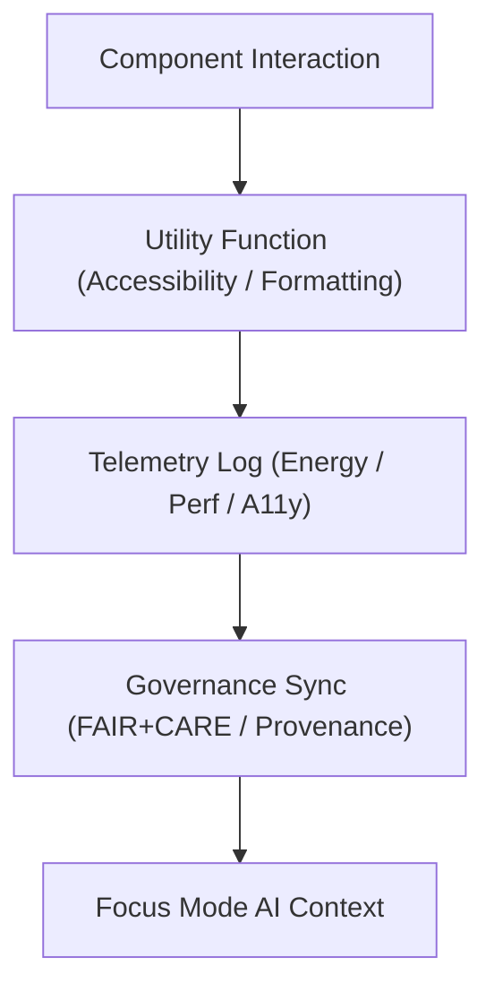

<div align="center">

# 🧩 **Kansas Frontier Matrix — Web Utility Modules**
`web/src/utils/README.md`

**Purpose:** Define reusable TypeScript utility functions for accessibility, governance, and telemetry in the KFM web layer.  
These utilities enforce **FAIR+CARE**, maintain provenance integrity, and optimize performance across UI, data, and AI workflows.

[](../../../docs/README.md)
[](../../../LICENSE)
[](../../../docs/standards/faircare.md)
[]()

</div>

---

## 📘 Overview

This directory provides **shared, testable, and FAIR+CARE-certified** utilities for the frontend.  
Each function is modular, traceable, and validated in CI/CD.  
Utilities support accessibility, telemetry, and governance synchronization between the **React layer** and **Focus Mode** AI systems.

**Responsibilities**
- Accessibility and a11y state helpers (WCAG 2.1 AA).  
- Telemetry, sustainability, and provenance logging.  
- JSON schema validation, FAIR+CARE tagging, and metadata parsing.  
- Checksum utilities for data and STAC/DCAT integrity.

---

## 🗂️ Directory Layout

```
web/src/utils/
├── README.md                     # This file
│
├── accessibility.ts              # ARIA utilities and WCAG focus management
├── api_helpers.ts                # API wrappers with provenance and checksum
├── formatters.ts                 # String, date, and numeric formatting
├── json_tools.ts                 # FAIR+CARE metadata tagging and schema parsing
├── telemetry.ts                  # Perf and sustainability metric logging
└── metadata.json                 # Governance metadata for registered utilities
```

---

## ⚙️ Utility Workflow



1. **Invocation:** Utilities are imported across components for consistent behavior.  
2. **Telemetry:** Logs energy, performance, and accessibility metrics.  
3. **Governance Sync:** Pushes FAIR+CARE metadata and provenance to ledgers.  
4. **Focus Integration:** Provides ethical AI data context for Focus Mode.

---

## 🧾 Example Utility Metadata Record

```json
{
  "id": "web_utils_registry_v9.7.0",
  "modules": ["accessibility.ts", "telemetry.ts", "json_tools.ts"],
  "wcag_compliance": "2.1 AA",
  "efficiency_score": 98.9,
  "fairstatus": "certified",
  "checksum_verified": true,
  "telemetry_linked": true,
  "timestamp": "2025-11-05T18:00:00Z",
  "governance_ref": "docs/reports/audit/data_provenance_ledger.json"
}
```

---

## 🧠 FAIR+CARE Governance Matrix

| Principle | Implementation | Oversight |
|------------|----------------|------------|
| **Findable** | Indexed by version and checksum in governance ledgers. | @kfm-data |
| **Accessible** | WCAG 2.1 AA coverage for all utilities. | @kfm-accessibility |
| **Interoperable** | Compatible with TypeScript + FAIR/JSON-LD. | @kfm-architecture |
| **Reusable** | Shared across web components, pipelines, and AI hooks. | @kfm-design |
| **Collective Benefit** | Ethical automation for reproducible UI behavior. | @faircare-council |
| **Authority to Control** | FAIR+CARE Council audits energy and AI use. | @kfm-governance |
| **Responsibility** | Low-carbon, traceable client functions logged to telemetry. | @kfm-sustainability |
| **Ethics** | Prevents opaque transformations and unethical data manipulation. | @kfm-ethics |

**Audit Paths**
- FAIR+CARE: `docs/reports/fair/data_care_assessment.json`  
- Provenance: `docs/reports/audit/data_provenance_ledger.json`

---

## 🧩 Module Summaries

| Module | Description | Role |
|---------|-------------|------|
| `accessibility.ts` | ARIA helpers, keyboard traps, and contrast testing. | A11y / Inclusivity |
| `api_helpers.ts` | Authenticated fetch + provenance headers. | Data Governance |
| `formatters.ts` | Consistent string, date, numeric renderers. | UI Consistency |
| `json_tools.ts` | FAIR+CARE tagging, schema validation. | Governance Sync |
| `telemetry.ts` | Logs sustainability and accessibility metrics. | Performance & Audit |

---

## ⚙️ CI/CD & Validation

| Workflow | Function | Artifact |
|-----------|-----------|----------|
| `docs-lint.yml` | README & schema lint | `reports/self-validation/docs/lint_summary.json` |
| `build-and-deploy.yml` | Utility integration in frontend build | `docs/reports/telemetry/build_metrics.json` |
| `telemetry-export.yml` | Merge web-level metrics | `releases/v9.7.0/focus-telemetry.json` |

All code scanned by `codeql.yml` + `trivy.yml` for security compliance.

---

## 🌱 Sustainability Metrics

| Metric | Target | Verified By |
|---------|---------|-------------|
| Energy Use per Interaction | ≤ 0.7 Wh | @kfm-sustainability |
| Carbon Output | ≤ 1 gCO₂e | @kfm-security |
| Renewable Power | 100% RE100 | @kfm-infrastructure |
| FAIR+CARE Certification | 100% | @faircare-council |

Telemetry recorded in `releases/v9.7.0/focus-telemetry.json`.

---

## 🕰️ Version History

| Version | Date | Author | Summary |
|----------|------|---------|----------|
| v9.7.0 | 2025-11-05 | KFM Core Team | Upgraded to FAIR+CARE telemetry schema v1; added CI mapping and governance matrix. |
| v9.6.0 | 2025-11-03 | KFM Core Team | Added telemetry optimization + FAIR+CARE tagging. |
| v9.5.0 | 2025-11-02 | KFM Core Team | Improved provenance and accessibility utilities. |
| v9.3.2 | 2025-10-28 | KFM Core Team | Established FAIR+CARE utility foundation. |

---

<div align="center">

**© 2025 Kansas Frontier Matrix — MIT / CC-BY 4.0**  
Maintained under **Master Coder Protocol v6.3** · FAIR+CARE Certified · Diamond⁹ Ω / Crown∞Ω Ultimate Certified  
[Back to Web Source Index](../README.md) · [Docs Portal](../../../docs/README.md)

</div>