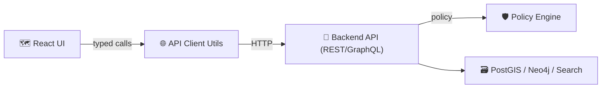

# 🧰 `web/src/utils`


> **Utilities = small, sharp tools** 🔧  
> This folder keeps UI components clean by centralizing reusable logic: API calls, data transforms (GeoJSON → map layers), performance helpers (debounce), and safe persistence (preferences).

---

## 🧭 Why this folder exists

KFM’s web UI is **map-centric** and **data-heavy**. To keep components readable and the system auditable, we centralize repeatable logic here:

- 🌐 **API client wrappers** (keep data access consistent, typed, and policy-aligned)
- 🗺️ **Geo + map transforms** (GeoJSON → MapLibre/Cesium-ready objects)
- ⚡ **Performance helpers** (debounce/throttle, stable IDs, memo helpers)
- 💾 **Preference persistence** (local storage wrappers for *non-sensitive* UI state)
- 🧱 **Formatting & guards** (string/date formatting, runtime checks, safe parsing)

---

## ✅ What belongs in `utils`

Put it here if it’s…

- **Pure + reusable** (same inputs → same outputs) 🧪
- **Framework-agnostic** (shouldn’t depend on React rendering) 🧼
- **Shared across multiple features** (map, timeline, story panel, search) 🔁
- **A boundary helper** (API client, schema validation, storage wrapper) 🚧

---

## 🚫 What does *not* belong in `utils`

Keep these elsewhere:

- 🧩 **React components** → `web/src/components/`
- 🪝 **React hooks** → `web/src/hooks/`
- 🗃️ **Global state slices / reducers** → `web/src/store/` (or equivalent)
- 🧠 **Backend business logic** → belongs in API/services (not UI utilities)
- 🔐 **Secrets / tokens / sensitive data handling** (don’t persist in browser)

---

## 🧱 Guiding principles

### 1) Preserve the “Truth Path” 🧾🗺️
The UI must **never bypass the backend**. All data access should go through the API client utilities—this keeps governance and audit rules enforceable in one place.



### 2) Keep side effects isolated 🧯
- Effects are okay, but **quarantine them**:
  - `utils/api/*` ✅
  - `utils/storage/*` ✅
  - Random side effects in formatting functions ❌

### 3) Prefer *typed* boundaries ✅
- Parse/validate at edges (API responses, URL params, localStorage reads).
- Inside the app, keep types trustworthy.

### 4) Make testing easy 🧪
- Prefer functions over classes.
- Avoid hidden globals.
- Accept dependencies as parameters when possible (e.g., `now`, `fetchImpl`, `storageImpl`).

---

## 📂 Suggested layout (adapt to match the repo)

> This is a **recommended structure**—update as the folder evolves.

```text
📁 web/src/utils/
├─ 📁 api/
│  ├─ 📄 client.ts          # fetch wrapper + base URL + headers
│  ├─ 📄 errors.ts          # ApiError normalization
│  └─ 📄 index.ts
├─ 📁 geo/
│  ├─ 📄 geojson.ts         # safe GeoJSON helpers
│  ├─ 📄 bbox.ts            # bbox math / fit bounds helpers
│  ├─ 📄 maplibre.ts        # layer/source builders
│  └─ 📄 cesium.ts          # (optional) Cesium entity helpers
├─ 📁 perf/
│  ├─ 📄 debounce.ts
│  ├─ 📄 throttle.ts
│  └─ 📄 memo.ts
├─ 📁 storage/
│  ├─ 📄 storage.ts         # JSON-safe get/set wrapper
│  └─ 📄 keys.ts            # key registry + prefixes
├─ 📁 format/
│  ├─ 📄 dates.ts
│  ├─ 📄 numbers.ts
│  └─ 📄 strings.ts
└─ 📄 index.ts              # barrel exports (optional)
```

---

## 🌐 API utilities

### Goals
- **One** place to manage:
  - base URL resolution
  - auth headers / session tokens (if applicable)
  - JSON parsing + error normalization
  - request tracing IDs (optional)
  - retry/timeout policy (optional)

### Example pattern: `apiJson<T>()`

```ts
// utils/api/client.ts
export type ApiError = {
  status: number;
  message: string;
  details?: unknown;
};

function isJsonResponse(res: Response) {
  return (res.headers.get("content-type") ?? "").includes("application/json");
}

async function toApiError(res: Response): Promise<ApiError> {
  let details: unknown = undefined;

  if (isJsonResponse(res)) {
    try {
      details = await res.json();
    } catch {
      // ignore parse failure; fall back to status text
    }
  }

  return {
    status: res.status,
    message: res.statusText || "Request failed",
    details,
  };
}

export async function apiJson<T>(
  path: string,
  init: RequestInit = {},
  opts: { baseUrl?: string } = {}
): Promise<T> {
  const baseUrl = opts.baseUrl ?? import.meta.env.VITE_API_BASE_URL ?? "";
  const url = `${baseUrl}${path}`;

  const res = await fetch(url, {
    ...init,
    headers: {
      "accept": "application/json",
      ...(init.headers ?? {}),
    },
  });

  if (!res.ok) {
    throw await toApiError(res);
  }

  return (await res.json()) as T;
}
```

**Rule of thumb:** components should call *named endpoint helpers* (e.g., `getDataset(id)`), not `fetch()` directly.

---

## 🗺️ Geo + map utilities

### Typical responsibilities
- Convert **GeoJSON** into:
  - MapLibre **sources + layers**
  - styling presets (line/polygon/point)
  - feature-id helpers (stable IDs for hover/select)
- Shared spatial helpers:
  - bbox calculation
  - centroid
  - geometry type guards

### Example: GeoJSON → MapLibre source/layer builder (shape)

```ts
// utils/geo/maplibre.ts (shape example)
import type { FeatureCollection } from "geojson";

export function makeGeoJsonSource(id: string, data: FeatureCollection) {
  return {
    id,
    type: "geojson" as const,
    data,
  };
}

export function makeLineLayer(id: string, sourceId: string) {
  return {
    id,
    type: "line" as const,
    source: sourceId,
    paint: {
      // keep style tokens centralized; don’t scatter them across components
      "line-width": 2,
    },
  };
}
```

---

## ⚡ Performance helpers

### `debounce()` (common for search + sliders)
Use debouncing for:
- search typing
- map hover/inspect events (if needed)
- expensive recomputations tied to rapid input

```ts
// utils/perf/debounce.ts
export function debounce<TArgs extends unknown[]>(
  fn: (...args: TArgs) => void,
  waitMs = 200
) {
  let t: number | undefined;

  return (...args: TArgs) => {
    if (t !== undefined) window.clearTimeout(t);
    t = window.setTimeout(() => fn(...args), waitMs);
  };
}
```

---

## 💾 Preferences & local storage

### What we store ✅
Local storage is for **non-sensitive**, user-local preferences, like:
- last map style / basemap
- timeline position
- layer toggles
- UI layout preferences

### What we never store ❌
- tokens, secrets, personal data, or anything that would violate governance expectations

### Example wrapper: JSON-safe `get/set`

```ts
// utils/storage/storage.ts
const PREFIX = "kfm:";

export const storage = {
  get<T>(key: string): T | null {
    try {
      const raw = localStorage.getItem(PREFIX + key);
      if (raw == null) return null;
      return JSON.parse(raw) as T;
    } catch {
      return null;
    }
  },

  set<T>(key: string, value: T): void {
    localStorage.setItem(PREFIX + key, JSON.stringify(value));
  },

  remove(key: string): void {
    localStorage.removeItem(PREFIX + key);
  },
};
```

### Recommended key registry 🗝️
Keep keys in one file to avoid collisions and typos.

```ts
// utils/storage/keys.ts
export const StorageKeys = {
  BasemapStyle: "pref:basemapStyle",
  TimelineYear: "pref:timelineYear",
  ActiveLayers: "pref:activeLayers",
} as const;
```

---

## 🧾 Citations helpers (when rendering “Focus Mode” content)

KFM’s UI supports citation markers (e.g., `[1]`, `[2]`) and should preserve them through formatting/render steps.

If you need to manipulate AI output:
- do **not** strip brackets
- do **not** renumber unless you also update the mapping
- prefer a small parser utility that extracts citations for UI tooltips/footnotes

```ts
// utils/format/citations.ts (tiny helper example)
export function extractCitationNumbers(text: string): number[] {
  const matches = text.matchAll(/\[(\d+)\]/g);
  const out: number[] = [];
  for (const m of matches) out.push(Number(m[1]));
  return Array.from(new Set(out)).sort((a, b) => a - b);
}
```

---

## 🧪 Testing utilities

### Recommendations
- ✅ Unit test pure utils heavily (geo math, parsers, formatters)
- ✅ Mock `fetch` for API client tests (or use MSW)
- ✅ Mock `localStorage` for storage tests
- ✅ Add regression tests for any bug-fix utilities

---

## ✅ Checklist when adding a new util

- [ ] Is this used in **2+ places** (or clearly will be soon)?
- [ ] Is it **pure** (or are side effects isolated to `api/` or `storage/`)?
- [ ] Are inputs/outputs **typed** (no `any`)?
- [ ] If it touches external data, do we **validate/guard**?
- [ ] Did we add/adjust **tests**?
- [ ] Did we update this README (if it introduces a new category)?

---

## 🔗 Related docs (repo-relative)

- 📘 `../../../docs/architecture/system_overview.md` (architecture + “truth path”)
- 🌐 `../../../src/server/api/README.md` (API contracts + endpoints)
- 🤖 `../../../docs/architecture/ai/OLLAMA_INTEGRATION.md` (citation requirements & format)