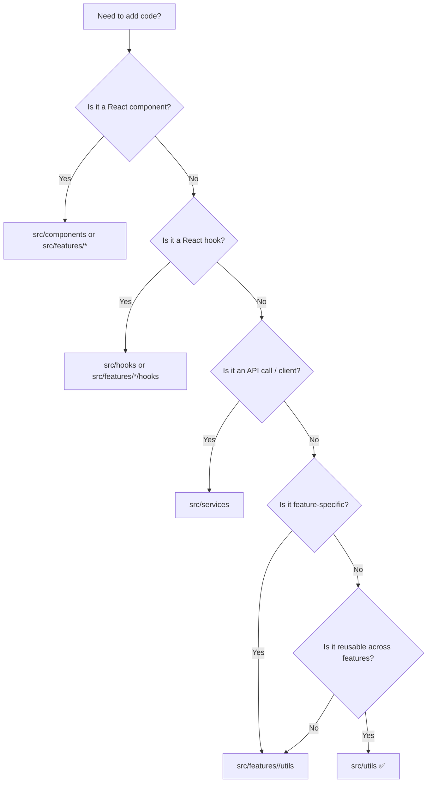

# 🧰 `web/src/utils` — Shared UI Helpers

   

> The **“boring but powerful”** toolbox for small, reusable helpers used across the KFM web UI 🌾🗺️  
> Keep it **pure**, **typed**, **tested**, **dependency-light**, and **audit-friendly**.

---

<details>
<summary><strong>📚 Table of Contents</strong></summary>

- [🧭 What this folder is for](#-what-this-folder-is-for)
- [🧱 KFM guardrails this folder must uphold](#-kfm-guardrails-this-folder-must-uphold)
- [🚦 Where should new code go?](#-where-should-new-code-go)
- [✅ What belongs here](#-what-belongs-here)
- [🚫 What should NOT be in <code>utils/</code>](#-what-should-not-be-in-utils)
- [🗂️ Suggested internal layout](#️-suggested-internal-layout)
- [🧩 Conventions](#-conventions)
- [🧪 Testing expectations](#-testing-expectations)
- [🗺️ Geo-specific gotchas](#️-geo-specific-gotchas)
- [📊 Stats & modeling gotchas](#-stats--modeling-gotchas)
- [⚡ Performance & scale gotchas](#-performance--scale-gotchas)
- [✍️ Adding a new util (checklist)](#️-adding-a-new-util-checklist)
- [🔗 Related folders](#-related-folders)
- [📚 Project reference shelf](#-project-reference-shelf)

</details>

---

## 🧭 What this folder is for

`src/utils/` is for **cross-feature utility code** that:

- ✅ Can be expressed as a **pure transform** (input ➜ output)
- ✅ Is **generic** enough to be used by *multiple* features (map, timeline, dashboard, auth, story/focus, etc.)
- ✅ Helps keep components clean and readable (less “inline logic”)
- ✅ Supports **traceability** (deterministic outputs, stable IDs, predictable formatting)

> 🧠 Rule of thumb: if a helper is only used by *one* feature, prefer placing it **inside that feature** (e.g. `src/features/map/utils/`) to avoid a “junk drawer” utils folder.

---

## 🧱 KFM guardrails this folder must uphold

KFM is **provenance-first** and **governed** end-to-end. Even UI helpers must not accidentally violate system contracts.

### 🚧 Non‑negotiables (frontend implications)

- **API boundary is sacred** 🌐  
  The UI must never “reach around” governed APIs (no direct graph/DB access, no hidden data fetch logic).

- **No data leakage** 🔒  
  Utilities that affect *map zooming, filtering, aggregation, or export* must preserve redaction rules and classification constraints. If a feature would leak sensitive detail, the util should make it **hard to do wrong** (e.g., explicit `redactionPolicy` inputs).

- **Evidence-first display** 🧾  
  If a helper formats or composes narrative text, tooltips, “insight cards,” etc., it must support **citation/provenance attachment** (even if the UI chooses not to render it in a given view).

- **Determinism by default** 🎯  
  A util that changes behavior “based on the current time” or randomness is a red flag. Prefer:
  - pass `now` as an argument
  - pass `rng` or `seed` explicitly
  - keep outputs stable across runs for auditing

### 🔁 Canonical pipeline reminder

```mermaid
flowchart LR
  A[ETL] --> B[Catalogs<br/>(STAC/DCAT/PROV)]
  B --> C[Graph]
  C --> D[API]
  D --> E[UI]
  E --> F[Story Nodes]
  F --> G[Focus Mode]
```

> 🗺️ **Utilities are UI infrastructure**. They should make it *easier* for feature code to stay inside the guardrails above.

---

## 🚦 Where should new code go?



> ✅ If it’s shared across features **and** can remain **pure + deterministic**, it’s a strong `src/utils` candidate.

---

## ✅ What belongs here

Examples of good `utils/` candidates:

- 🔁 **Data transforms**: normalize objects, map/filter helpers, stable sorting/grouping, dedupe, indexing
- 🕒 **Time helpers**: safe parsing, timeline ranges, timezone-safe formatting, interval math
- 🗺️ **Geo helpers** (when shared): bbox math, coordinate normalization, GeoJSON guards, CRS/unit labeling
- 🧪 **Guards**: runtime type checks, safe narrowing, `assertNever`, `invariant`
- ⚙️ **Environment helpers**: safe accessors for `import.meta.env` / `process.env`, SSR-safe checks
- 🧵 **Async helpers**: `sleep`, `retry`, `withTimeout`, `throttle/debounce` (only if used across features)
- 🧾 **Provenance helpers**: citation formatting, evidence reference helpers, “must-have provenance” assertions
- 📊 **Stats helpers** (UI-focused): summary stats, quantiles, histogram binning, safe rounding/formatting
- 🎛️ **Formatting**: bytes, distance, area, percentages, uncertainty/confidence badges (format-only)

---

## 🚫 What should NOT be in `utils/`

- ❌ React components, JSX, UI render logic
- ❌ Feature-specific helpers that don’t generalize
- ❌ API client logic (belongs in `src/services/`)
- ❌ “Hidden data” or datasets (UI should consume data via governed APIs + catalogs)
- ❌ Big third‑party “convenience” libraries unless clearly justified (bundle size matters 📦)
- ❌ Anything that silently bypasses governance (e.g., “just fetch the raw graph endpoint”)

---

## 🗂️ Suggested internal layout

> Keep this folder **discoverable**. Group by *domain* (time, geo, provenance, etc.), not by “random”.

```text
📁 web/
  └─ 📁 src/
     ├─ 📁 features/
     │  ├─ 📁 map/
     │  │  └─ 📁 utils/                 # map-only helpers live here ✅
     │  ├─ 📁 timeline/
     │  │  └─ 📁 utils/                 # timeline-only helpers live here ✅
     │  └─ 📁 story/
     │     └─ 📁 utils/                 # story/focus-only helpers live here ✅
     └─ 📁 utils/                       # shared across features ✅
        ├─ 📁 geo/                      # LonLat, bbox, GeoJSON safety, units
        ├─ 📁 time/                     # parsing, ranges, display formatting
        ├─ 📁 format/                   # bytes, numbers, labels, display strings
        ├─ 📁 guards/                   # runtime checks + narrowing
        ├─ 📁 perf/                     # memoize, chunking, throttle/debounce
        ├─ 📁 stats/                    # UI-safe summaries, bins, quantiles
        ├─ 📁 provenance/               # citations, evidence refs, audit helpers
        ├─ 📁 security/                 # safe parsing, escaping, URL helpers
        ├─ 📁 webgl/                    # 3D/map math helpers (if shared)
        ├─ 📄 index.ts                  # optional barrel exports
        └─ 📄 README.md                 # (this file) 📘
```

> ✨ If you can’t name the subfolder, the util probably isn’t reusable yet.

---

## 🧩 Conventions

### 1) TypeScript-first 🟦
- Prefer **TypeScript** and explicit types.
- Avoid `any` (use generics, unions, or runtime guards).
- Encode intent in types whenever possible:
  - `Meters` vs `Degrees`
  - `LonLat` vs `LatLon`
  - `UtcIsoString` vs “string”

### 2) Deterministic by default 🎯
- A util should be a **pure function** unless the name makes side effects explicit.
- Avoid:
  - `Date.now()` inside transforms (pass `now`)
  - `Math.random()` inside transforms (pass `rng` or `seed`)
  - relying on ambient locale/timezone without making it explicit

### 3) Small + single responsibility 🎯
- One file = one “unit of reuse”
- Prefer a couple of tiny utilities over one mega-helper.

### 4) Named exports ✅
Named exports make refactors safer and help tree-shaking:

```ts
export function clamp(n: number, min: number, max: number) {
  return Math.min(max, Math.max(min, n));
}
```

### 5) No hidden side effects 🧼
A util should not silently mutate inputs.

If it touches `window`, `document`, storage, or network:
- make it explicit in the name (e.g. `readLocalStorageSafely`)
- handle SSR/build-time safety (`typeof window !== "undefined"`)

### 6) Stable identifiers > derived labels 🧷
- Prefer backend-provided IDs.
- Avoid UI keys from array indexes.
- If you need a deterministic key, build it from stable fields (and document it).

---

## 🧪 Testing expectations

Utilities are ideal for fast unit tests.

- Add `*.test.ts` (or the project’s preferred convention)
- Focus on:
  - edge cases
  - timezones/locale pitfalls
  - geo coordinate order pitfalls
  - null/undefined safety
  - determinism (same input ➜ same output)

Example test skeleton:

```ts
import { clamp } from "./clamp";

describe("clamp", () => {
  it("bounds values inclusively", () => {
    expect(clamp(5, 0, 10)).toBe(5);
    expect(clamp(-1, 0, 10)).toBe(0);
    expect(clamp(999, 0, 10)).toBe(10);
  });
});
```

💡 Bonus patterns (when useful):
- **Property-based tests** (great for geo + parsing)
- **Fuzz tests** for “unsafe inputs” (`null`, weird strings, NaN, Infinity)
- **Golden tests** for formatting utilities (stable snapshots)

---

## 🗺️ Geo-specific gotchas (don’t skip) ⚠️

When adding geospatial utilities:

- 🌐 Be explicit about coordinate order (`[lon, lat]` vs `[lat, lon]`)
- 🧭 Document projections/units (degrees vs meters, CRS assumptions)
- 🧱 Guard invariants:
  - latitude ∈ `[-90, 90]`
  - longitude ∈ `[-180, 180]` (or documented wrapping policy)
- 🧨 Handle tricky cases:
  - antimeridian / dateline crossing
  - bbox intersection near wrapping longitudes
  - floating point drift (avoid equality checks on coords)

Tip: encode intent into types:

```ts
export type LonLat = readonly [lon: number, lat: number];
export type LatLon = readonly [lat: number, lon: number];

export type BBox = readonly [
  west: number,
  south: number,
  east: number,
  north: number
];
```

---

## 📊 Stats & modeling gotchas (UI edition) ⚠️

KFM surfaces analytics and model outputs; UI helpers must not accidentally mislead.

- 🧊 **Missing values are information**  
  Don’t silently coerce `null/undefined` to `0` unless explicitly intended.
- 📉 **Be honest about uncertainty**  
  If you format confidence intervals, error bars, probabilities, etc., prefer helpers that return **structured data**, not just strings.
- 🧮 **Rounding can change meaning**  
  Provide:
  - raw numeric value (for computation)
  - display value (for humans)
  - units + method (optional)
- 🧾 **Evidence linkage**  
  If a chart tooltip says “trend,” it should be possible to attach the evidence reference (dataset/run/model metadata) next to that output.

---

## ⚡ Performance & scale gotchas

KFM deals with **big spatial datasets**, **timelines**, and sometimes **raster-ish** things. Helpers can silently become hotspots.

- 📦 Avoid heavy dependencies; prefer tiny utilities or standard library
- 🧵 Avoid O(n²) operations in transforms used on large arrays (maps, tables)
- 🧠 Prefer streaming-friendly helpers:
  - `chunk(array, size)`
  - `groupBy` that doesn’t double-scan
- 🗜️ Avoid copies when possible (especially typed arrays)
- 🧰 If adding memoization:
  - document cache key assumptions
  - ensure it can’t leak sensitive data across contexts
  - prefer “memoize last call” patterns for UI-derived transforms

---

## ✍️ Adding a new util (checklist)

- [ ] Used by **2+ features**? If not, put it in `src/features/<feature>/utils/`
- [ ] Clear name + single purpose
- [ ] Fully typed (no `any`)
- [ ] Deterministic / pure (or explicitly named side effect)
- [ ] Has tests for edge cases
- [ ] Does **not** violate KFM guardrails (no leakage, no bypassing APIs)
- [ ] Doesn’t introduce a heavy dependency without strong reason
- [ ] If it formats or composes narrative/insights: supports **provenance attachment**

---

## 🔗 Related folders

- 🧩 `src/components/` — reusable UI building blocks
- 🪝 `src/hooks/` — reusable hooks
- 🗺️ `src/features/map/` — map feature code (including map-only utils)
- 🕒 `src/features/timeline/` — timeline feature code (including timeline-only utils)
- 🧾 `src/features/story/` — story/focus experiences (including story-only utils)
- 🌐 `src/services/` — API clients + network calls
- 🗃️ `src/store/` — global state (Redux slices / contexts)

---

## 📚 Project reference shelf

> 📖 This folder’s standards are shaped by the project’s core docs + the internal reference library (architecture, geospatial, modeling, performance, and responsible computing).  
> Keep this list updated as the library grows.

### 🧱 Governance / architecture / provenance (core)
- Kansas Frontier Matrix (KFM) — Comprehensive Technical Documentation  [oai_citation:0‡Kansas Frontier Matrix (KFM) – Comprehensive Technical Documentation.pdf](file-service://file-AkqwUuYPp5zePf7pv5SMxi)  [oai_citation:1‡Kansas Frontier Matrix (KFM) – Comprehensive Technical Documentation.pdf](file-service://file-AkqwUuYPp5zePf7pv5SMxi)
- MARKDOWN_GUIDE_v13 (repo contracts, pipeline ordering, UI leakage rules)  [oai_citation:2‡MARKDOWN_GUIDE_v13.md.gdoc](file-service://file-UYVruFXfueR8veHMUKeugU)  [oai_citation:3‡MARKDOWN_GUIDE_v13.md.gdoc](file-service://file-UYVruFXfueR8veHMUKeugU)
- Scientific Method / Research / Master Coder Protocol (reproducibility & documentation discipline)  [oai_citation:4‡Scientific Method _ Research _ Master Coder Protocol Documentation.pdf](file-service://file-HTpax4QbDgguDwxwwyiS32)
- Comprehensive Markdown Guide (documentation + provenance patterns)  [oai_citation:5‡Comprehensive Markdown Guide_ Syntax, Extensions, and Best Practices.docx](file-service://file-J6rFRcp4ExCCeCdTevQjxz)
- Introduction to Digital Humanism (human-centered, accountable systems)  [oai_citation:6‡Introduction to Digital Humanism.pdf](file-service://file-HC311tLjkcn1yRbyTBLJQQ)

### 🗺️ Geo / mapping / cartography / 3D
- Making Maps: A Visual Guide to Map Design for GIS
- Mobile Mapping: Space, Cartography and the Digital
- Python Geospatial Analysis Cookbook  [oai_citation:7‡python-geospatial-analysis-cookbook.pdf](file-service://file-HT14njz1MhrTZCE7Pwm5Cu)
- Cloud-Based Remote Sensing with Google Earth Engine — Fundamentals and Applications
- Archaeological 3D GIS  [oai_citation:8‡Archaeological 3D GIS_26_01_12_17_53_09.pdf](file-service://file-6DRx5ELzDPBso9Y5Qcbqm2)
- WebGL Programming Guide — Interactive 3D Graphics Programming with WebGL
- Spectral Geometry of Graphs

### 📊 Data science / stats / modeling
- Scientific Modeling and Simulation (NASA-grade thinking, verification/validation mindset)
- Regression Analysis with Python
- Regression analysis using Python (slides)
- Understanding Statistics & Experimental Design
- Graphical Data Analysis with R
- Think Bayes: Bayesian Statistics in Python
- Deep Learning for Coders with fastai and PyTorch (UI implications: leakage awareness, interpretation caution)

### 🗄️ Data management / databases / scaling
- Database Performance at Scale  [oai_citation:9‡Database Performance at Scale.pdf](file-service://file-36z8qyiVJRtrSs6QG7Epen)
- PostgreSQL Notes for Professionals
- Scalable Data Management for Future Hardware
- Data Spaces (microservices/adapter boundaries)

### 🧠 Systems / security / engineering depth
- Flexible Software Design (stable identifiers, long-term change)  [oai_citation:10‡F-H programming Books.pdf](file-service://file-QofzooQDG9grJwh9nFN9SY)
- Ethical Hacking and Countermeasures: Secure Network Infrastructures
- Gray Hat Python
- Concurrent Real-Time and Distributed Programming in Java (threads, time, correctness)
- Compressed Image File Formats (JPEG/PNG/GIF/BMP) — practical constraints for UI media handling
- Generalized Topology Optimization for Structural Design
- Principles of Biological Autonomy
- On the path to AI Law’s prophecies… (responsible AI framing & conceptual caution)

### 📦 Language reference collections (internal shelf)
- A programming Books.pdf
- B-C programming Books.pdf  [oai_citation:11‡B-C programming Books.pdf](file-service://file-7V9zHZSJakZZrJAw9ASCMJ)
- D-E programming Books.pdf
- F-H programming Books.pdf  [oai_citation:12‡F-H programming Books.pdf](file-service://file-QofzooQDG9grJwh9nFN9SY)
- I-L programming Books.pdf
- M-N programming Books.pdf
- O-R programming Books.pdf  [oai_citation:13‡O-R programming Books.pdf](file-service://file-M6zCNBGmJbot7A2aaUUy9M)
- S-T programming Books.pdf  [oai_citation:14‡S-T programming Books.pdf](file-service://file-NT32tqqzGW9RvfcNZmMH1K)
- U-X programming Books.pdf

---

## 🧠 Philosophy (why we care)

Good utilities keep the UI layer:
- easier to read 👀
- easier to test 🧪
- easier to evolve without breaking unrelated features 🔧
- easier to **audit** (deterministic transforms + provenance-friendly outputs) 🧾

When in doubt: **keep utils boring**—that’s the superpower 💪
