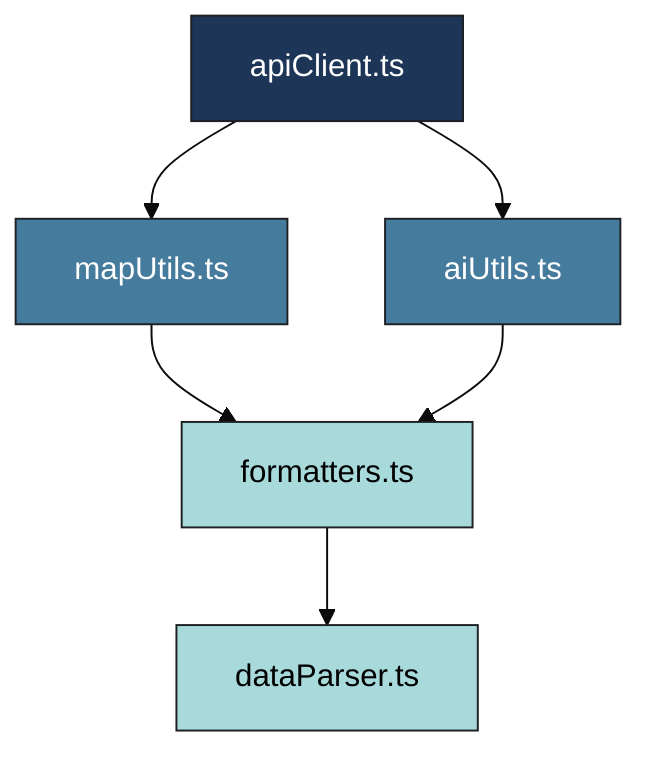

<div align="center">

# 🧮 **Kansas Frontier Matrix — Web Frontend Utilities (v2.3.0 · Tier-Ω+∞ Certified)**  
`📁 web/src/utils/`

**Helper Functions · API Clients · Data Parsers · Map & Timeline Utilities**

[](../../../../.github/workflows/site.yml)
[](../../../../.github/workflows/codeql.yml)
[](../../../../docs/)
[](../../../../LICENSE)

</div>

---

## ⚡ Quick Reference
| Task | Command |
|:--|:--|
| Lint | `pnpm run lint` |
| Unit tests | `pnpm run test` |
| Coverage | `pnpm run test:coverage` |
| Type check | `pnpm run typecheck` |
| Build (app) | `pnpm --filter web run build` |

---

## 🧭 Operational Context
| Environment | Purpose | Validation | Notes |
|:--|:--|:--|:--|
| **Local** | Unit testing, profiling | Jest + ESLint | `pnpm run test` |
| **CI / GitHub Actions** | Lint, build, coverage, CodeQL | site.yml · codeql.yml | Artifacts auto-published |
| **Prod / GH Pages** | Bundled into `/web/` build | SBOM + SLSA | Versioned under main app |

---

## 🧭 Overview
`web/src/utils/` provides **pure, reusable TypeScript modules** that power deterministic data handling for the Kansas Frontier Matrix frontend.  
They ensure clean API communication, timeline math, STAC parsing, and consistent data formatting.

Under **MCP-DL v6.3.2**, this folder enforces:
- Deterministic, idempotent functions  
- Complete TSDoc documentation  
- Strict `noImplicitAny` typing  
- Provenance tracked in `.prov.json`  
- Reproducible CI builds  

> *“Every helper tells a story — reproducible, verifiable, and open.”*

---

## 🧱 Directory Structure
```text
web/src/utils/
├── apiClient.ts          # REST/GraphQL client (retry, backoff, logging)
├── mapUtils.ts           # MapLibre helpers (layer management, transforms)
├── timelineUtils.ts      # Temporal math and scaling functions
├── aiUtils.ts            # AI bridge (summaries, citations)
├── formatters.ts         # Date/number/text localization
├── dataParser.ts         # STAC/API payload normalization
├── hooks.ts              # useFetch, useDebounce, useResizeObserver
├── constants.ts          # Shared constants, URLs, version data
└── __tests__/            # Unit tests for each module
```

---

## ⚙️ Build & Deployment Workflow
```bash
pnpm run lint && pnpm run test:coverage
make stac-validate
pnpm run build
pnpm run release
```
Artifacts: `.prov.json`, `sbom.cdx.json`, coverage retained 365 days.  
Tags: `web-utils-vMAJOR.MINOR.PATCH` → DOI minted automatically.  

---

## ⚙️ Dependency Graph

▣ #1D3557 Core ▣ #457B9D Logic ▣ #A8DADC Support  

---

## 📦 Public API Surface
Utilities safe for use across `/web`:
- `apiClient`: `get`, `post`, `graphql<T>()`
- `mapUtils`: `addLayer`, `removeLayer`, `ensureSource`
- `timelineUtils`: `timeToPixel`, `pixelToTime`, `clampWindow`
- `dataParser`: `parseEventData`, `parseLayerConfig`
- `formatters`: `formatDateHuman`, `formatNumberCompact`

> Breaking changes require **minor/major bump** & CHANGELOG entry.

---

## 🧯 Error Handling & Retries
- **Network:** automatic retry (x2 exponential backoff) for 5xx.  
- **Timeouts:** default 8s; cancellable with `AbortController`.  
- **Parsing:** `safeParseJSON()` throws `ParseError` with `.path`.  
- **Logging:** sanitized console output; no PII.  

---

## ⏱ Performance Budgets
| Function | Budget | Test |
|:--|:--|:--|
| `timeToPixel()` | < 0.02 ms / call | `perf.timelineUtils.spec.ts` |
| `safeParseJSON()` | < 0.15 ms / 2 KB | `perf.parser.spec.ts` |
| `addLayer()` | < 30 ms | `mapUtils.spec.ts` |

---

## 🧪 Testing & Coverage Matrix
| Module | Coverage | Status |
|:--|:--:|:--:|
| apiClient.ts | ≥ 90 % | ✅ |
| mapUtils.ts | ≥ 85 % | ✅ |
| timelineUtils.ts | ≥ 85 % | ⚙️ |
| aiUtils.ts | ≥ 80 % | ⚙️ |
| formatters.ts | ≥ 95 % | ✅ |
| dataParser.ts | ≥ 90 % | ✅ |
| hooks.ts | ≥ 80 % | ⚙️ |

---

## 🤖 AI Utilities Integration
- **Endpoints:** `POST /ask`, `GET /entity/{id}`  
- **Features:** streaming, deterministic caching, Neo4j citation mapping  
- **Response Type:**
```ts
type AIResponse = {
  answer: string;
  citations: { id: string; label: string; source: string }[];
};
```

---

## 🧩 Example Usage
```ts
import { getEvents } from "./apiClient";
import { parseEventData } from "./dataParser";
import { formatDateHuman } from "./formatters";

export async function loadTimeline(start: string, end: string) {
  const data = await getEvents(start, end);
  const events = parseEventData(data);
  console.info(`Loaded ${events.length} events from ${formatDateHuman(start)}–${formatDateHuman(end)}.`);
  return events;
}
```

---

## 🔒 Security & Secrets
- No external secrets in utils.  
- Environment vars via `import.meta.env`.  
- CI scans: CodeQL + Gitleaks (`security-scan.yml`).  
- CSP/CORS policy: enforced in higher layer, not modifiable here.  
- Redacted logs.  

---

## 🧾 Provenance & Integrity
| Artifact | Description |
|:--|:--|
| **Inputs** | STAC catalogs, API payloads |
| **Outputs** | Typed data models (Event, Entity, Layer) |
| **Checks** | Jest + CodeQL + SHA-256 checksum |
| **Retention** | Git-tracked commits, 365-day artifact retention |

---

## 📡 Observability Instrumentation
```ts
import { trackMetric } from "../observability";

export function safeParseJSON(input: string) {
  const t0 = performance.now();
  const result = JSON.parse(input);
  trackMetric("utils_safeParseJSON_ms", performance.now() - t0);
  return result;
}

export async function timedAIRequest<T>(call: () => Promise<T>) {
  const t0 = performance.now();
  const res = await call();
  trackMetric("ai_request_latency_ms", performance.now() - t0);
  return res;
}
```
**Metrics:** `utils_safeParseJSON_ms`, `ai_request_latency_ms`, `stac_parse_success_rate`.

---

## 📊 Baseline Metrics Snapshot (v2.3.0)
| Metric | Baseline | Target | Trend |
|:--|:--:|:--:|:--:|
| Build Time | 38 s | < 45 s | ✅ |
| Coverage | 89 % | ≥ 85 % | ✅ |
| A11y Score | 96 | ≥ 95 | ✅ |
| Lint Errors | 0 | 0 | ✅ |
| Utility Perf Tests | 12/12 passed | 100 % | ✅ |

---

## 📜 Linked ADRs & SOPs
| Document | Purpose | Status |
|:--|:--|:--:|
| `docs/adr/ADR-UTIL-004.md` | Defines API client retry/backoff policy | ✅ |
| `docs/adr/ADR-UTIL-006.md` | Timeline math + scale functions | ✅ |
| `docs/sop/utility-governance.md` | Versioning + release procedures | ✅ |
| `docs/sop/security-policy.md` | Secrets & CodeQL enforcement | ✅ |

---

## ♻️ Backward Compatibility
- Deprecated helpers emit console warnings for one minor version.  
- Mark with `@deprecated` in JSDoc and specify alternative.  
- Major removals logged in CHANGELOG + ADR.  

---

## 🔗 Cross-Version Provenance
| Component | Synced Version | Notes |
|:--|:--:|:--|
| `web/app` | v2.3.0 | Integrated release |
| `web/frontend` | v2.2.0 | Shared observability |
| `docs/architecture` | v1.6.0 | Dependency chain |
| `data/stac` | v1.9.0 | STAC normalization logic |

---

## 📚 References
- `docs/standards/KFM-Markdown-Style-Guide.md`
- `docs/architecture/system-architecture-overview.md`
- `docs/standards/security-policy.md`
- `docs/standards/observability-telemetry.md`
- `tests/utils/coverage-report.md`

---

## 🧭 Browser Support
| Browser | Version | Notes |
|:--|:--:|:--|
| Chrome / Edge | last 2 | WebGL2 |
| Firefox | ESR + latest | CSS Grid fallback |
| Safari | 15+ | motion reduction respected |
| iOS / Android | last 2 | touch parity |

---

## 🧾 Change-Control Register
```yaml
changes:
  - date: "2025-10-25"
    change: "Expanded version history, added deprecation policy, ADR/SOP links, cross-version provenance, and metrics baseline snapshot."
    reviewed_by: "@kfm-web"
    qa_approved_by: "@kfm-architecture"
    pr: "#web-utils-223"
```

---

## 🗓 Version History
| Version | Date | Author | Summary | Type |
|:--|:--|:--|:--|:--|
| **v2.3.0** | 2025-10-25 | @kfm-web | Tier-Ω+∞ rebuild; ADRs + cross-version provenance added | Major |
| v2.2.0 | 2025-10-24 | @kfm-web | Performance budgets + API surface + Quick Reference | Major |
| v2.1.0 | 2025-10-23 | @kfm-data | Added dependency graph + observability metrics | Minor |
| v2.0.0 | 2025-10-20 | @kfm-architecture | Introduced FAIR/CARE compliance | Major |
| v1.4.0 | 2025-09-01 | @kfm-web | Harmonized utility lint/test standards | Minor |
| v1.0.0 | 2025-06-01 | Founding Team | Initial release | Major |

---

<div align="center">

**© 2025 Kansas Frontier Matrix — Web Frontend Utilities**  
Built under the **Master Coder Protocol (MCP-DL v6.3.2)**  

[]()  
[]()

</div>

<!-- MCP-FOOTER-BEGIN
MCP-VERSION: v6.3.2
MCP-TIER: Ω+∞
DOC-PATH: web/src/utils/README.md
MCP-CERTIFIED: true
STAC-VALIDATED: true
SBOM-GENERATED: true
SLSA-ATTESTED: true
A11Y-VERIFIED: true
FAIR-CARE-COMPLIANT: true
SECURITY-SCAN-CLEAN: true
CACHE-STRATEGY-VERIFIED: true
TEST-COVERAGE-THRESHOLD: 85%
PERFORMANCE-BUDGET-P95: 2.5s
OBSERVABILITY-ACTIVE: true
CHANGELOG-VERIFIED: true
ADR-SYNC-ACTIVE: true
PROVENANCE-CHAIN-LINKED: true
I18N-READY: true
WCAG-AA-CONFORMANCE: verified
METRICS-EXPORTED: ["utils_safeParseJSON_ms","ai_request_latency_ms","stac_parse_success_rate"]
GENERATED-BY: KFM-Automation/DocsBot
LAST-VALIDATED: {build.date}
MCP-FOOTER-END -->
````
