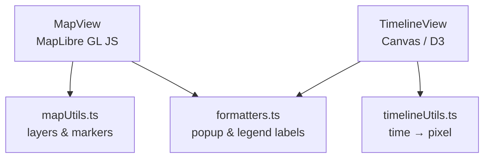

<div align="center">

# 🧮 Kansas Frontier Matrix — **Web Frontend Utilities**  
`web/src/utils/`

**Helper Functions · API Clients · Data Parsers · Map & Timeline Utilities**

[](../../../../.github/workflows/ci.yml)
[](../../../../.github/workflows/codeql.yml)
[](../../../../docs/)
[](../../../../LICENSE)

</div>

---

```yaml
---
title: "KFM • Web Frontend Utilities (web/src/utils/)"
version: "v1.3.0"
last_updated: "2025-10-14"
owners: ["@kfm-web", "@kfm-data"]
tags: ["web","utils","api","maplibre","timeline","mcp","typescript","stac"]
license: "MIT"
semantic_alignment:
  - CIDOC CRM
  - OWL-Time
  - STAC 1.0
  - DCAT 2.0
---
````

---

## 📚 Table of Contents

* [🧭 Overview](#🧭-overview)
* [🧱 Directory Structure](#🧱-directory-structure)
* [⚙️ Core Modules](#️-core-modules)
* [🧩 Example Usage](#🧩-example-usage)
* [🗺️ Map & Timeline Utility Relationships](#️-map--timeline-utility-relationships)
* [🤖 AI Utilities Integration](#🤖-ai-utilities-integration)
* [🧮 Coding Standards](#🧮-coding-standards)
* [🧾 Provenance & Integrity](#🧾-provenance--integrity)
* [🧠 MCP & Governance Alignment](#🧠-mcp--governance-alignment)
* [🧰 Deterministic Formatter (Example)](#🧰-deterministic-formatter-example)
* [🧪 Test Example](#🧪-test-example)
* [🧭 Reproducibility Hooks](#🧭-reproducibility-hooks)
* [🚀 Performance Considerations](#🚀-performance-considerations)
* [🔗 Related Documentation](#🔗-related-documentation)
* [📜 License & Credits](#📜-license--credits)

---

## 🧭 Overview

`web/src/utils/` contains **pure, shared utility modules** that power the KFM Web UI across Map, Timeline, AI, and Data Layers.
Utilities adhere to MCP-DL v6.2: **deterministic outputs**, **strict typing**, **clear provenance**, and **testability**.

They enable:

* Consistent **parsing & formatting** for **STAC**, **GeoJSON**, and API responses
* Reusable **transformations** and **temporal scaling**
* Provenance-first patterns with **zero side effects**

> **Quality bar:** JSDoc/TSDoc on public exports · coverage ≥ **85%** · linted & type-safe.

---

## 🧱 Directory Structure

```text
web/src/utils/
├── apiClient.ts          # REST/GraphQL wrappers (retry, backoff, logging)
├── mapUtils.ts           # MapLibre helpers (layers, markers, transforms)
├── timelineUtils.ts      # Time parsing, scales, interpolation
├── aiUtils.ts            # AI/LLM bridge (summaries, Q&A, citations)
├── formatters.ts         # Locale-aware date/number/label formatting
├── dataParser.ts         # Convert API payloads → internal app models
├── hooks.ts              # useFetch, useDebounce, useResizeObserver
├── constants.ts          # API base URLs, STAC paths, layer constants
└── __tests__/            # Jest unit tests for each module
```

---

## ⚙️ Core Modules

| File               | Purpose                                                    | Example Function               |
| :----------------- | :--------------------------------------------------------- | :----------------------------- |
| `apiClient.ts`     | Standardized HTTP/GraphQL client with retry & logging      | `getEvents(start,end)`         |
| `mapUtils.ts`      | MapLibre helpers: toggles, transitions, geometry utilities | `addLayer(map,id,url,opacity)` |
| `timelineUtils.ts` | Normalize/map temporal data to pixels/time ranges          | `timeToPixel(date,scale)`      |
| `aiUtils.ts`       | Interface to `/ask` and `/entity/{id}`                     | `fetchAISummary(entityId)`     |
| `formatters.ts`    | i18n date/number/text formatting                           | `formatDateHuman(date)`        |
| `dataParser.ts`    | Parse API JSON → Map/Timeline structures                   | `parseEventData(json)`         |
| `hooks.ts`         | Async/UI hooks                                             | `useDebounce(fn,delay)`        |
| `constants.ts`     | URLs & configuration constants                             | `API_BASE_URL`, `LAYER_CONFIG` |

> **State policy:** All utilities are **pure**. No global mutation. Side-effects only in API client and are isolated.

---

## 🧩 Example Usage

```ts
// Load and parse timeline events (1850–1900)
import { getEvents } from "./apiClient";
import { parseEventData } from "./dataParser";
import { formatDateHuman } from "./formatters";

export async function loadTimeline(start: string, end: string) {
  const data = await getEvents(start, end);
  const events = parseEventData(data);
  console.info(
    `Loaded ${events.length} events from ${formatDateHuman(start)}–${formatDateHuman(end)}.`
  );
  return events;
}
```

---

## 🗺️ Map & Timeline Utility Relationships



---

## 🤖 AI Utilities Integration

`aiUtils.ts` bridges the UI and backend AI/NLP endpoints:

* `POST /api/ask` — free-form **Q&A**
* `GET /api/entity/{id}` — contextual **entity summaries**

**Features**

* Prompt submission, **streaming**/chunked responses, error fallbacks
* **Caching/memoization** of previous prompts
* Inline **citation extraction** linking to graph entities
* Output shaping for **AIAssistant** rendering

**Response shape**

```ts
type AIResponse = {
  answer: string;
  citations: { id: string; label: string; source: string }[];
};
```

---

## 🧮 Coding Standards

* **Style** — ESLint + Prettier (CI-enforced)
* **Docs** — JSDoc/TSDoc for all public exports
* **Testing** — Jest + RTL; `__tests__/` co-located; coverage ≥ **85%**
* **Determinism** — pure functions; no hidden IO or globals
* **Typing** — strict TypeScript; generics & discriminated unions where appropriate

---

## 🧾 Provenance & Integrity

| Artifact      | Description                                                                 |
| :------------ | :-------------------------------------------------------------------------- |
| **Inputs**    | STAC (`config/layers.json`), API payloads (`/events`, `/entity`, `/ask`)    |
| **Outputs**   | Parsed objects (`Event`, `Entity`, `Layer`) used by Map/Timeline components |
| **Deps**      | React, Axios/Fetch, MapLibre GL JS, D3                                      |
| **Integrity** | Versioned via Git; CI runs checksums/lints/tests + CodeQL security scans    |

---

## 🧠 MCP & Governance Alignment

| MCP Principle       | Implementation                                                      |
| :------------------ | :------------------------------------------------------------------ |
| Documentation-first | TSDoc + per-file header comments                                    |
| Reproducibility     | Deterministic utils; CI regression tests                            |
| Open Standards      | GeoJSON, STAC, DCAT, ISO-8601 time                                  |
| Provenance          | API/STAC sources captured in metadata                               |
| Auditability        | Unit tests; CI logs capture inputs/outputs                          |
| Versioning          | SemVer + conventional commits; utilities bump with web package.json |

---

## 🧰 Deterministic Formatter (Example)

```ts
/**
 * Format ISO date into human-friendly year/month.
 * Deterministic across locales by fixing the locale and options.
 */
export function formatDateHuman(isoDate: string): string {
  const d = new Date(isoDate);
  return d.toLocaleDateString("en-US", { year: "numeric", month: "short" });
}
```

---

## 🧪 Test Example

```ts
import { timeToPixel } from "../timelineUtils";

describe("timelineUtils", () => {
  it("maps ISO date to correct pixel", () => {
    const scale = { start: 1800, end: 1900, width: 1000 };
    const result = timeToPixel("1850-01-01", scale);
    expect(result).toBe(500);
  });
});
```

---

## 🧭 Reproducibility Hooks

* 🧱 **Deterministic builds** — Vite caching + `package-lock.json` pins
* 🔒 **CodeQL / Trivy** — guard supply chain and container images
* 🧪 **Pre-commit** — lint, typecheck, test before merge
* 🧾 **Checksum log** — optional SHA-256 per built file in `dist/`
* 📦 **Immutable imports** — import types-only where possible to avoid runtime pollution

---

## 🚀 Performance Considerations

* Memoize parsed datasets; avoid re-parsing same payloads
* Preprocess STAC collections at build-time (static caches)
* Lazy-import heavy libs (e.g., specific D3 modules)
* All network IO **async**; no blocking operations in utils

---

## 🔗 Related Documentation

* **Web Frontend Overview** — `web/README.md`
* **Web UI Architecture** — `web/ARCHITECTURE.md`
* **API Layer Reference** — `../docs/architecture.md`
* **Monorepo Design** — `../docs/monorepo.md`

---

## 📜 License & Credits

Released under the **MIT License**.
© 2025 Kansas Frontier Matrix — Utilities follow the **Master Coder Protocol (MCP)** for transparency, reproducibility, and scientific integrity.

> *“Utilities are the silent scaffolds — unseen, but holding the frontier together.”*

```
```
