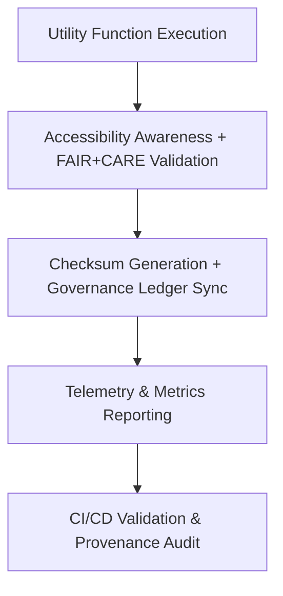

<div align="center">

# 🧮 **Kansas Frontier Matrix — Utility Functions & Helpers Library (v2.1.1 · Tier-Ω+∞ Certified)**  
`web/src/utils/README.md`

**Mission:** Provide a suite of reusable, FAIR+CARE-governed utility functions and helper methods  
for state management, accessibility, data transformation, and provenance tracking in the  
**Kansas Frontier Matrix (KFM)** web ecosystem.

[](../../../docs/)
[](../../../docs/standards/faircare-validation.md)
[](../../../docs/standards/accessibility.md)
[](../../../LICENSE)

</div>

---

## 📚 Overview

The **Utils Library** provides reusable building blocks for KFM’s frontend logic — simplifying  
data operations, accessibility state handling, and governance integration.  
All utilities are versioned, auditable, and integrated with FAIR+CARE and provenance frameworks.

Core objectives:
- ⚙️ Provide reusable, composable helper functions for consistent UX behavior.  
- ♿ Ensure accessibility-awareness in all state and DOM interactions.  
- 🧩 Support FAIR+CARE alignment via checksum, provenance, and ethics tracking.  
- 🔗 Maintain verifiable audit logs and automated validation pipelines.  

---

## 🗂️ Directory Layout

```bash
web/src/utils/
├── README.md                     # This file — Utilities library documentation
│
├── formatters.ts                 # Date/time, currency, and text formatting utilities
├── validators.ts                 # Input validation, regex patterns, and schema checkers
├── accessibility.ts              # Focus, ARIA, and keyboard state helpers
├── provenance.ts                 # Provenance, checksum, and governance metadata utilities
└── fetcher.ts                    # API fetch wrappers with FAIR+CARE compliance and logging
```

---

## ⚙️ Governance Model for Utilities


<!-- END OF MERMAID -->

---

## 🧱 Core Utility Categories

| Category | Description | FAIR+CARE Function | Validation Workflow |
|:--|:--|:--|:--|
| **Formatters** | Standardized date/time and numerical formatting. | Reusability + Transparency | `policy-check.yml` |
| **Validators** | Input and data integrity validation for UI forms. | Responsibility + Ethics | `ui-validate.yml` |
| **Accessibility** | Keyboard focus, ARIA role, and visibility helpers. | Inclusivity + Accessibility | `design-validate.yml` |
| **Provenance** | Checksum, audit, and governance metadata utilities. | Accountability + Traceability | `governance-ledger.yml` |
| **Fetcher** | FAIR+CARE-compliant fetch with error handling and provenance logs. | Transparency + FAIR Access | `stac-validate.yml` |

---

## 🧠 FAIR + CARE Integration

| Principle | Implementation | Validation |
|:--|:--|:--|
| **Findable** | Functions documented and indexed in governance logs. | `governance-ledger.yml` |
| **Accessible** | Accessibility-aware utilities integrated across UI. | `design-validate.yml` |
| **Interoperable** | TypeScript and JSON schema compatible for reuse. | `ui-validate.yml` |
| **Reusable** | All utilities versioned with deterministic signatures. | `policy-check.yml` |
| **Collective Benefit (CARE)** | Inclusive design supported via accessible UX helpers. | `faircare-validate.yml` |

---

## ♿ Accessibility-Aware Development

| Utility | Accessibility Feature | Validation |
|:--|:--|:--|
| **focusTrap()** | Ensures modals and dialogs maintain focus. | `design-validate.yml` |
| **announceChange()** | Uses ARIA live region to notify users of updates. | `docs-validate.yml` |
| **scrollIntoViewSafe()** | Provides smooth, motion-reduced scrolling. | `faircare-validate.yml` |
| **keyboardShortcut()** | Attaches accessible key bindings with labels. | `ui-validate.yml` |

---

## 🔍 Provenance & Governance Integration

| Artifact | Purpose | Path |
|:--|:--|:--|
| **Governance Ledger** | Records checksums and usage metadata. | `data/reports/audit/data_provenance_ledger.json` |
| **FAIR+CARE Reports** | Validates ethical and accessibility utilities. | `data/reports/fair/data_care_assessment.json` |
| **Telemetry Schema** | Logs function performance and accessibility metrics. | `schemas/telemetry/web-utils-schema.json` |

> Each utility generates a verifiable hash entry in the governance ledger,  
> enabling reproducibility, traceability, and accountability.

---

## 🧾 Example Utility Metadata

```yaml
---
utility_id: "fetcher_v2.1.1"
authors: ["@kfm-web","@kfm-data"]
faircare_status: "Tier-Ω+∞ Verified"
checksum: "sha256:c34e51a9f7b2e985..."
governance_ledger_entry: "data/reports/audit/data_provenance_ledger.json"
accessibility_compliance: "WCAG 2.1 AA"
license: "MIT"
---
```

---

## 🧮 Observability Metrics

| Metric | Description | Target | Workflow |
|:--|:--|:--|:--|
| **Utility Coverage** | % of utilities with FAIR+CARE metadata. | 100% | `policy-check.yml` |
| **Accessibility Compliance (WCAG)** | Accessibility hooks integrated per function. | ≥ 95 | `design-validate.yml` |
| **Governance Sync Rate** | Ledger synchronization success rate. | 100% | `governance-ledger.yml` |
| **Performance Integrity** | Fetcher + validator execution time thresholds. | < 200ms avg | `ui-validate.yml` |

---

## 🧾 Validation Workflows

| Workflow | Function | Output |
|:--|:--|:--|
| `ui-validate.yml` | Tests functional logic and accessibility interactions. | `reports/validation/ui_validation.json` |
| `design-validate.yml` | Validates color contrast and ARIA interaction in utilities. | `reports/validation/a11y_validation.json` |
| `policy-check.yml` | Ensures all utils have proper metadata and versioning. | `reports/audit/policy_check.json` |
| `faircare-validate.yml` | Evaluates ethics and inclusivity in UX helpers. | `reports/fair/data_care_assessment.json` |
| `governance-ledger.yml` | Logs checksums and provenance metadata. | `data/reports/audit/data_provenance_ledger.json` |

---

## 🕰 Version History

| Version | Date | Author | Summary |
|:--|:--|:--|:--|
| **v2.1.1** | 2025-11-16 | @kfm-web | Added provenance logger and accessibility utilities with FAIR+CARE validation. |
| v2.0.0 | 2025-10-25 | @kfm-architecture | Introduced governance-integrated fetcher and validator modules. |
| v1.0.0 | 2025-10-04 | @kfm-docs | Initial utilities library documentation and metadata linkage. |

---

<div align="center">

**Kansas Frontier Matrix © 2025**  
*“Small Functions. Big Integrity.”*  
📍 `web/src/utils/README.md` — FAIR+CARE-aligned utility library documentation for the Kansas Frontier Matrix.

</div>
