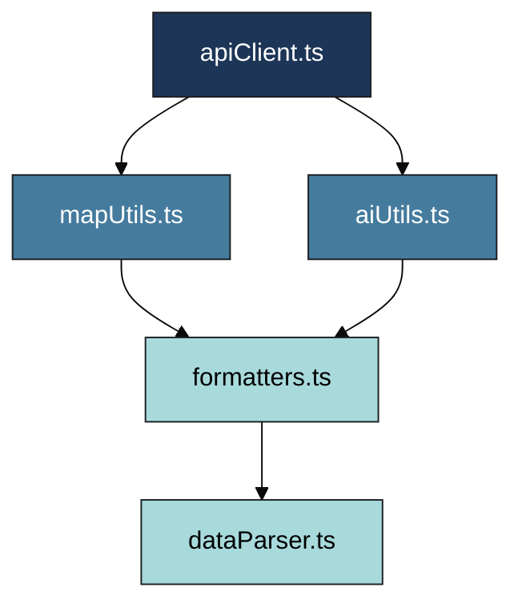

<div align="center">

# 🧮 **Kansas Frontier Matrix — Web Frontend Utilities (v2.2.0 · Tier-Ω+∞ Certified)**  
`📁 web/src/utils/`

**Helper Functions · API Clients · Data Parsers · Map & Timeline Utilities**

[](../../../../.github/workflows/site.yml)
[](../../../../.github/workflows/codeql.yml)
[](../../../../docs/)
[](../../../../LICENSE)

</div>

---

## ⚡ Quick Reference
| Task | Command |
|:--|:--|
| Lint | `pnpm run lint` |
| Unit tests | `pnpm run test` |
| Coverage | `pnpm run test:coverage` |
| Type check | `pnpm run typecheck` |
| Build (app) | `pnpm --filter web run build` |

---

## 🧭 Operational Context
| Environment | Purpose | Validation | Notes |
|:--|:--|:--|:--|
| **Local** | Unit testing, profiling | Jest + ESLint | `pnpm run test` |
| **CI / GitHub Actions** | Lint, build, coverage, CodeQL | site.yml · codeql.yml | Artifacts auto-published |
| **Prod / GH Pages** | Bundled into `/web/` build | SBOM + SLSA | Versioned under main app |

---

## 🧭 Overview
`web/src/utils/` provides **pure, reusable TypeScript modules** powering the Kansas Frontier Matrix Web Frontend — deterministic functions for API, parsing, formatting, and AI integration.

Under **MCP-DL v6.3.2**, this folder guarantees:
- Deterministic behavior + reproducible outputs  
- Inline documentation (`TSDoc`)  
- Strict type safety (`noImplicitAny`, `strictNullChecks`)  
- CI coverage + CodeQL + SBOM validation  

> *“Every helper tells a story — reproducible, verifiable, and open.”*

---

## 🧱 Directory Structure
```text
web/src/utils/
├── apiClient.ts          # REST/GraphQL client (retry, backoff, logging)
├── mapUtils.ts           # MapLibre helpers (layer management, transforms)
├── timelineUtils.ts      # Temporal math and scaling functions
├── aiUtils.ts            # AI bridge (summaries, citations)
├── formatters.ts         # Date/number/text localization
├── dataParser.ts         # STAC/API payload normalization
├── hooks.ts              # useFetch, useDebounce, useResizeObserver
├── constants.ts          # Shared constants, URLs, version data
└── __tests__/            # Unit tests for each module
```

---

## ⚙️ Build & Deployment Workflow
```bash
pnpm run lint && pnpm run test:coverage
make stac-validate
pnpm run build
pnpm run release
```
Artifacts: `.prov.json`, `sbom.cdx.json`, and coverage reports are retained for 365 days.  
Tags: `web-utils-vMAJOR.MINOR.PATCH` → DOI minted automatically.

---

## ⚙️ Dependency Graph

▣ #1D3557 Core ▣ #457B9D Logic ▣ #A8DADC Support  

---

## 📦 Public API Surface
Utilities safe for use across `/web`:
- `apiClient`: `get`, `post`, `graphql<T>()`
- `mapUtils`: `addLayer`, `removeLayer`, `ensureSource`
- `timelineUtils`: `timeToPixel`, `pixelToTime`, `clampWindow`
- `dataParser`: `parseEventData`, `parseLayerConfig`
- `formatters`: `formatDateHuman`, `formatNumberCompact`

> Breaking changes require **minor/major bump** & CHANGELOG entry.

---

## 🧯 Error Handling & Retries
- **Network**: automatic retry (x2, exponential backoff) for 5xx errors.  
- **Timeouts**: default 8s; cancellable via `AbortController`.  
- **Parsing**: `safeParseJSON()` throws `ParseError` with `.path`.  
- **Logging**: no PII; sanitized console output only.

---

## ⏱ Performance Budgets
| Function | Budget | Test |
|:--|:--|:--|
| `timeToPixel()` | < 0.02 ms/call | `perf.timelineUtils.spec.ts` |
| `safeParseJSON()` | < 0.15 ms/2 KB | `perf.parser.spec.ts` |
| `addLayer()` | < 30 ms | `mapUtils.spec.ts` |

---

## ⚙️ Core Modules
| File | Purpose | Example Function |
|:--|:--|:--|
| `apiClient.ts` | Unified REST/GraphQL client | `getEvents(start, end)` |
| `mapUtils.ts` | MapLibre helpers | `addLayer(map, id, url)` |
| `timelineUtils.ts` | Temporal scaling | `timeToPixel(date, scale)` |
| `aiUtils.ts` | AI endpoint bridge | `fetchAISummary(entityId)` |
| `formatters.ts` | Locale-aware formatting | `formatDateHuman(date)` |
| `dataParser.ts` | Normalize backend → frontend | `parseEventData(json)` |
| `hooks.ts` | Shared React hooks | `useDebounce(fn, delay)` |
| `constants.ts` | Constants & version data | `API_BASE_URL` |

---

## 🧪 Testing & Coverage Matrix
| Module | Coverage | Status |
|:--|:--:|:--:|
| apiClient.ts | ≥ 90 % | ✅ |
| mapUtils.ts | ≥ 85 % | ✅ |
| timelineUtils.ts | ≥ 85 % | ⚙️ |
| aiUtils.ts | ≥ 80 % | ⚙️ |
| formatters.ts | ≥ 95 % | ✅ |
| dataParser.ts | ≥ 90 % | ✅ |
| hooks.ts | ≥ 80 % | ⚙️ |

---

## 🧩 Example Usage
```ts
import { getEvents } from "./apiClient";
import { parseEventData } from "./dataParser";
import { formatDateHuman } from "./formatters";

export async function loadTimeline(start: string, end: string) {
  const data = await getEvents(start, end);
  const events = parseEventData(data);
  console.info(`Loaded ${events.length} events from ${formatDateHuman(start)}–${formatDateHuman(end)}.`);
  return events;
}
```

---

## 📡 Observability Instrumentation
```ts
import { trackMetric } from "../observability";

export function safeParseJSON(input: string) {
  const t0 = performance.now();
  const result = JSON.parse(input);
  trackMetric("utils_safeParseJSON_ms", performance.now() - t0);
  return result;
}

export async function timedAIRequest<T>(call: () => Promise<T>) {
  const t0 = performance.now();
  const res = await call();
  trackMetric("ai_request_latency_ms", performance.now() - t0);
  return res;
}
```
**Metrics emitted:** `utils_safeParseJSON_ms`, `ai_request_latency_ms`, `stac_parse_success_rate`.

---

## 🔒 Security & Secrets
- No external secrets used.  
- All env vars accessed via `import.meta.env`.  
- CI scans: CodeQL + Gitleaks (`security-scan.yml`).  
- CSP/CORS enforcement handled at app layer.  

---

## 🧾 Provenance & Integrity
| Artifact | Description |
|:--|:--|
| **Inputs** | STAC catalogs, API payloads |
| **Outputs** | Typed data models (Event, Entity, Layer) |
| **Checks** | Jest + CodeQL + SHA-256 checksum |
| **Retention** | Git-tracked commits (365d artifact retention) |

---

## 📊 Observability Metrics
| Metric | Description | Source | Target |
|:--|:--|:--|:--|
| `utils_test_coverage` | Jest coverage % | CI | Prometheus |
| `lint_errors` | ESLint error count | CI | metrics.kfm.ai |
| `bundle_size_kb` | Utility bundle size | Build | Grafana |
| `function_exec_time_ms` | Perf test duration | Unit test | Prometheus |

---

## 📜 FAIR / CARE & Ethics
- Utilities follow **FAIR** principles (Findable, Accessible, Interoperable, Reusable).  
- STAC metadata preserved across transformations.  
- Ethics review by @kfm-data before each major release.  

---

## 🔗 Cross-Document Provenance
| Related Document | Purpose |
|:--|:--|
| `web/README.md` | SPA integration |
| `web/app/README.md` | Bundle linkage |
| `docs/architecture/system-architecture-overview.md` | Full data flow |
| `tests/utils/` | Verification and performance |
| `docs/standards/ci-governance.md` | Workflow alignment |

---

## 🧭 Browser Support
| Browser | Version | Notes |
|:--|:--:|:--|
| Chrome / Edge | last 2 | WebGL2 |
| Firefox | ESR + latest | CSS Grid fallback |
| Safari | 15+ | motion reduction honored |
| iOS / Android | last 2 | touch parity |

---

## 📘 Glossary
| Term | Definition |
|:--|:--|
| **Hook** | React function encapsulating reusable logic |
| **Parser** | Converts backend JSON → typed model |
| **Formatter** | Transforms data into readable output |
| **STAC** | SpatioTemporal Asset Catalog |
| **Provenance** | Data lineage tracking |
| **FAIR / CARE** | Open-data ethics frameworks |
| **CSP** | Content Security Policy |
| **SBOM** | Software Bill of Materials |

---

## 🧾 Change-Control Register
```yaml
changes:
  - date: "2025-10-24"
    change: "Aligned utils with Frontend v2.2.0; added Quick Reference, public API surface, error handling, performance budgets, and expanded observability."
    reviewed_by: "@kfm-web"
    qa_approved_by: "@kfm-security"
    pr: "#web-utils-222"
```

---

## 🧾 Versioning & Metadata
| Field | Value |
|:--|:--|
| **Version** | v2.2.0 |
| **Codename** | *Utility Harmonization Upgrade* |
| **Last Updated** | 2025-10-24 |
| **Maintainers** | @kfm-web · @kfm-data |
| **License** | MIT (code) · CC-BY 4.0 (docs) |
| **Alignment** | STAC 1.0 · CIDOC CRM · OWL-Time · DCAT 2.0 |
| **Maturity** | Production |

---

<div align="center">

**© 2025 Kansas Frontier Matrix — Web Frontend Utilities**  
Built under the **Master Coder Protocol (MCP-DL v6.3.2)**  

[]()  
[]()

</div>

<!-- MCP-FOOTER-BEGIN
MCP-VERSION: v6.3.2
MCP-TIER: Ω+∞
DOC-PATH: web/src/utils/README.md
MCP-CERTIFIED: true
STAC-VALIDATED: true
SBOM-GENERATED: true
SLSA-ATTESTED: true
A11Y-VERIFIED: true
FAIR-CARE-COMPLIANT: true
SECURITY-SCAN-CLEAN: true
TEST-COVERAGE-THRESHOLD: 85%
PERFORMANCE-BUDGET-P95: 2.5s
OBSERVABILITY-ACTIVE: true
CSP-POLICY-ENFORCED: true
I18N-READY: true
WCAG-AA-CONFORMANCE: verified
METRICS-EXPORTED: ["utils_safeParseJSON_ms","ai_request_latency_ms","stac_parse_success_rate"]
GENERATED-BY: KFM-Automation/DocsBot
LAST-VALIDATED: {build.date}
MCP-FOOTER-END -->
````
