---

title: "🛠️ Kansas Frontier Matrix — Web Utility Modules (Diamond⁹ Ω / Crown∞Ω Ultimate Certified)"
path: "web/src/utils/README.md"
version: "v10.4.0"
last_updated: "2025-11-15"
review_cycle: "Quarterly / Autonomous · FAIR+CARE Council Oversight"
commit_sha: "<latest-commit-hash>"
sbom_ref: "../../../releases/v10.4.0/sbom.spdx.json"
manifest_ref: "../../../releases/v10.4.0/manifest.zip"
telemetry_ref: "../../../releases/v10.4.0/focus-telemetry.json"
telemetry_schema: "../../../schemas/telemetry/web-utils-v3.json"
governance_ref: "../../../docs/standards/governance/ROOT-GOVERNANCE.md"
license: "MIT"
mcp_version: "MCP-DL v6.3"
markdown_protocol_version: "KFM-MDP v10.4"
status: "Active / Enforced"
doc_kind: "Architecture"
intent: "web-utilities"
fair_category: "F1-A1-I1-R1"
care_label: "Public / Low-Risk"
sensitivity_level: "None"
public_exposure_risk: "Low"
indigenous_rights_flag: false
data_steward: "KFM FAIR+CARE Council"
risk_category: "Low"
redaction_required: false
provenance_chain:

* "web/src/utils/README.md@v10.3.2"
* "web/src/utils/README.md@v10.2.1"
  previous_version_hash: "<previous-sha256>"
  ontology_alignment:
  cidoc: "E29 DesignOrProcedure"
  schema_org: "SoftwareSourceCode"
  owl_time: "TemporalEntity"
  prov_o: "prov:Plan"
  geosparql: "N/A"
  json_schema_ref: "../../../schemas/json/web-utils.schema.json"
  shape_schema_ref: "../../../schemas/shacl/web-utils-shape.ttl"
  doc_uuid: "urn:kfm:doc:web-utils-readme-v10.4.0"
  semantic_document_id: "kfm-doc-web-utils"
  event_source_id: "ledger:web/src/utils/README.md"
  immutability_status: "version-pinned"
  doc_integrity_checksum: "<sha256>"
  ai_training_inclusion: false
  ai_focusmode_usage: "Allowed with restrictions"
  ai_transform_permissions:
* "summaries"
* "semantic-highlighting"
* "a11y-enhancement"
  ai_transform_prohibited:
* "speculative additions"
* "unverified historical claims"
  machine_extractable: true
  accessibility_compliance: "WCAG 2.1 AA"
  jurisdiction: "Kansas / United States"
  classification: "Public Document"
  role: "architecture"
  lifecycle_stage: "stable"
  ttl_policy: "Review required every 12 months"
  sunset_policy: "Superseded upon next major utilities revision"

---

# 🛠️ **Kansas Frontier Matrix — Web Utility Modules**

`web/src/utils/README.md`

**Purpose:**
Define the complete, FAIR+CARE-aligned architecture for all web utility modules powering the KFM v10.4 Web Platform.
These utilities provide deterministic TypeScript primitives for accessibility, governance, redaction, provenance, schema validation, formatting, telemetry, and sustainability — foundational to Focus Mode v2.5, Story Node v3, STAC/DCAT explorers, timeline UX, and MapLibre/Cesium rendering layers.

---

# 📘 Overview

`web/src/utils/**` defines the **pure, deterministic, reusable** logic that enables:

* WCAG 2.1 AA accessibility tooling
* CARE-aware redaction & sovereignty masking
* Provenance lineage, JSON-LD document construction, audit linking
* Runtime schema validation (Focus Mode, STAC/DCAT, GraphQL)
* Formatter utilities (dates, numbers, metadata, citations)
* Telemetry emission for WebVitals, A11y usage, ethics, sustainability
* Deterministic narrative formatting for Story Node v3 + Focus Mode

Every utility must be:

* Pure
* TypeScript-strict
* Deterministic
* Side-effect free (except telemetry emitters)
* FAIR+CARE governed
* Machine-extractable

---

# 🎯 Purpose

This document defines:

* The responsibilities of each utility module
* How utilities integrate with components, pipelines, and Focus Mode
* Required governance, CARE, A11y, and telemetry behaviors
* Deterministic patterns for formatting and validation
* Schema and ontology mapping rules

Primary consumers:
Frontend engineers, architects, FAIR+CARE reviewers, A11y specialists, and telemetry maintainers.

---

# 📍 Scope

## In Scope

* All code under `web/src/utils/**`
* Schema guards, provenance generators, formatting utilities, A11y helpers, telemetry senders
* Shared logic used by MapLibre, CesiumJS, Focus Mode, Story Nodes, STAC/DCAT, timeline

## Out of Scope

* Component logic (handled in `components/**`)
* Backend APIs and pipeline reliability logic
* Styling tokens (covered in `styles/**`)

---

# 📚 Definitions

* **Utility Function:** A pure function with no UI or side effects
* **Schema Guard:** Runtime predicate to validate API DTO structures
* **Provenance Chain:** JSON-LD lineage from entity → dataset → STAC/DCAT → source
* **CARE Redaction:** Removal or masking of sensitive content under tribal sovereignty or ethical restrictions
* **A11y Utility:** Helper enabling keyboard/ARIA compliance
* **Telemetry Emitter:** Controlled side-effect producing validated telemetry events

---

# 🏗 Architecture / Context

## How Utilities Fit in the Web Architecture

```mermaid
flowchart TD
    INT[UI Interaction] --> UTIL[Utility Module<br/>schema · a11y · provenance · format]
    UTIL --> GOV[Governance Engine<br/>CARE · License · Sovereignty]
    UTIL --> TEL[Telemetry Layer<br/>Vitals · Ethics · A11y · Energy]
    GOV --> FOCUS[Focus Mode v2.5]
    GOV --> MAP[MapView · Masks]
    GOV --> TL[TimelineView]
    FOCUS --> SN[Story Node v3 Renderer]
```

Utility modules act as the **stable foundation** underlying:

* Focus Mode narratives
* Story Node composition
* Map & timeline sync
* Governance UI overlays
* A11y interaction models

---

# ⚙️ Procedures / Implementation

All utility code MUST:

* Use TypeScript strict mode
* Never mutate input arguments
* Provide predictable outputs for identical inputs
* Throw governance-safe errors (no sensitive content)
* Validate telemetry payloads before emitting
* Integrate with schema guards to ensure data integrity
* Decorate provenance metadata consistently

---

# 📑 Data Contracts & Schemas

Utilities consume DTOs validated by schema guards:

* Focus Mode entities
* Story Node v3 objects
* STAC/DCAT metadata
* Neo4j-derived Person/Place/Event DTOs
* Telemetry payload schemas

All validated through:

* `schemaGuards.ts` (runtime)
* `types/api.ts` (compile-time)
* JSON Schema (`web-utils.schema.json`)

---

# 🧬 Ontology Alignment

Utility outputs comply with:

| Ontology       | Alignment                                                         |
| -------------- | ----------------------------------------------------------------- |
| **CIDOC-CRM**  | Provenance outputs map to `E7 Activity`, `E73 Information Object` |
| **OWL-Time**   | Interval formatting for timeline and Story Node extents           |
| **PROV-O**     | Provenance chips embed `prov:Entity` + `prov:wasDerivedFrom`      |
| **schema.org** | JSON-LD export uses `SoftwareSourceCode` + dataset classes        |
| **DCAT 3.0**   | STAC/DCAT formatters maintain dataset/distribution semantics      |
| **STAC 1.0**   | Metadata extractors follow STAC Item/Collection rules             |

---

# 🛰 STAC/DCAT Metadata Integration

Utilities must:

* Parse STAC Item/Collection fields
* Format layer labels, asset names, temporal extents
* Generate DCAT distribution metadata chips
* Ensure CARE indicators map correctly to dataset metadata

---

# 📖 Story Node Integration

Story Node v3 utilities include:

* `formatStoryNodeLabel()`
* `buildStoryNodeProvenance()`
* `normalizeStoryNodeDates()`
* `schemaGuardStoryNode()`

Utilities guarantee:

* Temporal precision handling (`year`, `month`, `day`)
* Spatial formatting for map frames
* CARE-safe rendering (e.g., ancestral lands masking)

---

# 🧠 Focus Mode Integration

Focus Mode v2.5 depends on utilities for:

* Narrative formatting
* Explainability chip generation
* Entity relation sorting
* Provenance expansion
* Citation normalization
* CARE-aware filtering

Focus data flow:

---

# 🔐 Ethics & CARE Requirements

Utility modules MUST:

* Enforce sovereignty masking for tribal/heritage datasets
* Apply CARE-labeled constraints:

  * `restricted` → block or blur
  * `sensitive` → require governance banner
  * `public` → normal display
* Prevent resurfacing of suppressed or sensitive content
* Emit governance telemetry (`care_masking_event`, etc.)

---

# 🛡 Governance

Governance integration includes:

* CARE label chips
* License badges
* Provenance warnings
* Block/allow decisions for sensitive entities
* Links to:

  * `ROOT-GOVERNANCE.md`
  * `web-governance-ledger.json`

Utilities must NEVER:

* Invert CARE rules
* Reveal restricted coordinates
* Produce undefined provenance

---

# 🧪 Validation & Testing

Mandatory testing:

* Unit tests for all pure utilities
* Schema guard validation tests
* Governance edge-case tests
* A11y tests for keyboard/focus helpers
* Telemetry structure tests

All covered in:

* `web-utils.test.ts`
* `governance-utils.test.ts`
* `schemaGuards.test.ts`

---

# 📈 Telemetry

Telemetry utilities capture:

* WebVitals: LCP, FID, CLS
* A11y interactions
* CARE gating events
* Story Node engagement
* Narrative reasoning depth
* Estimated CO₂e (from backend)

Payloads MUST satisfy `web-utils-v3.json`.

Telemetry destinations:

`../../../releases/<version>/focus-telemetry.json`

---

# 🎧 Accessibility (WCAG 2.1 AA)

Plain-language summary:

> These utilities help ensure the KFM web app is accessible to anyone, including those relying on keyboard navigation, screen readers, or high-contrast color modes.

Utilities MUST support:

* Focus management & traps
* Reduced-motion checks
* Color-safe token usage
* Screen reader announcements
* ARIA attribute helpers
* Keyboard shortcuts for map/timeline

---

# 🤖 Machine Extractability

Machine-readable guarantees:

* Predictable heading hierarchy
* YAML conforms to schema
* Tables are syntactically valid
* Mermaid diagrams are valid
* JSON examples valid under schemas
* No fenced code blocks

These allow:

* MCP-Lint
* JSON-Schema
* SHACL validators
* FAIR+CARE audits

---

# 🛡 Privacy & Security

Utilities MUST NOT:

* Log PII
* Embed secrets
* Expose internal identifiers
* Leak sensitive provenance

Security alignment:

* Must comply with KFM security rules (`docs/security/*`)
* Must validate external data with schema guards

---

# ♻️ Dataset Evolution / Deltas

Changes from v10.3.2:

* Full KFM-MDP v10.4 YAML
* Added ontology, AI transform governance, CARE enhancements
* Expanded schema guard requirements
* More explicit Story Node and Focus Mode utility descriptions
* Added sustainability telemetry requirements
* Formalized error taxonomy

---

# 🧩 Error Taxonomy

* **ValidationError** — schema guard failure
* **ProvenanceError** — lineage or citation failure
* **A11yError** — accessibility rule violation
* **CAREError** — improper masking/redaction
* **TelemetryError** — malformed telemetry payload
* **FormatError** — malformed date/number/layer formatting

Governance policy:
ALL errors must fail gracefully, trigger telemetry, and avoid leaking sensitive data.

---

# 📁 Directory Layout

web/src/utils/
├── README.md
├── schemaGuards.ts
├── provenance.ts
├── a11y.ts
└── formatters.ts

---

# 🕰 Version History

| Version | Date       | Author            | Summary                                                                                                                              |
| ------: | ---------- | ----------------- | ------------------------------------------------------------------------------------------------------------------------------------ |
| v10.4.0 | 2025-11-15 | Web Platform Team | Upgraded to full KFM-MDP v10.4; added ontology, CARE, Story Node v3, governance, A11y, telemetry, error taxonomy, and extended YAML. |
| v10.3.2 | 2025-11-13 | Web Platform Team | Prior architecture; foundational utility descriptions.                                                                               |
| v10.3.1 | 2025-11-13 | Web Platform Team | Initial v10 utilities specification.                                                                                                 |

---

**© 2025 Kansas Frontier Matrix — MIT License**
Validated under **Master Coder Protocol v6.3**
FAIR+CARE Certified · Diamond⁹ Ω / Crown∞Ω Ultimate Certified
[Back to Source Index](../README.md) · [Source Architecture](../ARCHITECTURE.md)

