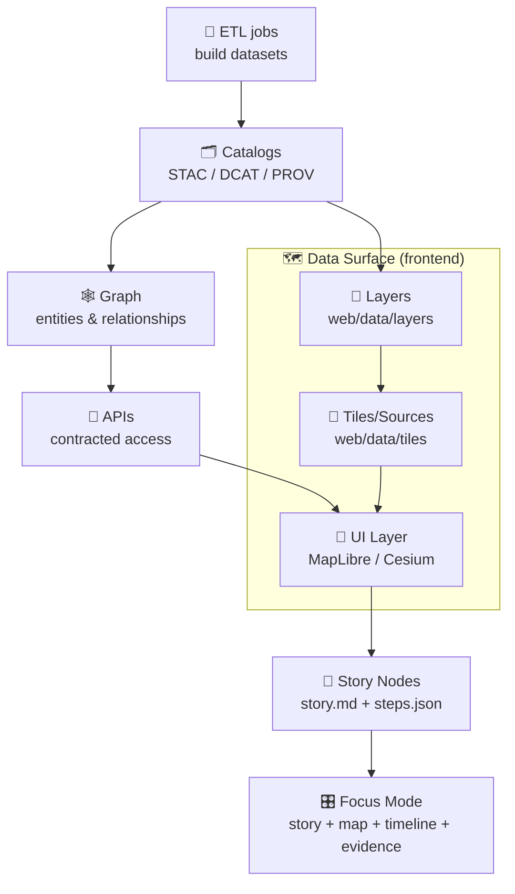

<a id="top"></a>

# 🧩 Story Nodes — `web/story_nodes/`  
**Go-to: governed narrative packages for the web viewer** 🧾🗺️  
*Markdown + semantics + citations + map/timeline/3D state → Focus Mode (evidence-first)*

<p align="left">
  
  
  
  
  
  
  
  
  
</p>

> [!IMPORTANT]
> **KFM invariant (non‑negotiable ordering):**  
> **ETL → STAC/DCAT/PROV Catalogs → Graph → APIs → UI → Story Nodes → Focus Mode**  
> If a change breaks this ordering (even “temporarily”), it’s not mergeable. 🚫🧱

> [!TIP]
> 🧼 If you remember one rule: **no story without evidence** (versioned data + provenance + citations). ✅🧾

---

## 🔗 Quick links

| Need | Where |
|---|---|
| 🌾 Web viewer overview | `../README.md` |
| 🎨 Shared UI assets rules | `../assets/README.md` |
| 🗺️ Frontend data assets rules | `../data/README.md` |
| 🧱 Layers contract (what a “layer id” means) | `../data/layers/README.md` *(expected)* |
| 🧩 Tiles contract (tile sets, TileJSON/PMTiles, provenance) | `../data/tiles/README.md` *(expected)* |
| 🗂️ Catalogs contract (STAC/DCAT/PROV runtime pointers) | `../data/catalog/README.md` *(expected)* |
| 📖 Canonical story authoring home (governed) | `../../docs/reports/story_nodes/` *(draft → review → published)* |
| 🧩 Story Node authoring template | `../../docs/templates/TEMPLATE__STORY_NODE_V3.md` |
| 🧾 Master Guide / pipeline rules | `../../docs/MASTER_GUIDE_v13.md` *(or `MARKDOWN_GUIDE_v13.md.gdoc` if present)* |
| 🧪 Tests posture & CI gates | `../../tests/README.md` |
| 🧬 Schemas registry (contracts) | `../../schemas/` |
| 🧪 MCP (methods + run receipts; models-as-evidence) | `../../mcp/` |

> [!NOTE]
> **Canonical home vs web runtime:**  
> Authoring + governance live under `docs/reports/story_nodes/`.  
> `web/story_nodes/` is **runtime packaging + loading + validation** for the browser.  
> If a link 404s, treat it as a **target shape** and add the missing README/template. 🧱✅

---

<details>
<summary><strong>📚 Table of contents</strong> (click to expand)</summary>

- [Why this folder exists](#why-this-folder-exists)
- [At a glance](#at-a-glance)
- [Two-layer model: Authoring vs Runtime](#two-layer-model-authoring-vs-runtime)
- [Non-negotiables](#non-negotiables)
- [What is a Story Node](#what-is-a-story-node)
- [Story Node types](#story-node-types)
- [Focus Mode contract](#focus-mode-contract)
- [Integration points](#integration-points)
- [Recommended folder layout](#recommended-folder-layout)
- [Registry & discovery indexes](#registry--discovery-indexes)
- [Runtime formats](#runtime-formats)
- [Story Node anatomy](#story-node-anatomy)
- [Evidence model](#evidence-model)
- [Versioning & reproducibility](#versioning--reproducibility)
- [Overlays, media & visual integrity](#overlays-media--visual-integrity)
- [Performance budgets & caching](#performance-budgets--caching)
- [3D Story Nodes](#3d-story-nodes)
- [Runtime loading pipeline](#runtime-loading-pipeline)
- [Validation & CI gates](#validation--ci-gates)
- [Security & safety notes](#security--safety-notes)
- [Accessibility & inclusive design](#accessibility--inclusive-design)
- [PR checklist](#pr-checklist)
- [Troubleshooting](#troubleshooting)
- [Project library influence map](#project-library-influence-map)
- [Glossary](#glossary)

</details>

---

## Why this folder exists

Story Nodes are **meaning-bearing artifacts** in KFM: they can change what users infer about history, environment, or policy. That makes them part of the **governed surface** — not “just content.”

`web/story_nodes/` exists so the web client can make Story Nodes:

- ✅ **loadable** (static-first + API-enhanced)
- ✅ **schema-valid** (machine-ingestible, not freeform prose)
- ✅ **safe** (sanitized rendering + hostile-input posture)
- ✅ **traceable** (every claim → evidence pointers)
- ✅ **reproducible** (version locks + checksums + stable IDs)
- ✅ **governed** (FAIR+CARE + sovereignty/classification handling)

If Story Nodes become “just markdown,” KFM loses auditability. This folder prevents that drift. 🧭🧱

---

## At a glance

### ✅ The happy path (author → publish → run)

1) ✍️ **Author (canonical)** under `docs/reports/story_nodes/<slug>/`  
2) 🧾 **Attach evidence pointers** (STAC/DCAT/PROV + licenses + classification)  
3) 🎞️ **Bind UI state** in `steps.json` (map/timeline/3D; diffable + testable)  
4) 📦 **Package runtime node** under `web/story_nodes/nodes/<slug>/`  
5) 🗂️ **Register** it in `web/story_nodes/registry/storyNodes.index.json`  
6) ✅ **CI validates** schema + manifest + link resolution + safety gates  
7) 🌐 **Focus Mode loads** `id@version` → locks evidence → renders story + map + timeline

### 🚫 The three fastest ways to get a PR blocked

- ❌ “Just add a paragraph” (no evidence pointers / no provenance)
- ❌ “Quick hotfix in UI” (governance or redaction fixed *downstream*)
- ❌ “Ship a big asset” (no manifest / no checksums / breaks budgets)

---

## Two-layer model: Authoring vs Runtime

KFM stays sane when **authoring** and **runtime** are cleanly separated:

### ✍️ Authoring layer (canonical ✅)
**Location (target):** `docs/reports/story_nodes/`

- human-reviewed narrative
- citations + source manifests
- governance review (FAIR/CARE, licensing, sensitivity)
- lifecycle: `draft → review → published`
- “one canonical home per story” (avoid shadow copies)

### 🌐 Runtime layer (this folder ✅)
**Location:** `web/story_nodes/`

- browser-friendly packages (relative paths, small assets, cacheable)
- a discovery registry (`registry/*.json`) for navigation & search
- validators/sanitizers and UI bindings (map/timeline/optional 3D)

> [!IMPORTANT]
> **Do not “fix” governance problems in the UI layer.**  
> If a Story Node needs evidence, licensing, or redaction fixes — fix it upstream (authoring + catalogs + API). ✅🧾

---

## Non-negotiables

These are the rails that keep Story Nodes defensible ✅

1) **Pipeline ordering is absolute**  
   `ETL → Catalogs (STAC/DCAT/PROV) → Graph → APIs → UI → Story Nodes → Focus Mode`

2) **API boundary rule (no backdoors)**  
   The browser must not query Neo4j/DB directly. Entity resolution comes through **contracted APIs**.

3) **Provenance-first narrative**  
   Every factual claim must be traceable to evidence (STAC/DCAT/PROV or cataloged external sources).

4) **Classification propagation (“no privacy downgrade”)**  
   Outputs can’t be less restricted than inputs without explicit policy + review. The UI must **not** become a side-channel.

5) **Deterministic + reproducible UX**  
   A Story Node view must be reconstructible from:
   - Story Node `id@version`
   - layer IDs + dataset/version pins
   - asset inventory + checksums
   - provenance bundle references (STAC/DCAT/PROV)

6) **Layer + tile integrity (no “mystery layers”)** 🧱🗺️  
   If a step deck turns on a layer, that layer must have:
   - a stable `layer_id` (defined in `web/data/layers/…`)
   - a tile/source definition (defined in `web/data/tiles/…`)
   - provenance + license + classification metadata (catalog pointers)

---

## What is a Story Node

A Story Node is **governed narrative as data**:

> 📄 Narrative markdown  
> + 🧾 Evidence pointers (STAC/DCAT/PROV + citations)  
> + 🕸️ Entity references (graph IDs)  
> + 🎛️ UI bindings (map/timeline/panels/optional 3D steps)  
> = **machine-ingestible storytelling**

Story Nodes should explicitly separate:

- ✅ **Facts** (with citations)
- 🧠 **Interpretation / hypothesis** (clearly labeled)
- 🧪 **Methods** (how evidence artifacts were produced)
- 🧯 **Limits / uncertainty** (what’s unknown or model-dependent)

> [!TIP]
> If you can’t click from a claim to evidence, it’s not a Story Node — it’s just prose. ✅

---

## Story Node types

Story Nodes aren’t one shape; the contract supports multiple “node styles” 🎛️

| Type | When to use | Required runtime artifacts |
|---|---|---|
| 📄 **Narrative-only** | Short reads, minimal map interaction | `story.md` (+ evidence keys) |
| 🎞️ **Step-deck** | Guided tours, classroom mode, “watch me” playback | `story.md` + `steps.json` |
| 🗺️ **Map-first** | Layer comparison, before/after, time slider | `steps.json` + strong layer metadata |
| 🧊 **3D node** | Terrain/volumes/structures where 3D helps comprehension | 3D bindings + 2D fallback plan |
| 🧪 **Model-backed** | Simulations/ML outputs (must be honest about uncertainty) | Methods + assumptions + provenance + uncertainty grammar |

> [!NOTE]
> “Model-backed” nodes MUST surface assumptions, verification/validation notes, and uncertainty.  
> (Treat models as evidence artifacts, not magic.) 🧪📉

---

## Focus Mode contract

Focus Mode is the “reading cockpit” 🚀  
Story on one side; map/timeline/evidence on the other — with strict hard gates.

### ✅ What Focus Mode must do
- show citations as **first-class UI elements** (clickable + inspectable)
- resolve entity references via API (place/person/event/dataset)
- show provenance for layers, overlays, and model outputs
- honor sensitivity rules (generalize/omit, warn, block, or require elevated access)
- label **AI-assisted content** clearly (and keep it opt-in)
- keep “what you see” reproducible (`id@version`, pinned evidence, pinned layers)

### 🚫 What Focus Mode must never do
- display content without a source pointer (hard gate)
- bypass classification/redaction rules
- auto-generate narrative by default (no surprise AI summaries)
- reveal sensitive coordinates via side-channels (tooltips, legends, tiles, screenshots, EXIF)

> [!IMPORTANT]
> **AI contributions must be opt-in + transparent.**  
> If AI-generated text exists, it must be user-triggered, clearly labeled, and bounded by evidence pointers. ✅🧾🤖

---

## Integration points

Story Nodes sit at the very end of the pipeline, but they *touch everything* ✅



### 🔩 What this means in practice

- Step decks reference **layer IDs**, not raw tile URLs.  
- Layer definitions reference **tile/source IDs**, not arbitrary endpoints.  
- Tile/source definitions reference **catalog evidence**, not “trust me.”  
- Focus Mode renders **only what can be evidenced + governed**.

---

## Recommended folder layout

> Adjust to match your repo; this is the **intended runtime shape** (static-first, Pages-friendly).

```text
web/story_nodes/
├─ 📘 README.md                        # (this file)
├─ 🗂️ registry/                        # discovery + navigation + browse UI
│  ├─ 🗺️ storyNodes.index.json         # published nodes, metadata, tags, thumbs
│  └─ 🏷️ tags.index.json               # optional: tag → node list
├─ 📐 schema/                          # runtime validation contracts
│  ├─ 🧾 story_node.v3.schema.json      # front matter + bindings + governance
│  ├─ 🧾 step_deck.v1.schema.json       # step-based story mode bindings
│  ├─ 🧾 focus_bundle.v1.schema.json    # optional: resolved “Focus Bundle”
│  └─ 🧾 manifest.v1.schema.json        # assets inventory: sha256/bytes/license/alt_text
├─ 🧰 loaders/                         # fetch + parse + validate + sanitize
│  ├─ ⛏️ fetchStoryNode.ts
│  ├─ ✅ validateStoryNode.ts
│  ├─ 🧼 sanitizeMarkdown.ts
│  ├─ 🔗 resolveEvidenceLinks.ts
│  ├─ 🧭 resolveLayerIds.ts             # binds steps → layers → tiles
│  └─ 🧯 applyRedaction.ts
├─ 🧩 types/                           # shared TS types
│  ├─ 🧾 storyNode.ts
│  ├─ 🧠 focusMode.ts
│  ├─ 🗺️ overlays.ts
│  └─ 🎞️ stepDeck.ts
├─ 🧪 __tests__/                        # schema + snapshot + safety tests
│  ├─ ✅ storyNode.schema.test.ts
│  ├─ ✅ storyNode.sanitize.test.ts
│  ├─ ✅ stepDeck.schema.test.ts
│  ├─ ✅ manifest.integrity.test.ts
│  └─ 🖼️ storyNode.render.test.tsx
└─ 📁 nodes/                            # the story node packages (published)
   ├─ 📁 kansas_from_above/             # example node
   │  ├─ 🧾 story.md                    # markdown with YAML front matter
   │  ├─ 🎞️ steps.json                 # step deck: map/timeline/camera bindings
   │  ├─ 📦 manifest.json               # inventory: bytes + sha256 + licenses + alt_text
   │  ├─ 🧾 evidence.json               # optional: resolved Focus Bundle pointers
   │  └─ 🖼️ assets/                     # local images/media/overlays (small!)
   └─ 📁 <slug>/...
```

> [!NOTE]
> Shared, reusable UI assets should live in `web/assets/`.  
> `web/story_nodes/**/assets` should be **story-owned**, **small**, and **manifested** (checksums + licenses + alt_text). ✅

---

## Registry & discovery indexes

Story Nodes are discoverable via a **registry index** (static-first) 🗂️

### ✅ `registry/storyNodes.index.json` (expected shape)

Recommended fields (minimum viable):

- `id`, `version`, `status`
- `title`, `summary`
- `tags[]`
- `thumb` (safe, small thumbnail)
- `entry` (relative path to `nodes/<slug>/story.md`)
- `time_range` (optional)
- `spatial.bbox` (optional)
- `requires` (optional flags: auth, heavy3d, sensitive)

Example entry:

```json
{
  "id": "ks.story.railroads.expansion",
  "version": "1.2.0",
  "status": "published",
  "title": "The Expansion of Railroads in Kansas (1860–1890)",
  "summary": "A step-based walkthrough of railroad expansion layers with primary-map citations.",
  "tags": ["kansas", "railroads", "history", "infrastructure"],
  "entry": "nodes/kansas_railroads_1860_1890/story.md",
  "thumb": "nodes/kansas_railroads_1860_1890/assets/thumb.webp",
  "time_range": {"start": "1860-01-01", "end": "1890-12-31"},
  "spatial": {"bbox": [-102.05, 36.99, -94.59, 40.00]},
  "requires": {"auth": false, "heavy3d": false, "sensitive": false}
}
```

> [!TIP]
> Keep the registry tiny and cacheable.  
> It should be safe to fetch on every app boot. ⚡

---

## Runtime formats

KFM supports *two complementary runtime surfaces*:

### 1) 📄 `story.md` — the narrative (human-readable)
- YAML front matter = machine contract (id/version/governance/evidence keys)
- Markdown body = claims, methods, limits, changelog, citations

### 2) 🎞️ `steps.json` — the step deck (machine-friendly UI bindings)
A step deck drives “story mode” playback:
- map camera state (center/zoom/bearing/pitch)
- layers on/off (by **layer_id**)
- timeline position/window
- optional 3D scene state
- optional highlight/annotation cues

> [!TIP]
> Keep “UI bindings” out of prose. Put bindings in `steps.json` so they’re schema-validated, diffable, and testable. 🧾✅

### 3) 📦 `manifest.json` — asset inventory (integrity + licensing)
Story assets are truth-bearing artifacts. The manifest makes them auditable:
- `sha256`, `bytes`
- `license`, `attribution`
- `alt_text` ✅
- `source` pointers (STAC/DCAT/PROV or cataloged external)

---

## Story Node anatomy

> Authoring typically uses the canonical template under `docs/templates/…`.  
> The web runtime expects the node to be parseable and schema-valid.

### 1) YAML front matter = machine contract 🧾

Recommended minimum fields:

- `id` *(stable slug; no spaces; global-ish)*
- `version` *(semver or date-based)*
- `status` *(draft | review | published | deprecated)*
- `title`, `summary`
- `time_range` *(start/end or undated)*
- `spatial` *(bbox; optional camera defaults)*
- `entities[]` *(graph IDs)*
- `evidence[]` *(STAC/DCAT/PROV pointers; license + classification)*
- `governance` *(classification + sensitivity + redaction hints)*
- `ui` *(optional: focus layout hints, reading_time, thumb)*
- `build` *(optional: tool versions; deterministic rebuild hints)*

Example (template-ish):

```yaml
---
id: ks.story.railroads.expansion
version: 1.2.0
status: published
title: "The Expansion of Railroads in Kansas (1860–1890)"
summary: "A step-based walkthrough of railroad expansion layers with primary-map citations."
time_range:
  start: 1860-01-01
  end: 1890-12-31
spatial:
  bbox: [-102.05, 36.99, -94.59, 40.00]
  camera:
    center: [-98.30, 38.50]
    zoom: 6
entities:
  - graph:place:kansas
  - graph:theme:railroads
evidence:
  - key: e_stac_rail_1870
    kind: stac
    id: stac:item:ks-railroads-1870
    license: "CC-BY-4.0"
    classification: public
    links:
      stac: "../../data/catalog/stac/railroads/ks-railroads-1870.json"
      prov: "../../data/prov/railroads/run_1870.json"
governance:
  sensitivity: public
  classification: open
  redaction:
    required: false
ui:
  reading_time_minutes: 8
  thumb: "./assets/thumb.webp"
build:
  generated_by: "kfm-storynode-builder"
  toolchain:
    node: ">=18"
    web: "maplibre|react"
---
```

### 2) Markdown body = narrative + machine-parseable citations ✍️

Use a structure that supports audit + rendering:

- `## Claims` note: **facts only** + citations
- `## Interpretation / hypothesis` clearly labeled (never presented as fact)
- `## Methods` (how evidence artifacts were produced)
- `## Uncertainty & limits` (what you don’t know / what could be wrong)
- `## Changelog` (what changed since last version)

#### Recommended citation pattern ✅

- Define evidence entries in front matter with `key`
- Cite them in markdown using footnotes like `[^e_stac_rail_1870]`

Example:

```md
Kansas rail lines increased significantly in the 1870s.[^e_stac_rail_1870]

[^e_stac_rail_1870]: STAC Item `stac:item:ks-railroads-1870` (see provenance links in front matter).
```

> [!CAUTION]
> Treat story markdown as **untrusted input** at runtime:  
> sanitize, disallow arbitrary HTML, and escape strings before rendering. 🧼🛡️

---

## Evidence model

### ✅ Rule: cite with system-native pointers
Prefer:
1) **Catalog artifacts** (STAC Item/Collection, DCAT dataset, PROV bundle)  
2) **Graph entity IDs** (stable node IDs)  
3) **External sources** only if they are also referenced in catalogs or the project library index

### 🧾 “Focus Bundle” (optional but recommended)
For fast, deterministic loads, Story Nodes *may* ship (or reference) a resolved bundle:
- resolved catalog hrefs
- resolved API entity chips (optional)
- computed redaction flags
- license/attribution text blocks

This makes the “story view” reproducible even if upstream systems evolve.

> [!TIP]
> If evidence is “big” (tiles, rasters, meshes), ship pointers, not payloads.  
> That’s the whole point of catalogs + data spaces. 🗂️➡️🔗

---

## Versioning & reproducibility

Story Nodes support “time travel” 🕰️ — what the reader saw must be reconstructible.

### ✅ Versioning expectations
A Story Node version changes when:
- evidence pointers change
- claims change
- step deck changes (layers/time/camera)
- assets change (manifest checksums)

### 🔒 Version lock in the UI
When a Story Node is opened in Focus Mode:
- pin `id@version`
- pin layer set + dataset versions (or content-hash assets)
- disable “latest auto-update” for referenced evidence
- emit telemetry: `storynode_version_locked`

### 🧾 Recommended view fingerprint
Add a deterministic fingerprint to aid debugging:

```text
storyView = sha256(
  storyNodeId + storyNodeVersion +
  stepDeckHash +
  layerIds + datasetPointers +
  time + bbox + uiMode
)
```

This answers: **“What exactly did the user see?”** ✅

---

## Overlays, media & visual integrity

Maps persuade. Visual choices carry meaning. Story assets must be treated as truth-bearing artifacts 🎛️🗺️

### ✅ Overlay metadata requirements (runtime must enforce)
Every overlay should have:
- `id` (stable)
- `type` (`raster | vector | annotation | chart | 3d`)
- `domain` (e.g., `hydrology`, `treaties`, `remote_sensing`, `model_output`)
- `alt_text` ✅ *(required)*
- `classification` + sensitivity notes
- `source` pointers (STAC/DCAT/PROV or external-cataloged)
- `sha256` + `bytes` (if shipped locally)
- `units` / `scale` notes when relevant
- `license` + attribution (block publish if missing)

### 🎨 Uncertainty must have a visual grammar
Avoid implying certainty:
- hatch/dots for low-confidence or missing coverage
- bands for credible intervals (Bayesian/model outputs)
- dashed boundaries for estimated features
- explicit legend notes: **observed vs derived vs simulated**

> [!TIP]
> If it’s big, it belongs in governed storage and should be referenced via catalogs/APIs — not shipped in `assets/`. 📦➡️🗂️

---

## Performance budgets & caching

Static-first doesn’t mean “slow-first” ⚡  
These are recommended *defaults* (tune per deployment), but CI should enforce *some* budgets.

| Artifact | Recommended budget | Why |
|---|---:|---|
| `story.md` | ≤ 150 KB (raw) | fast parse/render; good diffs |
| `steps.json` | ≤ 200 KB | avoid giant state blobs |
| `manifest.json` | ≤ 100 KB | keep audit fast |
| Single image (`.webp/.png`) | ≤ 300 KB | mobile-friendly |
| Total `assets/` per node | ≤ 3–10 MB | repo health + load time |
| Steps per deck | ≤ 60–120 | UX + authoring sanity |
| Network round trips to first render | ≤ 2 | static-first UX |

### ✅ Caching guidance
- registry indexes: cache aggressively (immutable if versioned)
- node packages: cache by `id@version` path
- evidence pointers: cache *metadata*, not necessarily payloads
- tiles: cache per tile strategy (see `web/data/tiles/README.md`)

> [!NOTE]
> If you blow budgets for a legitimate reason (e.g., 3D), set `requires.heavy3d=true` and provide a fallback. 🧊📱

---

## 3D Story Nodes

3D increases interpretability *and* risk: coordinate mistakes, misleading realism, performance cliffs 🧊🗺️

### ✅ 3D conventions (recommended)
- declare **CRS + vertical datum** (don’t assume)
- separate **measured** vs **interpretive** models (label explicitly)
- include **LOD strategy** (tiles/mesh simplification; avoid shipping giant meshes)
- avoid “photoreal certainty” when the data is reconstructed/estimated
- provide a 2D fallback view for accessibility and low-power devices 📱

### ✅ 3D asset safety
- treat GLTF/OBJ/3D tiles as untrusted inputs
- require `manifest.json` entries (sha256 + bytes + license + source pointers)
- cap asset sizes per node (budget; CI-enforced)
- prefer **server-hosted tiles** referenced via catalogs for larger 3D scenes

---

## Runtime loading pipeline

Static-first, API-enhanced (never API-dependent):

```mermaid
flowchart LR
  A["🗂️ storyNodes.index.json<br/>(discovery)"] --> B["⛏️ Fetch story package<br/>story.md + steps.json + manifest"]
  B --> C["✅ Validate schemas<br/>(front matter + step deck + manifests)"]
  C --> D["🧼 Sanitize markdown<br/>(no raw HTML)"]
  D --> E["🔗 Resolve evidence links<br/>(STAC/DCAT/PROV via API or local pointers)"]
  E --> F["🧭 Resolve layers<br/>(layer_id → tile/source → catalog)"]
  F --> G["🛡️ Apply redaction/classification<br/>(no sensitive leaks)"]
  G --> H["🗺️ Render Focus Mode<br/>story + map + timeline + evidence"]
  H --> I["📈 Telemetry<br/>version lock · redaction · citation clicks"]
```



> [!IMPORTANT]
> The API is **progressive enhancement**, not a bypass.  
> **No direct graph access from the browser.** 🚫🕸️

---

## Validation & CI gates

Treat Story Nodes like shipping code ✅

### Minimum checks (recommended)

**Content + safety**
- markdown lint / formatting
- block secrets/tokens and internal endpoints
- sanitize/escape checks (XSS prevention)
- external link policy (safe `rel`, no auto-embeds)

**Evidence + governance**
- every factual claim has a citation (or is explicitly labeled interpretation)
- evidence keys resolve to STAC/DCAT/PROV (or cataloged external)
- license present and consistent with usage
- classification propagation check (no downgrade)
- sensitive location checks (generalize/omit as required)

**Layer + tile integrity**
- every referenced `layer_id` exists and is valid
- every referenced tile/source is declared (TileJSON/PMTiles/etc.)
- tile sources include provenance + license + classification metadata
- no “raw endpoint drift” (step decks should not embed URLs)

**Reproducibility**
- required front matter fields present
- `steps.json` schema-valid (no malformed camera/layer/time state)
- `manifest.json` exists and matches assets (sha256 + bytes)
- registry entry present for published nodes
- render snapshot tests (prevent silent UI regressions)

### Suggested scripts (target shape)
```bash
# From repo root (examples — standardize in package.json / scripts/)
npm run storynodes:validate
npm run storynodes:lint
npm run storynodes:test
```

> [!NOTE]
> If CI gates don’t exist yet, treat that as a **required hardening task** (add a validator + tests). 🧱✅

---

## Security & safety notes

Story Nodes are a high-leverage surface. Assume hostile inputs 🔥

- 🧼 **Sanitize markdown** (disallow arbitrary HTML; allowlist if needed)
- 🔗 **External links are untrusted** (open safely; avoid auto-embedding)
- 🧾 **Never render raw coordinates** for sensitive content (redact/generalize)
- 📦 **Manifests + checksums** for shipped assets
- 🧯 **CSP** (Content Security Policy) strongly recommended in production
- 🧊 **No “hidden metadata leaks”**: screenshots, EXIF, filenames, debug logs can leak identities/locations
- 🧱 **No secrets in stories**: tokens, internal hosts, private endpoints = block

> [!IMPORTANT]
> Security posture here is defensive: hardening, verification, leak prevention. 🛡️✅

---

## Accessibility & inclusive design

Evidence-first is also people-first ❤️

### ✅ Required (non-negotiable)
- `alt_text` (manifest + inline images)
- keyboard navigation for Focus Mode controls
- visible focus rings (don’t remove)
- reduced motion support (step deck playback must respect it)
- no “color-only” encoding for uncertainty/state

### ✅ Recommended
- captions/transcripts for any audio/video
- avoid wall-of-text; use headings + short paragraphs
- provide “text-only” reading mode (no map required)
- ensure citations are discoverable on mobile 📱

---

## PR checklist

### 🧾 Content integrity
- [ ] Every factual claim has a citation (STAC/DCAT/PROV or cataloged external)
- [ ] Interpretation/hypothesis is clearly labeled (not presented as fact)
- [ ] Methods/assumptions included when using derived/model artifacts
- [ ] AI-assisted text (if any) is labeled, opt-in, and evidence-bounded

### 🧭 UX & accessibility
- [ ] All images/overlays have `alt_text`
- [ ] No “color-only” encoding for uncertainty/state
- [ ] Story renders cleanly on mobile and desktop
- [ ] Citations are visible, clickable, and discoverable

### 🔒 Governance
- [ ] Classification/sensitivity set correctly
- [ ] No privacy downgrade (outputs not less restricted than inputs)
- [ ] Sensitive locations generalized/hidden (no coordinate side-channels)
- [ ] Licensing/attribution recorded for redistributed media

### 🗺️ Layers & tiles
- [ ] All referenced `layer_id`s exist and are documented
- [ ] All tile/source IDs resolve via `web/data/tiles`
- [ ] Tile sources have provenance pointers + license + classification metadata
- [ ] No raw tile URLs embedded in `steps.json`

### 🕰️ Reproducibility
- [ ] Node has `id` + `version`
- [ ] `steps.json` present + schema-valid (if step-based)
- [ ] Assets declared in `manifest.json` (sha256 + bytes)
- [ ] Registry updated (published nodes only)
- [ ] Changelog/diff summary included when updating a published node

---

## Troubleshooting

| Symptom | Likely cause | Fix |
|---|---|---|
| ❌ “Schema validation failed” | missing front matter fields / wrong types | run `storynodes:validate`, fix YAML/JSON |
| ❌ “Evidence key unresolved” | `[^key]` not in front matter evidence list | add evidence entry or correct key |
| ❌ “Manifest mismatch” | asset changed but sha256/bytes not updated | regenerate manifest (or re-export asset) |
| 🗺️ Layer doesn’t toggle | `layer_id` typo or missing layer registry entry | fix `layer_id` + add to `web/data/layers` |
| 🧊 3D node crashes mobile | too heavy assets / no fallback | add LOD, mark heavy3d, provide 2D fallback |
| 🔒 Sensitive leak flagged | coordinates/tiles expose restricted info | apply redaction upstream + enforce zoom gates |

> [!TIP]
> When debugging: always start from **`id@version` → evidence pointers → layer ids → tile/source ids**.  
> If any link in that chain is missing, the story isn’t defensible. 🧱✅

---

## Project library influence map

> This repo is backed by a multidisciplinary reference pack.  
> These files influence **how Story Nodes are authored, validated, visualized, secured, and governed**.  
> ⚠️ Many references have different licenses than the repo code — **do not copy/paste** from them into public docs unless permitted.

<details>
<summary><strong>📦 Expand: Project files → what they influence in Story Nodes</strong></summary>

### 🧭 Core KFM system + narrative architecture
| Project file | Primary lens | Story Node impact |
|---|---|---|
| `Kansas Frontier Matrix (KFM) – Comprehensive Technical Documentation.pdf` | 🧭 System vision | Story Nodes as a governed narrative engine (Focus Mode, evidence-first, no mystery layers). |
| `MARKDOWN_GUIDE_v13.md.gdoc` | 🧾 Repo invariants | Canonical pipeline ordering + “one canonical home per subsystem”; Story Nodes treated as governed artifacts. |
| `Comprehensive Markdown Guide_ Syntax, Extensions, and Best Practices.docx` | ✍️ Markdown hygiene | Footnotes, readable diffs, scannable structure, static-first friendliness. |
| `Implementing Programming Languages: An Introduction to Compilers and Interpreters.pdf` | 🧩 DSL mindset | Helps treat schemas + step decks as a tiny “language” with parsing, validation, and safe evaluation. |

### 🗺️ Cartography, mobile mapping, and UI truthfulness
| Project file | Primary lens | Story Node impact |
|---|---|---|
| `making-maps-a-visual-guide-to-map-design-for-gis.pdf` | 🎨 Cartographic integrity | Symbology/aggregation are meaning decisions → require legends + uncertainty grammar. |
| `Mobile Mapping_ Space, Cartography and the Digital - 9789048535217.pdf` | 📱 Field constraints | Offline/low-bandwidth UX; avoid location sensitivity leaks; mobile-first narrative. |
| `responsive-web-design-with-html5-and-css3.pdf` | 🌐 Responsive UI | Focus Mode layout patterns; accessible navigation; progressive disclosure. |
| `compressed-image-file-formats-jpeg-png-gif-xbm-bmp.pdf` | 🖼️ Media hygiene | Performance-aware formats + compression norms; avoid repo bloat; thumbnails that load fast. |

### 🧊 3D GIS, WebGL, and spatial realism risk
| Project file | Primary lens | Story Node impact |
|---|---|---|
| `webgl-programming-guide-interactive-3d-graphics-programming-with-webgl.pdf` | 🧊 GPU constraints | 3D loading discipline, safe shader posture, performance budgets for story scenes. |
| `Archaeological 3D GIS_26_01_12_17_53_09.pdf` | 🏛️ 3D knowledge production | Distinguish interpretive vs realistic models; document reconstruction assumptions. |
| `Spectral Geometry of Graphs.pdf` | 🕸️ Graph meaning | Graph metrics require careful interpretation; avoid turning metrics into “facts” without context/evidence. |

### 🛰️ Remote sensing & geospatial processing
| Project file | Primary lens | Story Node impact |
|---|---|---|
| `Cloud-Based Remote Sensing with Google Earth Engine-Fundamentals and Applications.pdf` | 🛰️ EO workflows | Time-series/composites/indices must be reproducible; exports become evidence artifacts. |
| `python-geospatial-analysis-cookbook.pdf` | 🗺️ GIS engineering | CRS/unit hygiene, geometry validity, PostGIS patterns, stable export conventions used by story overlays. |
| `PostgreSQL Notes for Professionals - PostgreSQLNotesForProfessionals.pdf` | 🐘 Store discipline | Stable identifiers, query discipline, and “don’t ship DB blobs to browser” mindset. |

### 📊 Statistics, modeling, simulation, and uncertainty honesty
| Project file | Primary lens | Story Node impact |
|---|---|---|
| `Scientific Modeling and Simulation_ A Comprehensive NASA-Grade Guide.pdf` | 🧪 V&V discipline | Verification/validation posture for model-backed stories; assumptions + uncertainty surfaced. |
| `Understanding Statistics & Experimental Design.pdf` | 📊 Rigor | Distinguish fact vs inference; confounders; transparent uncertainty language. |
| `graphical-data-analysis-with-r.pdf` | 📉 EDA instincts | Encourage diagnostics (distributions/outliers) before publishing story claims. |
| `regression-analysis-with-python.pdf` | 📈 Model hygiene | Diagnostics-first presentation; avoid over-claiming; document assumptions & residual checks. |
| `Regression analysis using Python - slides-linear-regression.pdf` | 📈 Quick checks | Lightweight guardrails: assumptions, scaling, residual sanity. |
| `think-bayes-bayesian-statistics-in-python.pdf` | 🎲 Uncertainty | Credible intervals + posterior uncertainty as first-class story elements. |
| `Generalized Topology Optimization for Structural Design.pdf` | 🧮 Optimization narratives | Objectives/constraints + parameter sensitivity must be explicit for reproducibility. |
| `Deep Learning for Coders with fastai and PyTorch - Deep.Learning.for.Coders.with.fastai.and.PyTorchpdf` | 🤖 Practical ML | Model cards + evaluation awareness; keep ML claims bounded; surface dataset shift cautions. |

### 🗄️ Data management, performance, and interop
| Project file | Primary lens | Story Node impact |
|---|---|---|
| `Database Performance at Scale.pdf` | ⚙️ Performance realism | Performance budgets, caching discipline, diagnosing latency regressions in story UX. |
| `Scalable Data Management for Future Hardware.pdf` | ⚙️ Data movement | Reinforces minimizing data movement + bounding client work; favors efficient access patterns. |
| `Data Spaces.pdf` | 🔗 Pointer-over-payload | Evidence references as interfaces; interoperability by catalogs; avoid embedding big payloads in stories. |

### 🛡️ Security, governance, autonomy, and responsible AI
| Project file | Primary lens | Story Node impact |
|---|---|---|
| `ethical-hacking-and-countermeasures-secure-network-infrastructures.pdf` | 🧯 Defense | Threat modeling for content supply chain; governance checks in CI; least privilege. |
| `Gray Hat Python - Python Programming for Hackers and Reverse Engineers (2009).pdf` | 🛡️ Hostile inputs | Parser hardening mindset (defensive only); don’t trust markup/media blindly. |
| `On the path to AI Law’s prophecies and the conceptual foundations of the machine learning age.pdf` | ⚖️ Accountability | Label AI outputs; avoid presenting pattern-finding as certainty; traceability expectations. |
| `Introduction to Digital Humanism.pdf` | ❤️ Human impact | Transparency, autonomy, and non-manipulative storytelling; keep humans in control of meaning. |
| `Principles of Biological Autonomy - book_9780262381833.pdf` | 🧠 Systems thinking | Feedback loops & stability thinking applied to governance, UX, and narrative influence. |
| `concurrent-real-time-and-distributed-programming-in-java-threads-rtsj-and-rmi.pdf` | 🧵 Determinism | Bounded work + predictable workloads; avoid nondeterministic builds/rendering. |

### 📚 Programming reference shelves (craft support across the stack)
| Project file | Lens | Story Node impact |
|---|---|---|
| `A programming Books.pdf` | 📚 Breadth | Contributor shelf for “A*” tech (treat as reference, not source-of-truth). |
| `B-C programming Books.pdf` | 📚 Breadth | Contributor shelf for “B–C” tech; includes scripting + tooling patterns. |
| `D-E programming Books.pdf` | 📚 Breadth | Contributor shelf for “D–E” tech (data pipelines, devops, etc.). |
| `F-H programming Books.pdf` | 📚 Breadth | Contributor shelf for “F–H” tech; includes web + platform patterns. |
| `I-L programming Books.pdf` | 📚 Breadth | Contributor shelf for “I–L” tech (infra, languages, tooling). |
| `M-N programming Books.pdf` | 📚 Breadth | Contributor shelf for “M–N” tech; supports numerics + workflows. |
| `O-R programming Books.pdf` | 📚 Breadth | Contributor shelf for “O–R” tech; supports UI + runtime patterns. |
| `S-T programming Books.pdf` | 📚 Breadth | Contributor shelf for “S–T” tech; supports services + testing. |
| `U-X programming Books.pdf` | 📚 Breadth | Contributor shelf for “U–X” tech; supports ML + advanced topics. |

</details>

---

## Glossary

- **Story Node** 🧩: A governed narrative unit (markdown + semantics + citations + UI bindings).
- **Step deck** 🎞️: A schema-validated sequence of UI states (map/timeline/3D) that plays a story.
- **Focus Mode** 🎛️: The interactive reading experience pairing story + map + timeline + evidence panels (AI optional, always bounded).
- **Evidence pointer** 🧾: A reference to cataloged evidence (STAC/DCAT/PROV, or cataloged external).
- **Evidence artifact** 🧪: A derived dataset/model output treated as first-class data with provenance before UI use.
- **Manifest** 📦: Inventory of shipped assets (sha256 + bytes + license + attribution + alt_text).
- **Overlay** 🖼️: A visualization asset bound into map/3D with metadata + checksums.
- **Version lock** 🔒: Freezes UI + evidence pointers to a specific story/dataset version for reproducibility.
- **CARE** 🪶: Collective Benefit, Authority to Control, Responsibility, Ethics (sovereignty-aware governance).
- **FAIR** 🔎: Findable, Accessible, Interoperable, Reusable principles.

---

<div align="center">

**Kansas Frontier Matrix** · `web/story_nodes`  
🧠 Evidence-first · 🧾 Provenance-linked · 🗺️ Map-native storytelling · 🔒 Safe-by-default

</div>

<a id="bottom"></a>
