<!-- web/story_nodes/README.md -->

# 🧩 Story Nodes — `web/story_nodes/`
**Go-to: governed narrative packages for the web viewer**  
*Markdown + semantics + citations + map/timeline/3D state → Focus Mode (evidence-first)*

<p align="left">
  
  
  
  
  
  
  
  
  
</p>

> [!IMPORTANT]
> **KFM invariant (non‑negotiable ordering):**  
> **ETL → STAC/DCAT/PROV Catalogs → Graph → APIs → UI → Story Nodes → Focus Mode**  
> If a change breaks this ordering (even “temporarily”), it’s not mergeable. 🚫🧱

> [!TIP]
> 🧼 If you remember one rule: **no story without evidence** (versioned data + provenance + citations). ✅🧾

---

## 🔗 Quick links

| Need | Where |
|---|---|
| 🌾 Web viewer overview | `../README.md` |
| 🎨 Shared UI assets rules | `../assets/README.md` |
| 🗺️ Frontend data assets rules | `../data/README.md` |
| 📖 Canonical story content (governed authoring home) | `../../docs/reports/story_nodes/` *(draft → review → published)* |
| 🧩 Story Node authoring template | `../../docs/templates/TEMPLATE__STORY_NODE_V3.md` *(target shape)* |
| 🧾 KFM Master Guide / pipeline rules | `../../docs/MASTER_GUIDE_v13.md` *(or `MARKDOWN_GUIDE_v13.md` if present)* |
| 🧪 Methods & run receipts (model outputs as evidence) | `../../mcp/` |

> [!NOTE]
> **Canonical home vs web runtime:**  
> Authoring and governance live under `docs/reports/story_nodes/`.  
> `web/story_nodes/` focuses on **runtime packaging + loading + validation** for the browser.  
> If a link 404s, treat it as a **target shape** and add the missing README/template. 🧱✅

---

<details>
<summary><strong>📚 Table of contents</strong> (click to expand)</summary>

- [Why this folder exists](#why-this-folder-exists)
- [Two-layer model: Authoring vs Runtime](#two-layer-model-authoring-vs-runtime)
- [Non-negotiables](#non-negotiables)
- [What is a Story Node](#what-is-a-story-node)
- [Focus Mode contract (hard gate)](#focus-mode-contract-hard-gate)
- [Recommended folder layout](#recommended-folder-layout)
- [Story Node package format (web runtime)](#story-node-package-format-web-runtime)
- [Story Node anatomy (authoring contract)](#story-node-anatomy-authoring-contract)
- [Versioning & reproducibility](#versioning--reproducibility)
- [Overlays, media & visual integrity](#overlays-media--visual-integrity)
- [Runtime loading pipeline](#runtime-loading-pipeline)
- [Validation & CI gates](#validation--ci-gates)
- [Security & safety notes](#security--safety-notes)
- [PR checklist](#pr-checklist)
- [Project library influence map](#project-library-influence-map)
- [Glossary](#glossary)

</details>

---

## Why this folder exists

Story Nodes sit **downstream of the UI** in KFM’s trust pipeline — but the web client is responsible for making them:

- ✅ **loadable** (static-first + API-enhanced)
- ✅ **schema-valid** (machine-ingestible, not “just markdown”)
- ✅ **safe** (sanitized rendering, hostile-input posture)
- ✅ **traceable** (every claim → evidence pointers)
- ✅ **reproducible** (version locks + checksums + stable IDs)
- ✅ **governed** (FAIR+CARE + sensitivity / sovereignty handling)

If Story Nodes become “just content,” KFM loses auditability. This folder exists to prevent that drift. 🧭🧱

---

## Two-layer model: Authoring vs Runtime

KFM works best when **authoring** and **runtime** are separated cleanly:

### ✍️ Authoring layer (canonical)
**Location (target):** `docs/reports/story_nodes/`

- human-reviewed narrative
- citations and source manifests
- governance review (CARE/FAIR, licensing, sensitivity)
- lifecycle: `draft → review → published`

### 🌐 Runtime layer (this folder)
**Location:** `web/story_nodes/`

- browser-friendly packages (relative paths, small assets)
- discovery registry for navigation
- validators/sanitizers and UI bindings (map/timeline/3D)

> [!IMPORTANT]
> **Do not “fix” governance problems in the UI layer.**  
> If a Story Node needs evidence, licensing, or redaction fixes — fix it upstream (authoring + catalogs + API). ✅🧾

---

## Non-negotiables

These are the rails that keep Story Nodes defensible:

1) **Pipeline ordering is absolute**  
   `ETL → Catalogs (STAC/DCAT/PROV) → Graph → APIs → UI → Story Nodes → Focus Mode`

2) **API boundary rule (no backdoors)**  
   The web app must not query Neo4j directly. Graph/entity resolution comes through contracted APIs.

3) **Provenance-first narrative**  
   Every factual claim must be traceable to evidence (STAC/DCAT/PROV or cataloged external sources).

4) **Classification propagation (“no privacy downgrade”)**  
   Outputs can’t be less restricted than inputs without explicit policy + review. The UI must **not** become a side-channel.

5) **Deterministic + reproducible UX**  
   A Story Node view must be reconstructible from:
   - Story Node `id` + `version`
   - layer IDs + dataset/version pointers
   - asset inventory + checksums
   - provenance bundle references (STAC/DCAT/PROV)

---

## What is a Story Node

A Story Node is **governed narrative as data**:

> 📄 Narrative markdown  
> + 🧾 Evidence pointers (STAC/DCAT/PROV + citations)  
> + 🕸️ Entity references (graph IDs)  
> + 🧭 UI bindings (map/timeline/panels/optional 3D)  
> = **machine-ingestible storytelling**

Story Nodes should explicitly separate:

- ✅ **Facts** (with citations)
- 🧠 **Interpretation / hypothesis** (clearly labeled)
- 🧪 **Methods** (how evidence artifacts were produced)
- 🧯 **Limits / uncertainty** (what’s unknown or model-dependent)

> [!TIP]
> If you can’t click from a claim to evidence, it’s not a Story Node — it’s just prose. ✅

---

## Focus Mode contract (hard gate)

Focus Mode is the “reading cockpit” 🚀  
Story on one side; map/timeline/evidence on the other — with strict rules:

### ✅ What Focus Mode must do
- show citations as **first-class UI elements** (clickable + inspectable)
- resolve entity references via API (place/person/event/dataset)
- show provenance for layers, overlays, and model outputs
- honor sensitivity rules (generalize/omit, warn, block, or require elevated access)
- label **AI-assisted content** clearly (and keep it opt-in)

### 🚫 What Focus Mode must never do
- display content without a source pointer (hard gate)
- bypass classification/redaction rules
- auto-generate narrative by default (no surprise AI summaries)
- reveal sensitive coordinates as a side-channel

> [!IMPORTANT]
> **AI contributions must be opt-in + transparent.**  
> If AI-generated text exists, it must be user-triggered, clearly labeled, and bounded by evidence pointers. ✅🧾🤖

---

## Recommended folder layout

> Adjust to match your repo; this is the **intended runtime shape**.

```text
web/story_nodes/
├─ 📘 README.md                        # (this file)
├─ 🗂️ registry/                        # discovery + navigation
│  ├─ 🗺️ storyNodes.index.json         # published nodes, metadata, tags, thumbs
│  └─ 🏷️ tags.index.json               # optional: tag → node list
├─ 📐 schema/                          # runtime validation contracts
│  ├─ 🧾 story_node.v3.schema.json      # front matter + bindings
│  ├─ 🧾 focus_bundle.v1.schema.json    # optional: resolved “Focus Bundle”
│  └─ 🧾 overlay.v1.schema.json         # overlay metadata + checksums
├─ 🧰 loaders/                         # fetch + parse + validate + sanitize
│  ├─ ⛏️ fetchStoryNode.ts
│  ├─ ✅ validateStoryNode.ts
│  ├─ 🧼 sanitizeMarkdown.ts
│  └─ 🔗 resolveEvidenceLinks.ts
├─ 🧩 types/                           # shared TS types
│  ├─ 🧾 storyNode.ts
│  ├─ 🧠 focusMode.ts
│  └─ 🗺️ overlays.ts
├─ 🧱 renderers/                        # UI components (if colocated)
│  ├─ 📖 StoryNodeRenderer.tsx
│  ├─ 🧭 MapBindings.tsx
│  └─ 🧾 EvidencePanel.tsx
├─ 🧪 __tests__/                        # schema + snapshot + safety tests
│  ├─ ✅ storyNode.schema.test.ts
│  ├─ ✅ storyNode.sanitize.test.ts
│  └─ 🖼️ storyNode.render.test.tsx
└─ 📁 nodes/                            # the story node packages (published)
   ├─ 📁 kansas_from_above/             # example node
   │  ├─ 🧾 story.md                    # markdown with YAML front matter
   │  ├─ 🧭 bindings.json               # optional: extracted UI bindings
   │  ├─ 🧾 evidence.json               # optional: precomputed Focus Bundle pointer list
   │  ├─ 🔒 checksums.sha256            # required if node ships local assets
   │  └─ 🖼️ assets/                     # local images/media/overlays (small!)
   └─ 📁 <slug>/...
```

> [!NOTE]
> Shared, reusable UI assets should live in `web/assets/`.  
> `web/story_nodes/**/assets` should be **story-owned** and kept small + checksummed.

---

## Story Node package format (web runtime)

A **web Story Node package** is what the viewer can load deterministically.

### ✅ Minimum files (recommended)
- `story.md` — markdown with YAML front matter
- `checksums.sha256` — if any local `assets/` are present
- `registry` entry — so the UI can discover it

### 🧾 Recommended runtime metadata
Even if authoring is markdown-first, runtime should have **machine-friendly surfaces**:

- extracted bindings (`bindings.json`) so UI doesn’t have to parse markdown
- optional precomputed “Focus Bundle” (`evidence.json`) for fast loads
- thumbnail (`assets/thumb.webp`) for browse UI

---

## Story Node anatomy (authoring contract)

> Authoring typically uses the canonical template under `docs/templates/…`.  
> The web runtime expects the node to be parseable and schema-valid.

### 1) YAML front matter = machine contract 🧾

Recommended minimum fields:

- `id` *(stable slug)*
- `version` *(semver or date-based)*
- `status` *(draft | review | published | deprecated)*
- `title`, `summary`
- `time_range` *(start/end or undated)*
- `spatial` *(bbox, optional camera defaults)*
- `entities[]` *(graph IDs)*
- `evidence[]` *(STAC/DCAT/PROV pointers; license + classification)*
- `ui` *(map/timeline/panels; optional 3D scene binding)*
- `governance` *(classification + sensitivity + redaction hints)*
- `build` *(optional: generator/tool versions, for deterministic rebuilds)*

Example (template-ish):

```yaml
---
id: ks.story.railroads.expansion.v1
version: 1.2.0
status: published
title: "The Expansion of Railroads in Kansas (1860–1890)"
summary: "A guided walkthrough of railroad expansion layers with primary-map citations."
time_range:
  start: 1860-01-01
  end: 1890-12-31
spatial:
  bbox: [-102.05, 36.99, -94.59, 40.00]
  camera:
    center: [-98.30, 38.50]
    zoom: 6
entities:
  - graph:place:kansas
  - graph:theme:railroads
evidence:
  - key: e_stac_rail_1870
    kind: stac
    id: stac:item:ks-railroads-1870
    license: "CC-BY-4.0"
    classification: public
    links:
      stac: "../../data/catalog/stac/railroads/ks-railroads-1870.json"
      prov: "../../data/prov/railroads/run_1870.json"
  - key: e_dcat_rail
    kind: dcat
    id: dcat:dataset:ks-railroads-historical
    license: "CC-BY-4.0"
    classification: public
ui:
  mode: focus
  timeline:
    default: 1870-01-01
    snap: "1y"
  map:
    layers:
      - id: basemap.context
      - id: ks.railroads.lines
    overlays: []
  scene_3d:
    enabled: false
governance:
  sensitivity: public
  redaction:
    required: false
build:
  generated_by: "kfm-storynode-builder"
  toolchain:
    node: ">=18"
    web: "maplibre|react"
---
```

### 2) Markdown body = narrative + **machine-parseable citations** ✍️

Use a structure that supports audit + rendering:

- `## Claims` *(facts + citations)*
- `## Interpretation / hypothesis` *(clearly labeled)*
- `## Methods` *(what transforms created evidence artifacts)*
- `## Uncertainty & limits` *(what you don’t know)*
- `## Changelog` *(what changed since last version)*

#### Recommended citation pattern ✅
Make citations **parseable** and consistent:

- Define evidence entries in front matter with `key`
- Cite them in markdown using footnotes like `[^e_stac_rail_1870]`

Example:

```md
Kansas rail lines increased significantly in the 1870s.[^e_stac_rail_1870]

[^e_stac_rail_1870]: STAC Item `stac:item:ks-railroads-1870` (see provenance links in front matter).
```

> [!CAUTION]
> Treat story markdown as **untrusted input** at runtime:  
> sanitize, disallow arbitrary HTML, and escape strings before rendering.

---

## Versioning & reproducibility

Story Nodes support “time travel” 🕰️ — what the reader saw must be reconstructible.

### ✅ Versioning expectations
- Story Node version changes when:
  - evidence pointers change
  - claims change
  - UI bindings change (layers/time/camera)
  - assets change (checksums)

- Dataset version pins should rely on:
  - STAC Item identifiers and versioned hrefs
  - immutable objects (content-hash names where possible)
  - checksums in manifests

### 🔒 Version lock in the UI
When a Story Node is opened in Focus Mode:
- pin Story Node `id@version`
- pin layer set + layer versions (or dataset IDs)
- disable “latest auto-update” for referenced evidence
- emit telemetry: `storynode_version_locked`

### 🧾 Recommended “view fingerprint”
Add a deterministic fingerprint to aid debugging:

```text
storyView = sha256(
  storyNodeId + storyNodeVersion +
  layerIds + datasetPointers +
  time + bbox + uiMode
)
```

This lets you answer: **“What exactly did the user see?”** ✅

---

## Overlays, media & visual integrity

Story Nodes can bind overlays (rasters/vectors/JSON) and media (images/video) — but **visual choices are part of truth**.

### ✅ Overlay metadata requirements (web must enforce)
Every overlay must have:
- `id` (stable)
- `type` (`raster | vector | annotation | chart | 3d`)
- `domain` (e.g., `hydrology`, `treaties`, `remote_sensing`, `model_output`)
- `alt_text` ✅ *(required)*
- `classification` + sensitivity notes
- `source` pointers (STAC/DCAT/PROV or external-cataloged)
- `checksum_sha256` (if local asset)
- `units` / `scale` / `colormap` notes when relevant

### 🎨 Uncertainty must have a visual grammar
Avoid implying certainty:
- hatch/dots for low-confidence or missing coverage
- bands for credible intervals (Bayesian/model outputs)
- dashed boundaries for estimated features
- explicit legend notes for “derived” vs “observed”

> [!TIP]
> Keep overlays small + cacheable. If it’s big, it belongs in governed storage and should be referenced via catalogs/APIs.

---

## Runtime loading pipeline

This is the recommended runtime flow (static-first, API-enhanced):

```mermaid
flowchart LR
  A["🗂️ storyNodes.index.json<br/>(discovery)"] --> B["⛏️ Fetch story package<br/>story.md + assets manifest"]
  B --> C["✅ Validate schema<br/>(front matter + bindings)"]
  C --> D["🧼 Sanitize markdown<br/>(no raw HTML)"]
  D --> E["🔗 Resolve evidence links<br/>(STAC/DCAT/PROV via API or local pointers)"]
  E --> F["🛡️ Apply redaction/classification<br/>(no sensitive leaks)"]
  F --> G["🗺️ Render Focus Mode<br/>story + map + timeline + evidence"]
  G --> H["📈 Telemetry<br/>version lock · redaction · citation clicks"]
```



### API-enhanced (optional)
When an API is present, prefer:
- resolving entity chips (graph IDs → display names)
- resolving catalog pointers to “current best” *while respecting version lock*
- enforcing classification/redaction consistently server-side

> [!IMPORTANT]
> The API is **progressive enhancement**, not a bypass.  
> No direct graph access from the browser. 🚫🕸️

---

## Validation & CI gates

Treat Story Nodes like shipping code ✅

### Minimum checks (recommended)
**Content + safety**
- markdown lint / formatting
- block secrets/tokens and internal endpoints
- sanitize/escape checks (XSS prevention)
- external link policy (rel protections; avoid auto-embedding)

**Evidence + governance**
- every claim has a citation (or is explicitly labeled interpretation)
- evidence keys resolve to STAC/DCAT/PROV (or cataloged external)
- license present and consistent with usage
- classification propagation check (no privacy downgrade)
- sensitive location checks (coordinates generalized/omitted as required)

**Reproducibility**
- required front matter fields present
- checksums exist and match for local assets
- registry entry present for published nodes
- render snapshot tests (prevent silent UI regressions)

### Suggested scripts (target shape)
```bash
# From repo root (examples — standardize in package.json / scripts/)
npm run storynodes:validate
npm run storynodes:lint
npm run storynodes:test
```

> [!NOTE]
> If CI gates don’t exist yet, treat that as a **required hardening task** (add a validator + tests). 🧱✅

---

## Security & safety notes

Story Nodes are a high-leverage surface area. Assume hostile inputs:

- 🧼 **Sanitize markdown** (disallow arbitrary HTML; allowlist tags if needed)
- 🧨 **Treat SVG/OBJ/media as untrusted** (size caps; no scripts; safe loaders)
- 🔗 **External links are untrusted** (open safely; avoid automatic embedding)
- 🧾 **Never render raw coordinates** for sensitive content (redact/generalize)
- 📦 **Checksums + manifests** for any shipped local assets
- 🧯 **CSP** (Content Security Policy) is strongly recommended for production

---

## PR checklist

### 🧾 Content integrity
- [ ] Every factual claim has a citation (STAC/DCAT/PROV or cataloged external)
- [ ] Interpretation/hypothesis is clearly labeled (not presented as fact)
- [ ] Methods/assumptions are included when using derived/model artifacts
- [ ] AI-assisted text (if any) is labeled, opt-in, and evidence-bounded

### 🧭 UX & accessibility
- [ ] All images/overlays have `alt_text`
- [ ] No “color-only” encoding for uncertainty/state
- [ ] Story renders cleanly on mobile and desktop
- [ ] Citations are visible, clickable, and discoverable

### 🔒 Governance
- [ ] Classification/sensitivity set correctly
- [ ] No privacy downgrade (outputs not less restricted than inputs)
- [ ] Sensitive locations generalized/hidden (no coordinate side-channels)
- [ ] Licensing/attribution recorded for any redistributed media

### 🕰️ Reproducibility
- [ ] Node has `id` + `version`
- [ ] Assets have checksums (if local)
- [ ] Registry updated (published nodes only)
- [ ] Changelog/diff summary included when updating a published node

---

## Project library influence map

> This repo is backed by a multidisciplinary reference pack.  
> These files influence **how Story Nodes are authored, validated, visualized, and governed**.  
> ⚠️ Many references have different licenses than the repo code — **do not copy/paste** from them into public docs unless permitted.

<details>
<summary><strong>📦 Expand: All project files → what they influence in Story Nodes</strong></summary>

| Project file | How it influences Story Nodes + Focus Mode |
|---|---|
| `Kansas Frontier Matrix (KFM) – Comprehensive Technical Documentation.docx` | Story Nodes as step-based narrative engine (map camera + layers + text), hybrid 2D→3D orchestration, Focus Mode as citation-grounded assistant |
| `🌟 Kansas Frontier Matrix – Latest Ideas & Future Proposals.docx` | Operational gates (policy packs, signed artifacts, telemetry-driven governance), hybrid Story Nodes and “demo-first but governed” UX patterns |
| `MARKDOWN_GUIDE_v13.md.gdoc` *(or `docs/MASTER_GUIDE_v13.md`)* | Canonical pipeline invariants, Story Node template expectations, Focus Mode hard gates (no unsourced content, AI opt-in, no sensitive leaks), definition-of-done mindset |
| `Comprehensive Markdown Guide_ Syntax, Extensions, and Best Practices.docx` *(if present)* | Markdown conventions: consistent headings, callouts, tables/footnotes, readable diffs, machine-parseable citation patterns |
| `making-maps-a-visual-guide-to-map-design-for-gis.pdf` | Cartographic integrity: legends, hierarchy, avoiding misleading symbology; “maps persuade” → treat style choices as truth-bearing |
| `Mobile Mapping_ Space, Cartography and the Digital - 9789048535217.pdf` | Context-aware storytelling on constrained devices; offline constraints; sensitivity of location-based narratives |
| `responsive-web-design-with-html5-and-css3.pdf` | Focus Mode layout patterns, mobile-first readability, accessible navigation and responsive media handling |
| `compressed-image-file-formats-jpeg-png-gif-xbm-bmp.pdf` | Practical media choices for story assets; performance-aware image formats and optimization norms |
| `webgl-programming-guide-interactive-3d-graphics-programming-with-webgl.pdf` | WebGL constraints and shader discipline; safe loading; performance awareness for 3D Story Nodes |
| `Cloud-Based Remote Sensing with Google Earth Engine-Fundamentals and Applications.pdf` | Remote sensing-derived story layers (indices/composites/time series); emphasis on reproducibility and export/metadata hygiene |
| `python-geospatial-analysis-cookbook.pdf` | CRS sanity, vector/raster processing patterns; PostGIS-ready thinking for stable IDs and geometry validity |
| `PostgreSQL Notes for Professionals - PostgreSQLNotesForProfessionals.pdf` | Stable identifiers, indexing and query discipline; avoid “ship DB blobs to browser”; reproducible exports |
| `Data Spaces.pdf` | Pointer-over-payload philosophy; interoperability via catalogs; evidence references as interfaces |
| `Scalable Data Management for Future Hardware.pdf` | Performance mindset: minimize data movement; cache; stream; avoid heavy client parsing; bound work in the browser |
| `Scientific Modeling and Simulation_ A Comprehensive NASA-Grade Guide.pdf` | Model-backed stories require verification/validation posture; assumptions and uncertainty visible; reproducible run receipts |
| `Understanding Statistics & Experimental Design.pdf` | Distinguish fact vs inference; avoid misleading narratives; proper uncertainty and bias language in story claims |
| `regression-analysis-with-python.pdf` | Diagnostics-first mindset for model claims; how to present regression outputs responsibly in narratives |
| `Regression analysis using Python - slides-linear-regression.pdf` | Lightweight reference for regression assumptions/outputs; consistent presentation patterns for model-backed overlays |
| `graphical-data-analysis-with-r.pdf` | EDA culture: show distributions/outliers; don’t over-smooth; charts as diagnostics and evidence |
| `think-bayes-bayesian-statistics-in-python.pdf` | Credible intervals and posterior uncertainty as first-class story elements; avoid point-estimate “truth” styling |
| `Generalized Topology Optimization for Structural Design.pdf` | Scenario/optimization narratives: parameter sensitivity, constraints and objectives must be explicit for reproducibility |
| `Spectral Geometry of Graphs.pdf` | Graph claims need careful interpretation; avoid over-claiming “network insights”; support graph visuals with evidence |
| `ethical-hacking-and-countermeasures-secure-network-infrastructures.pdf` | Threat modeling for content + supply chain; treat narrative payloads as an attack surface; governance checks in CI |
| `Gray Hat Python - Python Programming for Hackers and Reverse Engineers (2009).pdf` | Defensive posture: parser hardening, hostile inputs, no trusting external media/markup blindly |
| `concurrent-real-time-and-distributed-programming-in-java-threads-rtsj-and-rmi.pdf` | Bounded work and deterministic pipelines; avoid nondeterministic asset builds; predictable rendering workloads |
| `Introduction to Digital Humanism.pdf` | Human-centered narrative and transparency; avoid manipulative storytelling; preserve autonomy and accountability |
| `Principles of Biological Autonomy - book_9780262381833.pdf` | Systems thinking: feedback loops, stability, and human-in-the-loop governance framing |
| `On the path to AI Law’s prophecies and the conceptual foundations of the machine learning age.pdf` | Clear labeling of AI outputs; accountability signals; avoid presenting pattern-finding as factual certainty |
| `Deep Learning for Coders with fastai and PyTorch - Deep.Learning.for.Coders.with.fastai.and.PyTorchpdf` | Model cards and evaluation awareness; keep ML claims bounded; surface uncertainty + dataset shift cautions |
| `Understanding Machine Learning: From Theory to Algorithms.pdf` *(if present)* | Theoretical grounding for ML claims; helps define what can/can’t be inferred and how to communicate limits |
| `Flexible Software Design.pdf` *(if present)* | Modular story-node loaders/renderers; separation of concerns; extension without breaking invariants |
| `A programming Books.pdf` | Contributor shelf (general reference pack) |
| `B-C programming Books.pdf` | Contributor shelf (general reference pack) |
| `D-E programming Books.pdf` | Contributor shelf (general reference pack) |
| `F-H programming Books.pdf` | Contributor shelf (general reference pack) |
| `I-L programming Books.pdf` | Contributor shelf (general reference pack) |
| `M-N programming Books.pdf` | Contributor shelf (general reference pack) |
| `O-R programming Books.pdf` | Contributor shelf (general reference pack) |
| `S-T programming Books.pdf` | Contributor shelf (general reference pack) |
| `U-X programming Books.pdf` | Contributor shelf (general reference pack) |

</details>

---

## Glossary

- **Story Node** 🧩: A governed narrative unit (markdown + semantics + citations + UI bindings).
- **Focus Mode** 🎛️: The interactive reading experience pairing story + map + timeline + evidence panels.
- **Evidence pointer** 🧾: A reference to cataloged evidence (STAC/DCAT/PROV, or cataloged external).
- **Evidence artifact** 🧪: A derived dataset/model output treated as first-class data with provenance before UI use.
- **Overlay** 🖼️: A visualization asset bound into the map/3D view with metadata + checksums.
- **Version lock** 🔒: Freezes UI + evidence pointers to a specific story/dataset version for reproducibility.
- **CARE** 🪶: Collective Benefit, Authority to Control, Responsibility, Ethics (sovereignty-aware governance).
- **FAIR** 🔎: Findable, Accessible, Interoperable, Reusable principles.

---

<div align="center">

**Kansas Frontier Matrix** · `web/story_nodes`  
🧠 Evidence-first · 🧾 Provenance-linked · 🗺️ Map-native storytelling · 🔒 Safe-by-default

</div>
