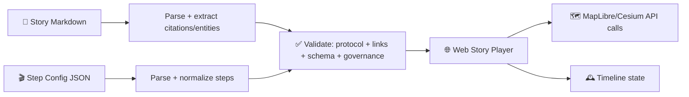

# 🧪 Story Nodes — Test Suite (`web/story_nodes/__tests__/`)

| Badge | Meaning |
|---|---|
| 🟩 **green** | safe to ship |
| 🟨 **yellow** | needs a test / needs governance review |
| 🟥 **red** | breaks trust gates |

> [!IMPORTANT]
> Story Nodes are **not “just content.”** In KFM they are *machine‑ingestible storytelling*: Markdown with semantic annotations + citations, plus step configuration that drives map/timeline behavior. Tests in this folder exist to keep Story Nodes **governed, deterministic, and safe** before they reach Focus Mode. [oai_citation:0‡MARKDOWN_GUIDE_v13.md.gdoc](file-service://file-UYVruFXfueR8veHMUKeugU) [oai_citation:1‡Kansas Frontier Matrix (KFM) – Comprehensive Technical Documentation.pdf](file-service://file-AkqwUuYPp5zePf7pv5SMxi)

---

## 🧭 Why this folder exists

KFM’s canonical pipeline is explicitly ordered (no leapfrogging):  
**ETL → STAC/DCAT/PROV catalogs → Neo4j graph → APIs → React/Map UI → Story Nodes → Focus Mode** [oai_citation:2‡MARKDOWN_GUIDE_v13.md.gdoc](file-service://file-UYVruFXfueR8veHMUKeugU)

Story Nodes sit *late* in that pipeline, which is why tests here are **trust gates**, not “nice-to-haves”:
- **Evidence-first narrative**: no unsourced claims, quotes, or data references. [oai_citation:3‡MARKDOWN_GUIDE_v13.md.gdoc](file-service://file-UYVruFXfueR8veHMUKeugU) [oai_citation:4‡MARKDOWN_GUIDE_v13.md.gdoc](file-service://file-UYVruFXfueR8veHMUKeugU)
- **Graph-aware linking**: people/places/events/documents referenced in a story should resolve to stable graph IDs. [oai_citation:5‡MARKDOWN_GUIDE_v13.md.gdoc](file-service://file-UYVruFXfueR8veHMUKeugU)
- **Focus Mode safety**: prevents “side-channels” (e.g., revealing sensitive coordinates through story UI behavior). [oai_citation:6‡MARKDOWN_GUIDE_v13.md.gdoc](file-service://file-UYVruFXfueR8veHMUKeugU)

---

## 📦 What a Story Node is (implementation view)

A Story Node typically consists of:

- 📝 **Markdown narrative** (rendered to HTML in the UI, sanitized/styled)
- 🧾 **Citations/provenance** (footnotes or inline references to cataloged evidence)
- 🧷 **Entity links** (stable identifiers that map mentions → knowledge graph)
- 🎬 **JSON step config** (drives story “slides” / steps: layers, camera, timeline) [oai_citation:7‡MARKDOWN_GUIDE_v13.md.gdoc](file-service://file-UYVruFXfueR8veHMUKeugU) [oai_citation:8‡Kansas Frontier Matrix (KFM) – Comprehensive Technical Documentation.pdf](file-service://file-AkqwUuYPp5zePf7pv5SMxi)

KFM’s technical design explicitly describes story playback like:  
“activate layer X/Y, set map camera, set timeline to year …” and then apply those instructions via **MapLibre/Cesium API calls**. [oai_citation:9‡Kansas Frontier Matrix (KFM) – Comprehensive Technical Documentation.pdf](file-service://file-AkqwUuYPp5zePf7pv5SMxi)

---

## 🗺️ Where story content lives vs where the UI consumes it

Source-of-truth narrative content is organized under the governed docs structure (draft vs published):  
`docs/reports/story_nodes/` (templates, draft, published) [oai_citation:10‡MARKDOWN_GUIDE_v13.md.gdoc](file-service://file-UYVruFXfueR8veHMUKeugU)

The UI implementation also expects story assets under the web app’s story node area (e.g., referenced assets):  
`web/story_nodes/assets/` (or equivalent) [oai_citation:11‡Kansas Frontier Matrix (KFM) – Comprehensive Technical Documentation.pdf](file-service://file-AkqwUuYPp5zePf7pv5SMxi)

✅ Tests in this folder should validate **the exact form that the web UI loads**, while staying aligned with **governed templates and schemas**.

---

## 🧠 Focus Mode trust rules these tests protect

Focus Mode is the reading experience where a Story Node is shown alongside map + timeline context, and it has “hard gate” trust rules. [oai_citation:12‡MARKDOWN_GUIDE_v13.md.gdoc](file-service://file-UYVruFXfueR8veHMUKeugU)

Minimum rules to test (directly or indirectly):

- 🧾 **Only provenance-linked content**: content without sources/IDs must not appear in Focus Mode outputs. [oai_citation:13‡MARKDOWN_GUIDE_v13.md.gdoc](file-service://file-UYVruFXfueR8veHMUKeugU)
- 🤖 **AI is opt‑in + labeled**: AI-generated text must never display by default; it must be user-triggered and labeled with uncertainty/confidence, and still respect sensitivity rules. [oai_citation:14‡MARKDOWN_GUIDE_v13.md.gdoc](file-service://file-UYVruFXfueR8veHMUKeugU)
- 🫥 **No sensitive location leaks**: sensitive locations must be generalized/omitted so Focus Mode doesn’t become a side-channel to reveal protected coordinates. [oai_citation:15‡MARKDOWN_GUIDE_v13.md.gdoc](file-service://file-UYVruFXfueR8veHMUKeugU)

---

## 🧪 What we test here

### ✅ Test categories (recommended)

| Category | Goal | Typical assertions |
|---|---|---|
| 🧾 Markdown protocol + front-matter | Docs/stories follow governed structure | valid YAML front-matter; required sections present |
| 🔗 Link/citation validation | Nothing references a missing source | no broken internal links; no unresolved citation tags |
| 🧩 JSON Schema validation | Story metadata/config conforms to schema | story config validates; step actions valid |
| 🧷 Graph entity linkage | Mentions resolve to stable graph IDs | IDs exist (fixture graph); IDs have required properties |
| 🗺️ Map/timeline integration | Steps reliably drive map state | camera targets parsed; layer toggles are correct |
| 🛡️ Sensitivity & governance | Prevent side-channels | sensitive coordinates not rendered; redaction rules honored |

These categories mirror the minimum CI gates described for v13 contributions (Markdown checks, link/reference validation, JSON Schema validation, graph integrity tests). [oai_citation:16‡MARKDOWN_GUIDE_v13.md.gdoc](file-service://file-UYVruFXfueR8veHMUKeugU)

---

## ▶️ Running tests

> [!NOTE]
> The repo may run **Jest** (common for TypeScript) and/or another runner, but `__tests__/` is a conventional discovery target.

### If using Jest (TypeScript)

Jest commonly discovers tests in `__tests__` and files named `*.test.*` or `*.spec.*` via patterns like:  
`(/__tests__/.*|\.(test|spec))\.(ts|tsx|js)$` [oai_citation:17‡S-T programming Books.pdf](file-service://file-NT32tqqzGW9RvfcNZmMH1K)

Common commands (adjust to your package manager scripts):
```bash
# From repo root (or web/), run the full test suite
jest

# Run only Story Node related tests (path filter)
jest web/story_nodes/__tests__

# Watch mode (fast iteration)
jest --watch

# Coverage (helpful when adding new validators)
jest --coverage
```
Coverage reporting is a standard Jest capability and is commonly used in TypeScript setups. [oai_citation:18‡S-T programming Books.pdf](file-service://file-NT32tqqzGW9RvfcNZmMH1K)

---

## 🧱 Directory layout (suggested)

```text
web/
└─ 📁 story_nodes/
   └─ 🧪 __tests__/
      ├─ 📄 README.md                     # ← you are here 📌
      ├─ 🧩 fixtures/
      │  ├─ 📝 story_md/                  # ← small markdown fixtures
      │  ├─ 🧾 story_cfg/                 # ← small JSON config fixtures
      │  └─ 🕸️ graph_fixture/             # ← tiny graph dataset (only what tests need)
      ├─ 🧪📄 storynode.schema.test.ts
      ├─ 🔗🧪📄 storynode.links.test.ts
      ├─ 🧬🧪📄 storynode.entities.test.ts
      ├─ 🔁🧪📄 storyplayer.integration.test.ts
      └─ 🖼️ __snapshots__/                # ← only if snapshot testing is justified
```

✅ Keep fixtures *small, local, deterministic* (no network, no huge raster assets).

---

## ✍️ Writing Story Node tests (house rules)

### 1) Evidence-first checks (non-negotiable)

A valid Story Node must:
- include provenance for claims (citations/footnotes) [oai_citation:19‡MARKDOWN_GUIDE_v13.md.gdoc](file-service://file-UYVruFXfueR8veHMUKeugU)
- reference graph entities via stable IDs [oai_citation:20‡MARKDOWN_GUIDE_v13.md.gdoc](file-service://file-UYVruFXfueR8veHMUKeugU)
- distinguish fact vs interpretation (especially if AI-assisted content exists) [oai_citation:21‡MARKDOWN_GUIDE_v13.md.gdoc](file-service://file-UYVruFXfueR8veHMUKeugU)

> [!TIP]
> Favor tests that fail with *actionable messages*:
> - “Missing citation for claim in paragraph 3”
> - “Unresolved graph ID: kfm:place:fort_riley”
> - “Invalid step config: camera.zoom must be number”

### 2) UI + map action checks (integration without flake)

Because story steps can drive MapLibre/Cesium state transitions, integration tests should:
- mock map/camera/timeline APIs
- assert **calls + payloads**, not pixels
- avoid timing sensitivity (no real animation frames)

This aligns with the design expectation that JSON step config triggers MapLibre/Cesium API calls. [oai_citation:22‡Kansas Frontier Matrix (KFM) – Comprehensive Technical Documentation.pdf](file-service://file-AkqwUuYPp5zePf7pv5SMxi)

### 3) Governance & sovereignty checks

Tests should enforce that:
- sensitive locations are generalized/omitted (no exact coordinate leak) [oai_citation:23‡MARKDOWN_GUIDE_v13.md.gdoc](file-service://file-UYVruFXfueR8veHMUKeugU)
- anything AI-generated is opt-in and clearly labeled with uncertainty/confidence [oai_citation:24‡MARKDOWN_GUIDE_v13.md.gdoc](file-service://file-UYVruFXfueR8veHMUKeugU)
- when interactive UI highlights story-linked locations, it honors CARE expectations (e.g., hiding precise coordinates when sensitive). [oai_citation:25‡MARKDOWN_GUIDE_v13.md.gdoc](file-service://file-UYVruFXfueR8veHMUKeugU)

---

## 🧰 Recommended fixtures & helpers

### Fixtures

- `fixtures/story_md/*.md`
  - minimal markdown
  - includes citations + entity refs
  - includes at least one “fact vs interpretation” example

- `fixtures/story_cfg/*.json`
  - 2–4 steps max
  - one step with layer toggles
  - one step with camera move
  - one step with timeline set

- `fixtures/graph_fixture/`
  - smallest graph subset that proves entity resolution
  - include only node labels/properties required by tests

### Helpers (suggested utilities)

- `loadStoryMarkdown()` → returns parsed AST + extracted citations
- `validateStoryNodeSchema()` → JSON Schema validation for metadata/config [oai_citation:26‡MARKDOWN_GUIDE_v13.md.gdoc](file-service://file-UYVruFXfueR8veHMUKeugU)
- `validateLinksAndRefs()` → internal link + citation tag validation [oai_citation:27‡MARKDOWN_GUIDE_v13.md.gdoc](file-service://file-UYVruFXfueR8veHMUKeugU)
- `mockMapLibre()` / `mockCesium()` → stable spies for map calls

---

## ✅ PR checklist for Story Node / Story Player changes

Use a checklist in PR descriptions to keep review crisp. [oai_citation:28‡Comprehensive Markdown Guide_ Syntax, Extensions, and Best Practices.docx](file-service://file-J6rFRcp4ExCCeCdTevQjxz)

**To ship:**
- [ ] Added/updated tests in `web/story_nodes/__tests__/`
- [ ] Story Node fixtures include citations for claims (evidence-first) [oai_citation:29‡Comprehensive Markdown Guide_ Syntax, Extensions, and Best Practices.docx](file-service://file-J6rFRcp4ExCCeCdTevQjxz) [oai_citation:30‡MARKDOWN_GUIDE_v13.md.gdoc](file-service://file-UYVruFXfueR8veHMUKeugU)
- [ ] Link/reference validation passes (no broken refs) [oai_citation:31‡MARKDOWN_GUIDE_v13.md.gdoc](file-service://file-UYVruFXfueR8veHMUKeugU)
- [ ] Schema validation passes (Story Node + UI config JSON) [oai_citation:32‡MARKDOWN_GUIDE_v13.md.gdoc](file-service://file-UYVruFXfueR8veHMUKeugU)
- [ ] No sensitive location leaks (manual spot-check if needed) [oai_citation:33‡MARKDOWN_GUIDE_v13.md.gdoc](file-service://file-UYVruFXfueR8veHMUKeugU)

---

## 🧯 Common failures & quick fixes

<details>
<summary><strong>🧾 “Missing citations / provenance”</strong></summary>

- Ensure each factual claim has a footnote or inline citation that points to a cataloged source.  
- If you added new factual text, add a source reference *in the story*, not just in code comments. [oai_citation:34‡MARKDOWN_GUIDE_v13.md.gdoc](file-service://file-UYVruFXfueR8veHMUKeugU)

</details>

<details>
<summary><strong>🔗 “Broken link / unresolved reference tag”</strong></summary>

- Update internal paths after moves/renames.  
- If a story references an ID/source that no longer exists, fix the story or restore the referenced artifact. [oai_citation:35‡MARKDOWN_GUIDE_v13.md.gdoc](file-service://file-UYVruFXfueR8veHMUKeugU)

</details>

<details>
<summary><strong>🧩 “Schema validation failed”</strong></summary>

- Re-run schema validation locally (same validator as CI).  
- Fix the config (preferred) before “loosening” the schema (requires governance review). [oai_citation:36‡MARKDOWN_GUIDE_v13.md.gdoc](file-service://file-UYVruFXfueR8veHMUKeugU)

</details>

<details>
<summary><strong>🫥 “Sensitive location leaked”</strong></summary>

- Remove exact coordinates from Story Nodes and/or ensure the UI generalizes them.  
- Add regression tests so the leak can’t return in a future refactor. [oai_citation:37‡MARKDOWN_GUIDE_v13.md.gdoc](file-service://file-UYVruFXfueR8veHMUKeugU)

</details>

---

## 🗺️ Mini mental model (how story validation flows)


```mermaid
flowchart LR
  MD[📝 Story Markdown] --> P1[Parse + extract citations/entities]
  CFG[🎬 Step Config JSON] --> P2[Parse + normalize steps]
  P1 --> V[✅ Validate: protocol + links + schema + governance]
  P2 --> V
  V --> UI[🌐 Web Story Player]
  UI --> MAP[🗺️ MapLibre/Cesium API calls]
  UI --> TL[🕰️ Timeline state]
```

---

## 📚 Related project artifacts (good starting points)

- `docs/templates/TEMPLATE__STORY_NODE_V3.md` (Story Node template) [oai_citation:38‡MARKDOWN_GUIDE_v13.md.gdoc](file-service://file-UYVruFXfueR8veHMUKeugU)
- `schemas/storynodes/` (Story Node JSON Schemas) [oai_citation:39‡MARKDOWN_GUIDE_v13.md.gdoc](file-service://file-UYVruFXfueR8veHMUKeugU)
- `docs/reports/story_nodes/` (draft/published story content) [oai_citation:40‡MARKDOWN_GUIDE_v13.md.gdoc](file-service://file-UYVruFXfueR8veHMUKeugU)
- `docs/governance/` (ethics, sovereignty, review gates) [oai_citation:41‡MARKDOWN_GUIDE_v13.md.gdoc](file-service://file-UYVruFXfueR8veHMUKeugU)

---

## 🧾 Source notes (why the rules are strict)

- Story Nodes drive interactive narratives that can link text → graph entities and map highlights (data-driven storytelling). [oai_citation:42‡Kansas Frontier Matrix (KFM) – Comprehensive Technical Documentation.pdf](file-service://file-AkqwUuYPp5zePf7pv5SMxi) [oai_citation:43‡Kansas Frontier Matrix (KFM) – Comprehensive Technical Documentation.pdf](file-service://file-AkqwUuYPp5zePf7pv5SMxi)
- Stories are authored in Markdown + JSON config and applied via MapLibre/Cesium API calls in the UI. [oai_citation:44‡Kansas Frontier Matrix (KFM) – Comprehensive Technical Documentation.pdf](file-service://file-AkqwUuYPp5zePf7pv5SMxi)
- v13 defines Story Nodes as governed narrative data: citations required, graph IDs required, fact vs interpretation separation encouraged. [oai_citation:45‡MARKDOWN_GUIDE_v13.md.gdoc](file-service://file-UYVruFXfueR8veHMUKeugU)
- v13 Focus Mode rules explicitly require opt-in AI and forbid sensitive location leaks (generalize/omit). [oai_citation:46‡MARKDOWN_GUIDE_v13.md.gdoc](file-service://file-UYVruFXfueR8veHMUKeugU)
- v13 CI gates explicitly include Markdown protocol checks, link/reference validation, schema validation, and graph integrity tests. [oai_citation:47‡MARKDOWN_GUIDE_v13.md.gdoc](file-service://file-UYVruFXfueR8veHMUKeugU)
