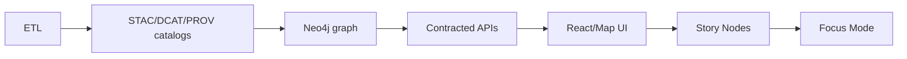
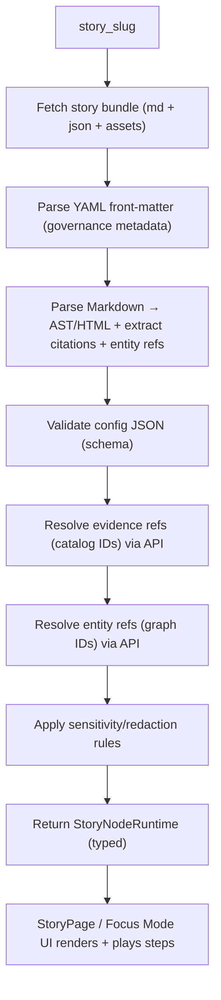

# 🧠 `web/story_nodes/loaders/` — Story Node Loaders (Story Mode + Focus Mode)


> 🎯 **Purpose:** This folder defines the **loader pipeline** that turns a *published Story Node bundle*  
> (**Markdown + JSON config + assets**) into a **validated, provenance-linked runtime model** that the UI can safely render and “play” (map/time steps).  
> Story Nodes are authored as Markdown + JSON config, and the front-end reads them to render HTML + drive map/timeline state. [oai_citation:0‡Kansas Frontier Matrix (KFM) – Comprehensive Technical Documentation.pdf](file-service://file-AkqwUuYPp5zePf7pv5SMxi)

---

## 🧭 Why loaders exist (the “trust surface” rule)

KFM’s narrative experience is not “just content.” It is a governed stage in the canonical pipeline:



- **No stage may leapfrog** earlier stages or bypass contracts/outputs. [oai_citation:1‡MARKDOWN_GUIDE_v13.md.gdoc](file-service://file-UYVruFXfueR8veHMUKeugU)
- Story Nodes are **machine-ingestible narrative artifacts**: Markdown with semantic annotations + citations, suitable for parsing/indexing/cross-linking. [oai_citation:2‡MARKDOWN_GUIDE_v13.md.gdoc](file-service://file-UYVruFXfueR8veHMUKeugU)

✅ **Implication:** loaders are a *hard gate* between “files on disk/CDN” and “facts rendered in the UI.”

---

## 🧩 What is a Story Node (requirements loaders must enforce)

A valid Story Node must (at minimum):

1. **Include provenance for every claim** (footnotes/inline citations that point to cataloged sources). [oai_citation:3‡MARKDOWN_GUIDE_v13.md.gdoc](file-service://file-UYVruFXfueR8veHMUKeugU)
2. **Reference graph entities with stable identifiers** (people/places/events/docs → graph IDs). [oai_citation:4‡MARKDOWN_GUIDE_v13.md.gdoc](file-service://file-UYVruFXfueR8veHMUKeugU)
3. **Distinguish fact vs interpretation** (especially when AI assistance is involved). [oai_citation:5‡MARKDOWN_GUIDE_v13.md.gdoc](file-service://file-UYVruFXfueR8veHMUKeugU)

> 🧠 “Story nodes use the graph to link narrative text to data” — e.g., names become interactive elements that can surface graph-backed context. [oai_citation:6‡Kansas Frontier Matrix (KFM) – Comprehensive Technical Documentation.pdf](file-service://file-AkqwUuYPp5zePf7pv5SMxi)

---

## 📦 What gets loaded

From an implementation perspective, each story is authored as:

- 📝 **Markdown narrative** (text + citations + images)
- 🧭 **JSON config** (map/timeline “steps”)
- 🗂️ **Assets** (images/media) referenced by the story

The front-end reads these files, renders Markdown as HTML (sanitized), loads images from `web/story_nodes/assets` (or links), and applies JSON instructions like:  
“activate layer X/Y, set map camera to `[lon, lat, zoom]`, set timeline to year 1935.” [oai_citation:7‡Kansas Frontier Matrix (KFM) – Comprehensive Technical Documentation.pdf](file-service://file-AkqwUuYPp5zePf7pv5SMxi)

---

## 🗺️ Expected runtime behavior (what the loader output must support)

Story Mode is a guided tour: narrative + synchronized map/time updates.

- UI navigation: next/prev buttons or scroll-driven progress
- Steps can drive: layers, camera/viewport, time, and highlights [oai_citation:8‡Kansas Frontier Matrix (KFM) – Comprehensive Technical Documentation.pdf](file-service://file-AkqwUuYPp5zePf7pv5SMxi)

---

## 🧱 Loader responsibilities

Loaders in this directory should be **pure-ish pipeline code**: IO + parsing + validation + resolution + gating.

### ✅ Must do
- Fetch story artifacts (Markdown, JSON config, local/remote assets).
- Parse **YAML front-matter** (governance metadata) when present.
- Parse Markdown into a safe render model (sanitized HTML or AST).
- Extract:
  - citations/footnotes → evidence panel model
  - entity references → graph lookup requests
- Validate config JSON against the **Story Node schema** (contract-first).
- Resolve evidence references against catalog IDs (STAC/DCAT/PROV) via the API boundary.
- Enforce **Focus Mode hard-gate rules** (see below).
- Return a single, typed, deterministic runtime object to the UI.

### ❌ Must not do
- Render UI components (no React here).
- Talk to Neo4j directly (only through contracted APIs).
- “Fill in missing facts” (no silent inference, no auto-fabrication).
- Leak sensitive precision (coordinates, restricted datasets, hidden attributes).

---

## 🔒 Focus Mode hard gates (enforced by loaders)

Focus Mode is explicitly designed with strict trust rules:

- **Only provenance-linked content** can appear (hard gate: if it lacks a source/ID, it must not render). [oai_citation:9‡MARKDOWN_GUIDE_v13.md.gdoc](file-service://file-UYVruFXfueR8veHMUKeugU)
- **AI contributions are opt-in + clearly labeled** with uncertainty/confidence, and must respect sensitivity rules. [oai_citation:10‡MARKDOWN_GUIDE_v13.md.gdoc](file-service://file-UYVruFXfueR8veHMUKeugU)
- **No sensitive location leaks**: map locations must be generalized/omitted as required (no side-channel via story playback). [oai_citation:11‡MARKDOWN_GUIDE_v13.md.gdoc](file-service://file-UYVruFXfueR8veHMUKeugU)

> 🧷 Practical translation for loaders: **validation failures should fail closed** (block or degrade safely), not fail open.

---

## 🗂️ Source-of-truth vs runtime packaging

Story content is governed under the repository’s docs structure (draft vs published), then surfaced to the web runtime:

- Governed story content lives under `docs/reports/story_nodes/` (draft/published). [oai_citation:12‡MARKDOWN_GUIDE_v13.md.gdoc](file-service://file-UYVruFXfueR8veHMUKeugU) [oai_citation:13‡MARKDOWN_GUIDE_v13.md.gdoc](file-service://file-UYVruFXfueR8veHMUKeugU)
- Story Node authoring uses a standard template: `docs/templates/TEMPLATE__STORY_NODE_V3.md`. [oai_citation:14‡MARKDOWN_GUIDE_v13.md.gdoc](file-service://file-UYVruFXfueR8veHMUKeugU)
- The web runtime includes `web/story_nodes/` as the interactive story content home (Markdown + config JSON). [oai_citation:15‡Kansas Frontier Matrix (KFM) – Comprehensive Technical Documentation.pdf](file-service://file-AkqwUuYPp5zePf7pv5SMxi)

📌 Many repos implement a small “publish/copy” step that syncs **published** Story Nodes into a web-readable bundle. If you add such a step, loaders should treat it as the only runtime input and still validate everything.

---

## 🧬 Typical on-disk layout (runtime bundle)

> Folder names can vary — the loader contract is: “given a `story_slug`, find the narrative + config + assets.”

```text
web/story_nodes/
├─ 🧾📄 index.json                  # list of available stories (optional)
├─ 📁 published/
│  └─ 🏷️📁 <story_slug>/
│     ├─ 📝 story.md                # Markdown narrative (citations + entity refs)
│     ├─ 🧭🧾 story.json             # step config (map/time/layers)
│     ├─ 📄🧾 manifest.json          # optional: explicit asset + metadata manifest
│     └─ 🖼️ assets/
│        ├─ 🖼️ hero.jpg
│        └─ 🖼️ photo_01.png
```

---

## 🔁 Loader pipeline (recommended architecture)



---

## 🧾 Governance metadata (front-matter)

KFM-style governed documents often use YAML front-matter to declare metadata like versioning, status, sensitivity/classification, and FAIR/CARE labels. [oai_citation:16‡Comprehensive Markdown Guide_ Syntax, Extensions, and Best Practices.docx](file-service://file-J6rFRcp4ExCCeCdTevQjxz)

### ✅ Loader expectations
- Parse front-matter (if present).
- Validate required keys (per schema/policy).
- Use metadata to enforce gating:
  - classification/sensitivity → redaction behavior
  - care_label → reviewer/guardrail triggers (as applicable)

<details>
<summary>📌 Example front-matter shape (illustrative)</summary>

```yaml
---
title: "Prairie Fires: Patterns & Policy"
version: "v1.0.0"
status: "published"
doc_kind: "Story Node"
story_slug: "prairie_fires"
last_updated: "2026-01-01"
fair_category: "FAIR+CARE"
care_label: "Public"
sensitivity: "public"
classification: "open"
story_uuid: "urn:kfm:story:prairie_fires:v1.0.0"
---
```

</details>

---

## 🧠 Loader output contract (runtime model)

> Keep the output **UI-friendly** (renderable + actionable), but **trust-safe** (validated + provenance-linked).

```ts
export type StorySlug = string;

export interface EvidenceRef {
  id: string;                 // stable catalog/record id
  kind: "STAC" | "DCAT" | "PROV" | "External";
  label?: string;
  href?: string;              // optional: resolved link to catalog UI
}

export interface EntityRef {
  graphId: string;            // stable ID into KFM graph (via API)
  label?: string;             // display name
  kind?: "Person" | "Place" | "Event" | "Document" | string;
}

export interface StoryStep {
  id: string;
  title?: string;

  // Timeline control
  time?: string | { start: string; end?: string };

  // Map control (2D/3D)
  camera?: { center: [number, number]; zoom: number; bearing?: number; pitch?: number };
  layers?: { on?: string[]; off?: string[] };

  // Optional highlights/annotations
  highlight?: { entityIds?: string[]; geojsonId?: string };
}

export interface StoryNodeRuntime {
  slug: StorySlug;

  // From front-matter
  meta: Record<string, unknown>;

  // Renderable narrative (sanitized)
  markdown: string;
  html: string;               // or AST

  // Evidence + entities
  evidence: EvidenceRef[];
  entities: EntityRef[];

  // Playback
  steps: StoryStep[];

  // Governance signals
  redactionsApplied: string[];
  warnings: string[];
}
```

---

## 🧼 Security: Markdown & media hygiene

Because Story Nodes render user-visible HTML:

- Sanitize HTML output (XSS-safe).
- Enforce safe link policies (`rel="noopener noreferrer"`, optional allowlist).
- Require alt text for images when possible.
- Block or degrade external embeds that bypass provenance.

> 🧭 Remember: Focus Mode is a “hard gate” for provenance-linked content. [oai_citation:17‡MARKDOWN_GUIDE_v13.md.gdoc](file-service://file-UYVruFXfueR8veHMUKeugU)

---

## ⚡ Performance: cache + progressive loading

Story playback often causes repeated fetches (steps, evidence panels, entity tooltips). Use caching:

- Cache resolved story bundles per `story_slug`
- Cache resolved evidence/entities per ID
- Use LRU/TTL eviction

Caching window + eviction is a standard approach to reusing intermediate results and improving repeated-query performance. [oai_citation:18‡Scalable Data Management for Future Hardware.pdf](file-service://file-GZ8gMsQ8hxu7GWEVd3csNE)

📌 Bonus: keep Markdown parsing off the critical path (parse once, reuse; consider background parsing for large stories).

---

## ♿ Accessibility expectations (loader-adjacent)

The web app is designed to be **responsive and accessible** across devices. [oai_citation:19‡Kansas Frontier Matrix (KFM) – Comprehensive Technical Documentation.pdf](file-service://file-AkqwUuYPp5zePf7pv5SMxi)  
Loaders support this by providing structured content that renderers can display accessibly:

- preserve heading structure (`#`, `##`, …)
- expose citations/evidence as navigable lists
- avoid injecting non-semantic HTML

---

## 🧪 Testing strategy

### Unit tests ✅
- Markdown front-matter parsing
- Citation extraction (every factual claim has an evidence ref)
- Entity reference extraction + resolution
- JSON schema validation (good/bad fixtures)
- Redaction enforcement (sensitive coords → generalized)

### Integration tests 🔗
- “Story playback”: step transitions correctly drive:
  - map camera
  - layer registry toggles
  - timeline state
- “Fail closed”: invalid story → safe error UI, no partial unsourced render

---

## ➕ Adding a new loader (checklist)

- [ ] Define the **loader boundary** (input slug → output runtime model)
- [ ] Validate against schemas (contract-first)
- [ ] Enforce Focus Mode gates (provenance-only; no sensitive leaks) [oai_citation:20‡MARKDOWN_GUIDE_v13.md.gdoc](file-service://file-UYVruFXfueR8veHMUKeugU)
- [ ] Add tests (fixtures for valid/invalid stories)
- [ ] Document the public API (export from `index.ts`)
- [ ] Confirm story authoring aligns with template `TEMPLATE__STORY_NODE_V3.md` [oai_citation:21‡MARKDOWN_GUIDE_v13.md.gdoc](file-service://file-UYVruFXfueR8veHMUKeugU)

---

## 🧯 Troubleshooting (common failure modes)

- **Missing citations / evidence refs** → block Focus Mode render; show “Missing provenance” message.
- **Unknown graph entity IDs** → render text, but disable entity popovers (and log warning).
- **Schema mismatch in config JSON** → fail closed; show “Invalid story config” with step ID.
- **Sensitive location present** → apply generalization/redaction and record `redactionsApplied`.

---

## 🔍 Where to look next

- 📘 Canonical pipeline + invariants: `docs/MASTER_GUIDE_v13.md` [oai_citation:22‡MARKDOWN_GUIDE_v13.md.gdoc](file-service://file-UYVruFXfueR8veHMUKeugU)
- 🧩 Story Node template: `docs/templates/TEMPLATE__STORY_NODE_V3.md` [oai_citation:23‡MARKDOWN_GUIDE_v13.md.gdoc](file-service://file-UYVruFXfueR8veHMUKeugU)
- 🗂️ Story Node content: `docs/reports/story_nodes/` (draft/published) [oai_citation:24‡MARKDOWN_GUIDE_v13.md.gdoc](file-service://file-UYVruFXfueR8veHMUKeugU)
- 🧾 Schemas: `schemas/` (incl. story nodes + UI schemas) [oai_citation:25‡MARKDOWN_GUIDE_v13.md.gdoc](file-service://file-UYVruFXfueR8veHMUKeugU)

---

## 📚 Source refs used to define loader rules

- Story authored as Markdown + JSON; front-end loads/sanitizes/plays steps [oai_citation:26‡Kansas Frontier Matrix (KFM) – Comprehensive Technical Documentation.pdf](file-service://file-AkqwUuYPp5zePf7pv5SMxi)
- `web/story_nodes/` houses story content as Markdown narrative + JSON config [oai_citation:27‡Kansas Frontier Matrix (KFM) – Comprehensive Technical Documentation.pdf](file-service://file-AkqwUuYPp5zePf7pv5SMxi)
- Story Nodes requirements: provenance, entity refs, fact vs interpretation [oai_citation:28‡MARKDOWN_GUIDE_v13.md.gdoc](file-service://file-UYVruFXfueR8veHMUKeugU)
- Focus Mode rules: provenance-only, AI opt-in transparency, no sensitive leaks [oai_citation:29‡MARKDOWN_GUIDE_v13.md.gdoc](file-service://file-UYVruFXfueR8veHMUKeugU)
- YAML front-matter governance metadata pattern [oai_citation:30‡Comprehensive Markdown Guide_ Syntax, Extensions, and Best Practices.docx](file-service://file-J6rFRcp4ExCCeCdTevQjxz)
- Caching window + eviction as a reuse strategy [oai_citation:31‡Scalable Data Management for Future Hardware.pdf](file-service://file-GZ8gMsQ8hxu7GWEVd3csNE)
