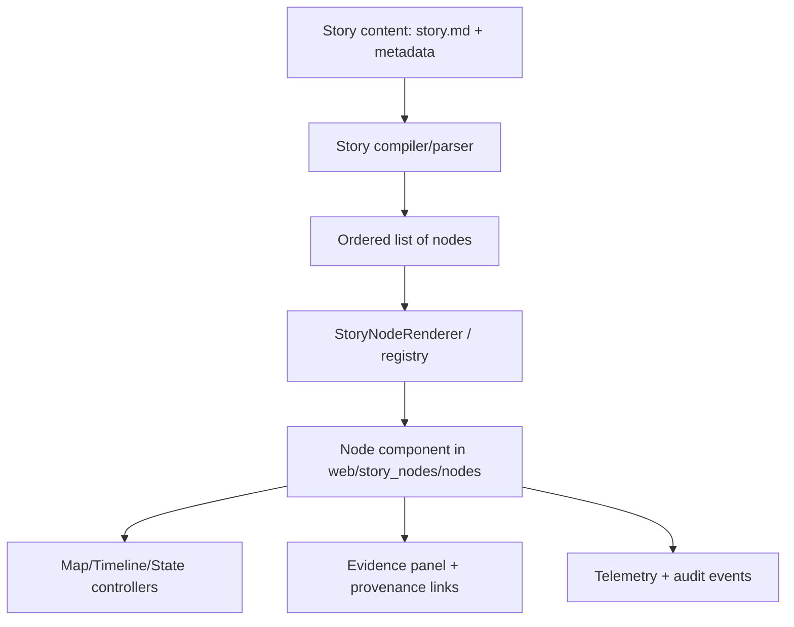

# 🧩 Story Node Renderers (`web/story_nodes/nodes/`)


> **What this folder is:** the **React/TypeScript renderers** for individual **Story Node step types** used by the Story experience (e.g., `StoryPage` / **Focus Mode**).  
> Story Nodes are designed as **machine‑ingestible storytelling units** (human narrative + structured references) that can be compiled and rendered reliably.  [oai_citation:0‡Scalable Data Management for Future Hardware.pdf](file-service://file-GZ8gMsQ8hxu7GWEVd3csNE)

---

## 📘 Overview

### Purpose 🎯
Story Nodes are KFM’s **guided, evidence-linked** narrative format. In Focus Mode, users read a story while the map/data/visuals stay synchronized — without breaking provenance or governance rules.  [oai_citation:1‡Scalable Data Management for Future Hardware.pdf](file-service://file-GZ8gMsQ8hxu7GWEVd3csNE)

This directory exists so we can:
- ✅ Render many node “kinds” (text, map state, media, charts, graphs, embeds…)
- ✅ Keep the system **extensible** (add new node types without rewriting the whole StoryPage)
- ✅ Enforce **trust gates** (citations, redaction, sensitivity rules, AI labeling) at the renderer layer  [oai_citation:2‡MARKDOWN_GUIDE_v13.md.gdoc](file-service://file-UYVruFXfueR8veHMUKeugU)

### Scope ✅ / ❌

| ✅ In this folder | ❌ Not in this folder |
|---|---|
| Node components (`<SomethingNode />`) | Authoring story content itself (Markdown, assets) |
| Node registry / dispatcher (type → renderer) | Raw data ingestion / processing pipelines |
| Shared UI helpers for nodes (layout, evidence panel glue, safe embeds) | Neo4j/PostGIS direct queries (must go via API) |
| Telemetry hooks for story interactions | Schema definitions (those live in `schemas/`) |

**Pipeline invariant:** the UI (including Story Nodes) must **not** skip layers (Graph → API → UI), and the UI must **never query Neo4j directly** — all retrievals go through the API boundary.  [oai_citation:3‡MARKDOWN_GUIDE_v13.md.gdoc](file-service://file-UYVruFXfueR8veHMUKeugU)

---

## 🗂️ Directory Layout

### “Where things live” 🧭

Canonical v13 story authoring & publishing workflow places stories under:

- `docs/reports/story_nodes/`
  - `draft/`
  - `published/<story_slug>/story.md`
  - `published/<story_slug>/assets/`  [oai_citation:4‡MARKDOWN_GUIDE_v13.md.gdoc](file-service://file-UYVruFXfueR8veHMUKeugU)

This was an explicit v13 redesign move (“moved story content to `docs/reports/story_nodes/` with draft/published workflow”).  [oai_citation:5‡MARKDOWN_GUIDE_v13.md.gdoc](file-service://file-UYVruFXfueR8veHMUKeugU)

At the same time, the web app historically treats Story Nodes as **content + configuration** that the UI reads to present a guided tour (Markdown narrative + a JSON step sequence controlling map views/layers).  [oai_citation:6‡Kansas Frontier Matrix (KFM) – Comprehensive Technical Documentation.pdf](file-service://file-AkqwUuYPp5zePf7pv5SMxi)

So, in practice:
- ✅ **Content**: `docs/reports/story_nodes/...` (authoring + review + publishing)
- ✅ **Runtime/Rendering**: `web/story_nodes/...` (StoryPage/Focus Mode engine)
- ✅ **This folder**: `web/story_nodes/nodes/...` (the per‑node renderers)

### Suggested internal structure (recommended) 🧱

> Your local tree may vary — this is the “north star” layout for maintainability.

```text
web/
└─ 📁 story_nodes/
   └─ 📦 nodes/                      # 👈 you are here 📌
      ├─ 📄 README.md
      ├─ 🧩📄 registry.ts             # type → component mapping
      ├─ 🧾📄 types.ts                # TS types for node payloads + props
      ├─ 🧱 base/
      │  ├─ 🧱🖼️📄 BaseNodeFrame.tsx   # shared layout (title, evidence toggle, etc.)
      │  └─ 🧾🧬📄 EvidencePanel.tsx    # citations + provenance UI hook
      ├─ 📝 markdown/
      ├─ 🗺️ map/
      ├─ 🎞️ media/
      ├─ 📊 chart/
      ├─ 🕸️ graph/
      └─ 🔗 embed/
```

---

## 🧠 Concepts & Contracts

### Story Nodes = “machine-ingestible storytelling” 🧬
Story Nodes are written so both humans *and* the system can understand them:
- Each node is a **typed block** with structured fields
- Narrative text is paired with **citations and graph/entity references**
- The UI can compile it into a deterministic reading experience  [oai_citation:7‡Scalable Data Management for Future Hardware.pdf](file-service://file-GZ8gMsQ8hxu7GWEVd3csNE)

### Focus Mode trust rules (hard gates) 🔒
Node renderers must enforce Focus Mode constraints:

- **AI content must be opt‑in + clearly labeled** (and include uncertainty/confidence).  [oai_citation:8‡MARKDOWN_GUIDE_v13.md.gdoc](file-service://file-UYVruFXfueR8veHMUKeugU)
- **No sensitive location leaks**: map views must generalize/omit protected locations; Focus Mode must not become a “side channel” around sovereignty restrictions.  [oai_citation:9‡MARKDOWN_GUIDE_v13.md.gdoc](file-service://file-UYVruFXfueR8veHMUKeugU)
- Focus Mode operationalizes: **“no new narrative without sources, no data without provenance.”**  [oai_citation:10‡MARKDOWN_GUIDE_v13.md.gdoc](file-service://file-UYVruFXfueR8veHMUKeugU)

### Renderer responsibilities ✅
Every node renderer should:
1. **Render the node payload** (text/media/chart/etc.)
2. **Apply side-effects safely** via the Story engine (e.g., update map state)
3. **Expose provenance** (evidence panel, dataset links, graph entity deep links)
4. **Emit telemetry** (enter/exit node, user interactions, redaction notices)

Governance emphasizes auditability — e.g., emitting an event like `focus_mode_redaction_notice_shown` when something is withheld/generalized.  [oai_citation:11‡MARKDOWN_GUIDE_v13.md.gdoc](file-service://file-UYVruFXfueR8veHMUKeugU)

---

## 🔁 Rendering Flow



The “guided tour” concept often looks like:
- Markdown narrative + embedded assets
- JSON/metadata defining steps such as “zoom here, enable these layers, show this photo”  [oai_citation:12‡Kansas Frontier Matrix (KFM) – Comprehensive Technical Documentation.pdf](file-service://file-AkqwUuYPp5zePf7pv5SMxi)

---

## 🧾 Node Data Contract (pattern)

> Keep contracts **schema-first**. The Story engine should validate node payloads against `schemas/storynodes/` and TypeScript types should mirror the schema. Story Node content metadata is explicitly part of schema validation gates.  [oai_citation:13‡MARKDOWN_GUIDE_v13.md.gdoc](file-service://file-UYVruFXfueR8veHMUKeugU)

**Minimal example shape (illustrative):**
```ts
type StoryNode =
  | { id: string; type: "markdown"; md: string; evidence?: EvidenceRef[] }
  | { id: string; type: "map"; camera: CameraState; layers: LayerSpec[]; evidence?: EvidenceRef[] }
  | { id: string; type: "media"; items: MediaItem[]; caption?: string; evidence?: EvidenceRef[] }
  | { id: string; type: "chart"; spec: ChartSpec; bindsToMap?: boolean; evidence?: EvidenceRef[] }
  | { id: string; type: "embed"; url: string; allowlistPolicy: "strict"; evidence?: EvidenceRef[] };
```

💡 *Design note:* configuration-driven behavior reduces “customization” pain and increases flexibility over time — prefer data/metadata-driven variation rather than hardcoding per-story logic.  [oai_citation:14‡F-H programming Books.pdf](file-service://file-QofzooQDG9grJwh9nFN9SY)

---

## ➕ Adding a New Node Type

### 1) Define the contract 📜
- Add/update JSON Schema in `schemas/storynodes/` (new `type`, payload fields, defaults)
- Update TypeScript types in `web/story_nodes/...` to match the schema

CI will validate Story Node metadata/content against the Story Node schema.  [oai_citation:15‡MARKDOWN_GUIDE_v13.md.gdoc](file-service://file-UYVruFXfueR8veHMUKeugU)

### 2) Implement the renderer 🧱
- Create a component in `web/story_nodes/nodes/<your_node>/`
- Use shared layout (`BaseNodeFrame`) so evidence + headers behave consistently
- Keep side effects behind “controllers” (map/timeline hooks), not inside random component effects

### 3) Register it 🧷
- Add the node to `registry.ts` (type → component mapping)
- Ensure unknown types fail gracefully:
  - Render a fallback “Unsupported node type” with a dev-friendly error
  - Don’t crash the whole story

### 4) Enforce Focus Mode rules 🔐
- If the node can reveal location: ensure it respects sensitivity/generalization rules  [oai_citation:16‡MARKDOWN_GUIDE_v13.md.gdoc](file-service://file-UYVruFXfueR8veHMUKeugU)
- If the node can display AI output: make it opt‑in + labeled + include uncertainty/confidence  [oai_citation:17‡MARKDOWN_GUIDE_v13.md.gdoc](file-service://file-UYVruFXfueR8veHMUKeugU)

### 5) Tests + fixtures 🧪
At minimum:
- Unit test: renderer handles valid payload
- Negative test: renderer rejects/handles invalid payload
- Contract test: schema validation passes/fails appropriately
- Visual/regression test (if available)

---

## 🧪 Validation & CI Gates (what will fail your PR)

KFM CI is intentionally strict:

- **Markdown protocol & front-matter check** (docs must follow the governed template)  [oai_citation:18‡MARKDOWN_GUIDE_v13.md.gdoc](file-service://file-UYVruFXfueR8veHMUKeugU)
- **Link/citation validation** (no broken internal links; no unresolved citation refs)  [oai_citation:19‡MARKDOWN_GUIDE_v13.md.gdoc](file-service://file-UYVruFXfueR8veHMUKeugU)
- **JSON Schema validation** (STAC/DCAT/PROV and Story Node metadata/content)  [oai_citation:20‡MARKDOWN_GUIDE_v13.md.gdoc](file-service://file-UYVruFXfueR8veHMUKeugU)
- **Graph integrity tests** (Neo4j constraints/ontology regressions)  [oai_citation:21‡MARKDOWN_GUIDE_v13.md.gdoc](file-service://file-UYVruFXfueR8veHMUKeugU)
- **API contract tests** (OpenAPI/GraphQL schemas; backward compatibility)  [oai_citation:22‡MARKDOWN_GUIDE_v13.md.gdoc](file-service://file-UYVruFXfueR8veHMUKeugU)
- **Security & governance scans** (secret scanning, PII checks, sensitive location checks, classification consistency)  [oai_citation:23‡MARKDOWN_GUIDE_v13.md.gdoc](file-service://file-UYVruFXfueR8veHMUKeugU)

---

## 🗺️ Map & Visualization Notes (node-specific)

The front-end mapping stack is designed around:
- **MapLibre** for 2D
- **Cesium** for 3D
- GeoJSON/TopoJSON for lightweight dynamic layers
- Vector tiles for heavier layers/performance  [oai_citation:24‡Kansas Frontier Matrix (KFM) – Comprehensive Technical Documentation.pdf](file-service://file-AkqwUuYPp5zePf7pv5SMxi)

3D is powerful, but computationally heavier and often **opt-in**.  [oai_citation:25‡Kansas Frontier Matrix (KFM) – Comprehensive Technical Documentation.pdf](file-service://file-AkqwUuYPp5zePf7pv5SMxi)

If you’re building `MapNode`, `LayerNode`, `3DNode`, or similar:
- Prefer tiles for large datasets (don’t push huge GeoJSON blobs to the browser)
- Consider a timeline slider pattern for time-aware layers/stories  [oai_citation:26‡Kansas-Frontier-Matrix_ Open-Source Geospatial Historical Mapping Hub Design.pdf](file-service://file-ShqHKgjxCS9UT9vbcxDNzA)
- Treat “2D → 3D transitions” as a UX moment; don’t do it unexpectedly  [oai_citation:27‡Kansas Frontier Matrix (KFM) – Comprehensive Technical Documentation.pdf](file-service://file-AkqwUuYPp5zePf7pv5SMxi)

---

## 📊 Charts, Analytics & “Chart ↔ Map” Binding

Some story experiences benefit from **interactive charts that control the map** (click a point in time → show the corresponding layer/view). This is a proven pattern in remote sensing workflows, where chart clicks reveal spatial imagery for the selected date.  [oai_citation:28‡Cloud-Based Remote Sensing with Google Earth Engine-Fundamentals and Applications.pdf](file-service://file-JVv3nbvtonX1HcpeERi9kV)

If you implement `ChartNode`:
- Keep it fast (downsample/aggregate server-side)
- Provide the evidence panel entries for computed values
- Avoid ambiguous outputs; label units, sources, and uncertainty

---

## ⚡ Performance Rules of Thumb

### Fetch less, render less 🧠
- Avoid “select everything” patterns — wildcard selection can cause excess IO/network/memory load.  [oai_citation:29‡S-T programming Books.pdf](file-service://file-NT32tqqzGW9RvfcNZmMH1K)
- Cache/Reuse where it’s safe: caching intermediate results can drastically improve execution for repeated/similar queries (but be mindful of memory).  [oai_citation:30‡Scalable Data Management for Future Hardware.pdf](file-service://file-GZ8gMsQ8hxu7GWEVd3csNE)

### UI tactics 🧩
- Lazy-load heavyweight node renderers (3D, large charts, large media galleries)
- Virtualize long lists (citations, entity lists, datasets)
- Debounce map updates triggered by scroll/step changes

---

## 🧑‍🦽 Accessibility & Responsive Design

Story Nodes should work across devices:
- Mobile/Tablet: readable typography, touch targets, responsive layout
- Keyboard navigation: stepper controls, evidence toggles, focus states
- Reduced motion: respect OS preferences, especially for map fly-to animations

> The web app is expected to be responsive and accessible.  [oai_citation:31‡Kansas Frontier Matrix (KFM) – Comprehensive Technical Documentation.pdf](file-service://file-AkqwUuYPp5zePf7pv5SMxi)

---

## 🔐 Security, Privacy, and Safety

Node renderers must be defensive:
- Sanitize Markdown (no arbitrary HTML/script execution)
- Embed nodes must use a **strict allowlist** (no “open iframe”)
- Never leak protected coordinates (even via hover tooltips, URL params, or hidden JSON blobs)  [oai_citation:32‡MARKDOWN_GUIDE_v13.md.gdoc](file-service://file-UYVruFXfueR8veHMUKeugU)
- Telemetry must not capture sensitive content; log only what’s necessary (and ensure redaction events are explicit)  [oai_citation:33‡MARKDOWN_GUIDE_v13.md.gdoc](file-service://file-UYVruFXfueR8veHMUKeugU)

---

## ✅ Definition of Done (for a Node PR)

- [ ] Node schema updated (`schemas/storynodes/`)
- [ ] TS types aligned with schema
- [ ] Renderer implemented + registered
- [ ] Evidence panel wired (citations render + link out)
- [ ] Focus Mode rules enforced (AI opt-in, sensitive location protection)  [oai_citation:34‡MARKDOWN_GUIDE_v13.md.gdoc](file-service://file-UYVruFXfueR8veHMUKeugU) [oai_citation:35‡MARKDOWN_GUIDE_v13.md.gdoc](file-service://file-UYVruFXfueR8veHMUKeugU)
- [ ] Telemetry events emitted (including redaction notices where applicable)  [oai_citation:36‡MARKDOWN_GUIDE_v13.md.gdoc](file-service://file-UYVruFXfueR8veHMUKeugU)
- [ ] Unit + contract tests added
- [ ] No broken links/citations; CI gates pass  [oai_citation:37‡MARKDOWN_GUIDE_v13.md.gdoc](file-service://file-UYVruFXfueR8veHMUKeugU)

---

## 🧰 Troubleshooting

### “My node type doesn’t render”
- Confirm it’s registered in `registry.ts`
- Confirm schema + TS types include the new `type`
- Check for schema validation failure (CI will block merges)  [oai_citation:38‡MARKDOWN_GUIDE_v13.md.gdoc](file-service://file-UYVruFXfueR8veHMUKeugU)

### “Map jumps to the wrong place”
- Validate camera state ordering (node activation vs async layer load)
- Ensure sensitive locations are generalized/omitted (don’t “zoom into” protected points)  [oai_citation:39‡MARKDOWN_GUIDE_v13.md.gdoc](file-service://file-UYVruFXfueR8veHMUKeugU)

### “AI text appears unexpectedly”
- That’s a bug: AI output must be opt-in + labeled + uncertainty-scored  [oai_citation:40‡MARKDOWN_GUIDE_v13.md.gdoc](file-service://file-UYVruFXfueR8veHMUKeugU)

---

## 📚 Project Reference Shelf (useful when designing node types)

<details>
<summary><strong>📦 Click to expand the full reference list</strong> (project PDFs & books)</summary>

### 🌍 Geospatial + Cartography + Mapping
- 📗 *Making Maps: A Visual Guide to Map Design for GIS*
- 📘 *Mobile Mapping: Space, Cartography and the Digital*
- 🛰️ *Cloud-Based Remote Sensing with Google Earth Engine* (interactive chart ↔ map pattern)  [oai_citation:41‡Cloud-Based Remote Sensing with Google Earth Engine-Fundamentals and Applications.pdf](file-service://file-JVv3nbvtonX1HcpeERi9kV)
- 🧭 *Python Geospatial Analysis Cookbook*
- 🏺 *Archaeological 3D GIS*
- 🧱 *Kansas Frontier Matrix — Comprehensive Technical Documentation* (MapLibre/Cesium + Story Nodes)  [oai_citation:42‡Kansas Frontier Matrix (KFM) – Comprehensive Technical Documentation.pdf](file-service://file-AkqwUuYPp5zePf7pv5SMxi)

### 🎨 Web UI / Front-End
- 📙 *Responsive Web Design with HTML5 and CSS3*
- 🧊 *WebGL Programming Guide* (for custom 3D/GL node renderers)
- 🗺️ KFM mapping stack notes (MapLibre/Cesium, vector tiles)  [oai_citation:43‡Kansas Frontier Matrix (KFM) – Comprehensive Technical Documentation.pdf](file-service://file-AkqwUuYPp5zePf7pv5SMxi)

### 🧠 Data Science / Stats / ML (for `ChartNode`, `AnalysisNode`)
- 📕 *Regression Analysis with Python*
- 📒 *Regression analysis using Python (slides)*
- 📗 *Think Bayes (Bayesian statistics in Python)*
- 📘 *Understanding Statistics & Experimental Design*
- 📙 *Graphical Data Analysis with R*

### 🗄️ Data / DB / Performance (for query-heavy nodes)
- 📘 *PostgreSQL Notes for Professionals*
- 📗 *Database Performance at Scale*
- 📙 *Scalable Data Management for Future Hardware* (caching & reuse)  [oai_citation:44‡Scalable Data Management for Future Hardware.pdf](file-service://file-GZ8gMsQ8hxu7GWEVd3csNE)
- 🧩 *Data Spaces*

### 🧬 Modeling / Simulation / Optimization (for future `SimulationNode`)
- 🚀 *Scientific Modeling and Simulation (NASA-grade guide)*
- 🏗️ *Generalized Topology Optimization for Structural Design*
- 🧠 *Spectral Geometry of Graphs* (graph viz + analytics nodes)

### 🧑‍⚖️ Ethics / Law / Humanism (for governance-aware UI decisions)
- ⚖️ *On the path to AI Law’s prophecies...*
- 🧑‍🤝‍🧑 *Introduction to Digital Humanism*
- 🧬 *Principles of Biological Autonomy*

### 🔐 Security (for embed + markdown safety)
- 🛡️ *Ethical Hacking and Countermeasures*
- 🐍 *Gray Hat Python*
- 🖼️ *Compressed Image File Formats (JPEG/PNG/GIF/BMP...)* (asset optimization)

### 📚 “Programming Books” Compendiums
- 📦 *A programming Books*
- 📦 *B-C programming Books*
- 📦 *D-E programming Books*
- 📦 *F-H programming Books*
- 📦 *I-L programming Books*
- 📦 *M-N programming Books*
- 📦 *O-R programming Books*
- 📦 *S-T programming Books*
- 📦 *U-X programming Books*

</details>

---

## 🧾 Sources (KFM-specific, load-bearing)

- Master Guide v13 pipeline ordering + API boundary rule (UI must not hit Neo4j directly)  [oai_citation:45‡MARKDOWN_GUIDE_v13.md.gdoc](file-service://file-UYVruFXfueR8veHMUKeugU)
- Story Nodes as machine-ingestible units + Focus Mode relationship  [oai_citation:46‡Scalable Data Management for Future Hardware.pdf](file-service://file-GZ8gMsQ8hxu7GWEVd3csNE)
- Focus Mode trust rules (AI opt-in, no sensitive location leaks)  [oai_citation:47‡MARKDOWN_GUIDE_v13.md.gdoc](file-service://file-UYVruFXfueR8veHMUKeugU) [oai_citation:48‡MARKDOWN_GUIDE_v13.md.gdoc](file-service://file-UYVruFXfueR8veHMUKeugU)
- Canonical story content location (`docs/reports/story_nodes/`, draft/published workflow)  [oai_citation:49‡MARKDOWN_GUIDE_v13.md.gdoc](file-service://file-UYVruFXfueR8veHMUKeugU) [oai_citation:50‡MARKDOWN_GUIDE_v13.md.gdoc](file-service://file-UYVruFXfueR8veHMUKeugU)
- Story Nodes in web UI described as Markdown + configuration JSON for guided map tours  [oai_citation:51‡Kansas Frontier Matrix (KFM) – Comprehensive Technical Documentation.pdf](file-service://file-AkqwUuYPp5zePf7pv5SMxi)
- CI gates (schema validation, link validation, security scans)  [oai_citation:52‡MARKDOWN_GUIDE_v13.md.gdoc](file-service://file-UYVruFXfueR8veHMUKeugU) [oai_citation:53‡MARKDOWN_GUIDE_v13.md.gdoc](file-service://file-UYVruFXfueR8veHMUKeugU)

---
