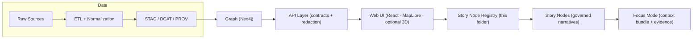

# 🧭 Story Node Registry (Web) — `web/story_nodes/registry/`


> **This folder is the curated index (registry) of Story Nodes the web UI is allowed to surface.**  
> It is a **contract artifact**: small, reviewable, and machine-validated — so Story + Focus Mode stay governed and reproducible.

---

## ✨ Why this exists

KFM’s Story Nodes are *not* “blog posts.” They’re **machine-ingestible narrative artifacts** that must stay attached to evidence (catalogs + provenance) and stable identifiers (graph + API). The web UI needs a **curated, deterministic list** to:

- Build navigation (Story list, categories, featured collections) 🗂️
- Load Story content safely (local markdown/MDX or via API) 🔌
- Preload the right map layers + time window for Focus Mode 🗺️⏳
- Enforce governance rules (CARE labels, redaction hints) 🛡️
- Keep URLs stable over time (even if titles/slugs change) 🔗

---

## 🧠 Key concepts (KFM-native)

### Story Node 🧩
A governed narrative document (Markdown) that:
- references evidence (STAC/DCAT/PROV or cataloged external sources),
- references graph entities via **stable identifiers**,
- is reviewable like code (diffs + PR review),
- distinguishes **fact vs interpretation**.

➡️ See the Story Node template:  
- `../../../docs/templates/TEMPLATE__STORY_NODE_V3.md`

### Focus Mode 🎯
An interactive “story in context” view that renders a Story Node next to:
- map layers,
- timeline window,
- evidence panel,
- optional AI Q&A **bounded by evidence**.

---

## 🗺️ Where the registry fits in the pipeline



**Rule of thumb:** the registry is a *UI-facing contract* — it should not bypass catalogs/graph/API. If a Story Node needs data, it should reference catalog IDs and let the UI fetch through the governed API.

---

## 📦 What belongs in this folder

✅ **Good fits**
- A machine-readable registry file (JSON/TS) listing Story Nodes approved for UI
- A JSON Schema (or Zod schema) enforcing the contract
- Small helper utilities for loading the registry (build-time or runtime)
- Tests validating:
  - schema validity,
  - referenced Story content exists,
  - referenced layer IDs exist,
  - referenced catalog IDs exist (optional but ideal)

🚫 **Not a good fit**
- Raw datasets or untracked analysis outputs
- Direct DB or graph queries
- Unreviewed “draft” stories that haven’t passed governance checks

---

## 📁 Suggested directory layout

> Your repo may vary — this layout is the **intended shape** for a governed UI registry.

```text
web/
└─ 📁 story_nodes/
   └─ 🗂️ registry/
      ├─ 📄 README.md                          # ← you are here 📌
      ├─ 🗂️🧾 story-node-registry.json         # ← curated entries
      ├─ 📐🧾 story-node-registry.schema.json  # ← contract-first schema
      ├─ 🧩📄 index.ts                         # ← exports + loader helpers
      └─ 🛡️📄 validate.ts                      # ← optional CLI validator
```

---

## 🧱 Non‑negotiables (contracts we do not break)

### 1) IDs must be **stable** (unique + invariant) 🆔
- **IDs are forever.**
- **IDs must not encode meaning** (no dates, counties, author names, “v2”, etc.).
- **Never reuse an ID** after archival.

> Use a UUID/ULID-style opaque ID (example: `sn_01J...`).  
> Keep “human meaning” in `title` and `slug` — those can evolve.

### 2) Registry entries must be machine-validated ✅
- Every change to the registry is effectively a **UI contract change**.
- Treat it like OpenAPI: review + validate + test.

### 3) Provenance must be linkable 🧾
- A registry entry must point to evidence identifiers (catalog IDs) *or* to a story file that itself does that.
- If the UI shows a layer because of a Story Node, the layer must be able to cite its data source.

### 4) Governance & redaction are first-class 🛡️
- If a story touches sensitive content, it must be labeled and the UI must respect redaction constraints.
- Prefer “safe defaults” (generalize/hide) over leaking precision.

---

## 🧾 Registry data model

You can implement the registry as **JSON** (easy to validate) and optionally wrap it with **TypeScript types** for the UI.

### ✅ Minimal JSON shape (recommended)

```json
{
  "version": "1.0.0",
  "generated_at": "2026-01-14T00:00:00Z",
  "entries": [
    {
      "id": "sn_01J0Y0H3FQ7A5Y7B0GJ2N7R5Q1",
      "slug": "dust-bowl-kansas-1930s",
      "title": "Dust Bowl: Kansas in the 1930s",
      "status": "published",
      "summary": "A provenance-linked narrative tying drought, land use, and policy to mapped evidence.",
      "tags": ["climate", "agriculture", "history"],
      "locale": "en-US",

      "content": {
        "format": "markdown",
        "ref": "docs/reports/story_nodes/published/dust-bowl-kansas-1930s.md"
      },

      "evidence": {
        "dcat_dataset_ids": ["kfm:dataset:example"],
        "stac_collections": ["kfm:stac:example"],
        "prov_bundles": ["kfm:prov:example"]
      },

      "graph": {
        "entity_ids": ["kfm:place:ks", "kfm:event:dust_bowl"]
      },

      "ui": {
        "layer_ids": ["landsat-ndvi", "soils-sda"],
        "map": { "bbox": [-102.0, 36.9, -94.6, 40.0], "zoom": 5 },
        "timeline": { "start": "1930-01-01", "end": "1940-12-31" }
      },

      "governance": {
        "care_label": "open",
        "redaction": { "level": "none", "notes": "" }
      }
    }
  ]
}
```

### 🧩 Suggested TypeScript types

```ts
export type StoryNodeStatus = "draft" | "review" | "published" | "archived";

export type CareLabel = "open" | "sensitive" | "restricted";
export type RedactionLevel = "none" | "generalize" | "hide";

export interface StoryNodeRegistry {
  version: string;            // semver
  generated_at: string;       // ISO datetime
  entries: StoryNodeEntry[];
}

export interface StoryNodeEntry {
  id: string;                 // stable, opaque
  slug: string;               // URL-safe, may change (use redirects)
  title: string;
  status: StoryNodeStatus;

  summary?: string;
  tags?: string[];
  locale?: string;

  content: {
    format: "markdown" | "mdx" | "json";
    ref: string;              // repo-relative path OR API path if you implement that
  };

  evidence?: {
    dcat_dataset_ids?: string[];
    stac_collections?: string[];
    stac_items?: string[];
    prov_bundles?: string[];
  };

  graph?: {
    entity_ids?: string[];    // stable IDs used in Neo4j + API
  };

  ui?: {
    layer_ids?: string[];     // must exist in UI layer registry
    map?: { bbox?: [number, number, number, number]; center?: [number, number]; zoom?: number };
    timeline?: { start?: string; end?: string };
  };

  governance?: {
    care_label?: CareLabel;
    redaction?: { level: RedactionLevel; notes?: string };
  };
}
```

---

## ➕ Adding a Story Node (workflow)

### Step 0 — Evidence first 🧾
Before a story goes “live,” make sure the underlying evidence is published through the pipeline:

- Raw → ETL → `data/processed/...`
- Catalog outputs exist:
  - `data/stac/...`
  - `data/catalog/dcat/...`
  - `data/prov/...`

### Step 1 — Write the Story Node ✍️
- Start from: `../../../docs/templates/TEMPLATE__STORY_NODE_V3.md`
- Ensure:
  - every claim has a citation,
  - key entities include stable graph IDs,
  - fact vs interpretation is explicit,
  - governance labels are set (FAIR/CARE and sovereignty).

### Step 2 — Add UI context (layers + time + map) 🗺️
- Decide which layers should be shown by default in Focus Mode.
- Choose:
  - a bbox (or center+zoom),
  - a timeline window,
  - optional “starter questions” (if the UI supports it).

### Step 3 — Register it ✅
Add an entry to `story-node-registry.json`:

- Generate a **new opaque `id`** (UUID/ULID).
- Set `slug` to a clean URL string.
- Set `status` to `review` until approved.

### Step 4 — Validate & test 🧪
Recommended checks:
- JSON Schema validation passes
- content file exists and renders
- referenced `layer_ids` exist in the UI layer registry
- referenced catalog IDs exist (DCAT/STAC/PROV)
- no unsafe HTML or untrusted embeds

### Step 5 — Publish 🚀
- Flip `status: "published"`
- If you change a slug, add redirects (don’t break bookmarks)

---

## ♻️ Updating, deprecating, and redirecting

### Change title? ✅
- Safe. The `id` is the contract.

### Change slug? ✅ (but preserve old URLs)
- Add a redirect map in your router (or keep an alias list in registry).

### Archive a Story Node? ✅
- Set `status: "archived"`
- Keep the entry (or keep a minimal tombstone entry) so old references don’t explode.

---

## 🧪 CI ideas (what we should enforce)

> Treat these as “minimum gates” for Story Node + Registry changes.

- ✅ `registry.schema.json` validates `story-node-registry.json`
- ✅ all `content.ref` paths exist (or all API paths are resolvable)
- ✅ all `layer_ids` exist in the layer registry
- ✅ Story Node markdown lint (front-matter, headings, citation style)
- ✅ “no uncited claims” heuristic checks (best-effort)
- ✅ governance checks:
  - `care_label` required when sensitive categories are detected,
  - redaction rules required when location precision could leak

---

## 🚀 Performance notes (don’t make the UI sad)

A registry is tiny by design — but Story Nodes can reference large things. Keep the UI fast by:

- Prefetching only metadata first (registry → title/summary)
- Lazy-loading story content on click
- Chunking evidence fetches (DCAT first, then STAC items as needed)
- Caching derived “context bundles” (layers + datasets + graph entities)

> Bonus: if you implement caching for repeated Focus Mode queries, treat cached results as **derived artifacts** with provenance (what inputs produced them, under which rules).

---

## 🛡️ Security + governance reminders

- Never embed secrets, tokens, or raw sensitive exports in Story Nodes
- Sanitize Markdown rendering (no arbitrary script execution)
- Make sure any “external” sources are either:
  - cataloged (preferred), or
  - clearly marked as external and review-required
- Respect sovereignty + CARE policy docs:
  - `../../../docs/governance/SOVEREIGNTY.md`
  - `../../../docs/governance/ETHICS.md`

---

## 📚 Project reference shelf (how the library supports Story Nodes)

> You do **not** need to read everything — this is the “toolbox wall” 🧰📖 for contributors.

### 🧭 Core KFM architecture & governance
- Kansas Frontier Matrix (KFM) — Comprehensive Technical Documentation  
- Master Guide / Markdown guide (v13) + templates  
- Markdown narrative best practices (citations + review workflows)

### 🗺️ GIS / mapping / storytelling
- *Making Maps* (map design + readability)
- *Mobile Mapping* (spatial UX and context)
- *Archaeological 3D GIS* (3D storytelling + spatial narrative patterns)
- *Python Geospatial Analysis Cookbook* (PostGIS, routing, GeoJSON workflows)
- *Cloud-Based Remote Sensing with Google Earth Engine* (remote sensing evidence pipelines)

### 📊 Statistics / modeling / uncertainty
- *Understanding Statistics & Experimental Design* (claims, inference, uncertainty)
- *Regression Analysis with Python* (+ linear regression slides)
- *Graphical Data Analysis with R* (EDA + “show your work” mindset)
- *Think Bayes* (explicit uncertainty + priors)
- *Scientific Modeling & Simulation (NASA-grade)* (reproducible modeling + provenance)
- *Generalized Topology Optimization* (specialized modeling patterns)

### 🧠 Graph + data systems
- *Spectral Geometry of Graphs* (graph thinking, structure, clustering)
- *Data Spaces* (data interoperability + discovery)
- *Scalable Data Management for Future Hardware* (throughput, caching, query planning)
- *Database Performance at Scale* (indexes, latency, IO realities)
- *PostgreSQL Notes for Professionals* (querying + correctness)

### 🎨 Web UI + media
- *Responsive Web Design with HTML5 & CSS3* (device-friendly story reading)
- *WebGL Programming Guide* (3D/advanced rendering)
- *Compressed Image File Formats* (asset tradeoffs + delivery)

### ⚖️ Digital society / ethics / governance
- *Introduction to Digital Humanism* (human values + sovereignty framing)
- *AI Law’s prophecies…* (conceptual/legal context for ML-era systems)
- *Principles of Biological Autonomy* (systems thinking, autonomy, constraints)

### 🛡️ Security awareness (defensive use only)
- *Ethical Hacking & Countermeasures* (threat modeling + hardening mindset)
- *Gray Hat Python* (security literacy; **do not** use for wrongdoing)

---

## ❓ FAQ

**Q: Why not just “auto-discover” story files at build time?**  
A: Discovery can be a validator, but the **registry is the governance gate**. We want reviewable, intentional publication.

**Q: Where should the actual Story Node markdown live?**  
A: Prefer `docs/reports/story_nodes/{draft,published}/...` (governed narrative content), and reference it via `content.ref`.

**Q: Can the UI read Story Nodes directly from disk?**  
A: It can during build-time, but runtime access should still respect the “governed API” boundary if sensitive data or redaction rules are involved.

---

## ✅ Definition of Done (DoD) checklist for registry changes

- [ ] Registry passes schema validation
- [ ] Story Node file renders cleanly in the UI
- [ ] Every claim has evidence (or is explicitly marked as interpretation)
- [ ] All referenced layers and IDs resolve (catalog + graph + UI)
- [ ] Governance labels are present when needed (CARE / sovereignty)
- [ ] No breaking URL changes without redirects
- [ ] CI checks updated if the contract changed

---

📌 **Tip:** if you’re unsure whether something belongs in the registry, ask:  
“Is this a stable, reviewable *contract* for what the UI may show?”  
If not, it probably belongs in catalogs, the graph, or the API — not here.
