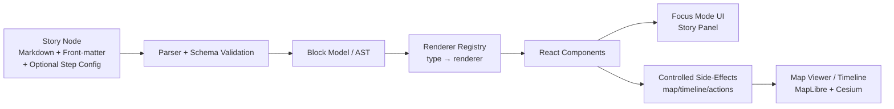

# 🧩 Story Node Renderers

**This folder is the “last mile” of trust:** it turns **Story Nodes** (machine-ingestible narrative + provenance) into **interactive UI blocks** inside the KFM web app.

Story Nodes are a flagship KFM feature: guided “slides” that synchronize narrative with **map + timeline** context, and optionally include media, charts, and interactive callouts. Renderers are the components that make that experience real.

> [!IMPORTANT]
> **Renderers are not “just UI.”** They are part of KFM’s trust boundary:
> - ✅ Only render content that is provenance-linked and schema-valid  
> - ✅ Keep humans in control (opt-in AI, clear labeling)  
> - ✅ Respect sovereignty constraints (no sensitive location leaks)

---

## 🧭 Quick Links

- 🗺️ Story Nodes overview (web): `../README.md` (if present)
- 🧠 App state & actions: `../../src/state/README.md`
- 🧾 Story Node authoring template: `../../../docs/templates/TEMPLATE__STORY_NODE_V3.md`
- 🧪 Review gates / governance: `../../../docs/governance/REVIEW_GATES.md`
- 🧱 Markdown protocol & rules: `../../../docs/standards/KFM_MARKDOWN_WORK_PROTOCOL.md`
- 📚 Story Node catalog location: `../../../docs/reports/story_nodes/`

---

## ✅ What Belongs Here

Renderers in this directory should:

- **Render Story Node blocks** (Markdown blocks, “map step” blocks, media blocks, chart blocks, etc.)
- **Bind narrative → graph entities → datasets** via stable IDs (no free-floating claims)
- **Dispatch controlled map/timeline actions** when a Story step changes (zoom, layers, time)
- **Enforce safe rendering** for authored content (sanitization, link safety, asset constraints)
- **Fail gracefully** (unknown blocks, missing assets, invalid schema) without breaking the Story Player

### 🚫 What Does *Not* Belong Here

- ❌ Ad-hoc fetching of raw data outside API contracts
- ❌ “Smart” inference that creates new narrative without citations
- ❌ Hard-coded domain logic (belongs in data/graph/pipeline layers)
- ❌ Unbounded queries / heavy computations inside React render paths

---

## 🗂️ Expected Directory Layout

> This is a recommended/target structure (names may vary by implementation).

```text
web/
└─ story_nodes/
   └─ renderers/
      ├─ README.md
      ├─ index.ts
      ├─ types.ts
      ├─ registry.ts
      ├─ context/
      │  ├─ RendererContext.ts
      │  └─ hooks.ts
      ├─ blocks/
      │  ├─ Markdown.renderer.tsx
      │  ├─ MapStep.renderer.tsx
      │  ├─ Media.renderer.tsx
      │  ├─ Chart.renderer.tsx
      │  ├─ Table.renderer.tsx
      │  ├─ Timeline.renderer.tsx
      │  ├─ GraphEntity.renderer.tsx
      │  └─ UnknownBlock.renderer.tsx
      ├─ safety/
      │  ├─ sanitizeMarkdown.ts
      │  ├─ safeExternalLink.tsx
      │  └─ redaction.ts
      └─ __tests__/
         ├─ registry.test.ts
         ├─ renderSmoke.test.tsx
         └─ fixtures/
            ├─ minimal.story.md
            └─ mixed-blocks.story.md
```

---

## 🔁 Rendering Pipeline



### 🎯 Key Idea
Renderers should be **mostly pure**: convert `block → UI`.  
Any side-effects (map moves, layer toggles, timeline changes) should be emitted as **declarative actions** and executed by the Story Player / controller layer.

---

## 📦 Contracts

Story Nodes are governed content. By the time a renderer runs:

- The Story Node should have passed **front-matter validation**
- The content should have passed **Story Node schema validation**
- Links/citations should have passed **reference validation**
- Sensitive data should already be tagged/classified, so UI can enforce redaction rules

> [!TIP]
> Think “contracts first”: renderer inputs are **validated** and **typed**.  
> If you need new fields, update the schema + template + tests first.

### Suggested TypeScript Interfaces

```ts
/** Minimal block model example (adapt to your schema). */
export type StoryNodeBlock =
  | { type: "markdown"; id: string; md: string; citations?: CitationRef[]; entities?: EntityRef[] }
  | { type: "map_step"; id: string; map: MapAction; timeline?: TimelineAction; sources: SourceRef[] }
  | { type: "media"; id: string; media: MediaRef; sources: SourceRef[] }
  | { type: "chart"; id: string; spec: ChartSpec; sources: SourceRef[] }
  | { type: "table"; id: string; dataRef: DataRef; sources: SourceRef[] }
  | { type: "timeline"; id: string; items: TimelineItem[]; sources: SourceRef[] }
  | { type: "graph_entity"; id: string; entityId: string; display?: EntityDisplayHints }
  | { type: "unknown"; id: string; raw: unknown };

export interface RendererContext {
  storyId: string;
  stepId?: string;

  // App integration (see web/src/state)
  dispatch: (action: unknown) => void;

  // Evidence + catalogs (STAC/DCAT/PROV, graph)
  getEntity: (id: string) => Promise<unknown>;
  getDataset: (id: string) => Promise<unknown>;

  // Trust controls
  redact: {
    location: (geo: unknown) => unknown;
    text: (value: string) => string;
  };

  // Telemetry (no PII)
  track: (event: { name: string; props?: Record<string, unknown> }) => void;

  // Feature flags / environment
  flags: Record<string, boolean>;
}

export interface BlockRenderer<T extends StoryNodeBlock = StoryNodeBlock> {
  type: T["type"];
  render: (block: T, ctx: RendererContext) => React.ReactNode;
}
```

---

## 🧩 Renderer Registry Pattern

**Goal:** Make renderers discoverable, testable, and safe by default.

```ts
import { MarkdownRenderer } from "./blocks/Markdown.renderer";
import { MapStepRenderer } from "./blocks/MapStep.renderer";
import { UnknownBlockRenderer } from "./blocks/UnknownBlock.renderer";

export const RENDERERS = new Map<string, BlockRenderer>([
  ["markdown", MarkdownRenderer],
  ["map_step", MapStepRenderer],
  // ...
]);

export function renderBlock(block: StoryNodeBlock, ctx: RendererContext) {
  const r = RENDERERS.get(block.type) ?? UnknownBlockRenderer;
  return r.render(block as any, ctx);
}
```

> [!NOTE]
> The fallback renderer is part of your safety model:
> - It should never crash
> - It should show enough debug info to fix the content
> - It should not “guess” intent or fabricate missing fields

---

## 🧠 State + Side Effects

Story Nodes often drive map/timeline updates. The renderer layer should **not** directly call the map engine (MapLibre/Cesium) unless your architecture explicitly allows it.

Recommended split:

- **Renderer**: emits an action request (`MapAction`, `TimelineAction`)
- **Story Player / Controller**: applies it via app state (`web/src/state`) + viewer adapters

Example:

```ts
// In MapStep renderer (declarative)
ctx.dispatch({
  type: "story/mapStepRequested",
  payload: { storyId: ctx.storyId, stepId: block.id, map: block.map, timeline: block.timeline },
});
```

---

## 🛡️ Safety & Governance Requirements

### 1) Provenance or Nothing 🧾
Every “factual” or data-backed block should include `sources[]` (dataset IDs, catalog references, citations).

UI must:
- show a **source badge** / “View evidence”
- provide a **stable link** to the referenced catalog record
- avoid presenting unsourced outputs as fact

### 2) Opt-in AI (Never Default) 🧠✨
If a renderer supports AI-generated summaries, “connections”, or highlights:

- Must be **user-triggered**
- Must be labeled **AI-generated**
- Must show uncertainty (confidence, caveats)
- Must obey sovereignty/sensitivity rules

### 3) No Sensitive Location Leaks 🧭🔒
Renderers that deal with geometry must route through a redaction layer (`ctx.redact.location(...)`) before:

- placing markers
- centering cameras
- exporting links
- showing coordinate readouts

### 4) Sanitization is Mandatory 🧼
Treat Story Node Markdown as **untrusted input**:
- sanitize HTML
- disallow scripts/iframes by default
- protect external links (`rel="noopener noreferrer"`)
- restrict embeds to allowed types/domains (if you allow embeds at all)

> [!WARNING]
> **Do not rely on “authors won’t do that.”**  
> Story Nodes may be community-authored; the renderer must be defensive.

---

## ♿ Accessibility & UX Rules

Renderers must support:

- ✅ keyboard navigation (tab order, focus states)
- ✅ screen readers (semantic structure, ARIA labels when needed)
- ✅ alternative text for media
- ✅ responsive layouts (mobile + desktop)
- ✅ reduced motion preferences (especially for map animations)

---

## ⚡ Performance Rules

Story experiences should feel instant and smooth, even on modest hardware.

Renderer best practices:

- Lazy-load heavy blocks (3D, large charts)
- Preload assets for the *next* step (predictable “slides”)
- Avoid expensive parsing in render; precompute in loader
- Memoize stable transforms
- Virtualize long lists (timeline, tables)
- Use Web Workers for CPU-heavy transforms (if needed)

---

## 🧪 Testing Checklist

### Minimum tests for each renderer ✅
- [ ] renders without crashing with minimal valid input
- [ ] fails gracefully with missing optional fields
- [ ] blocks unsourced content where required (or visibly flags it)
- [ ] respects redaction rules (no raw coordinates on sensitive items)
- [ ] sanitizes any user-authored markup
- [ ] snapshots (optional) are stable and readable

### Integration tests (recommended)
- [ ] “Play story” smoke test across 5–10 steps
- [ ] map/timeline actions are emitted correctly
- [ ] offline/slow network mode fallback for media & data

---

## ➕ Adding a New Renderer

1) **Define the block contract**
- Update Story Node schema in `../../../schemas/storynodes/`
- Update `TEMPLATE__STORY_NODE_V3.md` to document new block usage
- Add an example Story Node fixture

2) **Implement the renderer**
- Create `blocks/<YourBlock>.renderer.tsx`
- Keep it **pure** where possible
- Use `ctx.redact` and safe link helpers

3) **Register it**
- Add to `registry.ts`
- Ensure fallback works for unknown versions

4) **Tests**
- Unit test for block rendering + safety requirements
- Add fixtures that exercise edge cases

5) **Governance**
- Confirm it passes review gates and respects sovereignty constraints

---

## 🧰 Built-in Renderer Catalog

> This is a recommended baseline set. Customize to your actual schema.

| Block Type | Purpose | Common Inputs |
|---|---|---|
| `markdown` 📝 | narrative text w/ citations | `md`, `citations[]`, `entities[]` |
| `map_step` 🗺️ | camera/layer/time changes for a step | `map`, `timeline`, `sources[]` |
| `media` 🖼️ | images/video/audio with provenance | `media`, `sources[]`, `alt` |
| `chart` 📊 | data visualization | `spec`, `sources[]` |
| `table` 📋 | tabular evidence | `dataRef`, `sources[]` |
| `timeline` ⏳ | ordered events | `items[]`, `sources[]` |
| `graph_entity` 🔗 | entity cards / relationships | `entityId` |
| `unknown` ❓ | safe fallback | `raw` |

---

## 📚 Project Library Used for This Subsystem

The following project files inform renderer design, constraints, and future renderer ideas.

<details>
<summary><b>📖 Click to expand the full reference map</b> (what each file contributes)</summary>

### 🧱 KFM Core Docs
- **MARKDOWN_GUIDE_v13.md.gdoc** — repository structure, Story Node + Focus Mode rules, validation gates
- **Kansas Frontier Matrix (KFM) – Comprehensive Technical Documentation.pdf** — Story Node “slides” concept; map/timeline synchronization; interactive narrative patterns

### 🌐 Front-End / UI Engineering
- **responsive-web-design-with-html5-and-css3.pdf** — responsive layout patterns for story panels & embeds
- **compressed-image-file-formats-jpeg-png-gif-xbm-bmp.pdf** — asset optimization tradeoffs (story images, thumbnails)
- **webgl-programming-guide-interactive-3d-graphics-programming-with-webgl.pdf** — future-proofing WebGL/3D renderers
- **concurrent-real-time-and-distributed-programming-in-java-threads-rtsj-and-rmi.pdf** — mental models for concurrency (useful when introducing workers/streaming)

### 🗺️ GIS / Cartography / Mobile Mapping
- **making-maps-a-visual-guide-to-map-design-for-gis.pdf** — cartographic clarity (legends, symbology, map storytelling)
- **Mobile Mapping_ Space, Cartography and the Digital - 9789048535217.pdf** — mobile-first story experiences + context-aware mapping
- **python-geospatial-analysis-cookbook.pdf** — geospatial operations patterns (useful when renderers summarize geometry-derived results)
- **Cloud-Based Remote Sensing with Google Earth Engine-Fundamentals and Applications.pdf** — raster/remote sensing story blocks (COGs, time-series imagery)
- **Archaeological 3D GIS_26_01_12_17_53_09.pdf** — 3D GIS storytelling patterns + interpretability in spatial narratives

### 📊 Statistics / Data Visualization / Inference
- **Understanding Statistics & Experimental Design.pdf** — communicate uncertainty + study design in story visuals
- **think-bayes-bayesian-statistics-in-python.pdf** — credible intervals & probabilistic narratives (for “uncertainty-aware” charts)
- **regression-analysis-with-python.pdf** — regression result presentation patterns (assumptions, diagnostics)
- **Regression analysis using Python - slides-linear-regression.pdf** — simpler explanatory visuals for regression concepts
- **graphical-data-analysis-with-r.pdf** — exploratory plots and distribution-aware chart choices

### 🧪 Modeling / Simulation / Optimization
- **Scientific Modeling and Simulation_ A Comprehensive NASA-Grade Guide.pdf** — reproducibility & validation for simulation-backed story blocks
- **Generalized Topology Optimization for Structural Design.pdf** — inspiration for optimization/engineering renderers (inputs/constraints/outcomes)

### 🧠 Graph / Systems / Data Performance
- **Spectral Geometry of Graphs.pdf** — ideas for graph layout/embeddings in “relationship” renderers
- **Scalable Data Management for Future Hardware.pdf** — performance mindset (streaming, compilation, throughput)
- **Database Performance at Scale.pdf** — query budgeting & “don’t DDOS your own API” guardrails
- **PostgreSQL Notes for Professionals - PostgreSQLNotesForProfessionals.pdf** — practical query constraints that surface in UI feature design
- **Data Spaces.pdf** — metadata-first linking; treating datasets + narratives as interoperable “spaces”

### 🔐 Security / Safety / Governance Mindset
- **ethical-hacking-and-countermeasures-secure-network-infrastructures.pdf** — threat modeling mindset (inputs, links, injection)
- **Gray Hat Python - Python Programming for Hackers and Reverse Engineers (2009).pdf** — defensive thinking around unsafe content patterns

### 🤝 Human / Ethics / Law (for UI trust boundaries)
- **Introduction to Digital Humanism.pdf** — human-centered, transparent interaction patterns
- **On the path to AI Law’s prophecies and the conceptual foundations of the machine learning age.pdf** — governance + accountability framing for AI UI affordances
- **Principles of Biological Autonomy - book_9780262381833.pdf** — autonomy/agency framing: keep the user in control, avoid “runaway” automation

### 🧠 General Programming Reference Packs
- **A programming Books.pdf**
- **B-C programming Books.pdf**
- **D-E programming Books.pdf**
- **F-H programming Books.pdf**
- **I-L programming Books.pdf**
- **M-N programming Books.pdf**
- **O-R programming Books.pdf**
- **S-T programming Books.pdf**
- **U-X programming Books.pdf**

> [!NOTE]
> **Deep Learning for Coders with fastai and PyTorch - Deep.Learning.for.Coders.with.fastai.and.PyTorchpdf**  
> is part of the project library, but may not be indexed in all tooling contexts. Still valuable as a reference for any future “model explanation” or “ML result” renderers.

</details>

---

## 🧾 Related Repo Standards (Recommended)

- `../../../docs/standards/KFM_REPO_STRUCTURE_STANDARD.md`
- `../../../docs/standards/KFM_STAC_PROFILE.md`
- `../../../docs/standards/KFM_DCAT_PROFILE.md`
- `../../../docs/standards/KFM_PROV_PROFILE.md`
- `../../../docs/governance/ETHICS.md`
- `../../../docs/governance/SOVEREIGNTY.md`

---

## ✨ TODOs (Nice Next Steps)

- [ ] Add a documented **block schema** section (copy from `schemas/storynodes/`)
- [ ] Add a “golden story” fixture that exercises every renderer type
- [ ] Add a `RendererContext` contract doc + test doubles
- [ ] Add a “security posture” page for renderers (sanitization rules, allowed embeds)
- [ ] Add a “performance budget” table per renderer type (ms + memory)

---
