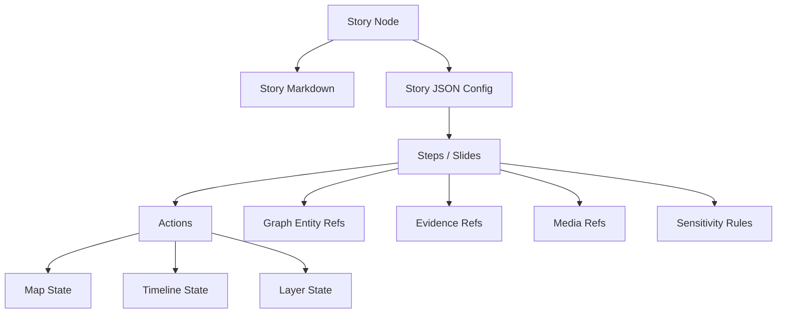

# 🧩 KFM Story Nodes — Web Schema Contract


> **Purpose:** this folder defines the **frontend-facing schema contract** for KFM “Story Node” configuration (`story.json`) used by the web Story Player / Focus Mode UI.  
> Story Nodes are authored as **Markdown + JSON config**, where JSON drives synchronized **map + timeline + layers** per step, and Markdown carries the narrative (with citations + semantic tags).

---

## 📍 Where this fits in KFM

KFM’s pipeline ordering is non-negotiable:

- **ETL → STAC/DCAT/PROV catalogs → Neo4j graph → APIs → React UI → Story Nodes → Focus Mode**

This schema exists to keep Story Nodes **machine-ingestible, validated, and provenance-aligned** (so the UI never becomes a “freeform story renderer” without evidence).

**Key principle:** *If it’s not provenance-linked (catalog/graph/ID), it doesn’t render in Focus Mode.*

---

## 🗂️ What lives here

### ✅ This folder owns
- **JSON Schema / runtime validators** for Story Node JSON configs used by the web app
- **Front-end safety contracts** for:
  - step-by-step map state changes
  - timeline/time-window changes
  - layer activation/opacity/filter overrides
  - entity linking (graph IDs)
  - evidence references (catalog IDs)
  - media (assets + licensing hooks)
  - sensitivity rules (redaction/generalization)

### 🚫 This folder does NOT own
- story content itself (Markdown + story assets)
- ETL, catalogs, or graph ingestion
- API schemas (those belong to `src/server/contracts/`)

---

## 🧱 Story Node file contract

Story Nodes are generally **two artifacts**:

- `story.md` → narrative content (Markdown; includes citations + entity tags)
- `story.json` → structured “director’s track” used by the UI to drive map/time/layers per step

Typical *runtime* shape (example paths — keep in sync with your repo’s chosen canonical location):

```text
📁 docs/reports/story_nodes/                # governed content (draft/published)
└── 📁 published/
    └── 📁 <story_slug>/
        ├── 📄 story.md
        ├── 📄 story.json
        └── 📁 assets/
            ├── 🖼️ figure_01.jpg
            └── 🎞️ clip_01.mp4

📁 web/story_nodes/                         # web runtime (optional: built/cached packs)
└── 📁 <story_slug>/
    ├── 📄 story.md
    ├── 📄 story.json
    └── 📁 assets/
```

> 🧠 **Important:** In v13, JSON Schemas are canonically housed under `schemas/` at repo root.  
> If this folder contains a mirror/derived validator, treat it as **generated** (don’t diverge by hand).

---

## 🧾 Schema artifacts

> Your actual filenames may differ; the intent is to keep the schema modular and composable.

Recommended layout:

```text
📁 web/story_nodes/schema/
├── 📄 README.md
├── 📄 story.schema.json            # top-level StoryNode / StoryManifest
├── 📄 step.schema.json             # a “slide” / step in the story
├── 📄 action.schema.json           # atomic UI + map actions
├── 📄 map_state.schema.json        # MapLibre + Cesium camera state
├── 📄 timeline_state.schema.json   # temporal window + cursor
├── 📄 media.schema.json            # images/audio/video + licensing hooks
├── 📄 evidence_ref.schema.json     # citations + catalog references
├── 📄 graph_ref.schema.json        # stable graph entity refs
└── 📄 sensitivity.schema.json      # redaction/generalization rules
```

---

## 🔑 Core identifiers and linking rules

Story Nodes are only “governed” if they can be traced.

### ✅ Required ID patterns (recommended)
- **Story ID**: stable, globally unique
  - `kfm.story.<slug>` or a UUID
- **Step ID**: stable within a story
  - `s01`, `s02`, … or `kfm.story.<slug>.s01`
- **Graph entity IDs**: stable IDs used by the Neo4j layer
  - treat these as **opaque** (don’t embed meaning in the UI)
- **Catalog references**:
  - STAC/DCAT/PROV references must resolve to catalog entries (directly or via API lookup)

### 🔗 Linking narrative text → graph entities
Markdown should support entity linking that the UI can recognize and enrich (tooltips, side panels, highlights). Options (pick one and standardize):
- `kfm:` URI-style links: `[Fort Riley](kfm:graph:place:<id>)`
- inline tag blocks (custom): `{{entity: place:<id>}}`
- footnote-bound entity refs

**Schema role:** the JSON config should also carry `graph_refs` so that *even if Markdown is plain*, the step still identifies entities.

---

## 🛡️ Focus Mode hard gates (schema-enforced behavior)

The schema must help enforce these invariants in the web runtime:

### 1) Only provenance-linked content 🧾
- every **step** must reference **evidence** (citations)
- every **media item** must have provenance + license pointer
- every **layer** referenced must map to a cataloged dataset/layer registry entry

### 2) AI content is opt-in + labeled 🤖
If the UI displays AI-generated summaries or “possible connections”:
- it must be **user-triggered** (opt-in)
- it must be explicitly labeled as AI-generated
- it must include **confidence/uncertainty metadata**
- it must obey sensitivity and redaction rules

### 3) No sensitive location leaks 🧿
- steps must allow **generalized geometry** (regions/buffers) instead of precise coordinates
- when `sensitivity.classification != public`, the UI must not show precise points by default

> ✅ **Schema implication:** include an explicit `sensitivity` object per step and/or per geometry/media reference.

---

## 🗺️ Map + Timeline: what the JSON config controls

The Story JSON is the “director”: it tells the UI what to do at each step.

### Map state (2D + 3D)
- **MapLibre (2D):**
  - center `[lon, lat]`
  - zoom, bearing, pitch
  - optional bounds + padding
- **Cesium (3D):**
  - camera destination + orientation (or lookAt)
  - terrain/exaggeration toggles (optional)
  - 3D tileset activation (optional)

### Timeline state
- cursor: a date/year/time-instant
- window: `[start, end]` for filtering layers
- playback hints: animation speed, easing, snapping

### Layer control
- activate/deactivate layers by stable `layer_id`
- opacity per layer
- optional filters (time, category, query presets)
- optional styling overrides (keep limited + safe)

---

## 🧠 Suggested data model (human readable)

Here’s the conceptual model the schema should represent:



---

## 🧪 Minimal `story.json` example (schema-aligned)

> This is an illustrative example; use it as a baseline for validation tests.

```json
{
  "schema_version": "1.0.0",
  "story_id": "kfm.story.dust-bowl-intro",
  "slug": "dust-bowl-intro",
  "title": "Dust Bowl: Kansas in Context",
  "summary": "A guided narrative connecting drought, land use, and migration patterns.",
  "authors": [
    { "name": "KFM Team", "role": "editor" }
  ],
  "defaults": {
    "viewer": "maplibre",
    "timeline": { "mode": "year", "cursor": 1930 }
  },
  "story_evidence": [
    { "type": "dcat", "id": "dcat:kfm.dataset.drought_1900_1950" }
  ],
  "steps": [
    {
      "step_id": "s01",
      "title": "Before the crisis",
      "md_ref": { "file": "story.md", "anchor": "before-the-crisis" },
      "timeline": { "mode": "year", "cursor": 1925, "window": [1920, 1930] },
      "map": { "viewer": "maplibre", "center": [-98.0, 38.5], "zoom": 5.2, "bearing": 0, "pitch": 0 },
      "layers": [
        { "layer_id": "kfm.layer.rainfall_anomaly", "visible": true, "opacity": 0.85 }
      ],
      "graph_refs": [
        { "kind": "event", "id": "graph:event:dust_bowl" }
      ],
      "evidence": [
        { "type": "prov", "id": "prov:kfm.lineage.rainfall_anomaly_v1" }
      ],
      "sensitivity": { "classification": "public" }
    }
  ]
}
```

---

## 🧰 Action vocabulary (recommended)

To keep stories portable and “builder-friendly,” prefer a small set of **atomic actions** over one giant custom object.

Example action types (the schema can model these as a tagged union):

- `setViewer` → `"maplibre" | "cesium"`
- `setMapCamera2D` → center/zoom/bearing/pitch/bounds
- `setMapCamera3D` → destination/orientation/lookAt
- `setTimeline` → cursor/window/mode
- `setLayers` → visibility/opacity/filter presets
- `highlightEntity` → graph IDs → UI/Map highlight
- `highlightGeometry` → safe geojson (or generalized region refs)
- `showMedia` → media refs, captions, credits
- `showCallout` → UI annotations (arrows, labels, markers)

> ✅ **Schema hint:** keep actions declarative; avoid embedding executable code or ad-hoc expressions.

---

## 🔐 Security, safety, and trust (frontend-specific)

Even with perfect provenance, the web UI can still leak data or be exploited if we’re careless.

### Markdown rendering safety
- sanitize HTML
- disable dangerous raw HTML by default
- treat external links carefully (noopener/noreferrer)
- enforce `alt` text for images (accessibility + safety)

### Config injection safety
- do not allow arbitrary JS expressions in JSON
- strongly validate any “filter” or “query preset” fields (prefer enums or named presets)

### Sensitive content handling
- if a step is sensitive, the schema should require:
  - classification label
  - redaction strategy (`omit`, `blur`, `generalize`)
  - justification / governance note (optional but recommended)

---

## ✅ Validation expectations

### What should be validated by schema
- structure (required fields present)
- ID formats
- enums (viewer, action types, sensitivity classification)
- array shapes (steps, layers, evidence)
- value ranges (opacity 0–1, zoom bounds, etc.)

### What should be validated by cross-checks (runtime/CI)
- every `layer_id` exists in the UI layer registry
- every `evidence.id` resolves via catalogs/API
- every `graph_ref.id` resolves via API (not direct graph access)
- every media asset has an associated license entry (see `web/data/licenses/`)

---

## 🔄 Versioning & migrations

Because Story Nodes are long-lived educational artifacts, **schema evolution must be gentle**.

- `schema_version` uses **semver**
- breaking changes require:
  - version bump
  - migration notes
  - (ideally) an automated migration script
- prefer additive fields + defaults over destructive renames

---

## 🧩 Contributing checklist

Before submitting a Story Node config or changing schema:

- [ ] All narrative claims have citations (Markdown)
- [ ] `story.json` validates against schema
- [ ] Every referenced dataset/media has provenance (catalog IDs)
- [ ] Graph entity refs are stable IDs
- [ ] No sensitive location leaks (classification + redaction rules in place)
- [ ] No AI content renders by default; AI is opt-in + labeled (if used)

---

## 📚 Reference library (project files)

<details>
<summary><strong>📚 Project PDFs that informed the schema design</strong> (click to expand)</summary>

### 🧭 KFM system context (source-of-truth docs)
- **Kansas Frontier Matrix (KFM) – Comprehensive Technical Documentation.pdf**
- **MARKDOWN_GUIDE_v13.md.gdoc**

### 🗺️ Geospatial, mapping, and cartographic design
- **making-maps-a-visual-guide-to-map-design-for-gis.pdf**
- **Mobile Mapping_ Space, Cartography and the Digital - 9789048535217.pdf**
- **Archaeological 3D GIS_26_01_12_17_53_09.pdf**
- **python-geospatial-analysis-cookbook.pdf**
- **Cloud-Based Remote Sensing with Google Earth Engine-Fundamentals and Applications.pdf**

### 🌐 Web UI, 3D, and visualization
- **responsive-web-design-with-html5-and-css3.pdf**
- **webgl-programming-guide-interactive-3d-graphics-programming-with-webgl.pdf**
- **compressed-image-file-formats-jpeg-png-gif-xbm-bmp.pdf**

### 🧠 Modeling, simulation, and reproducibility
- **Scientific Modeling and Simulation_ A Comprehensive NASA-Grade Guide.pdf**
- **Data Spaces.pdf**

### 🗄️ Data systems, performance, and scale
- **Database Performance at Scale.pdf**
- **Scalable Data Management for Future Hardware.pdf**
- **PostgreSQL Notes for Professionals - PostgreSQLNotesForProfessionals.pdf**

### 📊 Statistics, analysis, and uncertainty communication
- **Understanding Statistics & Experimental Design.pdf**
- **regression-analysis-with-python.pdf**
- **Regression analysis using Python - slides-linear-regression.pdf**
- **graphical-data-analysis-with-r.pdf**
- **think-bayes-bayesian-statistics-in-python.pdf**

### ⚖️ Ethics, governance, and “bad evidence” handling
- **Introduction to Digital Humanism.pdf**
- **On the path to AI Law’s prophecies and the conceptual foundations of the machine learning age.pdf**
- **Principles of Biological Autonomy - book_9780262381833.pdf**

### 🔐 Security mindset (defense-in-depth for UI + config)
- **ethical-hacking-and-countermeasures-secure-network-infrastructures.pdf**
- **Gray Hat Python - Python Programming for Hackers and Reverse Engineers (2009).pdf**

### 🧩 Engineering + programming reference volumes (grab-bag)
- **A programming Books.pdf**
- **B-C programming Books.pdf**
- **D-E programming Books.pdf**
- **F-H programming Books.pdf**
- **I-L programming Books.pdf**
- **M-N programming Books.pdf**
- **O-R programming Books.pdf**
- **S-T programming Books.pdf**
- **U-X programming Books.pdf**

### 🧮 Additional technical depth (structural/graph theory, optimization)
- **Generalized Topology Optimization for Structural Design.pdf**
- **Spectral Geometry of Graphs.pdf**

</details>

---

## 🧭 Next steps (recommended)

- Add/confirm the actual schema JSON files in this folder (or generate them from `schemas/storynodes/`)
- Wire schema validation into CI (fail builds on invalid stories)
- Add a small “fixture pack” of 1–2 sample stories for regression tests (story.md + story.json)
- Design Story Builder GUI output to emit **only** schema-valid configs (no hidden fields)

---
