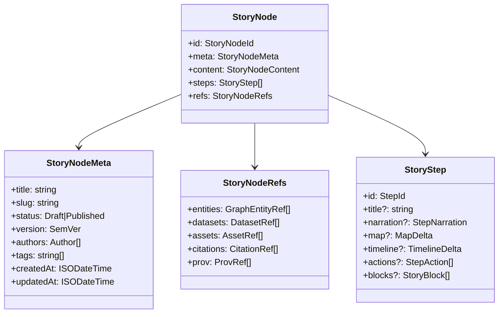

# Story Node Types 🧩📚
<kbd>🟦 TypeScript</kbd> <kbd>🧾 Provenance-first</kbd> <kbd>🧬 Contract-first</kbd> <kbd>🗺️ Map · Timeline</kbd> <kbd>🔒 FAIR + CARE</kbd>

**Path:** `web/story_nodes/types/`

These types define the **governed, machine-ingestible contract** for KFM Story Nodes — the narrative layer that connects **evidence (STAC/DCAT/PROV + graph)** to **interactive UI behavior (mapeact + MapLibre/Cesium + timeline + layers)**.

---

## 🔭 Why this folder exists

Story Nodes are not “just markdown.” In KFM they are **structured narrative artifacts** that must be:

- ✅ **Traceable** (citations + provenance)
- ✅ **Linkable** (stable graph entity references)
- ✅ **Interactive** (step-by-step UI state: map camera, layers, timeline, highlights)
- ✅ **Governable** (draft/published flows, review gates, sovereignty + safety rules)
- ✅ **Deterministic** (no hidden “magic” behavior; everything is declarative)

This folder provides the **TypeScript source of truth** for:
- Story node objects consumed by the web UI
- Validation boundaries (schema ↔ runtime guards)
- Serialization formats (Markdown + JSON config, or API payloads)

---

## 🧭 Quick links (contracts & authoring)

- 📘 `docs/MASTER_GUIDE_v13.md` — pipeline invariants & governance
- 🧱 `docs/templates/TEMPLATE__STORY_NODE_V3.md` — Story Node authoring template
- ✅ `schemas/storynodes/` — JSON Schemas for Story Node validation
- 🧾 `docs/standards/` — STAC/DCAT/PROV profiles & governed metadata rules
- 🎨 `web/data/styles/` — style tokens referenced by story rendering & map themes

> Keep this folder aligned with **templates + schemas**. If a Story Node can be authored, it must be representable here. If it’s representable here, it must be validatable by schema.

---

## 🗂️ Suggested module layout

> Your exact file names may differ — this is the intended separation of concerns.

```text
📁 web/
└── 📁 story_nodes/
    ├── 📁 types/  👈 you are here
    │   ├── 📄 README.md
    │   ├── 📄 index.ts                # barrel exports
    │   ├── 📄 storyNode.ts            # StoryNode, meta, versioning
    │   ├── 📄 steps.ts                # StoryStep, actions, state deltas
    │   ├── 📄 blocks.ts               # renderable content blocks union
    │   ├── 📄 refs.ts                 # stable IDs & external references
    │   ├── 📄 governance.ts           # access labels, CARE/FAIR flags
    │   └── 📄 validation.ts           # runtime guards / schema bridges
    └── ...
```

---

## 🧠 Mental model

A Story Node is a **document** + **configuration**:

- **Document**: Markdown narrative (often with semantic annotations and citations)
- **Configuration**: JSON-like step script that drives the UI (map, timeline, layers)

In practice, the UI consumes a normalized object:



---

## 🧬 Core type contracts

### 1) IDs & references (the “don’t break this” layer) 🧷

**Rule of thumb:** IDs must be **stable**, **opaque**, **never reused**, and **not derived from mutable meaning** (like titles, categories, or paths).

Recommended “branded string” pattern:

```ts
type Brand<T, B extends string> = T & { readonly __brand: B };

export type StoryNodeId = Brand<string, "StoryNodeId">;
export type StepId = Brand<string, "StepId">;

export type GraphEntityId = Brand<string, "GraphEntityId">;   // stable graph ID (NOT DB internal id)
export type DatasetId = Brand<string, "DatasetId">;           // DCAT dataset identifier
export type StacItemId = Brand<string, "StacItemId">;         // STAC item identifier
export type ProvBundleId = Brand<string, "ProvBundleId">;     // PROV bundle/activity identifier
export type AssetId = Brand<string, "AssetId">;               // internal media asset identifier
```

**Reference objects** should be explicit and linkable:

```ts
export type GraphEntityRef = {
  id: GraphEntityId;
  label?: string;              // display label override
  kind?: "Place" | "Person" | "Event" | "Document" | "Dataset" | string; // allow extensibility
};

export type CitationRef = {
  id: string;                  // stable citation id within node
  source: "dcat" | "stac" | "external";
  locator: string;             // e.g., DCAT identifier, STAC link rel, DOI, archive id
  note?: string;
};
```

---

### 2) StoryNode shape 📦

```ts
export type StoryNodeStatus = "draft" | "published" | "archived";

export type StoryNodeMeta = {
  title: string;
  slug: string;
  status: StoryNodeStatus;

  // contract-first: explicit version so schema migrations are possible
  version: string; // SemVer

  authors?: { name: string; role?: string; org?: string }[];
  tags?: string[];

  createdAt?: string; // ISO 8601
  updatedAt?: string; // ISO 8601

  // governance knobs
  license?: string;
  access?: "public" | "restricted" | "internal";
  care?: {
    sensitivity?: "low" | "moderate" | "high";
    communities?: string[]; // sovereignty-aware tags, if applicable
    notes?: string;
  };
};

export type StoryNodeContent = {
  markdown: string;       // canonical story text
  summary?: string;       // optional UI preview
  language?: string;      // e.g., "en"
};

export type StoryNode = {
  id: StoryNodeId;
  meta: StoryNodeMeta;
  content: StoryNodeContent;
  steps: StoryStep[];
  refs: StoryNodeRefs;
};
```

---

### 3) Steps (declarative UI choreography) 🎬

A `StoryStep` is a **small, reversible delta** that the UI applies.

```ts
export type StoryStep = {
  id: StepId;

  title?: string;
  narration?: { markdown?: string; tts?: { enabled?: boolean; voice?: string } };

  map?: MapDelta;
  timeline?: TimelineDelta;

  actions?: StepAction[];
  blocks?: StoryBlock[];

  // optional validation hints
  requires?: {
    layers?: string[];
    entities?: GraphEntityId[];
    datasets?: DatasetId[];
  };
};
```

Map & timeline deltas should support both **2D** and **3D** modes:

```ts
export type MapDelta = {
  view?: {
    center?: [number, number];  // lon, lat
    zoom?: number;
    bearing?: number;
    pitch?: number;
  };

  // integrate with web/data/styles
  style?: { themeId?: string; styleId?: string };

  layers?: {
    enable?: string[];
    disable?: string[];
    opacity?: Record<string, number>;
    params?: Record<string, Record<string, unknown>>;
  };

  highlight?: {
    entityIds?: GraphEntityId[];
    featureIds?: string[];
    colorToken?: string; // refer to style tokens (not raw colors)
  };

  mode3d?: {
    enabled?: boolean;
    camera?: {
      position?: [number, number, number]; // lon, lat, height
      heading?: number;
      pitch?: number;
      roll?: number;
    };
    tilesets?: string[]; // e.g., 3D Tiles ids (resolved via registry)
  };
};

export type TimelineDelta = {
  at?: string;        // ISO date, year string, or domain-defined temporal ID
  range?: { start: string; end: string };
  lock?: boolean;     // keep user from drifting timeline mid-step (optional)
};
```

---

## 🧱 Blocks (renderable “pieces” of a step)

Blocks are a **discriminated union** so renderers can be exhaustive and safe.

```ts
export type StoryBlock =
  | { type: "markdown"; markdown: string }
  | { type: "callout"; variant: "info" | "warning" | "note"; markdown: string }
  | { type: "figure"; assetId: AssetId; caption?: string; credits?: CitationRef[] }
  | { type: "table"; markdown?: string; dataRef?: DatasetId }
  | { type: "chart"; spec: unknown; dataRefs?: DatasetId[]; caption?: string }
  | { type: "quote"; text: string; citation: CitationRef }
  | { type: "entity_link"; entity: GraphEntityRef; label?: string }
  | { type: "dataset_link"; datasetId: DatasetId; label?: string }
  | { type: "citation_list"; citationIds?: string[] };
```

**Guideline:** if a block can introduce factual content (tables, charts, quotes), it must be linkable to **citations + provenance** via `refs`.

---

## 🧾 Provenance-first (what types must enforce)

Story Nodes must support three linked “evidence rails”:

1. **Catalog rail**: STAC/DCAT identifiers and links (what the data *is*)
2. **Lineage rail**: PROV bundle/activity references (how it was made)
3. **Graph rail**: stable entity IDs + relationships (how it connects)

```ts
export type StoryNodeRefs = {
  entities: GraphEntityRef[];
  datasets: { id: DatasetId; title?: string }[];
  assets: { id: AssetId; kind: "image" | "video" | "document" | "other"; uri?: string }[];

  citations: CitationRef[];

  prov: {
    bundleId: ProvBundleId;
    activityIds?: string[];
    inputEntityIds?: string[];
    outputEntityIds?: string[];
  }[];
};
```

---

## ⚖️ Governance & safety (FAIR + CARE + “don’t map secrets”)

Story Nodes are user-facing narrative. They must also be **safety-aware**:

- 🧭 **Locational privacy**: do not expose sensitive exact coordinates unless explicitly permitted.
- 🪶 **Sovereignty / CARE**: allow labeling, community flags, review triggers.
- 🧼 **Sanitization**: treat all markdown as untrusted input at render time (no raw HTML injection).
- 🔐 **API boundary**: story rendering should only consume data via governed APIs.

Types should include **hooks** to support these controls (even if the enforcement is elsewhere):

```ts
export type Governance = {
  access: "public" | "restricted" | "internal";
  care?: {
    sensitivity: "low" | "moderate" | "high";
    reviewRequired?: boolean;
    notes?: string;
  };
  redaction?: {
    hidePreciseLocations?: boolean;
    hideNames?: boolean;
  };
};
```

---

## ✅ Validation strategy

### Contract-first rule
The source of truth for “is this valid?” lives in:

- `schemas/storynodes/` ✅ (JSON Schema)
- `docs/templates/TEMPLATE__STORY_NODE_V3.md` ✅ (authoring structure)

This folder should either:
- **(Preferred)** generate TS types from JSON Schema, *or*
- maintain TS types + schema together with strict CI checks.

### Suggested CI gates 🧪
- Schema validation for every story node in `docs/reports/story_nodes/`
- Reference validation:
  - every `GraphEntityId` exists (or is resolvable) ✅
  - every `DatasetId` exists in DCAT ✅
  - every `StacItemId` exists in STAC ✅
  - every step’s referenced layers exist in the UI registry ✅
- Governance validation:
  - disallow publishing if required CARE reviews are missing ✅

---

## 🛠️ Extending the contract (how to add new capabilities)

### Add a new block type
1. Add the discriminated union member in `blocks.ts`
2. Update renderer switch statement (must be exhaustive)
3. Update `schemas/storynodes/` (JSON Schema)
4. Add:
   - a **fixture** Story Node using the block
   - a **validator test** proving it passes
5. Update `docs/templates/TEMPLATE__STORY_NODE_V3.md` with authoring guidance

### Add a new map/timeline action
1. Add to `StepAction` union
2. Update “step executor” (state machine)
3. Ensure it is:
   - deterministic
   - reversible or at least resettable
   - provenance-safe (no hidden data fetches)

---

## 🧯 Performance notes (keep stories fast)

Story nodes are interactive; they should feel instant.

- Keep step deltas small and incremental (avoid “reset everything” every step)
- Prefer referencing datasets/layers by ID rather than embedding large data blobs
- Lazy-load assets (figures, tilesets) by step activation
- Avoid N+1 patterns: resolve step requirements in one batch call whenever possible

---

## ✨ Example: a minimal Story Node object

```ts
const node: StoryNode = {
  id: "story:example@1.0.0" as StoryNodeId,
  meta: {
    title: "Example Story Node",
    slug: "example-story-node",
    status: "draft",
    version: "1.0.0",
    tags: ["example", "contract"],
    access: "internal",
  },
  content: {
    markdown: "# Example\n\nThis is a governed story with citations.",
    summary: "A tiny example story.",
  },
  refs: {
    entities: [{ id: "graph:place:fort_riley" as GraphEntityId, kind: "Place" }],
    datasets: [{ id: "dcat:dataset:some_dataset" as DatasetId, title: "Some Dataset" }],
    assets: [{ id: "asset:hero_image" as AssetId, kind: "image" }],
    citations: [
      { id: "c1", source: "dcat", locator: "dcat:dataset:some_dataset", note: "Primary dataset" },
    ],
    prov: [{ bundleId: "prov:bundle:run_2025_12_01" as ProvBundleId }],
  },
  steps: [
    {
      id: "step:intro" as StepId,
      title: "Intro",
      blocks: [
        { type: "markdown", markdown: "Welcome. Here is what we will explore." },
        { type: "citation_list" },
      ],
      map: {
        view: { center: [-96.8, 39.1], zoom: 8 },
        layers: { enable: ["layer:example"] },
      },
      timeline: { at: "1861-01-01" },
    },
  ],
};
```

---

## 📚 “Use all the project files” — how that shows up here

This contract intentionally supports:
- 📈 **Analysis artifacts** (charts/tables/models) with explicit provenance & uncertainty hooks
- 🛰️ **Remote sensing layers** (time series, map overlays, derived rasters)
- 🧠 **Graph-driven narrative** (entity references, relationships, cluster/bridge concepts)
- 🗺️ **Cartographic integrity** (metadata, accuracy, and privacy-aware mapping)
- 🧰 **Scalable data + service boundaries** (API-first, schema-first, performance-first)

If you extend types, keep those cross-cutting needs in mind — Story Nodes are where all disciplines meet.

---

## 🧷 TL;DR checklist (PR reviewer edition)

- [ ] Updated TypeScript types **and** `schemas/storynodes/` together
- [ ] Added fixtures/tests demonstrating validity
- [ ] No story content can bypass provenance & citations
- [ ] Graph entity references use stable IDs (not DB internals)
- [ ] Sensitive locations/communities handled with CARE flags + redaction paths
- [ ] Rendering is safe (sanitized) and deterministic
- [ ] Steps are incremental and performant

---

**🗺️ Next file to read:** `web/story_nodes/README.md` (how story nodes are loaded + rendered)  
**🧾 Next contract to review:** `schemas/storynodes/` (the validation truth)
