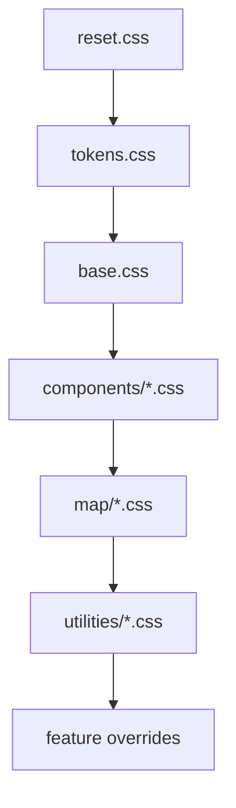

# 🎨 `web/styles` — KFM UI Styles & Design Tokens


> Shared styling for the **Kansas Frontier Matrix (KFM)** web client: map viewer 🗺️, layer catalog 🗂️, story nodes 🎬, and Focus Mode 🧠.  
> This folder holds **CSS/Sass beyond what component libraries provide**, plus a small **design-token system** to keep the UI consistent, accessible, responsive, and fast.

---

## 🧭 What belongs here

✅ Put these in `web/styles/`:
- Global tokens (CSS custom properties) for color/typography/spacing/motion
- Global base styles (reset, base typography, forms, focus rings)
- Map UI overrides (MapLibre/Cesium control theming, popup skins, legend layout)
- Reusable utility classes for layout (sparingly) and responsive helpers

❌ Avoid putting these here:
- Component-specific styles that only one component uses (keep them co-located with the component)
- Hard-coded colors/spacing in random component files (use tokens)
- “One-off” overrides without a reason (if you need it twice, it’s a component or a utility)

---

## 🧠 Principles (KFM-flavored)

KFM’s UI isn’t “just pretty” — it’s part of the project’s **contract-first, evidence-first** architecture:

- **Provenance-first UI** 🔎  
  Styles must make it easy to see *what’s sourced*, *what’s derived*, and *what’s AI-assisted* — without being distracting.
- **Accessible by default** ♿  
  Keyboard navigation, focus visibility, contrast, and screen reader semantics come first.
- **Responsive map-first layouts** 📱➡️🖥️  
  The map is the canvas; panels should collapse/stack gracefully on smaller screens.
- **Performance-aware** ⚡  
  Map rendering is WebGL-heavy; CSS should not add jank (avoid expensive effects & layout thrash).

---

## 🗂️ Suggested folder layout

> Adjust to match the repo’s current files; this is the target shape we should converge on.

```text
web/
└─ 🎨 styles/
   ├─ 📄 README.md                 # 📘 Styling rules: layering order, theming approach, a11y expectations
   ├─ 🧩📄 index.css                # Entry point: imports all CSS in strict order (reset → base → tokens → themes → comps)
   ├─ 🎛️📄 tokens.css               # Design tokens as CSS variables (colors, spacing, typography, z-index, etc.)
   ├─ 🧼📄 reset.css                # Minimal reset / normalization for consistent defaults across browsers
   ├─ 🔤📄 base.css                 # Base typography, forms, links, focus rings, and global element defaults
   ├─ 🎨 themes/
   │  ├─ 🌞🎨📄 light.css            # Light theme overrides (token values / theme-specific rules)
   │  └─ 🌙🎨📄 dark.css             # Dark theme overrides
   ├─ 🗺️ map/
   │  ├─ 🗺️🎛️📄 maplibre.css         # MapLibre control/popup overrides + map UI alignment with tokens
   │  └─ 🧊🗺️🎛️📄 cesium.css          # (Optional) Cesium 3D viewer UI overrides (only if Cesium enabled)
   ├─ 🧩 components/
   │  ├─ 🏷️📄 badges.css             # Provenance/AI/status badges (chips, tags, severity colors)
   │  ├─ 🧰📄 panels.css             # Panels/drawers/bottom sheets (layout, motion, scroll behavior)
   │  └─ 📊📄 charts.css             # Small embedded charts (popups, sparklines) styling
   └─ 🧰 utilities/
      ├─ 📐📄 layout.css             # Utility layout classes (.stack, .cluster, .grid) kept minimal
      └─ 🙈📄 visually-hidden.css     # Screen-reader-only utility (a11y helper)
```

---

## 🎛️ Design tokens

Tokens are our “UI contracts” — they keep the app consistent and make theming (light/dark, high-contrast) realistic.

### ✅ Rules
- Prefer **semantic tokens** (`--kfm-color-surface`) over raw palette tokens (`--blue-500`).
- Components should **not** introduce new raw hex values; add tokens instead.
- Use **`rem`** for typography + spacing scale (respects user zoom settings).
- If a token affects meaning (e.g., provenance), it must include **label + icon**, not color alone.

### 🧱 Token categories (recommended)

| Category | Examples | Notes |
|---|---|---|
| 🎨 Color | `--kfm-color-bg`, `--kfm-color-surface`, `--kfm-color-text`, `--kfm-color-accent` | Keep “surface” hierarchy clear (map overlays must remain readable). |
| 🗺️ Layer semantics | `--kfm-color-layer-historical`, `--kfm-color-layer-environment`, `--kfm-color-layer-infra` | Use in legends + category labels (not necessarily map symbology). |
| 🧾 Provenance | `--kfm-color-source`, `--kfm-color-derived`, `--kfm-color-ai` | Used for badges/chips that communicate trust level. |
| ✍️ Typography | `--kfm-font-sans`, `--kfm-font-mono`, `--kfm-text-sm`, `--kfm-text-lg` | Keep type scale conservative; maps need density. |
| 📐 Spacing | `--kfm-space-1 … --kfm-space-8` | Use for paddings/gaps; avoid random pixel values. |
| 🧊 Radius | `--kfm-radius-sm`, `--kfm-radius-md` | Keep consistent across panels/pills. |
| 🌫️ Elevation | `--kfm-shadow-1 … --kfm-shadow-3` | Use sparingly; heavy shadows can hurt performance + clarity. |
| 🧠 Motion | `--kfm-dur-fast`, `--kfm-ease-standard` | Respect `prefers-reduced-motion`. |
| 🧭 Z-index | `--kfm-z-map`, `--kfm-z-panel`, `--kfm-z-modal`, `--kfm-z-toast` | Keep a single source of truth. |

### Example tokens

```css
:root {
  /* Color — surfaces */
  --kfm-color-bg: hsl(210 20% 98%);
  --kfm-color-surface: hsl(0 0% 100%);
  --kfm-color-surface-2: hsl(210 16% 96%);
  --kfm-color-text: hsl(215 25% 15%);
  --kfm-color-muted: hsl(215 12% 45%);

  /* Color — semantic */
  --kfm-color-accent: hsl(211 90% 45%);
  --kfm-color-danger: hsl(0 75% 50%);
  --kfm-color-success: hsl(142 55% 35%);

  /* Provenance cues */
  --kfm-color-source: hsl(142 55% 35%);   /* “primary source” */
  --kfm-color-derived: hsl(35 85% 45%);   /* “derived / processed” */
  --kfm-color-ai: hsl(265 65% 50%);       /* “AI-assisted” */

  /* Spacing scale */
  --kfm-space-1: 0.25rem;
  --kfm-space-2: 0.5rem;
  --kfm-space-3: 0.75rem;
  --kfm-space-4: 1rem;
  --kfm-space-6: 1.5rem;
  --kfm-space-8: 2rem;

  /* Motion */
  --kfm-dur-fast: 120ms;
  --kfm-dur-med: 200ms;
  --kfm-ease-standard: cubic-bezier(0.2, 0, 0, 1);

  /* Radius */
  --kfm-radius-sm: 0.375rem;
  --kfm-radius-md: 0.75rem;
}
```

---

## 🧩 CSS architecture (layers + import order)

We want predictable styling with minimal specificity battles.



### Recommended `@layer` setup

```css
@layer reset, tokens, base, components, map, utilities, overrides;

@import "./reset.css" layer(reset);
@import "./tokens.css" layer(tokens);
@import "./base.css" layer(base);
@import "./components/panels.css" layer(components);
@import "./map/maplibre.css" layer(map);
@import "./utilities/layout.css" layer(utilities);
```

✅ Benefits:
- Lower specificity (fewer `!important`s)
- Easier overrides
- Cleaner reviews (“why is this in overrides?”)

---

## 📱 Responsive rules (mobile-first)

KFM’s UI includes panels (layer list, details, story) plus map controls. On small screens:

- Prefer **bottom sheets** for details, and **collapsible drawers** for catalogs.
- Make hit targets ≥ **44px**.
- Keep the map visible — don’t cover 100% unless in a deliberate “Focus” screen.

### Breakpoints (suggested)
Use `em`/`rem` so breakpoints respond to user zoom:

- `40rem` (~640px): small tablet
- `64rem` (~1024px): desktop
- `80rem` (~1280px): large desktop

```css
/* Base: mobile */
.kfm-panel { width: 100%; }

/* Tablet+ */
@media (min-width: 40rem) {
  .kfm-panel { width: 22rem; }
}

/* Desktop+ */
@media (min-width: 64rem) {
  .kfm-shell { display: grid; grid-template-columns: 22rem 1fr; }
}
```

---

## ♿ Accessibility: non-negotiables

### Focus & keyboard
- Always provide visible focus (`:focus-visible`) — never remove outlines without replacement.
- Keep tab order logical in panels, popups, and modals.
- Ensure map controls can be navigated (or provide an accessible alternative UI).

### Color & contrast
- Aim for **WCAG AA contrast** for text against surfaces.
- Never use color alone to convey provenance/status — pair with icon + label.

### Motion
Respect reduced motion:

```css
@media (prefers-reduced-motion: reduce) {
  * { animation-duration: 1ms !important; transition-duration: 1ms !important; }
}
```

---

## 🗺️ Map UI styling (MapLibre / Cesium)

KFM’s standard UX includes:
- Layer list/catalog 🗂️
- Search 🔍
- Legends 🧾
- Timeline slider ⏳
- Popups/details side panel 📌

### Popups & side panels
- Use a **single, consistent** popup skin.
- Popups should be readable over any basemap (use surface tokens + subtle border).
- If content is long (charts + metadata), promote to the details panel instead of a giant popup.

### Legends
Legends must support multiple layers at once:
- Clear headings
- Compact swatches
- Collapsible groups

Use semantic layer category colors for labels (not necessarily symbology).

### Timeline slider
- Thumb + track contrast must remain visible over the map.
- Provide labels that don’t rely on hover (mobile).

---

## 🔎 Provenance & Focus Mode UI cues

The system’s “evidence-first” rule should be visible in the UI, not hidden.

### Required UI patterns
- **Source chips** (primary sources) ✅
- **Derived/processed chips** 🟧
- **AI-assisted chips** 🧠
- **Confidence/quality indicators** (when applicable) 📊

### Suggested styling primitives
- `Badge` (small label)
- `Chip` (clickable, can open metadata/source panel)
- `Callout` (for disclaimers, “verify sources”, “data redacted”)

```css
.kfm-chip {
  display: inline-flex;
  gap: var(--kfm-space-1);
  padding: 0 var(--kfm-space-2);
  border-radius: 999px;
  border: 1px solid color-mix(in hsl, var(--kfm-color-text), transparent 85%);
  background: var(--kfm-color-surface-2);
  font-size: 0.875rem;
}

.kfm-chip[data-kind="ai"] {
  border-color: color-mix(in hsl, var(--kfm-color-ai), transparent 65%);
}
```

---

## ⚡ Performance tips (especially around WebGL maps)

- Avoid heavy `box-shadow`, `filter: blur()`, and large `backdrop-filter` usage on frequently updating elements.
- Prefer `transform` + `opacity` for animations.
- Keep selectors simple; avoid deep nesting and expensive selectors.
- Limit repaint areas: overlays should be their own layers where possible.

---

## ✅ PR checklist for style changes

- [ ] Uses tokens (no random hex/pixels without a token)
- [ ] Verified in **light + dark** (if applicable)
- [ ] Verified at **mobile + desktop** widths
- [ ] Keyboard navigation still works (focus visible)
- [ ] Contrast checked for text
- [ ] No “AI” or “derived” content looks like “primary source”
- [ ] Map popups/panels remain legible over multiple basemaps
- [ ] No noticeable interaction jank (drag/zoom/pan stays smooth)

---

## 🔗 Related docs

- `docs/MASTER_GUIDE_v13.md` 📚 (contracts, pipeline ordering, evidence-first rules)
- KFM technical documentation 📄 (front-end UI elements, responsiveness, accessibility)
- Any UI component docs / Story Node templates 🧩 (if present)

---

<details>
<summary>🧠 “Why are we so strict about provenance styling?”</summary>

Because KFM’s UI is part of the system’s trust model: the user should always be able to tell **what came from a primary source**, **what was derived**, and **what was AI-assisted** — and reach the underlying sources in one or two clicks.

</details>

