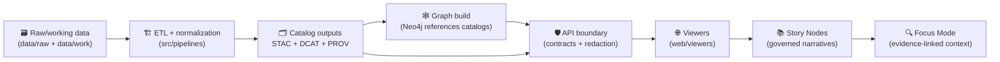

<!--
🗺️ web/viewers/ is KFM’s visualization boundary: map engines + narrative readers.
🗓️ Last updated: 2026-01-13
🔁 Review cycle: 90 days (or anytime viewer contracts/state model/story-node schema changes)
🔐 Reminder: UI is world-readable. No secrets. No direct graph access. No raw-storage bypass.
🧾 If it influences a decision, it must be provenance-linked (STAC/DCAT/PROV) and reviewable.
-->

<div align="center">

# 🗺️🛰️ KFM Web Viewers — `web/viewers/`

**Browser-first geospatial viewers for the Kansas Frontier Matrix (KFM)**  
🗺️ 2D Explorer (MapLibre) • 🛰️ 3D Globe (Cesium) • 📚 Story Nodes • 🔍 Focus Mode • 🧾 Provenance UI


</div>

> [!IMPORTANT]
> **KFM invariant (non‑negotiable ordering):**  
> **ETL → STAC/DCAT/PROV Catalogs → Neo4j Graph → APIs → UI → Story Nodes → Focus Mode** [oai_citation:0‡MARKDOWN_GUIDE_v13.md.gdoc](file-service://file-UYVruFXfueR8veHMUKeugU)  
> Viewers are **UI**. They are **contract consumers**, not a backdoor to the graph or raw storage.  
> **API boundary rule:** the frontend must **never** query Neo4j directly; all access goes through the governed API layer [oai_citation:1‡MARKDOWN_GUIDE_v13.md.gdoc](file-service://file-UYVruFXfueR8veHMUKeugU).

---

## 🔗 Quick links

| What | Link |
|---|---|
| 🌾 Back to `web/` | `../README.md` |
| 🎨 Static assets rules | `../assets/README.md` |
| 🗂️ Frontend data assets rules | `../data/README.md` |
| 🧩 Story Nodes runtime rules | `../story_nodes/README.md` |
| 🧾 Report an issue | `https://github.com/bartytime4life/Kansas-Frontier-Matrix/issues/new/choose` |

---

## 🧾 Doc metadata

| Field | Value |
|---|---|
| Folder | `web/viewers/` |
| Role | 🌐 UI boundary (map/globe + narrative + evidence panels) |
| Audience | frontend devs · cartographers · data stewards · reviewers |
| Status | Active ✅ |
| Version | **v1.2.0** |
| Last updated | **2026-01-13** |
| Core constraint | contract‑first + provenance‑first + sovereignty‑aware [oai_citation:2‡MARKDOWN_GUIDE_v13.md.gdoc](file-service://file-UYVruFXfueR8veHMUKeugU) |
| Review trigger | any change to viewer contracts / Story Node schema / Focus Mode evidence bundles |

---

<details>
<summary><strong>🧭 Table of contents</strong></summary>

- [🧭 What lives in <code>web/viewers/</code>](#-what-lives-in-webviewers)
- [🧱 Non-negotiables](#-non-negotiables)
- [🏗️ Architecture & data flow](#️-architecture--data-flow)
- [🧠 Viewer contract](#-viewer-contract)
- [🧩 Viewer lineup](#-viewer-lineup)
- [📦 Contracts & schemas](#-contracts--schemas)
- [🗺️ Data inputs, CRS, and GIS correctness](#️-data-inputs-crs-and-gis-correctness)
- [📚 Story Nodes + Focus Mode](#-story-nodes--focus-mode)
- [🧾 Provenance & trust cues](#-provenance--trust-cues)
- [🎨 Cartography truthfulness](#-cartography-truthfulness)
- [🧊 3D realism, uncertainty, and interpretation](#-3d-realism-uncertainty-and-interpretation)
- [⚡ Performance budgets & caching](#-performance-budgets--caching)
- [📱 Accessibility & mobile mapping](#-accessibility--mobile-mapping)
- [🛡️ Security & privacy](#️-security--privacy)
- [✅ Testing & CI gates](#-testing--ci-gates)
- [🤝 Contributing workflow](#-contributing-workflow)
- [🛣️ Roadmap](#️-roadmap)
- [📚 Project library influence map](#-project-library-influence-map)
- [🕰️ Version history](#️-version-history)

</details>

---

## 🧭 What lives in `web/viewers/`

This folder is KFM’s **front-end visualization boundary**: the code that turns **cataloged + governed artifacts** into an interactive experience.

KFM (as designed) is a “living atlas” that publishes governed metadata (STAC/DCAT/PROV), builds a semantically structured Neo4j graph, and serves evidence through contracted APIs into a map-and-narrative UI [oai_citation:3‡MARKDOWN_GUIDE_v13.md.gdoc](file-service://file-UYVruFXfueR8veHMUKeugU). Viewers sit at the **end** of that chain.

### ✅ Core promises

- **One dataset, many lenses**: the same cataloged artifacts can be explored in 2D, 3D, and narrative modes.
- **Catalog-driven UX**: viewers are powered by **catalog + provenance** patterns (STAC/DCAT/PROV), not hard-coded layers [oai_citation:4‡MARKDOWN_GUIDE_v13.md.gdoc](file-service://file-UYVruFXfueR8veHMUKeugU).
- **Story-first exploration**: Story Nodes provide curated waypoints; Focus Mode provides deep dives with evidence panels (story + map + provenance in one cockpit) [oai_citation:5‡Kansas Frontier Matrix (KFM) – Comprehensive Technical Documentation.pdf](file-service://file-AkqwUuYPp5zePf7pv5SMxi).
- **Governed UI boundary**: the viewer consumes data through **API contracts** and/or **catalog pointers** (no direct graph coupling) [oai_citation:6‡MARKDOWN_GUIDE_v13.md.gdoc](file-service://file-UYVruFXfueR8veHMUKeugU).

### 🚫 Anti-goals (on purpose)

- ❌ No “just fetch a file from a bucket and show it” (bypasses governance).
- ❌ No “query Neo4j from the browser” (breaks access control + redaction) [oai_citation:7‡MARKDOWN_GUIDE_v13.md.gdoc](file-service://file-UYVruFXfueR8veHMUKeugU).
- ❌ No “publish-looking artifacts” created in the viewer (publishing is upstream).

---

## 🧱 Non-negotiables

### 1) Pipeline ordering is absolute
The viewer can only render what has passed upstream contracts and checks [oai_citation:8‡MARKDOWN_GUIDE_v13.md.gdoc](file-service://file-UYVruFXfueR8veHMUKeugU).

### 2) Stable identifiers are UI contracts
Layer IDs and Story Node IDs become deep-link keys and review anchors. Keep **IDs stable**; put changeable facts in metadata (`version`, `run_id`, `prov:wasGeneratedBy`, etc.).

### 3) Evidence-first narrative (no unsourced claims)
Story Nodes / Focus Mode must not introduce uncited claims; every claim needs traceable evidence [oai_citation:9‡MARKDOWN_GUIDE_v13.md.gdoc](file-service://file-UYVruFXfueR8veHMUKeugU).

### 4) Sovereignty & “no downgrade”
No output can be less restricted than its inputs; sensitive locations may need generalization/omission in UI [oai_citation:10‡MARKDOWN_GUIDE_v13.md.gdoc](file-service://file-UYVruFXfueR8veHMUKeugU).

### 5) Treat all external content as hostile input 🧯
Story Node markdown, GeoJSON properties, SVG, style JSON, and metadata strings are all untrusted; sanitize/escape and fail closed.

> [!TIP]
> If it can’t be deep-linked, it can’t be reviewed.  
> If it can’t be reproduced (version-lock + run IDs), it can’t be trusted.

---

## 🏗️ Architecture & data flow

### 🔁 Downstream, contract-driven



This matches the v13 pipeline and “no leapfrog” rule [oai_citation:11‡MARKDOWN_GUIDE_v13.md.gdoc](file-service://file-UYVruFXfueR8veHMUKeugU).

### ✅ Two supported ingestion paths for viewers

1. **API-first** (preferred): the viewer loads *render-ready* layer manifests and evidence bundles via governed endpoints.
2. **Catalog-pointer**: the viewer resolves a STAC/DCAT/PROV pointer to fetch public assets (still validated + sanitized at runtime).

---

## 🧠 Viewer contract

A KFM viewer should share a common **state model** so deep-links and reproducibility work across engines.

### ✅ Recommended state keys (engine-agnostic)

- `engine`: `maplibre | cesium | hybrid`
- `time`: `date | range | step`
- `view`:
  - 2D: `center | zoom | bearing | pitch`
  - 3D: `camera` (position + orientation)
- `layers[]`: `{ id, visibility, opacity, styleVariant?, timeBehavior?, version? }`
- `focus`: `{ featureId? | bbox? | placeId? }`
- `story`: `{ storyNodeId?, storyNodeVersion? }`
- `locks`: `{ versionLock: true/false, layerVersions?: Record<string,string> }`

### 🔗 URL conventions (suggested)

- `?engine=maplibre`
- `&time=1880-01-01`
- `&layers=boundaries.counties,transport.railroads`
- `&story=sn.ks.rail.1880.v1`
- `&lock=1`

> [!NOTE]
> Version-lock matters because KFM is designed so every narrative claim can be traced to **versioned evidence** [oai_citation:12‡MARKDOWN_GUIDE_v13.md.gdoc](file-service://file-UYVruFXfueR8veHMUKeugU).

---

## 🧩 Viewer lineup

### 🗺️ MapLibre viewer (2D)
Best for: fast pan/zoom, vector & raster layering, cartographic clarity.

Expected: `web/viewers/maplibre/`

### 🛰️ Cesium viewer (3D)
Best for: terrain, 3D Tiles / GLB, camera-path narratives.

Expected: `web/viewers/cesium/`

### 🔀 Hybrid shell
Best for: unified deep-linking, seamless switching 2D ↔ 3D with shared Focus Mode.

Expected: `web/viewers/shared/`

### 🧾 Capability matrix (target)

| Capability | MapLibre (2D) | Cesium (3D) | Shared/hybrid |
|---|---:|---:|---:|
| Timeline scrubber | ✅ | ✅ | ✅ |
| Vector tiles (MVT/PMTiles) | ✅ | ⚠️ (adapter) | ✅ |
| Raster tiles / COG previews | ✅ | ⚠️ (adapter) | ✅ |
| 3D terrain | ⚠️ (2.5D) | ✅ | ✅ |
| 3D Tiles / GLB | 🚫 | ✅ | ✅ |
| Story Nodes | ✅ | ✅ | ✅ |
| Focus Mode evidence drawer | ✅ | ✅ | ✅ |
| Version lock (repro UX) | ✅ | ✅ | ✅ |
| Sovereignty banners / redaction cues | ✅ | ✅ | ✅ |

---

## 📦 Contracts & schemas

Viewers should be **schema-first** because UI is downstream of governance [oai_citation:13‡MARKDOWN_GUIDE_v13.md.gdoc](file-service://file-UYVruFXfueR8veHMUKeugU).

### 📌 Minimum contract set (recommended)

Store these in exactly one canonical location:

- `web/viewers/shared/contracts/` *(viewer-owned)*
- **or** repo-wide `schemas/` *(preferred if shared across subsystems)* [oai_citation:14‡MARKDOWN_GUIDE_v13.md.gdoc](file-service://file-UYVruFXfueR8veHMUKeugU)

**Schemas to define (minimum):**
- `viewerState.schema.json`
- `layer.manifest.schema.json` (UI view of STAC/DCAT + render hints)
- `storyNode.schema.json` (front-matter + references)
- `evidenceBundle.schema.json` (Focus Mode payload)
- `redactionPolicy.schema.json` (UI-visible gating rules)

### ✅ Example: Layer manifest (render hint + provenance)

```json
{
  "id": "boundaries.counties",
  "title": "Kansas counties (historic)",
  "description": "County boundaries, time-enabled where available.",
  "source": {
    "stac_item": "stac://kfm.boundaries.counties.v1",
    "dcat_dataset": "dcat://kfm.datasets.boundaries.counties"
  },
  "license": "CC-BY-4.0",
  "provenance": {
    "prov_bundle": "prov://kfm.prov.boundaries.counties.v1",
    "run_id": "kfm.etl.boundaries.counties.2026-01-01T00:00:00Z"
  },
  "sensitivity": {
    "classification": "public",
    "care_label": "Public"
  },
  "render": {
    "type": "mvt",
    "tiles": "https://example.invalid/tiles/{z}/{x}/{y}.pbf",
    "minzoom": 4,
    "maxzoom": 12
  }
}
```

Why so strict?
- KFM is intentionally meticulous about licensing and provenance to avoid legal pitfalls and foster collaboration [oai_citation:15‡Kansas Frontier Matrix (KFM) – Comprehensive Technical Documentation.pdf](file-service://file-AkqwUuYPp5zePf7pv5SMxi).
- Provenance must exist *before* graph/UI usage [oai_citation:16‡MARKDOWN_GUIDE_v13.md.gdoc](file-service://file-UYVruFXfueR8veHMUKeugU).

### ✅ Example: Story Node contract (Markdown + YAML front matter)

KFM-style governed docs benefit from YAML front matter for versioning, status, licensing, and sensitivity labels [oai_citation:17‡Comprehensive Markdown Guide_ Syntax, Extensions, and Best Practices.docx](file-service://file-J6rFRcp4ExCCeCdTevQjxz).

```yaml
---
id: "sn.ks.rail.1880"
version: "v1.0.0"
status: "draft"
title: "Railroads reshape Kansas (1880)"
time:
  start: "1875-01-01"
  end: "1885-12-31"
engines:
  - maplibre
  - cesium
layers:
  - id: "transport.railroads"
    visibility: true
focus:
  evidence_bundle: "evidence://sn.ks.rail.1880.v1"
sensitivity:
  classification: "public"
  care_label: "Public"
---
```

> [!TIP]
> If Focus Mode parses citations from Markdown (e.g., square-bracket patterns) to populate evidence panels, test rendering and validate Markdown structure to avoid breaking the parser [oai_citation:18‡Comprehensive Markdown Guide_ Syntax, Extensions, and Best Practices.docx](file-service://file-J6rFRcp4ExCCeCdTevQjxz).

---

## 🗺️ Data inputs, CRS, and GIS correctness

UI bugs become *belief bugs* in a map. GIS correctness is a governance requirement, not a “nice-to-have”.

### 🧭 CRS rules (defensive + explicit)

- **Shapefiles**: CRS identification assumes a `.prj` exists; without it, projection detection may fail [oai_citation:19‡python-geospatial-analysis-cookbook.pdf](file-service://file-HT14njz1MhrTZCE7Pwm5Cu).
- **GeoJSON**: CRS is often absent; the common standard assumption is **EPSG:4326 (WGS84)** unless CRS is explicitly defined and correct [oai_citation:20‡python-geospatial-analysis-cookbook.pdf](file-service://file-HT14njz1MhrTZCE7Pwm5Cu).
- **Vector → raster conversion**: some workflows require input projection in a Cartesian system in meters; WGS84/EPSG:4326 may not work for rasterization steps [oai_citation:21‡python-geospatial-analysis-cookbook.pdf](file-service://file-HT14njz1MhrTZCE7Pwm5Cu).

### ✅ Viewer-side checks (minimum)

- Validate geometry type + coordinate ranges (reject nonsense early).
- Enforce deterministic ordering for features when IDs are missing.
- Clamp/validate bbox, zoom, and time parameters (fail closed on invalid).

---

## 📚 Story Nodes + Focus Mode

### 📚 Story Nodes (narrative waypoints)
Story Nodes are Markdown-based narrative waypoints that can set time, view, visible layers, and include citations that link back to evidence [oai_citation:22‡Kansas Frontier Matrix (KFM) – Comprehensive Technical Documentation.pdf](file-service://file-AkqwUuYPp5zePf7pv5SMxi).

### 🔍 Focus Mode (evidence cockpit)
Focus Mode is a dedicated workflow for “deep dives” that combines narrative with context panels and evidence/provenance links [oai_citation:23‡Kansas Frontier Matrix (KFM) – Comprehensive Technical Documentation.pdf](file-service://file-AkqwUuYPp5zePf7pv5SMxi).

#### 🤖 AI in Focus Mode (strictly bounded)
KFM’s design treats Focus Mode AI as **advisory-only** and requires safeguards:
- **No autonomous action** (never publishes or hides data on its own) [oai_citation:24‡Kansas Frontier Matrix (KFM) – Comprehensive Technical Documentation.pdf](file-service://file-AkqwUuYPp5zePf7pv5SMxi)  
- **Citations required** and **no speculation beyond KFM data** [oai_citation:25‡Kansas Frontier Matrix (KFM) – Comprehensive Technical Documentation.pdf](file-service://file-AkqwUuYPp5zePf7pv5SMxi)  
- **Clear UI labeling** of AI-generated outputs [oai_citation:26‡Kansas Frontier Matrix (KFM) – Comprehensive Technical Documentation.pdf](file-service://file-AkqwUuYPp5zePf7pv5SMxi)

Additionally, v13 guidance requires:
- **AI hints must be opt-in**, clearly labeled, and include uncertainty/confidence metadata [oai_citation:27‡MARKDOWN_GUIDE_v13.md.gdoc](file-service://file-UYVruFXfueR8veHMUKeugU)  
- **No sensitive location leaks**: Focus Mode should generalize or omit sensitive locations, preventing side-channel bypasses [oai_citation:28‡MARKDOWN_GUIDE_v13.md.gdoc](file-service://file-UYVruFXfueR8veHMUKeugU)

---

## 🧾 Provenance & trust cues

If the UI can show it, the UI must be able to answer:

- **What is it?**
- **Where did it come from?**
- **What changed it / produced it?**
- **What license governs it?**
- **What uncertainty / caveats apply?**

KFM explicitly positions careful licensing and provenance as collaboration-enabling and trust-building [oai_citation:29‡Kansas Frontier Matrix (KFM) – Comprehensive Technical Documentation.pdf](file-service://file-AkqwUuYPp5zePf7pv5SMxi).

### ✅ Minimum trust cues to surface *in the viewer*
- License + attribution (visible, not buried)
- Source/provider
- Dataset ID(s): STAC / DCAT
- Lineage: PROV bundle + run ID + timestamp
- Sensitivity banner (classification + CARE label)
- Uncertainty badge (when model-derived)

---

## 🎨 Cartography truthfulness

Maps persuade. Design choices must not imply certainty that doesn’t exist.

A map should match its **data type**, **purpose**, and **audience**, and include core map elements (title, legend, scale bar, north arrow, labels, etc.) as appropriate [oai_citation:30‡Scalable Data Management for Future Hardware.pdf](file-service://file-GZ8gMsQ8hxu7GWEVd3csNE). Metadata and copyright considerations are also part of responsible mapmaking [oai_citation:31‡Scalable Data Management for Future Hardware.pdf](file-service://file-GZ8gMsQ8hxu7GWEVd3csNE).

### 🧪 “Don’t mislead” checklist (viewer defaults)
- Avoid misleading symbolization: e.g., dot maps can make dense areas appear more important even when they’re not.
- Keep legends honest: no hidden thresholds, no unexplained bins.
- No color-only encoding: use labels/patterns/tooltips for accessibility.

---

## 🧊 3D realism, uncertainty, and interpretation

3D can feel “more true” than it is.

Archaeological 3D GIS literature emphasizes that 3D models are representations used for exploring interpretations and supporting understanding—i.e., they participate in knowledge production, not just photorealism [oai_citation:32‡Mobile Mapping_ Space, Cartography and the Digital - 9789048535217.pdf](file-service://file-AkVmsLhdFzwie5Gco3zgYj).

### ✅ 3D viewer rules (Cesium / hybrid)
- Show **scale + vertical exaggeration** explicitly (if used).
- Surface **uncertainty + assumptions** for reconstructed/derived models.
- Prefer “interpretation-safe” defaults (don’t imply precision without evidence).

### 🧪 Modeling & simulation posture (V&V)
KFM’s modeling references stress credibility practices like verification, validation, uncertainty quantification, and credibility assessment as part of responsible simulation.

---

## ⚡ Performance budgets & caching

### 🎯 Why performance is governance (not vanity)
If the map stutters, users stop investigating. If time-scrub is slow, reviewers stop reviewing. That harms trust.

Database performance guidance highlights why user-facing systems should prioritize **latency** goals, percentile tracking (e.g., P99), and realistic peak planning [oai_citation:33‡Database Performance at Scale.pdf](file-service://file-36z8qyiVJRtrSs6QG7Epen).

### ✅ Practical viewer budgets (starter targets)
Treat these as initial guardrails; tighten with measurement.

| Budget | Target | Why |
|---|---:|---|
| “Time-scrub + pan” responsiveness | smooth, no lockups | hot path for exploration |
| Concurrent network requests | bounded | “No system supports unlimited concurrency” [oai_citation:34‡Database Performance at Scale.pdf](file-service://file-36z8qyiVJRtrSs6QG7Epen) |
| Tile payload size | keep small, prefer tiling | avoid multi‑MB GeoJSON blobs |
| Decode/parse | off main thread when possible | protect interaction |

### 🧠 Caching rules of thumb
- Cache *within a time window* (recent queries/tiles).
- Reuse computed intermediate results where possible (avoid repeating expensive work) [oai_citation:35‡webgl-programming-guide-interactive-3d-graphics-programming-with-webgl.pdf](file-service://file-7Nd7iS68ES97NmWhPiRWTP).
- Prefer immutable, versioned asset URLs for deterministic cache invalidation.

> [!CAUTION]
> External caches can add latency/cost, reduce availability, increase complexity, and introduce security risks [oai_citation:36‡Database Performance at Scale.pdf](file-service://file-36z8qyiVJRtrSs6QG7Epen). Don’t add caching layers blindly—measure first.

### 🎮 WebGL cost awareness (especially Cesium)
Debug tooling and “developer mode” can reduce performance; keep production builds lean [oai_citation:37‡webgl-programming-guide-interactive-3d-graphics-programming-with-webgl.pdf](file-service://file-7quELMw4FrspPczB9Y3BTp).

---

## 📱 Accessibility & mobile mapping

### 📐 Progressive enhancement (mobile-first reality)
Progressive enhancement starts with the smallest baseline and adds features as device capability grows.

### 📍 Mobile mapping constraints (design for them)
Mobile mapping work highlights practical constraints:
- GPS accuracy issues can arise from limited satellite access or multipath effects  
- Location services can drain battery by keeping radios/sensors active

### ✅ Baseline a11y commitments
- keyboard navigation (Tab/Enter/Esc)
- ARIA labels for drawers/controls
- no color-only encoding
- responsive layout: map always reachable; no scroll traps

---

## 🛡️ Security & privacy

### 🔐 UI is world-readable
Never ship secrets. Assume client code and requests are inspectable.

### 🧯 Input validation is fundamental
Security guidance emphasizes input validation as a primary defense: any input from an untrusted source is a potential target and must be validated (client-side and server-side), and cookie-provided data should not be trusted [oai_citation:38‡Introduction to Digital Humanism.pdf](file-service://file-HC311tLjkcn1yRbyTBLJQQ).

### ✅ Viewer hardening checklist (minimum)
- Sanitize Markdown (disallow raw HTML by default)
- Escape feature properties (no unsafe DOM sinks)
- Strict URL allow-lists for remote assets
- CSP + SRI (especially if GitHub Pages)
- Size limits (GeoJSON, images, tiles); guard against decompression bombs
- Fail closed on unclear classification/redaction policy

### 🧭 Sovereignty & sensitive locations
UI safeguards must prevent “side-channel” disclosure of sensitive sites; Focus Mode guidance explicitly calls for generalization/omission where needed [oai_citation:39‡MARKDOWN_GUIDE_v13.md.gdoc](file-service://file-UYVruFXfueR8veHMUKeugU).

### 🧑‍⚖️ Governance context (why this matters)
- Data space thinking emphasizes transparency, granular control, and data portability rights as central to trustworthy data sharing [oai_citation:40‡Data Spaces.pdf](file-service://file-7UnZyJ7eCK1egnsyuYJaFq).
- KFM’s broader framing includes ethical considerations around technology, law, and society—keep humans and accountability in the loop [oai_citation:41‡responsive-web-design-with-html5-and-css3.pdf](file-service://file-Heg28TVM2nReDYTQ7nPhAK) [oai_citation:42‡responsive-web-design-with-html5-and-css3.pdf](file-service://file-4pQLNMB3Rk5n5vUPTqxpNa).

---

## ✅ Testing & CI gates

v13 expects CI gates to enforce invariants (schemas, provenance completeness, security scans, link validity). Violations (missing PROV, broken links, secrets leaks) should fail the build [oai_citation:43‡MARKDOWN_GUIDE_v13.md.gdoc](file-service://file-UYVruFXfueR8veHMUKeugU).

### Minimum test suite for viewers
- **Schema validation**: layer manifests, viewer state, evidence bundles
- **Router reversibility**: state ↔ URL round-trips (deep-link reproducibility)
- **Sanitization tests**: Story Node markdown → safe HTML
- **Smoke e2e**: load map, toggle a layer, open a Story Node, open Focus Mode
- **Sovereignty tests**: sensitive content triggers banners/generalization, never precise leaks [oai_citation:44‡MARKDOWN_GUIDE_v13.md.gdoc](file-service://file-UYVruFXfueR8veHMUKeugU)

> [!TIP]
> Treat narrative documents as first-class, versioned artifacts; reviewers should check prose *and* provenance of statements [oai_citation:45‡Comprehensive Markdown Guide_ Syntax, Extensions, and Best Practices.docx](file-service://file-J6rFRcp4ExCCeCdTevQjxz).

---

## 🤝 Contributing workflow

When adding/changing viewer behavior:

1) **Start with contracts** (schemas + manifest fields).  
2) Add/adjust **layer registry** behavior (resolution + validation).  
3) Implement **engine adapter(s)** (MapLibre/Cesium) with graceful degradation.  
4) Add a **Story Node** (draft) that demonstrates the feature with evidence links.  
5) Add tests (schema + router + smoke).  
6) Ensure no invariant regressions: ordering, API boundary, provenance-first, sovereignty.

> [!NOTE]
> The design audit recommends modular documentation and glossaries for interdisciplinary clarity—treat viewer docs the same way (small, linkable, reviewable modules) [oai_citation:46‡Kansas-Frontier-Matrix Design Audit – Gaps and Enhancement Opportunities.pdf](file-service://file-TkRzAfTnxCYDUHauCf1NcH).

---

## 🛣️ Roadmap

- [ ] Unified URL state model across 2D/3D (hybrid as default deep-link)
- [ ] Layer Registry + render adapters (MVT/PMTiles/raster/COG/3D Tiles)
- [ ] Portable Story Node renderer (2D ↔ 3D parity)
- [ ] Focus Mode evidence drawer with citation UI (claim → evidence → provenance)
- [ ] Provenance/automation badges (health, last-run, attestation linkouts)
- [ ] Performance regression gates (interaction budgets + request concurrency caps)
- [ ] Accessibility audit + keyboard-first flows everywhere

---

## 📚 Project library influence map

> These references shape viewer templates, defaults, and review checklists. Respect upstream licenses.

<details>
<summary><strong>📦 Expand: Project files → what they influence in <code>web/viewers/</code></strong></summary>

### 🧭 KFM system vision, ordering, governance, and CI discipline
- 📄 **`MARKDOWN_GUIDE_v13.md.gdoc`** — canonical pipeline ordering; API boundary rule; provenance-first; evidence-first narrative; sovereignty propagation; CI gate expectations [oai_citation:47‡MARKDOWN_GUIDE_v13.md.gdoc](file-service://file-UYVruFXfueR8veHMUKeugU).
- 📄 **`Kansas Frontier Matrix (KFM) – Comprehensive Technical Documentation.pdf`** — Story Nodes + Focus Mode UX; AI safeguards (advisory-only, citations, labeling); licensing emphasis; sensitive data handling [oai_citation:48‡Kansas Frontier Matrix (KFM) – Comprehensive Technical Documentation.pdf](file-service://file-AkqwUuYPp5zePf7pv5SMxi) [oai_citation:49‡Kansas Frontier Matrix (KFM) – Comprehensive Technical Documentation.pdf](file-service://file-AkqwUuYPp5zePf7pv5SMxi).
- 📄 **`Kansas-Frontier-Matrix Design Audit – Gaps and Enhancement Opportunities.pdf`** — documentation modularity + glossary; MCP-aligned evidence discipline; testing and ethics checklist gaps to close [oai_citation:50‡Kansas-Frontier-Matrix Design Audit – Gaps and Enhancement Opportunities.pdf](file-service://file-TkRzAfTnxCYDUHauCf1NcH).
- 📄 **`Comprehensive Markdown Guide_ Syntax, Extensions, and Best Practices.docx`** — YAML front matter governance patterns; narrative review as code review; UI rendering tests for Focus Mode markdown; citation pattern expectations [oai_citation:51‡Comprehensive Markdown Guide_ Syntax, Extensions, and Best Practices.docx](file-service://file-J6rFRcp4ExCCeCdTevQjxz).

### 🗺️ GIS correctness, formats, CRS hygiene
- 📄 **`python-geospatial-analysis-cookbook.pdf`** — CRS detection (.prj); GeoJSON CRS assumptions; vector↔raster conversion pitfalls (meters vs degrees) [oai_citation:52‡python-geospatial-analysis-cookbook.pdf](file-service://file-HT14njz1MhrTZCE7Pwm5Cu) [oai_citation:53‡python-geospatial-analysis-cookbook.pdf](file-service://file-HT14njz1MhrTZCE7Pwm5Cu).
- 📄 **`KFM- python-geospatial-analysis-cookbook-over-60-recipes...pdf`** — web mapping interoperability patterns; GeoJSON generation pipelines; routing/query examples for API design review (server-side, not client-side).

### 🛰️ Remote sensing visualization patterns
- 📄 **`Cloud-Based Remote Sensing with Google Earth Engine-Fundamentals and Applications.pdf`** — time-series patterns, indices, and spatiotemporal visualization expectations [oai_citation:54‡Database Performance at Scale.pdf](file-service://file-36z8qyiVJRtrSs6QG7Epen).

### 🎨 Cartography, legends, mapping UX
- 📄 **`making-maps-a-visual-guide-to-map-design-for-gis.pdf`** — map purpose/audience fit; required map elements; metadata/copyright; avoiding misleading symbolization (e.g., dot maps) [oai_citation:55‡Scalable Data Management for Future Hardware.pdf](file-service://file-GZ8gMsQ8hxu7GWEVd3csNE).
- 📄 **`Mobile Mapping_ Space, Cartography and the Digital - 9789048535217.pdf`** — small-screen constraints; GPS error realities; battery/latency tradeoffs for mobile map UX.
- 📄 **`Archaeological 3D GIS_26_01_12_17_53_09.pdf`** — interpretative nature of 3D models; avoid “false certainty” in 3D presentations [oai_citation:56‡Mobile Mapping_ Space, Cartography and the Digital - 9789048535217.pdf](file-service://file-AkVmsLhdFzwie5Gco3zgYj).

### 🌐 Web UI, WebGL, media correctness
- 📄 **`responsive-web-design-with-html5-and-css3.pdf`** — progressive enhancement; mobile-first responsive constraints for map + panels.
- 📄 **`webgl-programming-guide-interactive-3d-graphics-programming-with-webgl.pdf`** — GPU cost awareness; avoid debug overhead in production; rendering discipline [oai_citation:57‡webgl-programming-guide-interactive-3d-graphics-programming-with-webgl.pdf](file-service://file-7quELMw4FrspPczB9Y3BTp).
- 📄 **`compressed-image-file-formats-jpeg-png-gif-xbm-bmp.pdf`** — correct image format selection for sprites/thumbnails/legends (JPEG vs PNG vs GIF).

### ⚡ Performance, caching, scale thinking
- 📄 **`Database Performance at Scale.pdf`** — latency vs throughput framing; percentile thinking (P99); concurrency limits; caution around external caches (latency/cost/availability/security) [oai_citation:58‡Database Performance at Scale.pdf](file-service://file-36z8qyiVJRtrSs6QG7Epen) [oai_citation:59‡Database Performance at Scale.pdf](file-service://file-36z8qyiVJRtrSs6QG7Epen).
- 📄 **`Scalable Data Management for Future Hardware.pdf`** — reuse/intermediate result thinking; adaptive optimization patterns (translate to UI: progressive loading + reuse) [oai_citation:60‡webgl-programming-guide-interactive-3d-graphics-programming-with-webgl.pdf](file-service://file-7Nd7iS68ES97NmWhPiRWTP).
- 📄 **`Data Spaces.pdf`** — trust, governance, transparency, and user-control framing for data sharing ecosystems [oai_citation:61‡Data Spaces.pdf](file-service://file-7UnZyJ7eCK1egnsyuYJaFq).
- 📄 **`PostgreSQL Notes for Professionals - PostgreSQLNotesForProfessionals.pdf`** — (backend-side) PostGIS/query literacy for layer services; helps reviewers catch API anti-patterns (still: UI must not query DB directly).

### 📈 Stats, inference, and uncertainty UX
- 📄 **`Understanding Statistics & Experimental Design.pdf`** — discipline around inference vs observation; communicate uncertainty and assumptions, especially in UI claims.
- 📄 **`graphical-data-analysis-with-r.pdf`** — diagnostic-first visualization patterns that inform Focus Mode plots.
- 📄 **`regression-analysis-with-python.pdf`** + **`Regression analysis using Python - slides-linear-regression.pdf`** — regression diagnostics and repeatability mindset for model-result panels.
- 📄 **`think-bayes-bayesian-statistics-in-python.pdf`** — credible intervals / posterior thinking for uncertainty UI.

### 🧪 Simulation, verification, optimization, and scenario UX
- 📄 **`Scientific Modeling and Simulation_ A Comprehensive NASA-Grade Guide.pdf`** — V&V / UQ / credibility expectations for simulation-derived layers and scenario viewers.
- 📄 **`Generalized Topology Optimization for Structural Design.pdf`** — parameter sensitivity mindset; informs how optimization scenarios should be displayed (assumptions + constraints).

### 🕸️ Graphs & structure overlays
- 📄 **`Spectral Geometry of Graphs.pdf`** — future network overlays; structural diagnostics; graph-as-visual evidence patterns.

### 🔒 Security, concurrency, adversarial posture
- 📄 **`ethical-hacking-and-countermeasures-secure-network-infrastructures.pdf`** — hostile-input mindset; input validation; defensive web posture [oai_citation:62‡Introduction to Digital Humanism.pdf](file-service://file-HC311tLjkcn1yRbyTBLJQQ).
- 📄 **`Gray Hat Python - Python Programming for Hackers and Reverse Engineers (2009).pdf`** — adversarial thinking and attack-surface awareness (used defensively).
- 📄 **`concurrent-real-time-and-distributed-programming-in-java-threads-rtsj-and-rmi.pdf`** — bounded work + timeouts mindset; informs client-side task scheduling (Web Workers, cancellation, no main-thread stalls).

### 🧠 Human factors, autonomy, law
- 📄 **`Introduction to Digital Humanism.pdf`** — human-centered framing and accountability across digital systems [oai_citation:63‡responsive-web-design-with-html5-and-css3.pdf](file-service://file-Heg28TVM2nReDYTQ7nPhAK).
- 📄 **`Principles of Biological Autonomy - book_9780262381833.pdf`** — autonomy/control metaphors; informs “assist not assert” UI posture.
- 📄 **`On the path to AI Law’s prophecies and the conceptual foundations of the machine learning age.pdf`** — governance/accountability framing for ML-era systems [oai_citation:64‡responsive-web-design-with-html5-and-css3.pdf](file-service://file-4pQLNMB3Rk5n5vUPTqxpNa).
- 📄 **`Deep Learning for Coders with fastai and PyTorch - Deep.Learning.for.Coders...pdf`** — model cards + evaluation discipline (note: file access may be limited in some tooling).

### 📚 Programming reference shelves (maintainer lookup)
- 📄 **`A programming Books.pdf`**
- 📄 **`B-C programming Books.pdf`**
- 📄 **`D-E programming Books.pdf`**
- 📄 **`F-H programming Books.pdf`**
- 📄 **`I-L programming Books.pdf`**
- 📄 **`M-N programming Books.pdf`**
- 📄 **`O-R programming Books.pdf`**
- 📄 **`S-T programming Books.pdf`**
- 📄 **`U-X programming Books.pdf`**

</details>

---

## 🕰️ Version history

| Version | Date | Summary | Author |
|---:|---|---|---|
| v1.2.0 | 2026-01-13 | Upgraded viewer README to be v13 contract-first + provenance-first: added doc metadata, architecture/data-flow diagram aligned to canonical ordering, clarified Focus Mode AI guardrails (opt-in, citations, no sensitive leaks), expanded CRS/GIS correctness rules, added cartography + 3D uncertainty posture, strengthened performance/caching and security sections with project-library grounding, and expanded influence map to cover all project files. | KFM Engineering |
| v1.1.0 | 2026-01-11 | Prior iteration: viewer lineup, contracts outline, Story Nodes + Focus Mode integration, performance + security basics. | KFM Engineering |

---

<div align="center">

🗺️ Explore responsibly · 🧾 Surface provenance · 🧪 Show uncertainty · 🛡️ Honor sovereignty · ✅ Ship contracts

</div>