# 🗂️ DataCatalogPage


> [!IMPORTANT]
> **DataCatalogPage is a governance-grade discovery UI.**
> It must **surface** canonical metadata (STAC/DCAT/PROV + API contracts) — not **invent** it. If a dataset doesn’t have the required boundary artifacts, it’s not “published” and shouldn’t appear here.

---

<details>
<summary>🧭 Table of Contents</summary>

- [Purpose](#purpose)
- [Where this page fits in KFM](#where-this-page-fits-in-kfm)
- [UX anatomy](#ux-anatomy)
- [Data inputs](#data-inputs)
- [UI contract](#ui-contract)
- [Search, filtering, and sorting](#search-filtering-and-sorting)
- [Provenance and citation UX](#provenance-and-citation-ux)
- [Sensitivity, privacy, and governance](#sensitivity-privacy-and-governance)
- [Performance and reliability](#performance-and-reliability)
- [Accessibility and responsive behavior](#accessibility-and-responsive-behavior)
- [Telemetry](#telemetry)
- [Testing checklist](#testing-checklist)
- [Contributing: how to make a dataset appear here](#contributing-how-to-make-a-dataset-appear-here)
- [Recommended folder layout](#recommended-folder-layout)
- [Reference shelf](#reference-shelf)

</details>

---

## Purpose

DataCatalogPage is the **front door** to KFM’s datasets and layers:

- 🔎 **Discover** datasets (keywords + facets + spatial + temporal)
- 🧾 **Understand** what a dataset is, where it came from, and what it’s safe to do with it (license + provenance + sensitivity)
- 🗺️ **Preview & activate** datasets (Add to Map / Open in viewer / Download)
- 📌 **Bridge** into related experiences (MapPage layers, Story Nodes, Focus Mode, graph relationships)

> [!NOTE]
> Think of this page as **“DCAT discovery + STAC browsing + PROV inspection”** wrapped in an ergonomic UI.

---

## Where this page fits in KFM

```mermaid
flowchart LR
  subgraph Data["📦 Data lifecycle"]
    A["Raw sources 📥"] --> B["ETL + normalization 🧼"]
    B --> C["Processed assets 🗄️"]
    C --> S["STAC (Items + Collections) 🛰️"]
    C --> D["DCAT (dataset entries) 🗂️"]
    C --> P["PROV (lineage bundles) 🧾"]
  end

  S --> G["Graph (Neo4j) 🕸️"]
  D --> G
  P --> G

  G --> H["API layer (contracts + redaction) 🔌"]
  H --> UI["Web UI (React) 🌍"]

  UI --> M["MapPage (MapLibre / optional Cesium) 🗺️"]
  UI --> CATALOG["DataCatalogPage (this) 🗃️"]
  UI --> STORY["Story Nodes 🧭"]
  UI --> FOCUS["Focus Mode 🎯"]
```



**Key implication:** DataCatalogPage is downstream of **catalog artifacts**. If STAC/DCAT/PROV aren’t present/valid, the dataset is not “catalog-ready.”

---

## UX anatomy

A practical mental model (desktop):

- **Top bar**: global keyword search + “within map extent” toggle
- **Left rail**: facets (domain, format, tags, license, classification, temporal slider)
- **Main pane**: results list (cards/rows), with paging/infinite scroll
- **Right pane**: details drawer/panel for selected dataset
- **Primary actions** (per dataset):  
  ✅ *Add to Map* · 🧾 *View Provenance* · 📥 *Download* · 🔗 *Copy Citation* · 🕸️ *Related entities* (optional)

Mobile model:

- Filters collapse into a **bottom sheet / drawer**
- Details panel becomes a **full-screen step** from results

---

## Data inputs

### From the API (preferred)

DataCatalogPage should treat the API as the **only online entry point**:

- `GET /api/datasets`  
  Returns dataset summaries (enough for list view)
- `GET /api/datasets/{id}`  
  Returns full metadata (details panel)
- `GET /api/search?...`  
  Cross-entity search (datasets + docs + places), if supported
- Optional: dataset-specific endpoints like `/api/datasets/{id}/data` **must not** be called from list view (too heavy)

> [!TIP]
> Design list view around a **thin summary payload**. Fetch details lazily on selection.

### From catalog artifacts (indirectly)

Even if the API aggregates things, the canonical sources are:

- 🛰️ **STAC**: spatial/temporal extent, assets, item/collection structure
- 🗂️ **DCAT**: discovery-oriented dataset record (JSON-LD)
- 🧾 **PROV**: lineage (inputs, transformations, agents, run IDs, parameters)

**UI invariant:** If a dataset claims to be “published,” it should be linkable to its STAC/DCAT/PROV records.

---

## UI contract

Keep the UI contract **small, typed, and schema-aligned**.

Example (TypeScript-ish):

```ts
export type DataClassification =
  | "public"
  | "internal"
  | "confidential"
  | "restricted";

export type DatasetFormat =
  | "vector"
  | "raster"
  | "table"
  | "tiles"
  | "3d-tiles"
  | string;

export interface DatasetSummary {
  id: string;
  title: string;
  description?: string;

  domains?: string[];
  keywords?: string[];

  // Prefer a single canonical bbox for filtering + preview
  bbox?: [number, number, number, number]; // [minLon, minLat, maxLon, maxLat]

  // Temporal summary for the catalog list
  temporal?: { start?: string; end?: string };

  formats?: DatasetFormat[];

  updatedAt?: string;         // last published/update timestamp
  license?: string;           // SPDX-ish when possible

  classification: DataClassification;

  // Canonical record references (URLs or IDs)
  refs?: {
    stac?: string;
    dcat?: string;
    prov?: string;
  };
}

export interface DatasetDetail extends DatasetSummary {
  // Links for actions (download, tiles, docs, etc.)
  links?: Array<{
    rel: "download" | "tiles" | "docs" | "preview" | "license" | string;
    href: string;
    type?: string;
    title?: string;
  }>;

  // Optional governance/quality signals
  quality?: {
    completeness?: number;   // 0..1
    uncertainty?: number;    // 0..1
    notes?: string[];
  };

  // Optional: map integration hints
  map?: {
    defaultStyle?: string;   // style/layer preset id
    defaultOpacity?: number;
    timeField?: string;      // for timeline slider (if applicable)
  };
}
```

> [!IMPORTANT]
> Any “extra” metadata should be added via **schema/profile extension**, not ad-hoc UI-only fields.

---

## Search, filtering, and sorting

### Filter taxonomy (3 modes)

1) **Query by attribute** 🏷️  
   Domain, tags, format, license, classification, source/org, update frequency

2) **Query by geography** 🗺️  
   - Within map bounds (“search in view”)
   - Intersects polygon/region (if a region picker exists)
   - Distance/radius (optional)

3) **Query by time** 🕰️  
   Temporal extent slider or start/end date filter

> [!NOTE]
> This mirrors common GIS discovery patterns: selection, attribute query, geography query.

### Suggested query parameters

Keep URL/share-links stable:

- `q=...`
- `domain=...` (multi)
- `format=...` (multi)
- `license=...`
- `classification=public|internal|...`
- `timeStart=YYYY-MM-DD`
- `timeEnd=YYYY-MM-DD`
- `bbox=minLon,minLat,maxLon,maxLat`
- `sort=relevance|updated|title`
- `cursor=...` + `limit=...`

### Sorting

- **Relevance** (default if `q` present)
- **Updated** (great for browsing)
- **Title** (predictable for scanning)

---

## Provenance and citation UX

### Minimum provenance affordances

In the **details panel**, always show:

- 📌 **Source attribution** (organization + original source link)
- 🧾 **Provenance link** (PROV bundle / run ID / pipeline)
- 🧭 **Processing summary** (what was done at a high level)
- 🔁 **Versioning** (dataset version, published date, and/or run hash)
- ⚖️ **License** + any **restrictions** (non-commercial, etc.)

### “Copy citation” output

Provide a one-click copy format (human-readable), e.g.:

```text
{Publisher/Org}. ({Year}). {Dataset Title} (v{Version}). Kansas Frontier Matrix (KFM).
Accessed {YYYY-MM-DD}. Source: {Source URL or Catalog URL}.
```

> [!TIP]
> If a dataset has a DOI, use it as the primary cite target. Otherwise cite the DCAT/STAC record URL.

---

## Sensitivity, privacy, and governance

### Classification-driven behavior 🔒

Treat classification as a **first-class field**:

- **Public**: visible by default
- **Internal / Confidential / Restricted**: gated by auth/role, or omitted entirely for public users

### UI rules (hard invariants)

- 🚫 **Never display restricted datasets** to unauthorized users (even “just metadata” unless explicitly allowed)
- 🧩 **No “downstream loosening”**: UI must not show more detail than what the API returns
- 🧯 **Redaction is layered**: processed data + metadata + API + UI should all align

### Sensitive location handling 🧭

If a dataset contains sensitive points (e.g., archaeological sites):

- display generalized geometry (e.g., hex/area)
- show a warning banner (“locations generalized for protection”)
- require a click-through disclaimer if policy requires it

> [!IMPORTANT]
> The UI is not the primary enforcement layer — but it **must** be a consistent enforcement layer.

---

## Performance and reliability

### Front-end performance

- 🧠 Debounce keyword input (e.g., 250–400ms)
- 🧵 Cancel in-flight requests when filters change (AbortController)
- 🪟 Virtualize large result lists (windowing)
- 🧊 Use skeleton loading states (avoid layout shift)
- 🧰 Cache stable queries (query-keyed cache; respect auth scopes)

### API-friendly patterns

- Prefer **cursor pagination** over page numbers for big catalogs
- Ask for **thin summaries** (`fields=` / `select=` pattern)
- Support **ETag/If-None-Match** or similar to avoid refetching unchanged catalogs

---

## Accessibility and responsive behavior

- ✅ Semantic HTML landmarks (`main`, `nav`, `aside`)
- ♿ ARIA only when needed (don’t ARIA-overwrite native semantics)
- ⌨️ Full keyboard navigation:
  - filter toggles
  - facet checkboxes
  - results list
  - details drawer focus trap
- 🌗 High-contrast compatibility (avoid conveying meaning by color alone)

Responsive notes:

- Filters in a drawer on small screens
- Details panel becomes a route/step (back button supported)

---

## Telemetry

Telemetry should support governance + UX improvement without creeping into surveillance:

Suggested events:

- `catalog_search_submitted`
- `catalog_filters_changed`
- `dataset_opened`
- `dataset_added_to_map`
- `dataset_download_clicked`
- `sensitivity_warning_shown`
- `restricted_dataset_hidden`
- `provenance_viewed`
- `citation_copied`

> [!NOTE]
> If sensitive data interactions are logged, ensure it’s aligned with governance policy and minimized to what’s necessary.

---

## Testing checklist

### Unit tests 🧪

- Filter state reducers / query serialization
- Sorting logic
- Classification gating logic
- Citation formatter

### Integration tests 🔌

- Results list renders from `/api/datasets`
- Details panel renders from `/api/datasets/{id}`
- “Add to Map” dispatches correct map integration action
- “Search in map extent” passes bbox

### UX checks 🧭

- Empty state (no results)
- Offline / API error state
- Slow network (loading skeleton + cancel behavior)
- Keyboard-only navigation
- Screen reader pass (labels, headings, focus order)

---

## Contributing: how to make a dataset appear here

> [!IMPORTANT]
> DataCatalogPage is downstream of the catalogs. **Catalog outputs are the publication boundary.**

High-level checklist:

1) 📥 **Ingest** to `data/raw/<domain>/...`
2) 🧼 Transform through `data/work/<domain>/...`
3) 🗄️ Publish outputs in `data/processed/<domain>/...`
4) 🛰️ Write STAC Item/Collection to `data/stac/...`
5) 🗂️ Write DCAT dataset entry to `data/catalog/dcat/...`
6) 🧾 Write PROV bundle to `data/prov/...`
7) ✅ Pass schema validators + CI gates
8) 🔌 Confirm API index picks it up (`GET /api/datasets`)

Common reasons a dataset doesn’t show up:

- Missing DCAT entry
- Missing/invalid STAC record
- Missing PROV
- Classification disallows exposure (correct behavior!)
- API index/cache not refreshed (dev environment)

---

## Recommended folder layout

This view should stay modular and boring (in a good way 🙂):

```text
📁 web/
  📁 views/
    📁 DataCatalogPage/
      📄 README.md                  👈 you are here
      📄 DataCatalogPage.tsx
      📁 components/
      │  ├─ 📄 DatasetCard.tsx
      │  ├─ 📄 DatasetDetailsPanel.tsx
      │  ├─ 📄 FacetFilters.tsx
      │  └─ 📄 CatalogSearchBar.tsx
      📁 hooks/
      │  ├─ 📄 useCatalogQueryState.ts
      │  ├─ 📄 useDatasetsQuery.ts
      │  └─ 📄 useDatasetDetailsQuery.ts
      📁 types/
      │  └─ 📄 catalog.types.ts
      📁 __tests__/
         └─ 📄 DataCatalogPage.test.tsx
```

> [!TIP]
> Keep “query state” logic (URL params ↔ state) in one place. This prevents filter drift and makes shareable URLs trivial.

---

## Reference shelf

### Core project docs (canonical)

- 📘 `docs/MASTER_GUIDE_v13.md` (directory layout, invariants, validation gates)
- 🧾 STAC/DCAT/PROV schemas under `schemas/`
- ⚖️ Governance standards under `docs/standards/` and `docs/governance/`
- 📚 Reference PDFs under `docs/library/` (if present)

### 📚 Project Library (reference PDFs)

<details>
<summary>Open the library list (used as design/engineering references)</summary>

#### 🌐 Web UI / Front-end
- responsive-web-design-with-html5-and-css3.pdf
- webgl-programming-guide-interactive-3d-graphics-programming-with-webgl.pdf
- compressed-image-file-formats-jpeg-png-gif-xbm-bmp.pdf

#### 🗺️ GIS / Cartography / Geo UX
- making-maps-a-visual-guide-to-map-design-for-gis.pdf
- python-geospatial-analysis-cookbook.pdf
- Mobile Mapping_ Space, Cartography and the Digital - 9789048535217.pdf
- Archaeological 3D GIS_26_01_12_17_53_09.pdf

#### 🛰️ Remote Sensing / Earth Data
- Cloud-Based Remote Sensing with Google Earth Engine-Fundamentals and Applications.pdf

#### 🗄️ Data Engineering / Databases / Scale
- PostgreSQL Notes for Professionals - PostgreSQLNotesForProfessionals.pdf
- Database Performance at Scale.pdf
- Scalable Data Management for Future Hardware.pdf
- Data Spaces.pdf

#### 📈 Statistics / ML / Modeling
- Understanding Statistics & Experimental Design.pdf
- regression-analysis-with-python.pdf
- Regression analysis using Python - slides-linear-regression.pdf
- think-bayes-bayesian-statistics-in-python.pdf
- graphical-data-analysis-with-r.pdf
- Deep Learning for Coders with fastai and PyTorch (PDF)

#### 🔐 Security
- ethical-hacking-and-countermeasures-secure-network-infrastructures.pdf
- Gray Hat Python - Python Programming for Hackers and Reverse Engineers (2009).pdf

#### 🧠 Ethics / Society / Law
- Introduction to Digital Humanism.pdf
- On the path to AI Law’s prophecies and the conceptual foundations of the machine learning age.pdf

#### 🧪 Simulation / Optimization / Theory (supporting workstreams)
- Scientific Modeling and Simulation_ A Comprehensive NASA-Grade Guide.pdf
- Generalized Topology Optimization for Structural Design.pdf
- Spectral Geometry of Graphs.pdf
- Principles of Biological Autonomy - book_9780262381833.pdf

#### 📦 Programming Compendiums (quick references)
- A programming Books.pdf
- B-C programming Books.pdf
- D-E programming Books.pdf
- F-H programming Books.pdf
- I-L programming Books.pdf
- M-N programming Books.pdf
- O-R programming Books.pdf
- S-T programming Books.pdf
- U-X programming Books.pdf

</details>

---

## TODOs (keep this doc honest)

- [ ] Confirm exact API endpoints + query params implemented in `src/server/`  
- [ ] Confirm dataset type schema location (`schemas/`) and link it here  
- [ ] Add a real screenshot/gif once UI stabilizes (optional)  
- [ ] Document exact “Add to Map” layer config contract (vector/raster/3d-tiles)  

✅ If you update DataCatalogPage behavior, update this README in the same PR.
