# 🧠 FocusModePage


-informational)


> **FocusModePage is the “trust surface” of KFM**: a map + timeline + Focus panel where users ask questions, read Story Nodes, and explore **only provenance-linked** content.  
> The platform’s key invariants (pipeline ordering, API boundary, provenance-first, evidence-first narrative) are non‑negotiable.  [oai_citation:0‡MARKDOWN_GUIDE_v13.md.gdoc](file-service://file-UYVruFXfueR8veHMUKeugU)

---

<details>
  <summary><strong>📌 Table of contents</strong></summary>

- [🧭 What Focus Mode is](#-what-focus-mode-is)
- [🧱 Non-negotiable KFM invariants](#-non-negotiable-kfm-invariants)
- [🗺️ Page anatomy](#️-page-anatomy)
- [🔁 Data flow](#-data-flow)
- [🧩 Suggested component breakdown](#-suggested-component-breakdown)
- [🧾 Evidence & citation model](#-evidence--citation-model)
- [📚 Story Node integration](#-story-node-integration)
- [🔐 Safety, sovereignty, and privacy](#-safety-sovereignty-and-privacy)
- [⚡ Performance notes](#-performance-notes)
- [♿ Accessibility](#-accessibility)
- [🧪 Testing & CI gates](#-testing--ci-gates)
- [✅ Definition of done](#-definition-of-done)
- [📚 Project library crosswalk](#-project-library-crosswalk)
- [🧷 Glossary](#-glossary)

</details>

---

## 🧭 What Focus Mode is

Focus Mode is the interactive experience where users:
- **Ask natural-language questions** and receive answers with references (citations / evidence links).  [oai_citation:1‡Kansas Frontier Matrix (KFM) – Comprehensive Technical Documentation.pdf](file-service://file-AkqwUuYPp5zePf7pv5SMxi)
- **Explore relationships** (people ↔ events ↔ places ↔ datasets) by leveraging the knowledge graph.  [oai_citation:2‡Kansas Frontier Matrix (KFM) – Comprehensive Technical Documentation.pdf](file-service://file-AkqwUuYPp5zePf7pv5SMxi)
- **Read Story Nodes alongside map + timeline context**, with strict trust rules (no provenance → no display).  [oai_citation:3‡MARKDOWN_GUIDE_v13.md.gdoc](file-service://file-UYVruFXfueR8veHMUKeugU)

KFM’s documentation explicitly describes Focus Mode AI as graph-backed: the assistant can traverse relationships to answer questions (e.g., “what events happened here?”, “what datasets exist?”, “what notable people are linked?”).  [oai_citation:4‡Kansas Frontier Matrix (KFM) – Comprehensive Technical Documentation.pdf](file-service://file-AkqwUuYPp5zePf7pv5SMxi)

---

## 🧱 Non-negotiable KFM invariants

> [!IMPORTANT]
> **If FocusModePage violates any of these rules, it is a system defect (not a “feature gap”).**  
> These invariants are treated as hard gates in KFM’s architecture and CI.  [oai_citation:5‡MARKDOWN_GUIDE_v13.md.gdoc](file-service://file-UYVruFXfueR8veHMUKeugU)

### 1) Pipeline ordering is absolute ✅
KFM’s pipeline ordering is **inviolable**:  
**ETL → Catalogs (STAC/DCAT/PROV) → Graph → API → UI → Story Nodes → Focus Mode**.  [oai_citation:6‡MARKDOWN_GUIDE_v13.md.gdoc](file-service://file-UYVruFXfueR8veHMUKeugU)

### 2) API boundary rule ✅
The UI **must never query the Neo4j graph directly**. All access goes through the governed API layer (e.g., `src/server/`).  [oai_citation:7‡MARKDOWN_GUIDE_v13.md.gdoc](file-service://file-UYVruFXfueR8veHMUKeugU)

### 3) Provenance-first ✅
Everything shown in Focus Mode must be traceable back to cataloged sources and provable processing (“no mystery layers”).  [oai_citation:8‡Kansas Frontier Matrix (KFM) – Comprehensive Technical Documentation.pdf](file-service://file-AkqwUuYPp5zePf7pv5SMxi)

### 4) Evidence-first narrative ✅
No unsourced narrative content is allowed in Story Nodes or Focus Mode; claims must cite evidence and AI-generated text must be labeled with provenance/confidence metadata.  [oai_citation:9‡MARKDOWN_GUIDE_v13.md.gdoc](file-service://file-UYVruFXfueR8veHMUKeugU)

### 5) Sovereignty & classification propagation ✅
No output artifact can be less restricted than its inputs; sensitive datasets must remain protected end‑to‑end, including UI safeguards.  [oai_citation:10‡MARKDOWN_GUIDE_v13.md.gdoc](file-service://file-UYVruFXfueR8veHMUKeugU)

---

## 🗺️ Page anatomy

KFM’s target UI stack is described as **React + MapLibre** (with **optional Cesium** for 3D).  [oai_citation:11‡MARKDOWN_GUIDE_v13.md.gdoc](file-service://file-UYVruFXfueR8veHMUKeugU)

### 🧠 High-level layout (conceptual)

```mermaid
flowchart LR
  subgraph MapSide["🗺️ Map + Timeline Surface"]
    Map["Map Canvas (MapLibre)"]
    Timeline["⏱️ Timeline / Time Filter"]
    Layers["🧩 Layer Registry + Controls"]
  end

  subgraph FocusSide["🧠 Focus Panel (This Page)"]
    Context["📌 Context Bar (viewport/time/layers/selection)"]
    Chat["💬 Chat Thread (Q&A)"]
    Story["📚 Story Node Reader (optional mode)"]
    Evidence["🧾 Evidence Drawer (citations + provenance)"]
  end

  Map --- FocusSide
  Timeline --- FocusSide
  Layers --- FocusSide
```



### 🧭 Two primary modes

1) **Explore (Q&A)**  
   - User asks: “What happened here in the 1870s?” 
   - Focus Mode traverses graph + catalogs to answer with citations.  [oai_citation:12‡Kansas Frontier Matrix (KFM) – Comprehensive Technical Documentation.pdf](file-service://file-AkqwUuYPp5zePf7pv5SMxi) [oai_citation:13‡Kansas Frontier Matrix (KFM) – Comprehensive Technical Documentation.pdf](file-service://file-AkqwUuYPp5zePf7pv5SMxi)

2) **Read (Story Node)**  
   - Story Nodes are governed Markdown narratives with citations + semantic links.  [oai_citation:14‡MARKDOWN_GUIDE_v13.md.gdoc](file-service://file-UYVruFXfueR8veHMUKeugU)  
   - Focus Mode presents the Story Node alongside the map/timeline context and enforces strict display rules.  [oai_citation:15‡MARKDOWN_GUIDE_v13.md.gdoc](file-service://file-UYVruFXfueR8veHMUKeugU)

---

## 🔁 Data flow

### ✅ Contract-first, API-mediated flow

KFM’s backend is described as a stateless FastAPI service, with documented APIs (OpenAPI/Swagger) and a GraphQL schema for integration.  [oai_citation:16‡Kansas Frontier Matrix (KFM) – Comprehensive Technical Documentation.pdf](file-service://file-AkqwUuYPp5zePf7pv5SMxi)

```mermaid
sequenceDiagram
  participant U as 👤 User
  participant UI as 🧠 FocusModePage (web/)
  participant API as 🔌 Governed API (src/server/)
  participant G as 🕸️ Graph (Neo4j)
  participant C as 📚 Catalogs (STAC/DCAT/PROV)

  U->>UI: Ask question (plus map/time context)
  UI->>API: POST /focus/answer (context bundle)
  API->>G: Traverse entities/relations
  API->>C: Resolve provenance + citations
  API-->>UI: Answer markdown + evidence list
  UI-->>U: Render answer + Evidence Drawer
```



> [!NOTE]
> The UI may be “graph-aware” conceptually, but must be “graph-blind” operationally: **only the API can touch Neo4j**.  [oai_citation:17‡MARKDOWN_GUIDE_v13.md.gdoc](file-service://file-UYVruFXfueR8veHMUKeugU)

---

## 🧩 Suggested component breakdown

> This is a **recommended** structure to keep the page flexible as requirements evolve (expect imperfect knowledge; design for change).  [oai_citation:18‡F-H programming Books.pdf](file-service://file-QofzooQDG9grJwh9nFN9SY)

```text
📁 web/
  📁 views/
    📁 FocusModePage/
      📄 README.md  👈 you are here
      📄 FocusModePage.tsx
      📁 components/
        📄 FocusShell.tsx
        📄 ContextBar.tsx
        📄 ChatThread.tsx
        📄 MessageComposer.tsx
        📄 EvidenceDrawer.tsx
        📄 StoryReader.tsx
      📁 hooks/
        📄 useFocusMode.ts
        📄 useEvidence.ts
      📁 utils/
        📄 citations.ts
        📄 redaction.ts
      📁 types/
        📄 focusModeContracts.ts
```

### ⚙️ Why this split matters
- **Stability**: citations/evidence parsing should be isolated and testable.
- **Sovereignty**: redaction rules should be centralized and enforced before rendering.  [oai_citation:19‡MARKDOWN_GUIDE_v13.md.gdoc](file-service://file-UYVruFXfueR8veHMUKeugU)
- **Adaptability**: the system will evolve; build for flexibility and long-term change.  [oai_citation:20‡F-H programming Books.pdf](file-service://file-QofzooQDG9grJwh9nFN9SY)

---

## 🧾 Evidence & citation model

### The hard rule: citations required
KFM’s documentation states the AI is engineered to provide sources for statements and to avoid speculation beyond KFM’s data.  [oai_citation:21‡Kansas Frontier Matrix (KFM) – Comprehensive Technical Documentation.pdf](file-service://file-AkqwUuYPp5zePf7pv5SMxi)

### What FocusModePage must render
1) **Answer content** (Markdown)  
2) **Citations** (clickable references)  
3) **Evidence drawer/panel** (source cards backed by STAC/DCAT/PROV)

Story/Focus Markdown is expected to include citation patterns (e.g., inline footnotes / bracketed references) so the UI can populate an evidence panel.  [oai_citation:22‡Comprehensive Markdown Guide_ Syntax, Extensions, and Best Practices.docx](file-service://file-J6rFRcp4ExCCeCdTevQjxz)

> [!TIP]
> Treat citations as a first-class UI element (not decoration). The Evidence Drawer is part of the trust contract.  [oai_citation:23‡MARKDOWN_GUIDE_v13.md.gdoc](file-service://file-UYVruFXfueR8veHMUKeugU)

### Suggested evidence item contract (frontend DTO)

> IDs must be stable and information-free when possible (avoid encoding meaning into identifiers).  [oai_citation:24‡F-H programming Books.pdf](file-service://file-QofzooQDG9grJwh9nFN9SY)

```ts
export type EvidenceItem = {
  id: string; // stable, information-free
  kind: "dataset" | "document" | "story-node" | "analysis";
  title: string;

  // Provenance pointers (resolved by API; UI displays)
  stac?: { collection?: string; item?: string };
  dcat?: { dataset?: string };
  prov?: { bundle?: string };

  // Governance + trust
  license?: string;
  confidence?: number; // if AI-generated or derived
  classification?: "public" | "restricted" | "sensitive";
  redactions?: string[];

  // UX
  excerpt?: string;
  links?: Array<{ label: string; href: string }>;
};
```

---

## 📚 Story Node integration

Story Nodes are “machine-ingestible” narratives:
- include provenance for every claim (citations pointing to catalog entries or cataloged external sources),
- reference graph entities via stable identifiers,
- distinguish fact vs interpretation (especially when AI assistance is involved).  [oai_citation:25‡MARKDOWN_GUIDE_v13.md.gdoc](file-service://file-UYVruFXfueR8veHMUKeugU)

### Focus Mode rules when reading stories (hard gate)
- **Only provenance-linked content** appears in Focus Mode. If it’s not in catalogs/graph with provenance, it won’t show.  [oai_citation:26‡MARKDOWN_GUIDE_v13.md.gdoc](file-service://file-UYVruFXfueR8veHMUKeugU)
- **AI contributions are opt-in + transparent** with labels and uncertainty/confidence.  [oai_citation:27‡MARKDOWN_GUIDE_v13.md.gdoc](file-service://file-UYVruFXfueR8veHMUKeugU)
- **No sensitive location leaks**; the map must generalize/omit sensitive locations and prevent side-channels.  [oai_citation:28‡MARKDOWN_GUIDE_v13.md.gdoc](file-service://file-UYVruFXfueR8veHMUKeugU)

---

## 🔐 Safety, sovereignty, and privacy

### Advisory-only AI
Focus Mode is advisory-only and never takes autonomous action without user prompting; AI output is labeled as AI-generated.  [oai_citation:29‡Kansas Frontier Matrix (KFM) – Comprehensive Technical Documentation.pdf](file-service://file-AkqwUuYPp5zePf7pv5SMxi)

### Sovereignty & sensitive data
- Restriction level must propagate (outputs cannot be less restricted than inputs).  [oai_citation:30‡MARKDOWN_GUIDE_v13.md.gdoc](file-service://file-UYVruFXfueR8veHMUKeugU)
- Focus Mode must not become a bypass for restricted coordinates or sensitive sites (generalize/omit/blurring).  [oai_citation:31‡MARKDOWN_GUIDE_v13.md.gdoc](file-service://file-UYVruFXfueR8veHMUKeugU)

### Human-centered design (Digital Humanism alignment)
Digital Humanism emphasizes human-centered innovation, ethical grounding, and the need for well-designed human–system interfaces (including privacy and security concerns).  [oai_citation:32‡Introduction to Digital Humanism.pdf](file-service://file-HC311tLjkcn1yRbyTBLJQQ) [oai_citation:33‡Introduction to Digital Humanism.pdf](file-service://file-HC311tLjkcn1yRbyTBLJQQ)

> [!NOTE]
> FocusModePage should make it *easy* for users to verify, challenge, and contextualize what they see—especially AI-generated summaries.

---

## ⚡ Performance notes

### Frontend
- Stream responses where possible (SSE/WebSocket) to reduce perceived latency.
- Debounce the composer (and cancel in-flight requests on context changes).
- Parse markdown + citations off the main thread (web worker) if rendering is heavy.
- Cache evidence resolution results keyed by `(query, contextHash, policyVersion)`.

### Backend (design implication)
KFM’s architecture is designed for scale (stateless API, scalable workers).  [oai_citation:34‡Kansas Frontier Matrix (KFM) – Comprehensive Technical Documentation.pdf](file-service://file-AkqwUuYPp5zePf7pv5SMxi)

For expensive graph/citation lookups, adaptive compilation / progressive optimization patterns can reduce runtime overhead (start in interpretation mode, switch to optimized execution when ready).  [oai_citation:35‡Scalable Data Management for Future Hardware.pdf](file-service://file-GZ8gMsQ8hxu7GWEVd3csNE)

---

## ♿ Accessibility

Minimum requirements:
- Full keyboard navigation (composer → messages → citations → evidence drawer)
- Screen-reader labels for citations and evidence cards
- Clear “AI-generated” labeling and confidence metadata when present  [oai_citation:36‡MARKDOWN_GUIDE_v13.md.gdoc](file-service://file-UYVruFXfueR8veHMUKeugU)
- Respect reduced motion and responsive layouts (mobile/tablet/desktop)

---

## 🧪 Testing & CI gates

KFM CI gates include:
- Markdown/front-matter validation,
- Link/reference validation,
- JSON schema validation,
- Graph integrity tests.  [oai_citation:37‡MARKDOWN_GUIDE_v13.md.gdoc](file-service://file-UYVruFXfueR8veHMUKeugU)

### FocusModePage should add/maintain tests for:
- 🧾 Citation extraction + evidence rendering
- 🔐 Redaction + classification propagation (UI never renders restricted details)
- 🧠 “AI-generated” labeling rules
- 🗺️ Map context bundle serialization (viewport, geometry selection, timeline)

---

## ✅ Definition of done

### ✅ Functional
- [ ] User can ask a question and receive a markdown answer + citations.  [oai_citation:38‡Kansas Frontier Matrix (KFM) – Comprehensive Technical Documentation.pdf](file-service://file-AkqwUuYPp5zePf7pv5SMxi)
- [ ] Evidence Drawer lists all cited sources with provenance links.  [oai_citation:39‡Kansas Frontier Matrix (KFM) – Comprehensive Technical Documentation.pdf](file-service://file-AkqwUuYPp5zePf7pv5SMxi)
- [ ] UI never queries Neo4j directly (API boundary enforced).  [oai_citation:40‡MARKDOWN_GUIDE_v13.md.gdoc](file-service://file-UYVruFXfueR8veHMUKeugU)
- [ ] Unsourced claims are blocked (or clearly flagged as non-factual / unsupported).  [oai_citation:41‡MARKDOWN_GUIDE_v13.md.gdoc](file-service://file-UYVruFXfueR8veHMUKeugU)

### 🔐 Governance / trust
- [ ] AI output is opt-in where required and clearly labeled with confidence/uncertainty.  [oai_citation:42‡MARKDOWN_GUIDE_v13.md.gdoc](file-service://file-UYVruFXfueR8veHMUKeugU)
- [ ] Sensitive locations are generalized/omitted; no leaks via citations/tooltips.  [oai_citation:43‡MARKDOWN_GUIDE_v13.md.gdoc](file-service://file-UYVruFXfueR8veHMUKeugU)
- [ ] Output classification is never less restrictive than inputs.  [oai_citation:44‡MARKDOWN_GUIDE_v13.md.gdoc](file-service://file-UYVruFXfueR8veHMUKeugU)

### ⚡ Quality
- [ ] Works responsively; evidence UI is usable on narrow screens
- [ ] Meets baseline accessibility requirements
- [ ] Includes tests for citation parsing + redaction
- [ ] Updates docs when UI contract changes (contract-first discipline).  [oai_citation:45‡MARKDOWN_GUIDE_v13.md.gdoc](file-service://file-UYVruFXfueR8veHMUKeugU)

---

## 📚 Project library crosswalk

> This repo carries a broad “design + research” library (stats, modeling, GIS, security, performance).  
> Use it as a reference set when extending Focus Mode (analytics, 3D, remote sensing, provenance UX).

<details>
  <summary><strong>📦 Crosswalk table (click to expand)</strong></summary>

| 📄 Project file | 🧠 How it informs FocusModePage | ✨ Where it shows up |
|---|---|---|
| Kansas Frontier Matrix (KFM) – Comprehensive Technical Documentation | Focus Mode behavior, graph-backed Q&A, trust rules | Evidence drawer, graph traversal UX |
| MARKDOWN_GUIDE_v13 | Pipeline ordering, API boundary, evidence-first, story/focus rules | Implementation constraints + DoD |
| Comprehensive Markdown Guide (syntax/best practices) | Citation parsing patterns for UI evidence panels | Markdown renderer + citations |
| Responsive Web Design (HTML5/CSS3) | Responsive layouts for side panels, drawer UX | Focus panel breakpoints |
| WebGL Programming Guide + Cesium references | Optional 3D story experiences | “Kansas From Above” / 3D mode |
| Making Maps + Mobile Mapping + Archaeological 3D GIS | Map storytelling UX, cartographic clarity | Story reader + map interactions |
| Python Geospatial / GEE Remote Sensing | Data pipeline + geo-analytics concepts | Analytical Q&A + layer explainers |
| Understanding Statistics / Regression / Think Bayes | Communicating uncertainty + confidence | Confidence badges + “how computed” |
| Database Performance at Scale + Scalable Data Mgmt | Performance mindset for graph/citation retrieval | Backend latency + caching strategy |
| PostgreSQL Notes | PostGIS-adjacent mental model | Spatial query framing (via API) |
| Ethical Hacking / Gray Hat Python | Threat modeling & hardening | Prompt injection + abuse prevention |
| Data Spaces | Interoperability + data products framing | Catalog UX + provenance |
| NASA-grade Modeling & Simulation / Topology Optimization / Spectral Graph Geometry | Future-proofing analytical and graph reasoning features | “Explain method” panels (future) |
| Programming Books bundles (A, B–C, … U–X) | Implementation reference library | Dev onboarding & patterns |

</details>

---

## 🧷 Glossary

- **Focus Mode**: Interactive map+story+Q&A experience with strict provenance-linked trust rules.  [oai_citation:46‡MARKDOWN_GUIDE_v13.md.gdoc](file-service://file-UYVruFXfueR8veHMUKeugU)
- **Story Node**: Governed Markdown narrative with citations + semantic links into the graph.  [oai_citation:47‡MARKDOWN_GUIDE_v13.md.gdoc](file-service://file-UYVruFXfueR8veHMUKeugU)
- **Evidence-first**: No narrative claims without citations; AI text must be labeled and tied to provenance/confidence.  [oai_citation:48‡MARKDOWN_GUIDE_v13.md.gdoc](file-service://file-UYVruFXfueR8veHMUKeugU)
- **Contract-first**: Schemas and API contracts are first-class artifacts; changes require versioning/compatibility discipline.  [oai_citation:49‡MARKDOWN_GUIDE_v13.md.gdoc](file-service://file-UYVruFXfueR8veHMUKeugU)
- **No “mystery layers”**: Anything shown in the UI must be traceable to cataloged sources and provable processing.  [oai_citation:50‡Kansas Frontier Matrix (KFM) – Comprehensive Technical Documentation.pdf](file-service://file-AkqwUuYPp5zePf7pv5SMxi)
