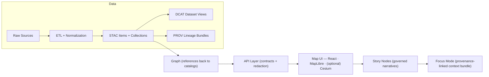
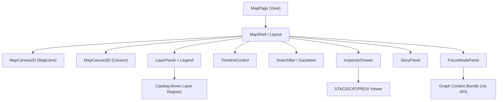

# 🗺️ MapPage


> 📍 **Location:** `web/views/MapPage/`  
> MapPage is the **primary map + timeline view** of the Kansas Frontier Matrix (KFM). It orchestrates **2D + optional 3D rendering**, **layer stack**, **timeline slider**, **feature inspection**, and **Story/Focus overlays** — with **provenance and governed contracts** treated as first-class UX.

---

## 🧭 Quick links

- 📘 **Master Guide (v13)**: `../../../docs/MASTER_GUIDE_v13.md`
- 🧱 **Architecture / vision docs**: `../../../docs/architecture/`
- 🌐 **Standards (STAC / DCAT / PROV profiles)**: `../../../docs/standards/`
- 🧩 **API contracts**: `../../../docs/api/` *(or wherever API contracts live in this repo)*
- 🧵 **Story Nodes**: `../../../story_nodes/` *(expected)*  
- 🧪 **Notebooks (modeling examples)**: `../../../notebooks/` *(expected)*
- 🗃️ **Catalog outputs (STAC/DCAT/PROV)**: `../../../data/` *(expected)*

---

## 🎯 What MapPage “owns”

### Core UX responsibilities ✅
- 🗺️ **Map canvas** (2D: MapLibre; 3D: Cesium when enabled)
- 🧱 **Layer stack**  
  Toggle, group, reorder, opacity, legends, attribution, and provenance links
- 🕰️ **Timeline slider**  
  Drives *time-filtered layers* + playback controls
- 🔎 **Discover & inspect**  
  Search, click-to-identify, feature info, metadata and lineage viewer
- 📚 **Story Mode**  
  Guided narrative steps that control the map (camera/time/layers)
- 🧠 **Focus Mode**  
  Provenance-linked contextual answers, tied back to the graph + catalogs

### What MapPage does **NOT** do 🚫
- 🚫 Direct graph DB queries (Neo4j/Cypher) from the browser  
- 🚫 Hard-coded datasets as “magic layers”  
- 🚫 Silent analysis outputs (anything computed must be a dataset + metadata)

---

## 🧩 UI anatomy

A typical MapPage layout:

- 🧰 **Top bar**: search, mode toggle (2D/3D), share link, help
- 🧱 **Left drawer**: layers + legend + catalog browsing
- 🕰️ **Bottom**: timeline slider (scrub + play + step)
- 🧾 **Right drawer**: inspector (feature → dataset → provenance)
- 📖 **Story panel**: stepper + narrative
- 🧠 **Focus panel**: Q&A with citations + “show on map” actions

> 💡 **Principle:** a user should be able to answer “*what is this? where did it come from? how was it made?*” from *within* MapPage without leaving the map.

---

## 🏗️ Architecture at a glance

### 🌊 Canonical pipeline ordering (non‑negotiable)



### 🧱 MapPage composition



---

## 🧷 Non‑negotiables for contributors

### ✅ Contract‑first
- **Schemas and API contracts are first-class artifacts.**  
- MapPage should treat contracts as *source of truth* and fail loudly if they drift.

### ✅ Deterministic + reproducible
- A given **URL state** (view/time/layers) should be enough to reproduce a view.

### ✅ Provenance‑first
- Every dataset/layer displayed must have discoverable:
  - **STAC** (spatial/temporal assets)
  - **DCAT** (catalog/discovery)
  - **PROV** (lineage + agents + parameters)

### ✅ Evidence artifacts ≈ regular datasets
- If a model/AI pipeline produces a layer (raster/vector/table), it must be:
  - stored under processed data,
  - cataloged (STAC/DCAT),
  - traced (PROV),
  - exposed only through governed APIs.

### ✅ API boundary
- **UI never talks directly to the graph DB.**  
  All graph/metadata access must go through the API layer so redaction/classification rules are enforceable.

---

## 📁 Expected folder layout (inside this view)

> Adjust to the actual code once the view stabilizes — but keep the *intent* the same.

```text
web/
  views/
    MapPage/
      README.md ✅
      MapPage.tsx (or .jsx)
      MapPage.test.tsx
      mapPage.routes.ts
      state/
        mapPage.store.ts
        mapPage.selectors.ts
        mapPage.actions.ts
      components/
        MapShell/
        MapCanvas2D/
        MapCanvas3D/
        LayerPanel/
        Legend/
        TimelineControl/
        InspectorDrawer/
        StoryPanel/
        FocusModePanel/
      hooks/
        useMapState.ts
        useLayerRegistry.ts
        useTimeline.ts
      utils/
        geo.ts
        tiles.ts
        time.ts
        urls.ts
```

---

## 🧠 State model (recommended)

### 🗺️ View state
- Use **WGS84** for display coordinates (`[lon, lat]`) and keep CRS conversions out of the UI whenever possible.
- Maintain separate “engine adapters” for 2D/3D so MapPage state stays consistent.

### 🕰️ Temporal state
- MapPage timeline represents **valid time** (real‑world time).  
- Provenance + publishing metadata can track **transaction time** (when the system created/ingested).

### 🧱 Layer state
A layer should be describable from catalog metadata + small UI overrides:

```ts
type MapMode = "2D" | "3D";

type LayerRenderType =
  | "vector"
  | "raster"
  | "vectorTile"
  | "cog"
  | "terrain"
  | "3dtiles"
  | "heatmap";

type TimeMode = "static" | "filter" | "animate";

export interface LayerDescriptor {
  id: string;                 // stable, canonical
  title: string;
  visible: boolean;
  opacity: number;            // 0..1
  zIndex: number;

  render: {
    type: LayerRenderType;
    styleRef?: string;        // style token or style URL
  };

  time?: {
    mode: TimeMode;
    start?: string;           // ISO 8601
    end?: string;             // ISO 8601
    timeProperty?: string;    // e.g. "system:time_start" / "date" / etc.
  };

  catalog: {
    stacId?: string;
    dcatId?: string;
    provId?: string;
  };

  source: {
    url?: string;             // tiles/COG endpoint
    attribution?: string;
    license?: string;
  };
}
```

---

## 🧱 Layer system: how MapPage should think

### 1) Layers are **catalog-first**
- MapPage should load the “layer registry” from the API (which is driven by catalogs).
- A “layer” is a **view** over:
  - an asset (COG, vector tile set, GeoJSON stream, 3D tileset),
  - its metadata (STAC/DCAT),
  - and its lineage (PROV).

### 2) Prefer scalable formats 🌍
- **Vector tiles** for large static vectors (roads, rivers, boundaries).
- **COGs** for large rasters (imagery, gridded outputs).
- Keep raw GeoJSON sizes small; consider server-side tiling and/or simplification.

### 3) Legends are part of the contract 🎛️
- A layer without a legend is a layer without meaning.
- Legend content should be derivable from:
  - style metadata,
  - units,
  - thresholds,
  - and uncertainty (if applicable).

### 4) Time-enabled layers must “obey the slider” 🕰️
- If a layer has time, the timeline slider must:
  - filter it,
  - animate it (optional),
  - and show what time is currently represented.

---

## 🕰️ Timeline control: minimum expectations

### Required controls
- Scrub (drag)
- Step (prev/next)
- Play/Pause
- Playback speed
- “Pin” to a specific date/time and show it everywhere (UI + legend + inspector)

### Recommended behaviors
- Timeline should drive:
  - map layers (filter/animate),
  - story steps,
  - chart overlays (brush/click → map updates),
  - “time travel” queries for graph context (via API).

> 💡 Pattern: **chart ↔ map coupling**  
> Clicking a chart point can update the map to the corresponding timestamp, refresh layers, and update legend labels.

---

## 🌐 2D ↔ 3D: MapLibre + Cesium

### 2D mode (default)
- Fast, familiar, web-native.
- Best for:
  - historical maps (raster overlays),
  - boundaries/roads/rivers,
  - most timeline scrubbing.

### 3D mode (opt-in)
- Heavier; use when it provides real value.
- Best for:
  - terrain storytelling (“tilt from 1850 map → modern terrain”),
  - 3D tiles, extrusions, subsurface/volumetric concepts.

### Bridging rules
- Keep one canonical “camera state” in MapPage state.
- Switch engines by:
  - deriving engine-specific camera from canonical state,
  - hiding/showing canvases (not re-mounting unless necessary),
  - syncing on transition start/end.

---

## 📖 Story Mode integration

### Story Nodes
Story Nodes should be treated as **governed content**:
- Markdown narrative (human-facing)
- JSON steps (machine-ingestible “map actions”)

#### Typical actions
- `flyTo` (center/zoom/pitch/bearing)
- `setTime` (timeline)
- `toggleLayer` / `setOpacity`
- `openInspector` (feature/dataset)
- `switchMode` (2D/3D)
- `highlight` (feature set / region)

> 🧱 **Rule of thumb:** a Story step should never require a “special case” in MapPage; it should work via a small, stable action contract.

---

## 🧠 Focus Mode integration

Focus Mode is where KFM answers “why / how / what’s connected” — and it must be **evidence-linked**.

### Expectations
- Pull context via API:
  - graph relationships (places ↔ events ↔ people ↔ datasets),
  - dataset references,
  - story references.
- Return:
  - a narrative answer,
  - **citations to datasets/story nodes**, and
  - “show me” actions (pan to place, toggle layer, open provenance).

### Hard gates 🔒
- No uncited claims.
- If a claim can’t be grounded in catalogs/graph, it should be labeled as:
  - hypothesis,
  - interpretation,
  - or unknown.

---

## 📊 Analytics overlays (models, statistics, ML)

MapPage should support two kinds of analytics UX:

### 1) Evidence artifacts as map layers 🧾
Examples:
- regression outputs (predicted surfaces, residual maps),
- Bayesian posterior summaries (probability layers, credible intervals),
- deep-learning detections (feature masks, point candidates).

**Rule:** every output becomes a dataset (STAC/DCAT/PROV), not a UI-only overlay.

### 2) Exploratory analysis on top of the map 🔍
Examples:
- scatter/hist overlays for selected region,
- brushing between chart and map,
- “compare layers” slider, difference maps.

**UX rule:** expose uncertainty clearly (intervals, confidence/credibility, data gaps).

---

## ⚡ Performance playbook

### Frontend (MapPage)
- 🧵 Use **Web Workers** for heavy parsing/simplification.
- 🧠 Debounce/throttle:
  - mouse move picking,
  - repeated tile requests,
  - timeline animation ticks.
- 🧯 Always use `AbortController` for in-flight requests during pan/zoom/time scrub.
- 🧊 Cache:
  - catalog metadata,
  - tileset manifests,
  - computed layer legends.

### Backend/API (what MapPage should assume)
- Prefer endpoints that support:
  - bounding boxes,
  - time filters,
  - pagination,
  - vector tiles / raster windows,
  - server-side aggregation for charts.

---

## 🛡️ Security + privacy guardrails

### UI security
- Treat Markdown/HTML as untrusted: sanitize and constrain.
- Avoid leaking internal IDs if they can be used to infer restricted content.
- Respect roles:
  - public viewer,
  - contributor,
  - admin.

### Data privacy patterns
For sensitive datasets (people, land ownership, health/environmental exposure):
- prefer aggregation,
- enforce redaction at API layer,
- consider anonymization strategies (k-anonymity / l-diversity / t-closeness) before exposing queryable slices.

> 🔐 MapPage should assume **query auditing/inference controls** exist in the API for high-risk datasets.

---

## ♿ Accessibility + cartographic quality

### Responsive layout 📱
- Mobile-first layout rules:
  - drawers become bottom sheets,
  - timeline remains reachable,
  - story/focus panels collapse cleanly.

### Cartography 🎨
- Maintain strong visual hierarchy:
  - basemap subdued,
  - thematic layers legible,
  - labels not fighting the data.
- Use palettes intentionally:
  - sequential for magnitudes,
  - diverging for anomalies,
  - categorical for classes.
- Ensure legends include units + time context.

### Interaction
- Full keyboard navigation for:
  - layer toggles,
  - timeline controls,
  - inspector navigation.
- ARIA labels for controls and live regions for timeline updates.

---

## 🧪 Testing checklist

### Unit tests
- reducers/selectors (layer state, timeline state)
- URL encode/decode for shareable states
- time filter logic for layers

### Integration tests
- layer toggle + opacity affects renderer
- timeline scrub updates time-enabled layers
- click-to-identify opens inspector with metadata links

### Visual regression
- legend rendering
- style changes
- 2D↔3D transition

### Performance checks
- tile request volume during pan/zoom
- memory growth during playback
- FPS in 3D mode with representative datasets

---

## 🆘 Troubleshooting

- **Layers don’t respond to timeline**
  - confirm layer has time metadata + correct time property
  - confirm renderer adapter reads `time.current`
- **Map “janks” during playback**
  - reduce frame rate, throttle updates, prefer pre-tiled assets
- **3D looks misaligned**
  - verify CRS assumptions (display is WGS84) and terrain/imagery alignment
- **Inspector shows “missing provenance”**
  - dataset isn’t fully published: STAC/DCAT/PROV boundary artifacts must exist

---

## 📚 Project reference shelf (why these files matter here)

> This view is intentionally informed by the project’s research library. Keep this list updated as the implementation evolves.

<details>
<summary><strong>🌍 Geospatial, cartography, remote sensing</strong></summary>

- 🧭 <em>making-maps-a-visual-guide-to-map-design-for-gis.pdf</em> — legends, hierarchy, symbology, map literacy
- 📱 <em>Mobile Mapping_ Space, Cartography and the Digital - 9789048535217.pdf</em> — mobile interaction + narrative mapping patterns
- 🛰️ <em>Cloud-Based Remote Sensing with Google Earth Engine-Fundamentals and Applications.pdf</em> — time-series ↔ map coupling; interactive legends
- 🧰 <em>python-geospatial-analysis-cookbook.pdf</em> — overlays, topology workflows, routing patterns
- 🏺 <em>Archaeological 3D GIS_26_01_12_17_53_09.pdf</em> — 3D storytelling, classification/detection workflows in spatial contexts

</details>

<details>
<summary><strong>🎛️ Rendering + web UI engineering</strong></summary>

- 🧊 <em>webgl-programming-guide-interactive-3d-graphics-programming-with-webgl.pdf</em> — GPU mental model; picking; performance
- 📐 <em>responsive-web-design-with-html5-and-css3.pdf</em> — responsive layouts + accessibility ergonomics

</details>

<details>
<summary><strong>🗄️ Data systems, catalogs, and scale</strong></summary>

- 🐘 <em>PostgreSQL Notes for Professionals - PostgreSQLNotesForProfessionals.pdf</em> — spatial queries + practical SQL reference
- 🚀 <em>Database Performance at Scale.pdf</em> — indexes, caching, avoiding N+1, performance measurement culture
- 🧩 <em>Scalable Data Management for Future Hardware.pdf</em> — spatiotemporal streaming + multi-query optimization mindset
- 🧺 <em>Data Spaces.pdf</em> — federated data integration patterns; “data as a living space”

</details>

<details>
<summary><strong>🧪 Statistics, modeling, and uncertainty</strong></summary>

- 🛰️ <em>Scientific Modeling and Simulation_ A Comprehensive NASA-Grade Guide.pdf</em> — V&V mindset for model layers
- 📏 <em>Understanding Statistics & Experimental Design.pdf</em> — experimental rigor + interpretation
- 📉 <em>regression-analysis-with-python.pdf</em> — regression workflows and diagnostics
- 🧾 <em>Regression analysis using Python - slides-linear-regression.pdf</em> — compact reference patterns
- 🎲 <em>think-bayes-bayesian-statistics-in-python.pdf</em> — Bayesian uncertainty UX concepts
- 📊 <em>graphical-data-analysis-with-r.pdf</em> — exploratory visualization patterns
- 🧠 <em>Deep Learning for Coders with fastai and PyTorch - Deep.Learning.for.Coders.with.fastai.and.PyTorchpdf</em> — classification/detection “evidence artifacts”
- 🧱 <em>Generalized Topology Optimization for Structural Design.pdf</em> — advanced modeling outputs as spatial layers
- 🕸️ <em>Spectral Geometry of Graphs.pdf</em> — graph structure intuition (useful for graph-driven UI affordances)

</details>

<details>
<summary><strong>⚖️ Governance, ethics, privacy, security</strong></summary>

- 🧭 <em>Kansas Frontier Matrix (KFM) – Comprehensive Technical Documentation.pdf</em> — Map/Timeline MVP, 2D/3D integration, Story/Focus concepts
- 🧷 <em>MARKDOWN_GUIDE_v13.md.gdoc</em> — contract-first + deterministic pipeline invariants
- 🧑‍⚖️ <em>On the path to AI Law’s prophecies and the conceptual foundations of the machine learning age.pdf</em> — governance framing for ML-backed claims
- 🌱 <em>Introduction to Digital Humanism.pdf</em> — human-centered transparency expectations
- 🕵️ <em>ethical-hacking-and-countermeasures-secure-network-infrastructures.pdf</em> — defensive thinking (threat modeling, controls)
- 🧰 <em>Gray Hat Python - Python Programming for Hackers and Reverse Engineers (2009).pdf</em> — security awareness for developer tooling
- 🔏 <em>Data Mining Concepts &amp; applictions.pdf</em> — privacy models (anonymization + inference control)

</details>

<details>
<summary><strong>🖼️ Media + assets</strong></summary>

- 🖼️ <em>compressed-image-file-formats-jpeg-png-gif-xbm-bmp.pdf</em> — choosing formats for raster overlays, icons, and export pipelines

</details>

<details>
<summary><strong>🧵 Concurrency and systems</strong></summary>

- 🧵 <em>concurrent-real-time-and-distributed-programming-in-java-threads-rtsj-and-rmi.pdf</em> — concurrency mental models (race conditions, scheduling)

</details>

<details>
<summary><strong>📚 Language &amp; ecosystem shelves (quick reference)</strong></summary>

- 📘 <em>A programming Books.pdf</em>
- 📘 <em>B-C programming Books.pdf</em>
- 📘 <em>D-E programming Books.pdf</em>
- 📘 <em>F-H programming Books.pdf</em>
- 📘 <em>I-L programming Books.pdf</em>
- 📘 <em>M-N programming Books.pdf</em>
- 📘 <em>O-R programming Books.pdf</em>
- 📘 <em>S-T programming Books.pdf</em>
- 📘 <em>U-X programming Books.pdf</em>

</details>

---

## ✅ Definition of done (MapPage)

- [ ] Layer panel supports toggle + opacity + grouping
- [ ] Timeline controls time-enabled layers (filter + optional animation)
- [ ] Inspector shows STAC/DCAT/PROV links for a selected feature/layer
- [ ] 2D/3D switch is stable and preserves camera + time state
- [ ] Story step actions are contract-driven (no view-specific hacks)
- [ ] Focus answers include citations + “show on map” actions
- [ ] URL state is shareable and reproducible
- [ ] Accessibility + responsive checks pass
- [ ] Performance budgets met on representative datasets

🧭 **Keep MapPage boring internally, magical externally.**  
The magic comes from governed data + provenance + great interaction — not fragile one-off UI logic.
