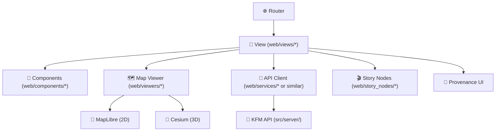

<a id="top"></a>

# 🧭 `web/views/` — Route-Level Screens for the KFM Web App 🌐🗺️

<div align="left">

<!-- Repo-level badges (adjust paths if your workflow filenames differ) -->
<a href="https://github.com/bartytime4life/Kansas-Frontier-Matrix/actions"></a>


</div>

> 🧠 **What is a “View” in KFM?**  
> `web/views/` contains **page/screen components** (route-level “containers”) that compose the KFM UI:  
> **MapPage**, **DataCatalogPage**, **StoryPage**, and future screens like **FocusModePage**.  
> Views orchestrate layout + state + API calls + viewer integration; reusable UI bits live in `web/components/`, and map engines live in `web/viewers/`. [oai_citation:0‡Kansas Frontier Matrix (KFM) – Comprehensive Technical Documentation.pdf](file-service://file-AkqwUuYPp5zePf7pv5SMxi)

---

## 🧾 View policy metadata

| Field | Value |
|---|---|
| Folder | `web/views/` |
| Role | Route-level screens (“smart containers”) 🧠 |
| UI stack | React SPA (TypeScript) [oai_citation:1‡Kansas Frontier Matrix (KFM) – Comprehensive Technical Documentation.pdf](file-service://file-AkqwUuYPp5zePf7pv5SMxi) |
| Map engines | MapLibre GL JS (2D) + CesiumJS (3D) [oai_citation:2‡Kansas Frontier Matrix (KFM) – Comprehensive Technical Documentation.pdf](file-service://file-AkqwUuYPp5zePf7pv5SMxi) |
| Narrative engine | Story Nodes (Markdown + step JSON) [oai_citation:3‡Kansas Frontier Matrix (KFM) – Comprehensive Technical Documentation.pdf](file-service://file-AkqwUuYPp5zePf7pv5SMxi) |
| Accessibility | Responsive + accessible by default [oai_citation:4‡Kansas Frontier Matrix (KFM) – Comprehensive Technical Documentation.pdf](file-service://file-AkqwUuYPp5zePf7pv5SMxi) |
| Non-negotiables | API boundary + provenance-first + evidence-first 🧾 [oai_citation:5‡MARKDOWN_GUIDE_v13.md.gdoc](file-service://file-UYVruFXfueR8veHMUKeugU) |

---

## ⚡ Quick links

| Jump | Link |
|---|---|
| `web/` overview | [`../README.md`](../README.md) |
| Reusable UI primitives | [`../components/`](../components/) |
| Map engines | [`../viewers/`](../viewers/) |
| Story content | [`../story_nodes/`](../story_nodes/) |
| Repo root | [`../../README.md`](../../README.md) |
| CI/CD philosophy | [`../../.github/workflows/README.md`](../../.github/workflows/README.md) *(if present)* |

---

<details>
<summary><b>🧭 Table of contents</b></summary>

* [🧱 Directory contract](#directory-contract)
* [🗺️ How Views fit the KFM UI](#how-views-fit-the-kfm-ui)
* [🧬 KFM UI invariants Views must enforce](#kfm-ui-invariants-views-must-enforce)
* [📁 What lives in <code>web/views/</code>](#what-lives-in-webviews)
* [🧩 Recommended View structure](#recommended-view-structure)
* [🗺️ Map Views: 2D/3D integration](#map-views-2d3d-integration)
* [🎬 Story Views: Story Nodes + guided tours](#story-views-story-nodes--guided-tours)
* [🧾 Provenance UX requirements](#provenance-ux-requirements)
* [📱 Responsive + a11y rules](#responsive--a11y-rules)
* [⚡ Performance guardrails](#performance-guardrails)
* [🔐 Security guardrails](#security-guardrails)
* [🧪 Testing expectations](#testing-expectations)
* [🧾 Adding a new View checklist](#adding-a-new-view-checklist)
* [📚 Reference library & influence map](#reference-library--influence-map)

</details>

---

<a id="directory-contract"></a>

## 🧱 Directory contract

### ✅ Views DO

- 🧭 Define **screen layout** + route-level composition
- 🔌 Coordinate **API calls** (via an API client layer) and pass data down
- 🗺️ Own **map state** at the page level (viewport, active layers, time slider, selected feature)
- 🎛️ Glue together panels: **layer list**, **search**, **legend**, **timeline**, **detail panels** [oai_citation:6‡Kansas Frontier Matrix (KFM) – Comprehensive Technical Documentation.pdf](file-service://file-AkqwUuYPp5zePf7pv5SMxi)
- 🧾 Enforce **trust UI**: provenance, citations, licenses, and “what am I looking at?” affordances [oai_citation:7‡Kansas Frontier Matrix (KFM) – Comprehensive Technical Documentation.pdf](file-service://file-AkqwUuYPp5zePf7pv5SMxi)

### 🚫 Views DO NOT

- 🚫 Implement reusable UI primitives (put those in `web/components/`)
- 🚫 Implement MapLibre/Cesium engine internals (put those in `web/viewers/`) [oai_citation:8‡Kansas Frontier Matrix (KFM) – Comprehensive Technical Documentation.pdf](file-service://file-AkqwUuYPp5zePf7pv5SMxi)
- 🚫 Query Neo4j/PostGIS directly (UI must go through the governed API boundary) [oai_citation:9‡MARKDOWN_GUIDE_v13.md.gdoc](file-service://file-UYVruFXfueR8veHMUKeugU)
- 🚫 Ship “vibes-based” content: Story/Focus outputs require evidence + provenance metadata [oai_citation:10‡MARKDOWN_GUIDE_v13.md.gdoc](file-service://file-UYVruFXfueR8veHMUKeugU)

---

<a id="how-views-fit-the-kfm-ui"></a>

## 🗺️ How Views fit the KFM UI

KFM’s web app is a React SPA that loads dynamic content from the API, with Views as the route-level screens. [oai_citation:11‡Kansas Frontier Matrix (KFM) – Comprehensive Technical Documentation.pdf](file-service://file-AkqwUuYPp5zePf7pv5SMxi)



**Why this shape matters:**  
The architecture explicitly separates **presentation** (Views + Components) from **map engines** and from **data enforcement** (API + contracts). Views are where “map-first usability” meets “provenance-first trust.” [oai_citation:12‡Kansas Frontier Matrix (KFM) – Comprehensive Technical Documentation.pdf](file-service://file-AkqwUuYPp5zePf7pv5SMxi) [oai_citation:13‡MARKDOWN_GUIDE_v13.md.gdoc](file-service://file-UYVruFXfueR8veHMUKeugU)

---

<a id="kfm-ui-invariants-views-must-enforce"></a>

## 🧬 KFM UI invariants Views must enforce

These are KFM “never regress” rules (treat as UI requirements *and* integrity controls):

1) 🚦 **Pipeline ordering is absolute**  
**ETL → Catalogs (STAC/DCAT/PROV) → Graph → API → UI → Story Nodes → Focus Mode** [oai_citation:14‡MARKDOWN_GUIDE_v13.md.gdoc](file-service://file-UYVruFXfueR8veHMUKeugU)

2) 🔌 **API boundary rule**  
Frontend must never query the knowledge graph directly; **all data access goes through the governed API**. [oai_citation:15‡MARKDOWN_GUIDE_v13.md.gdoc](file-service://file-UYVruFXfueR8veHMUKeugU)

3) 🧾 **Provenance-first UI**  
Anything visible in the UI must be traceable to cataloged sources and processing records (STAC/DCAT + PROV). [oai_citation:16‡Kansas Frontier Matrix (KFM) – Comprehensive Technical Documentation.pdf](file-service://file-AkqwUuYPp5zePf7pv5SMxi)

4) 🎬 **Evidence-first narrative**  
No unsourced narrative in Story Nodes or Focus Mode. Claims must cite evidence; AI-assisted text must be labeled and accompanied by provenance/confidence metadata. [oai_citation:17‡MARKDOWN_GUIDE_v13.md.gdoc](file-service://file-UYVruFXfueR8veHMUKeugU)

5) 🗺️ **Map correctness is not optional**  
- Serve in web-friendly CRS (commonly WGS84/EPSG:4326) and preserve original CRS in metadata/provenance when applicable. [oai_citation:18‡Kansas Frontier Matrix (KFM) – Comprehensive Technical Documentation.pdf](file-service://file-AkqwUuYPp5zePf7pv5SMxi)
- Time is a first-class UX axis: the timeline slider must drive time-enabled layers. [oai_citation:19‡Kansas Frontier Matrix (KFM) – Comprehensive Technical Documentation.pdf](file-service://file-AkqwUuYPp5zePf7pv5SMxi)

---

<a id="what-lives-in-webviews"></a>

## 📁 What lives in `web/views/`

From the canonical KFM structure:

- `views/` = page/screen components: e.g., **MapPage**, **DataCatalogPage**, **StoryPage** [oai_citation:20‡Kansas Frontier Matrix (KFM) – Comprehensive Technical Documentation.pdf](file-service://file-AkqwUuYPp5zePf7pv5SMxi)
- `viewers/` = MapLibre/Cesium integration + 3D Tiles streaming logic [oai_citation:21‡Kansas Frontier Matrix (KFM) – Comprehensive Technical Documentation.pdf](file-service://file-AkqwUuYPp5zePf7pv5SMxi)
- `story_nodes/` = Story Node content: **Markdown narrative + step JSON** [oai_citation:22‡Kansas Frontier Matrix (KFM) – Comprehensive Technical Documentation.pdf](file-service://file-AkqwUuYPp5zePf7pv5SMxi)

Suggested “target shape” (✅ = typical now, 🧾 = planned):

```text
📁 web/views/
├─ ✅ MapPage/                     # 🗺️ default “atlas” experience
│  ├─ 📄 MapPage.tsx
│  ├─ 📄 MapPage.state.ts          # URL + store bindings (optional)
│  ├─ 📄 MapPage.hooks.ts          # data fetching + map event adapters
│  └─ 📄 MapPage.css               # minimal; prefer shared styles
├─ 🧾 DataCatalogPage/             # 🗂️ browse datasets / STAC collections
├─ 🧾 StoryPage/                   # 🎬 Story Nodes player (MD + JSON steps)
├─ 🧾 FocusModePage/               # 🤖 evidence-backed Q&A / guided analysis
├─ 🧾 AboutPage/                   # ℹ️ mission + provenance explainer
└─ 📄 README.md                    # you are here 👋
```

> [!TIP]
> Treat Views as **composition roots**: they decide what goes on screen and in what order — but they should delegate rendering detail to Components and Viewer modules.

---

<a id="recommended-view-structure"></a>

## 🧩 Recommended View structure

### 🧠 “Smart View, Dumb Components”

- **Views** own orchestration + data flow.
- **Components** are reusable and mostly presentational.
- **Viewers** own WebGL engine integration and map rendering pipelines.

### 🧵 A pragmatic pattern that stays testable

```text
MapPage.tsx
  ├─ useRouteParams()
  ├─ useMapState()          # bbox, zoom, selected feature
  ├─ useLayerCatalog()      # active layers from STAC/DCAT
  ├─ useTimeline()          # time slider ↔ time-enabled layers
  ├─ useFeatureDetails()    # click → fetch details from API
  ├─ <MapViewer ... />      # 2D/3D engine wrapper
  ├─ <LayerPanel ... />
  ├─ <Legend ... />
  └─ <ProvenanceDrawer ... />
```

**Why it fits KFM:**  
KFM explicitly expects the web UI to provide layer toggles, legends, a search bar, and a timeline slider, with detail panels when users click features. [oai_citation:23‡Kansas Frontier Matrix (KFM) – Comprehensive Technical Documentation.pdf](file-service://file-AkqwUuYPp5zePf7pv5SMxi)

---

<a id="map-views-2d3d-integration"></a>

## 🗺️ Map Views: 2D/3D integration

### ✅ Engines used

- **MapLibre GL JS** for 2D interactive maps [oai_citation:24‡Kansas Frontier Matrix (KFM) – Comprehensive Technical Documentation.pdf](file-service://file-AkqwUuYPp5zePf7pv5SMxi)
- **CesiumJS** for 3D globe/terrain and streaming 3D Tiles [oai_citation:25‡Kansas Frontier Matrix (KFM) – Comprehensive Technical Documentation.pdf](file-service://file-AkqwUuYPp5zePf7pv5SMxi)

Views should treat the viewer as a “capability surface”:

- 2D mode: basemap + vector overlays (GeoJSON / vector tiles)
- 3D mode: terrain + 3D Tiles (point clouds, buildings, volumetric datasets) [oai_citation:26‡Kansas Frontier Matrix (KFM) – Comprehensive Technical Documentation.pdf](file-service://file-AkqwUuYPp5zePf7pv5SMxi)

### 🎛️ View responsibilities in 2D/3D

- maintain a single **canonical map state** (center/zoom/bearing/time)
- persist map state into the URL (deep links = shareable research)
- toggle 2D/3D without losing user context (same “camera” intent)

### 🧊 WebGL reality check

WebGL exists to make “rich 3D interfaces” feasible in a browser with standard web tech (HTML5 + JavaScript), across devices. [oai_citation:27‡webgl-programming-guide-interactive-3d-graphics-programming-with-webgl.pdf](file-service://file-7Nd7iS68ES97NmWhPiRWTP)

Practical consequences for Views:

- keep long lists virtualized (DOM + WebGL = 💥 on low-end devices)
- show a clear fallback when WebGL is unavailable (or context is lost)
- avoid re-render storms (debounce/throttle map-driven state updates)

---

<a id="story-views-story-nodes--guided-tours"></a>

## 🎬 Story Views: Story Nodes + guided tours

KFM Story Nodes are modular narratives:

- 📄 **Markdown** narrative (text + images + citations)
- 🧾 **JSON** step config controlling map views/layers (“guided tour”)  
The front-end reads these to sync narrative text with map state, enabling non-coders to contribute stories by editing MD/JSON. [oai_citation:28‡Kansas Frontier Matrix (KFM) – Comprehensive Technical Documentation.pdf](file-service://file-AkqwUuYPp5zePf7pv5SMxi)

### ✅ StoryPage must enforce

- citations required for factual claims (no “orphan facts”)
- every dataset/layer referenced in a step must resolve to a stable catalog ID
- time slider changes must be deterministic per step

### 🧰 Story authoring is expected to get easier

The KFM roadmap explicitly calls out improving Story Node authoring (templates, possible wizard GUI, or in-app Story Builder). Views should anticipate an editor surface later, but keep the runtime player deterministic today. [oai_citation:29‡Kansas Frontier Matrix (KFM) – Comprehensive Technical Documentation.pdf](file-service://file-AkqwUuYPp5zePf7pv5SMxi)

---

<a id="provenance-ux-requirements"></a>

## 🧾 Provenance UX requirements

### 🧭 The UI must show “the map behind the map”

KFM’s front-end philosophy is to preserve context and provenance: users should be able to click/inspect a visible layer or feature and see source + metadata (not a black box). [oai_citation:30‡Kansas Frontier Matrix (KFM) – Comprehensive Technical Documentation.pdf](file-service://file-AkqwUuYPp5zePf7pv5SMxi)

### ✅ Every View that displays data must provide

- 📌 **Source** (publisher/provider)
- ⚖️ **License** and usage constraints
- 🧬 **Lineage** (PROV link: inputs → transforms → outputs)
- 🧾 **Catalog ID** (STAC item/collection or DCAT dataset identifier)
- 🏷️ **Classification / sensitivity** badge when applicable

### Suggested UI primitives to standardize across Views

- **Provenance Drawer** (right panel)  
  - “What is this layer?” → STAC/DCAT summary  
  - “How was it made?” → PROV graph summary
- **Citation Footer** for charts and narrative blocks
- **“Open in Catalog”** button to jump to DataCatalogPage

> [!IMPORTANT]
> This is not decoration — provenance is a trust boundary in KFM. Anything visible should be attributable and auditable. [oai_citation:31‡Kansas Frontier Matrix (KFM) – Comprehensive Technical Documentation.pdf](file-service://file-AkqwUuYPp5zePf7pv5SMxi)

---

<a id="responsive--a11y-rules"></a>

## 📱 Responsive + a11y rules

KFM’s web app is explicitly intended to be responsive and accessible across desktop and mobile/tablet contexts. [oai_citation:32‡Kansas Frontier Matrix (KFM) – Comprehensive Technical Documentation.pdf](file-service://file-AkqwUuYPp5zePf7pv5SMxi)

### ✅ Minimum standards for Views

- ♿ semantic structure: headings, landmarks, focus order
- ⌨️ keyboard navigation for panels + map controls
- 🔍 zoom-safe layout (avoid “UI falls apart at 200%”)
- 📱 touch-first affordances on mobile (large hit targets, bottom sheets)
- 🌗 contrast-safe palettes for legends and overlays

---

<a id="performance-guardrails"></a>

## ⚡ Performance guardrails

### 🧊 WebGL + Maps performance “gotchas”

- avoid repainting the whole screen on every mousemove
- prefer **event sampling** (e.g., only update UI state when interaction ends)
- memoize derived state (legend bins, filtered layer lists)
- lazy-load heavy panels (catalog browser, story player)

### ⏱️ Data loading patterns

- cancel in-flight fetches on route/map changes (AbortController)
- cache recent viewport queries (especially for “pan around” UX)
- keep “time slider” requests cheap (prefer server-side precomputation)

KFM’s backend expects common viewport requests to be responsive, with expensive operations done offline or via explicit jobs — Views should lean into that: “fast by default, heavy by choice.” [oai_citation:33‡Kansas Frontier Matrix (KFM) – Comprehensive Technical Documentation.pdf](file-service://file-AkqwUuYPp5zePf7pv5SMxi)

---

<a id="security-guardrails"></a>

## 🔐 Security guardrails

Views are not a “safe layer” — they are the **largest attack surface** (untrusted content, URLs, and user input). Defense-in-depth rules:

### ✅ URL + link safety

- treat any dataset link/asset URL as untrusted until validated by policy/API
- never render `javascript:` or other unsafe schemes
- prefer allowlists for external domains in UI (especially for embedded media)

### ✅ Untrusted content rendering

- Story markdown must be sanitized (no raw HTML injection)
- don’t interpolate user input into HTML/URL paths unsafely

### ✅ Path handling caution (even in web contexts)

Security literature highlights that improperly validated user-supplied file paths can lead to path traversal/file inclusion bugs; while that example is server-side, the principle applies to any system that constructs paths/URLs from untrusted input: **validate + normalize + constrain**. [oai_citation:34‡S-T programming Books.pdf](file-service://file-NT32tqqzGW9RvfcNZmMH1K)

> [!CAUTION]
> If you add a View that supports “load local file” or “import project” features, treat it as security-sensitive and route it through hardened APIs + strict validation.

---

<a id="testing-expectations"></a>

## 🧪 Testing expectations

### ✅ View-level tests should cover

- routing: params → correct initial state (map position, time, selected layer)
- API boundary: view never calls internal stores directly (mock API client)
- provenance UI: provenance drawer contains source/license/IDs for visible layers
- story playback: step JSON drives map state deterministically

### 🧪 Integration tests worth having

- MapPage loads a fixture STAC collection and renders legend + toggles
- StoryPage plays a story and asserts “step 2” toggles correct layers
- 2D/3D toggle does not lose camera + selected layer context

---

<a id="adding-a-new-view-checklist"></a>

## 🧾 Adding a new View checklist

- [ ] ✅ View lives in `web/views/<Name>/`
- [ ] ✅ Route-level composition only (no reusable primitives here)
- [ ] ✅ Data access goes through API client (UI → API boundary) [oai_citation:35‡MARKDOWN_GUIDE_v13.md.gdoc](file-service://file-UYVruFXfueR8veHMUKeugU)
- [ ] ✅ Includes provenance UX for any visible data [oai_citation:36‡Kansas Frontier Matrix (KFM) – Comprehensive Technical Documentation.pdf](file-service://file-AkqwUuYPp5zePf7pv5SMxi)
- [ ] ✅ Responsive + keyboard navigable [oai_citation:37‡Kansas Frontier Matrix (KFM) – Comprehensive Technical Documentation.pdf](file-service://file-AkqwUuYPp5zePf7pv5SMxi)
- [ ] ✅ URL shareable state (where it matters: map/time/story step)
- [ ] ✅ Tests exist for “happy path” + “no data” + “API error”
- [ ] ✅ Avoids render storms (map events throttled)
- [ ] ✅ Heavy work is scheduled/offloaded; View stays interactive [oai_citation:38‡Kansas Frontier Matrix (KFM) – Comprehensive Technical Documentation.pdf](file-service://file-AkqwUuYPp5zePf7pv5SMxi)

---

<a id="reference-library--influence-map"></a>

## 📚 Reference library & influence map

KFM’s `web/views/` is where **GIS + cartography + WebGL + governance + modeling discipline** meet. Below is the project library that influences how Views are designed and how trust is preserved.

> ⚠️ Reference materials may have different licenses than repo code — keep them in `docs/library/` (or outside the repo) and respect upstream terms.

### 🧭 Canonical KFM system specs

- `Kansas Frontier Matrix (KFM) – Comprehensive Technical Documentation.pdf`  [oai_citation:39‡Kansas Frontier Matrix (KFM) – Comprehensive Technical Documentation.pdf](file-service://file-AkqwUuYPp5zePf7pv5SMxi)
- `Kansas-Frontier-Matrix_ Open-Source Geospatial Historical Mapping Hub Design.pdf`  [oai_citation:40‡Kansas-Frontier-Matrix_ Open-Source Geospatial Historical Mapping Hub Design.pdf](file-service://file-ShqHKgjxCS9UT9vbcxDNzA)
- `MARKDOWN_GUIDE_v13.md.gdoc`  [oai_citation:41‡MARKDOWN_GUIDE_v13.md.gdoc](file-service://file-UYVruFXfueR8veHMUKeugU)

### 🌐 Web, UX, and graphics (WebGL / 3D)

- `responsive-web-design-with-html5-and-css3.pdf`
- `webgl-programming-guide-interactive-3d-graphics-programming-with-webgl.pdf`  [oai_citation:42‡webgl-programming-guide-interactive-3d-graphics-programming-with-webgl.pdf](file-service://file-7Nd7iS68ES97NmWhPiRWTP)
- `compressed-image-file-formats-jpeg-png-gif-xbm-bmp.pdf`

### 🗺️ GIS + cartography + spatial databases

- `python-geospatial-analysis-cookbook.pdf`  [oai_citation:43‡python-geospatial-analysis-cookbook.pdf](file-service://file-HT14njz1MhrTZCE7Pwm5Cu)
- `PostgreSQL Notes for Professionals - PostgreSQLNotesForProfessionals.pdf`
- `making-maps-a-visual-guide-to-map-design-for-gis.pdf`
- `Mobile Mapping_ Space, Cartography and the Digital - 9789048535217.pdf`

### 🛰️ Remote sensing workflows

- `Cloud-Based Remote Sensing with Google Earth Engine-Fundamentals and Applications.pdf`

### 📈 Statistics, experiments, modeling discipline

- `Understanding Statistics & Experimental Design.pdf`
- `regression-analysis-with-python.pdf`
- `Regression analysis using Python - slides-linear-regression.pdf`
- `graphical-data-analysis-with-r.pdf`
- `think-bayes-bayesian-statistics-in-python.pdf`
- `Scientific Modeling and Simulation_ A Comprehensive NASA-Grade Guide.pdf`

### ⚙️ Systems & scalability

- `Scalable Data Management for Future Hardware.pdf`  [oai_citation:44‡Scalable Data Management for Future Hardware.pdf](file-service://file-GZ8gMsQ8hxu7GWEVd3csNE)
- `Database Performance at Scale.pdf`  [oai_citation:45‡Database Performance at Scale.pdf](file-service://file-36z8qyiVJRtrSs6QG7Epen)
- `Data Spaces.pdf`
- `concurrent-real-time-and-distributed-programming-in-java-threads-rtsj-and-rmi.pdf`

### 🧮 Graphs, optimization, and advanced math

- `Spectral Geometry of Graphs.pdf`
- `Generalized Topology Optimization for Structural Design.pdf`
- `Archaeological 3D GIS_26_01_12_17_53_09.pdf`  [oai_citation:46‡Archaeological 3D GIS_26_01_12_17_53_09.pdf](file-service://file-6DRx5ELzDPBso9Y5Qcbqm2) *(3D spatial narrative + visualization inspiration)*

### ❤️ Ethics, autonomy, governance, and AI/legal framing

- `Introduction to Digital Humanism.pdf`
- `Principles of Biological Autonomy - book_9780262381833.pdf`
- `On the path to AI Law’s prophecies and the conceptual foundations of the machine learning age.pdf`

### 🛡️ Security (defensive references)

- `ethical-hacking-and-countermeasures-secure-network-infrastructures.pdf`
- `Gray Hat Python - Python Programming for Hackers and Reverse Engineers (2009).pdf`
- `S-T programming Books.pdf`  [oai_citation:47‡S-T programming Books.pdf](file-service://file-NT32tqqzGW9RvfcNZmMH1K) *(secure input handling concepts)*

### 🧰 General programming shelf (bundles)

- `A programming Books.pdf`
- `B-C programming Books.pdf`  [oai_citation:48‡B-C programming Books.pdf](file-service://file-7V9zHZSJakZZrJAw9ASCMJ)
- `D-E programming Books.pdf`
- `F-H programming Books.pdf`  [oai_citation:49‡F-H programming Books.pdf](file-service://file-QofzooQDG9grJwh9nFN9SY)
- `I-L programming Books.pdf`
- `M-N programming Books.pdf`
- `O-R programming Books.pdf`  [oai_citation:50‡O-R programming Books.pdf](file-service://file-M6zCNBGmJbot7A2aaUUy9M)
- `S-T programming Books.pdf`  [oai_citation:51‡S-T programming Books.pdf](file-service://file-NT32tqqzGW9RvfcNZmMH1K)
- `U-X programming Books.pdf`

---

<p align="right"><a href="#top">⬆️ Back to top</a></p>