<a id="top"></a>

# 🧭 `web/views/` — Route-Level Screens for the KFM Web App 🌐🗺️

<div align="left">

<!-- Repo-level badges (adjust paths if your workflow filenames differ) -->
<a href="https://github.com/bartytime4life/Kansas-Frontier-Matrix/actions"></a>


</div>

> [!IMPORTANT]
> This README is written to align with the **KFM Markdown Protocol** (front-matter + required sections + link validation). If your repo CI enforces the protocol, keep the YAML block valid and up-to-date. 🧾✅[^kfm-md-protocol]

---

## 🧠 What is a “View” in KFM?

`web/views/` contains **page/screen components** (route-level “containers”) that compose the KFM UI: **MapPage**, **DataCatalogPage**, **StoryPage**, and future screens like **FocusModePage**. Views orchestrate **layout + state + API calls + viewer integration**, while reusable UI primitives live in `web/components/`, and map engines live in `web/viewers/`.[^kfm-web-structure]

> [!TIP]
> Think of Views as **composition roots** 🧩: they decide “what is on screen + in what order,” then delegate rendering and engine work downward.

---

## 🧾 View policy metadata

| Field | Value |
|---|---|
| Folder | `web/views/` |
| Role | Route-level screens (“smart containers”) 🧠 |
| UI stack | React SPA (TypeScript) *(see architecture sources)*[^kfm-web-structure] |
| Map engines | MapLibre GL JS (2D) + CesiumJS (3D / 3D Tiles)[^kfm-web-structure][^kfm-map-engines] |
| Narrative engine | Story Nodes (Markdown narrative + step config)[^kfm-story-runtime][^kfm-story-node-rules] |
| Provenance core | STAC + DCAT + PROV alignment is required before UI consumption 🧾[^kfm-pipeline-invariants][^kfm-stac-dcat-prov] |
| Canonical spec | `MARKDOWN_GUIDE_v13` (pipeline ordering + subsystem homes + CI gates)[^kfm-pipeline-invariants][^kfm-canonical-homes] |
| Accessibility | Responsive + accessible by default (desktop → mobile/tablet) ♿📱[^kfm-responsive] |
| Security stance | “Trust boundaries” enforced: UI → API (gatekeeper) → DB/graph 🔐[^kfm-security-boundaries] |
| Non-negotiables | Pipeline ordering + API boundary + evidence-first + classification propagation 🧷[^kfm-pipeline-invariants][^kfm-classification] |

---

## ⚡ Quick links

| Jump | Link |
|---|---|
| `web/` overview | [`../README.md`](../README.md) |
| Reusable UI primitives | [`../components/`](../components/) |
| Map engines | [`../viewers/`](../viewers/) |
| API client layer *(recommended)* | [`../services/`](../services/) *(or `web/api/` / `web/lib/` depending on repo)* |
| Story Nodes (canonical authoring home, v13) | [`../../docs/reports/story_nodes/`](../../docs/reports/story_nodes/) |
| Standards & profiles (STAC/DCAT/PROV, markdown protocol, etc.) | [`../../docs/standards/`](../../docs/standards/) |
| Governance (ethics, sovereignty) | [`../../docs/governance/`](../../docs/governance/) |
| UI schemas *(if defined)* | [`../../schemas/ui/`](../../schemas/ui/) |
| Repo root | [`../../README.md`](../../README.md) |

> [!NOTE]
> In **v13**, narrative content has an explicit canonical home: `docs/reports/story_nodes/` (draft/published). Avoid “repo drift” by keeping story content there and treating any runtime copy under `web/` as a build artifact or mirror.[^kfm-canonical-homes]

---

<details>
<summary><b>🧭 Table of contents</b></summary>

* [🧱 Directory contract](#directory-contract)
* [🗺️ Where Views sit in the KFM pipeline](#where-views-sit-in-the-kfm-pipeline)
* [🧭 Route ↔ View registry](#route--view-registry)
* [🧬 KFM UI invariants Views must enforce](#kfm-ui-invariants-views-must-enforce)
* [📁 What lives in <code>web/views/</code>](#what-lives-in-webviews)
* [🧩 Recommended View structure](#recommended-view-structure)
* [🗺️ Map Views: 2D/3D integration](#map-views-2d3d-integration)
* [🗂️ Data Catalog Views: STAC/DCAT discovery](#data-catalog-views-stacdcat-discovery)
* [🎬 Story Views: Story Nodes + guided tours](#story-views-story-nodes--guided-tours)
* [🤖 Focus Mode Views: evidence-linked Q&A](#focus-mode-views-evidence-linked-qa)
* [🧾 Provenance UX contract](#provenance-ux-contract)
* [🔗 URL state + deep links](#url-state--deep-links)
* [📱 Responsive + a11y rules](#responsive--a11y-rules)
* [⚡ Performance guardrails](#performance-guardrails)
* [🔐 Security guardrails](#security-guardrails)
* [🧪 Testing + CI expectations](#testing--ci-expectations)
* [🧾 Adding a new View checklist](#adding-a-new-view-checklist)
* [📚 Reference library & influence map](#reference-library--influence-map)
* [✅ Definition of Done for this README](#definition-of-done-for-this-readme)

</details>

---

<a id="directory-contract"></a>

## 🧱 Directory contract

### ✅ Views DO

- 🧭 Define **screen layout** + route-level composition
- 🔌 Coordinate **API calls** via the governed API boundary (through an API client layer)
- 🗺️ Own **page-level map state** (viewport, active layers, time slider, selected feature)
- 🎛️ Glue together core KFM UI panels: **layer list**, **search bar**, **legend**, **timeline slider**, **detail panels**[^kfm-ui-elements]
- 🎬 Host story playback surfaces (story text + step controls) while delegating rendering to components[^kfm-story-runtime]
- 🧾 Enforce **trust UI**: provenance, citations, licensing, classification/sensitivity badges[^kfm-stac-dcat-prov][^kfm-classification]
- ♿ Preserve a11y contract: keyboard navigation, focus order, responsive panel patterns[^kfm-responsive]

### 🚫 Views DO NOT

- 🚫 Implement reusable UI primitives (put those in `web/components/`)
- 🚫 Implement MapLibre/Cesium engine internals (put those in `web/viewers/`)[^kfm-web-structure]
- 🚫 Query Neo4j/PostGIS directly (frontend must go through governed API)[^kfm-pipeline-invariants]
- 🚫 Render unsanitized untrusted HTML (Story Markdown must be sanitized)[^kfm-story-runtime]
- 🚫 Ship “vibes-based” narrative: Story/Focus outputs require evidence + provenance metadata[^kfm-pipeline-invariants][^kfm-focus-mode-rules]

---

<a id="where-views-sit-in-the-kfm-pipeline"></a>

## 🗺️ Where Views sit in the KFM pipeline

KFM’s pipeline ordering is **inviolable**:

**ETL → Catalogs (STAC/DCAT/PROV) → Graph → API → UI → Story Nodes → Focus Mode**[^kfm-pipeline-invariants]

```mermaid
flowchart LR
  A["🧱 ETL + Normalization"] --> B["🧾 Catalogs<br/>STAC · DCAT · PROV"]
  B --> C["🕸️ Graph<br/>(references catalogs)"]
  C --> D["🔌 API layer<br/>(contracts + redaction)"]
  D --> E["🗺️ Map UI<br/>React · MapLibre · (optional) Cesium"]
  E --> F["🎬 Story Nodes<br/>(governed narratives)"]
  F --> G["🤖 Focus Mode<br/>(provenance-linked context bundle)"]
```



> [!WHY]
> Views are where “map-first usability” meets “provenance-first trust.” The UI must only display what’s passed governance checks and can be traced back to catalog + lineage artifacts.[^kfm-stac-dcat-prov][^kfm-focus-mode-rules]

---

<a id="route--view-registry"></a>

## 🧭 Route ↔ View registry

> [!NOTE]
> Treat this as the **source-of-truth table** for screens. Update it when the router changes.

| Route | View folder | Screen intent | URL state contract (minimum) | Status |
|---|---|---|---|---|
| `/` or `/map` | `MapPage/` | Default “atlas” exploration | `bbox/center/zoom` + `time` + `layers` | ✅ |
| `/catalog` | `DataCatalogPage/` | Browse/search datasets (STAC/DCAT) | query + filters + selected dataset id | 🧾 |
| `/story/:storyId` | `StoryPage/` | Run a Story Node (guided tour) | `storyId` + `step` (optional) | 🧾 |
| `/focus` | `FocusModePage/` | Evidence-linked Q&A in context | `contextId` (optional) + `bbox/time` | 🧾 |
| `/about` | `AboutPage/` | Mission + provenance explainer | none | 🧾 |

---

<a id="kfm-ui-invariants-views-must-enforce"></a>

## 🧬 KFM UI invariants Views must enforce

These are KFM “never regress” rules (treat as UI requirements **and** integrity controls):

1) 🚦 **Pipeline ordering is absolute**  
No UI consumption without upstream catalog + provenance artifacts.[^kfm-pipeline-invariants]

2) 🔌 **API boundary rule**  
Frontend must never query the Neo4j graph directly; **all data access goes through the governed API** (contract + redaction lives server-side).[^kfm-pipeline-invariants]

3) 🧾 **Provenance-first UI**  
Anything visible must be traceable to cataloged sources and processing records (STAC/DCAT + PROV).[^kfm-stac-dcat-prov]

4) 🎬 **Evidence-first narrative**  
No unsourced narrative in Story Nodes or Focus Mode; AI-assisted text must be labeled and accompanied by provenance/confidence metadata.[^kfm-pipeline-invariants][^kfm-focus-mode-rules]

5) 🧷 **Classification propagation**  
No output artifact can be less restricted than its inputs; UI must respect sovereignty rules (e.g., blur/generalize sensitive locations).[^kfm-classification][^kfm-focus-mode-rules]

---

<a id="what-lives-in-webviews"></a>

## 📁 What lives in `web/views/`

From the canonical KFM web structure:

- `views/` = page/screen components (MapPage, DataCatalogPage, StoryPage)[^kfm-web-structure]
- `viewers/` = MapLibre/Cesium integration + 3D Tiles streaming logic[^kfm-web-structure]
- Story runtime content: Markdown narrative + step config that drives camera/layers/time (see Story section)[^kfm-story-runtime]

Suggested “target shape” (✅ = typical now, 🧾 = planned):

```text
📁 web/views/
├─ ✅ MapPage/                     # 🗺️ default “atlas” experience
│  ├─ 📄 MapPage.tsx
│  ├─ 📄 MapPage.state.ts          # URL ↔ store bindings (optional)
│  ├─ 📄 MapPage.hooks.ts          # data fetching + map event adapters
│  ├─ 📄 MapPage.routes.ts         # route param parsing (optional)
│  └─ 📄 MapPage.test.tsx
├─ 🧾 DataCatalogPage/             # 🗂️ browse datasets / STAC collections
├─ 🧾 StoryPage/                   # 🎬 Story Nodes player (MD + step config)
├─ 🧾 FocusModePage/               # 🤖 evidence-backed Q&A / guided analysis
├─ 🧾 AboutPage/                   # ℹ️ mission + provenance explainer
└─ 📄 README.md                    # you are here 👋
```

> [!TIP]
> If a View becomes “too smart,” split orchestration into hooks (`*.hooks.ts`) and keep the main `*.tsx` readable.

---

<a id="recommended-view-structure"></a>

## 🧩 Recommended View structure

### 🧠 “Smart View, Dumb Components”

| Concern | Lives in | Why |
|---|---|---|
| Route + page composition | `web/views/*` | View owns the screen contract |
| UI primitives | `web/components/*` | Reuse + visual consistency |
| Map engines & WebGL | `web/viewers/*` | Engine complexity stays isolated |
| Data fetching | `web/services/*` (or similar) | Keeps API boundary & testability |

### 🧵 A pragmatic pattern that stays testable

```text
MapPage.tsx
  ├─ useRouteParams()
  ├─ useMapState()          # bbox, zoom, selected feature
  ├─ useLayerCatalog()      # active layers (from DCAT/STAC ids)
  ├─ useTimeline()          # time slider ↔ time-enabled layers
  ├─ useFeatureDetails()    # click → fetch details via API
  ├─ <MapViewer ... />      # 2D/3D engine wrapper
  ├─ <LayerPanel ... />
  ├─ <Legend ... />
  └─ <ProvenanceDrawer ... />
```

This matches KFM’s intended UI surface: toggles, legends, search, timeline, detail panels.[^kfm-ui-elements]

---

<a id="map-views-2d3d-integration"></a>

## 🗺️ Map Views: 2D/3D integration

### ✅ Engines used

- **MapLibre GL JS** for 2D interactive maps
- **CesiumJS** for 3D globe/terrain and streaming 3D Tiles  
KFM’s web structure explicitly separates the viewer integration from Views.[^kfm-web-structure][^kfm-map-engines]

> [!NOTE]
> WebGL runs through an HTML5 `<canvas>` and is designed to run across platforms (desktop + mobile), which makes performance and fallback handling non-optional in Views.[^kfm-webgl]

### 🎛️ View responsibilities in 2D/3D

- maintain a single **canonical map state** (center/zoom/bearing/time)
- persist state into the URL (deep links = shareable research)
- toggle 2D/3D without losing user intent (same “camera” semantics)
- keep legends + layer toggles consistent across modes
- enforce cartographic conventions: clear legend, intuitive labels, colorblind-friendly palettes[^kfm-cartography][^making-maps-legend]

### 🧭 Legend quality is part of trust

Map readers often rely on explanatory text + credits/sources to interpret a map correctly (and to judge trust). KFM should treat “data sources shown in UI” as a required part of the map product, not optional decoration.[^making-maps-legend]

---

<a id="data-catalog-views-stacdcat-discovery"></a>

## 🗂️ Data Catalog Views: STAC/DCAT discovery

DataCatalogPage exists to make KFM’s datasets **findable + understandable + attributable**.

### ✅ The catalog contract

Every dataset/evidence artifact must have:

- **STAC** collection/items (spatiotemporal metadata + assets)
- **DCAT** dataset entry (discoverability + license + distribution links)
- **PROV** lineage bundle (inputs → processing → outputs + agents + timestamps)  
…and these are validated against KFM profiles and CI gates.[^kfm-stac-dcat-prov][^kfm-ci-gates]

### Recommended UX blocks

- 🔎 Search + filters (keyword, domain, time coverage, license, sensitivity)
- 🧾 Dataset detail panel:
  - DCAT summary (title/description/license/keywords)
  - STAC assets list (items/collections)
  - PROV lineage link (“How was it made?”)
- 🗺️ “Open in Map” CTA → jumps to MapPage with layer toggled on
- 🧷 Classification badge & handling note (CARE label, sensitivity)  
  (This is required when sovereignty rules apply.)[^kfm-classification]

> [!IDEA]
> Consider “chart ↔ map” linking patterns (clicking a chart point updates the map view). This interaction pattern appears in geospatial analysis workflows and can be used for time-series layers or remote sensing summaries.[^gee-interactive]

---

<a id="story-views-story-nodes--guided-tours"></a>

## 🎬 Story Views: Story Nodes + guided tours

Story Nodes are modular narratives:

- 📄 **Markdown** narrative (text + images + citations)
- 🎛️ **Step config** controlling map view/layers/time (“guided tour”)  
The KFM runtime expects the front-end to read this content and synchronize story steps with map state (zoom/layers/timeline).[^kfm-story-runtime]

### ✅ StoryPage must enforce

- 🧾 **Provenance for every claim** (footnotes/inline citations)
- 🧩 **Graph entity linking** via stable identifiers (people/places/events)
- 🧠 **Fact vs interpretation** is clearly separated (especially for AI-assisted text)[^kfm-story-node-rules]

### 🔄 Authoring workflow (v13)

In v13, Story Node content is governed under `docs/reports/story_nodes/` with draft/published separation (canonical home).[^kfm-canonical-homes]

> [!TIP]
> If the UI needs story content under `web/`, automate the sync and treat `web/story_nodes/` as **derived** (so the canonical authored story stays governed).

---

<a id="focus-mode-views-evidence-linked-qa"></a>

## 🤖 Focus Mode Views: evidence-linked Q&A

Focus Mode is KFM’s “interactive reading + analysis” surface:

- It presents Story Nodes alongside map + timeline context
- It may include AI assistance, but **trust gates are strict**[^kfm-focus-mode-rules]

### ✅ FocusModePage hard requirements

- 🧾 **Only provenance-linked content** (hard gate: if it lacks an ID/source, it doesn’t render)
- 🤖 **AI is opt-in + labeled** (“AI-generated” tag + uncertainty/confidence)
- 🧷 **No sensitive location leaks** (generalize/omit protected locations automatically)[^kfm-focus-mode-rules]

### ✅ AI safety posture (KFM-specific)

- Focus Mode is **advisory-only** (no autonomous action)
- AI outputs must include **citations**, avoid speculation beyond KFM data, and be clearly labeled in UI
- Sensitive information must be generalized or refused when appropriate[^kfm-focus-safeguards]

> [!CAUTION]
> Focus Mode cannot become a “side-channel” that bypasses governance. If a user asks for something outside KFM’s cataloged evidence, the UI must fail safely (e.g., “No evidence found in KFM for that claim.”).[^kfm-focus-mode-rules]

---

<a id="provenance-ux-contract"></a>

## 🧾 Provenance UX contract

### 🧭 The UI must show “the map behind the map”

Provenance is a **trust boundary**: users should be able to click/inspect a visible layer or feature and see *source + license + lineage*.[^kfm-stac-dcat-prov]

### ✅ Every View that displays data must provide

- 📌 **Source** (publisher/provider)
- ⚖️ **License** and constraints
- 🧬 **Lineage** (PROV: inputs → transforms → outputs)
- 🧾 **Catalog IDs** (STAC item/collection + DCAT dataset id)
- 🏷️ **Classification / sensitivity** badge (CARE label) when applicable[^kfm-stac-dcat-prov][^kfm-classification]

### Suggested UI primitives to standardize across Views

- **Provenance Drawer** (right panel)
  - “What is this layer?” → DCAT + STAC summary
  - “How was it made?” → PROV summary (with link to full PROV bundle)
- **Citation Footer** for charts and narrative blocks
- **“Open in Catalog”** → DataCatalogPage (dataset detail)
- **“Open in Story”** → StoryPage (if the layer is referenced in a narrative)

---

<a id="url-state--deep-links"></a>

## 🔗 URL state + deep links

Deep links are a trust + collaboration feature: they let researchers share “exactly what I’m looking at.”

### ✅ What should be URL-driven (recommended)

- Map viewport: center/bbox + zoom (+ bearing/pitch if needed)
- Active layer IDs (catalog IDs, not UI-only labels)
- Timeline time/window (for time-enabled layers)
- Selected feature ID (stable ID)
- Story step index (for StoryPage)

### 🧷 “One fact, one place” state rule

Avoid duplicating authoritative state across URL/store/component. Pick one canonical source (usually URL for shareability, store for runtime ergonomics) and keep the other as a derived view. This aligns with KFM’s broader “single source of truth / no drift” philosophy.[^kfm-canonical-homes]

---

<a id="responsive--a11y-rules"></a>

## 📱 Responsive + a11y rules

KFM explicitly expects the web app to be responsive and accessible across desktop and mobile/tablet contexts.[^kfm-responsive]

### ✅ Minimum standards for Views

- ♿ semantic structure: headings, landmarks, focus order
- ⌨️ keyboard navigation for panels + map controls
- 🔍 zoom-safe layout (avoid “UI falls apart at 200%”)
- 📱 touch-first affordances on mobile (large hit targets, bottom sheets)
- 🌗 contrast-safe palettes for legends and overlays
- 🗺️ Mobile map context matters: “mobile mapping” implies a digital representation accessible through a mobile device (often location-aware), so panel behavior and interaction targets must be adapted thoughtfully.[^mobile-mapping]

---

<a id="performance-guardrails"></a>

## ⚡ Performance guardrails

### 🧊 WebGL + Maps performance “gotchas”

- avoid repainting the whole screen on every mousemove
- prefer **event sampling** (update URL/store when interaction ends)
- memoize derived state (legend bins, filtered layer lists)
- lazy-load heavy panels (catalog browser, story player)
- handle WebGL context loss gracefully (clear fallback UI) 🧯[^kfm-webgl]

### ⏱️ Data loading patterns (UI ↔ API)

- cancel in-flight fetches on route/map changes (`AbortController`)
- cache recent viewport queries (pan/zoom UX)
- use paging/windowing for large feature sets

> [!NOTE]
> Avoid “over-fetching” by default. A classic warning from SQL practice: `SELECT *` increases IO/network/memory by pulling data you don’t need — the same principle applies to API payloads feeding Views.[^sql-select-star]

### ✅ Contract-first helps performance

KFM is **contract-first**: schemas and API contracts are first-class artifacts, and changes trigger compatibility checks.[^kfm-contract-first]  
In practice for Views: define the payload shape you need, and avoid accidental “grab everything” endpoints.

### 🧠 Server-side wins (when appropriate)

- push expensive aggregations to the backend
- prefer prepared statements / cached query plans for repeated requests (reduces overhead, improves predictability)[^db-prepared]

---

<a id="security-guardrails"></a>

## 🔐 Security guardrails

### ✅ Trust boundaries (non-negotiable)

KFM separates trust boundaries between:
- front-end (untrusted input)
- API (gatekeeper enforcing access controls + schema + redaction)
- graph/DB (never directly accessed by UI)[^kfm-security-boundaries][^kfm-pipeline-invariants]

### ✅ Untrusted content rendering

- sanitize Story Markdown before rendering
- never render `javascript:` URLs or unsafe schemes
- treat any dataset link/asset URL as untrusted until validated by policy/API

### ✅ Sovereignty + sensitivity safety

- enforce classification propagation end-to-end
- blur/generalize sensitive locations in map surfaces (especially Focus Mode)[^kfm-classification][^kfm-focus-mode-rules]

---

<a id="testing--ci-expectations"></a>

## 🧪 Testing + CI expectations

### ✅ View-level tests should cover

- routing: params → correct initial state (map position, time, selected layer)
- API boundary: View never calls internal stores directly (mock API client)
- provenance UI: drawer contains source/license/IDs for visible layers
- story playback: step config drives map state deterministically
- focus mode: “hard gate” behavior for uncited/unknown content[^kfm-focus-mode-rules]

### 🧪 Integration tests worth having

- MapPage loads a fixture STAC collection and renders legend + toggles
- StoryPage plays a story and asserts “step 2” toggles correct layers
- 2D/3D toggle does not lose camera + selected layer context

### ✅ CI gates you should assume exist

KFM v13 CI includes automated gates such as:
- Markdown front-matter + required sections checks
- link/reference validation
- JSON schema validation (STAC/DCAT/PROV + story node schemas)
- graph integrity tests
- API contract tests
- security + governance scans (secrets/PII/sensitivity checks)[^kfm-ci-gates]

> [!TIP]
> Consider emitting governance-relevant telemetry events (e.g., sensitive data access, redaction events) if UI telemetry schemas exist.[^kfm-telemetry]

---

<a id="adding-a-new-view-checklist"></a>

## 🧾 Adding a new View checklist

- [ ] ✅ View lives in `web/views/<Name>/`
- [ ] ✅ Route-level composition only (no reusable primitives here)
- [ ] ✅ Data access goes through API client (UI → API boundary)[^kfm-pipeline-invariants]
- [ ] ✅ Includes provenance UX for any visible data[^kfm-stac-dcat-prov]
- [ ] ✅ Handles sensitivity/classification propagation (CARE label visible)[^kfm-classification]
- [ ] ✅ Responsive + keyboard navigable[^kfm-responsive]
- [ ] ✅ URL shareable state (map/time/story step where applicable)
- [ ] ✅ Story rendering is sanitized (no raw HTML injection)[^kfm-story-runtime]
- [ ] ✅ Tests exist for “happy path” + “no data” + “API error”
- [ ] ✅ Avoids render storms (map events throttled)
- [ ] ✅ Heavy work is scheduled/offloaded; View stays interactive
- [ ] ✅ CI gates pass (front-matter, links, schemas, security scans)[^kfm-ci-gates]

---

<a id="reference-library--influence-map"></a>

## 📚 Reference library & influence map

KFM’s `web/views/` is where **GIS + cartography + WebGL + governance + modeling discipline** meet.

> [!WARNING]
> Reference materials may have different licenses than repo code — keep them in `docs/library/` (or outside the repo) and respect upstream terms.

### 🧭 “How these references influence Views” (quick map)

| Library | Influences in `web/views/` | Example impact |
|---|---|---|
| 🧾 KFM Master Guide / Markdown Protocol | governance + CI + canonical homes | story nodes in governed folders; docs must validate[^kfm-md-protocol] |
| 🧾 STAC/DCAT/PROV alignment | provenance drawer + catalog UX | “What is this layer?” is always answerable[^kfm-stac-dcat-prov] |
| 🗺️ Cartography / map design | legend + labeling + source credits | map readability = trust signal[^making-maps-legend] |
| 🌐 WebGL | 2D/3D viewer behavior + perf | context loss, mobile constraints[^kfm-webgl] |
| 🛰️ Remote sensing workflows | chart ↔ map patterns | clicking charts updates map state[^gee-interactive] |
| 🗄️ DB/query performance | avoid over-fetching, cache | stable payloads, prepared queries[^sql-select-star][^db-prepared] |

### 🧭 Canonical KFM system specs

- `Kansas Frontier Matrix (KFM) – Comprehensive Technical Documentation.pdf`
- `Kansas-Frontier-Matrix_ Open-Source Geospatial Historical Mapping Hub Design.pdf`
- `MARKDOWN_GUIDE_v13.md.gdoc`

### 🌐 Web, UX, and graphics (WebGL / 3D)

- `responsive-web-design-with-html5-and-css3.pdf`
- `webgl-programming-guide-interactive-3d-graphics-programming-with-webgl.pdf`
- `compressed-image-file-formats-jpeg-png-gif-xbm-bmp.pdf`

### 🗺️ GIS + cartography + spatial databases

- `python-geospatial-analysis-cookbook.pdf`
- `PostgreSQL Notes for Professionals - PostgreSQLNotesForProfessionals.pdf`
- `making-maps-a-visual-guide-to-map-design-for-gis.pdf`
- `Mobile Mapping_ Space, Cartography and the Digital - 9789048535217.pdf`

### 🛰️ Remote sensing workflows

- `Cloud-Based Remote Sensing with Google Earth Engine-Fundamentals and Applications.pdf`

### 📈 Statistics, experiments, modeling discipline

- `Understanding Statistics & Experimental Design.pdf`
- `regression-analysis-with-python.pdf`
- `Regression analysis using Python - slides-linear-regression.pdf`
- `graphical-data-analysis-with-r.pdf`
- `think-bayes-bayesian-statistics-in-python.pdf`
- `Scientific Modeling and Simulation_ A Comprehensive NASA-Grade Guide.pdf`

### ⚙️ Systems & scalability

- `Scalable Data Management for Future Hardware.pdf`
- `Database Performance at Scale.pdf`
- `Data Spaces.pdf`
- `concurrent-real-time-and-distributed-programming-in-java-threads-rtsj-and-rmi.pdf`

### 🧮 Graphs, optimization, and advanced math

- `Spectral Geometry of Graphs.pdf`
- `Generalized Topology Optimization for Structural Design.pdf`
- `Archaeological 3D GIS_26_01_12_17_53_09.pdf` *(3D spatial narrative + visualization inspiration)*

### ❤️ Ethics, autonomy, governance, and AI/legal framing

- `Introduction to Digital Humanism.pdf`
- `Principles of Biological Autonomy - book_9780262381833.pdf`
- `On the path to AI Law’s prophecies and the conceptual foundations of the machine learning age.pdf`

### 🛡️ Security (defensive references)

- `ethical-hacking-and-countermeasures-secure-network-infrastructures.pdf`
- `Gray Hat Python - Python Programming for Hackers and Reverse Engineers (2009).pdf`
- `S-T programming Books.pdf` *(secure input handling concepts)*

### ✍️ Documentation craft (repo governance)

- `Comprehensive Markdown Guide_ Syntax, Extensions, and Best Practices.docx`

---

<a id="definition-of-done-for-this-readme"></a>

## ✅ Definition of Done for this README

- [ ] Front-matter is valid YAML and matches the repo’s universal doc template (fields updated, no syntax errors)[^kfm-md-protocol][^md-front-matter-example]
- [ ] All key claims are cited (pipeline, boundary rules, provenance, story/focus rules)[^kfm-pipeline-invariants][^kfm-focus-mode-rules]
- [ ] Links resolve (no broken internal paths; CI link validation passes)[^kfm-ci-gates]
- [ ] Route ↔ View registry reflects actual router config
- [ ] “Adding a new View” checklist matches current repo conventions
- [ ] Peer review complete (UI + governance reviewer sign-off)

---

<p align="right"><a href="#top">⬆️ Back to top</a></p>

---

## 📎 Footnotes & Sources

[^kfm-web-structure]: KFM technical documentation describes the web folder structure: `views/` (page components), `viewers/` (MapLibre/Cesium integration), and `story_nodes/` (story content). [oai_citation:0‡Kansas Frontier Matrix (KFM) – Comprehensive Technical Documentation.pdf](file-service://file-AkqwUuYPp5zePf7pv5SMxi)

[^kfm-ui-elements]: KFM UI expects common map UI elements like layer toggles, legend, search bar, timeline slider, and detail panels.  [oai_citation:1‡Kansas Frontier Matrix (KFM) – Comprehensive Technical Documentation.pdf](file-service://file-AkqwUuYPp5zePf7pv5SMxi)

[^kfm-map-engines]: Design references for KFM specify MapLibre GL JS for 2D and Cesium for 3D expansion/3D tiles, plus timeline/layer controls. 

[^kfm-story-runtime]: KFM story mode is authored as Markdown + step configuration; the front-end reads these files and applies camera/layer/time instructions.  [oai_citation:2‡Kansas Frontier Matrix (KFM) – Comprehensive Technical Documentation.pdf](file-service://file-AkqwUuYPp5zePf7pv5SMxi)

[^kfm-story-node-rules]: Story Nodes must include citations/provenance for claims, reference graph entities via stable identifiers, and distinguish facts vs interpretation.  [oai_citation:3‡MARKDOWN_GUIDE_v13.md.gdoc](file-service://file-UYVruFXfueR8veHMUKeugU)

[^kfm-focus-mode-rules]: Focus Mode rules: only provenance-linked content; AI contributions opt-in + labeled with confidence; prevent sensitive location leaks; preserve “no narrative without sources.”  [oai_citation:4‡MARKDOWN_GUIDE_v13.md.gdoc](file-service://file-UYVruFXfueR8veHMUKeugU)

[^kfm-focus-safeguards]: KFM technical documentation describes AI guardrails: advisory-only, citations required, constrained to avoid speculation beyond KFM data, AI outputs labeled, and sensitive info generalized/refused.  [oai_citation:5‡Kansas Frontier Matrix (KFM) – Comprehensive Technical Documentation.pdf](file-service://file-AkqwUuYPp5zePf7pv5SMxi)

[^kfm-security-boundaries]: KFM technical documentation describes trust boundaries between front-end, API, and databases; API is the gatekeeper and front-end does not call DB directly. 

[^kfm-responsive]: KFM’s web app is designed to be responsive and accessible, using modern responsive web design principles across desktop and mobile/tablet. 

[^kfm-cartography]: KFM documentation notes cartographic conventions such as colorblind-friendly palettes, clear legends, and intuitive labels. 

[^kfm-pipeline-invariants]: v13 guide: pipeline ordering is absolute; API boundary; provenance-first; deterministic/idempotent ETL; evidence-first narrative + AI confidence metadata.  [oai_citation:6‡MARKDOWN_GUIDE_v13.md.gdoc](file-service://file-UYVruFXfueR8veHMUKeugU)

[^kfm-canonical-homes]: v13 guide defines canonical subsystem homes: UI in `web/`, API in `src/server/`, Story Nodes in `docs/reports/story_nodes/` (draft/published).  [oai_citation:7‡MARKDOWN_GUIDE_v13.md.gdoc](file-service://file-UYVruFXfueR8veHMUKeugU)

[^kfm-stac-dcat-prov]: STAC/DCAT/PROV alignment policy and cross-layer linkage expectations (STAC assets, DCAT distribution links, PROV end-to-end lineage, graph references catalogs).  [oai_citation:8‡MARKDOWN_GUIDE_v13.md.gdoc](file-service://file-UYVruFXfueR8veHMUKeugU)

[^kfm-contract-first]: v13 guide defines “contract-first” and deterministic pipeline principles.  [oai_citation:9‡MARKDOWN_GUIDE_v13.md.gdoc](file-service://file-UYVruFXfueR8veHMUKeugU)

[^kfm-classification]: v13 guide: sovereignty and classification propagation; UI safeguards like blurring/generalizing sensitive locations.  [oai_citation:10‡MARKDOWN_GUIDE_v13.md.gdoc](file-service://file-UYVruFXfueR8veHMUKeugU)

[^kfm-telemetry]: v13 guide discusses telemetry-driven governance signals (e.g., logging sensitive access/redaction/publication blocks).  [oai_citation:11‡MARKDOWN_GUIDE_v13.md.gdoc](file-service://file-UYVruFXfueR8veHMUKeugU)

[^kfm-ci-gates]: v13 guide lists CI gates: markdown front-matter checks, link validation, JSON schema validation, graph integrity tests, API contract tests, security/governance scans.  [oai_citation:12‡MARKDOWN_GUIDE_v13.md.gdoc](file-service://file-UYVruFXfueR8veHMUKeugU)

[^kfm-md-protocol]: v13 guide: documentation is validated for YAML front-matter + required sections (KFM Markdown Protocol), and broken front-matter fails the build.  [oai_citation:13‡MARKDOWN_GUIDE_v13.md.gdoc](file-service://file-UYVruFXfueR8veHMUKeugU)

[^md-front-matter-example]: Example YAML front-matter fields and doc governance patterns (including CARE labels) are discussed in the project’s markdown best practices reference.  [oai_citation:14‡Comprehensive Markdown Guide_ Syntax, Extensions, and Best Practices.docx](file-service://file-J6rFRcp4ExCCeCdTevQjxz)

[^making-maps-gis-analysis]: GIS analysis includes query/overlay/buffer operations, and the map is the outcome of that analysis. 

[^making-maps-legend]: Map design guidance: explanatory text, credits, and “data sources” statements help users interpret and trust the map. 

[^kfm-webgl]: WebGL is a 3D graphics API for the web, running through an HTML5 canvas and designed to work across platforms/devices (including mobile). 

[^mobile-mapping]: Mobile maps are digital representations accessible through mobile devices and often rely on location-aware capabilities. 

[^gee-interactive]: Remote sensing UI interaction patterns can link legends/charts and map state (e.g., clicking chart points shows corresponding imagery). 

[^sql-select-star]: SQL notes warn against `SELECT *` in production due to excess IO/network/memory from returning unnecessary columns—useful analogy for avoiding over-fetching in UI/API payloads.  [oai_citation:15‡S-T programming Books.pdf](file-service://file-NT32tqqzGW9RvfcNZmMH1K)

[^db-prepared]: Prepared statements can reduce query overhead and support plan caching; also relevant to predictable performance and safer query execution. 
